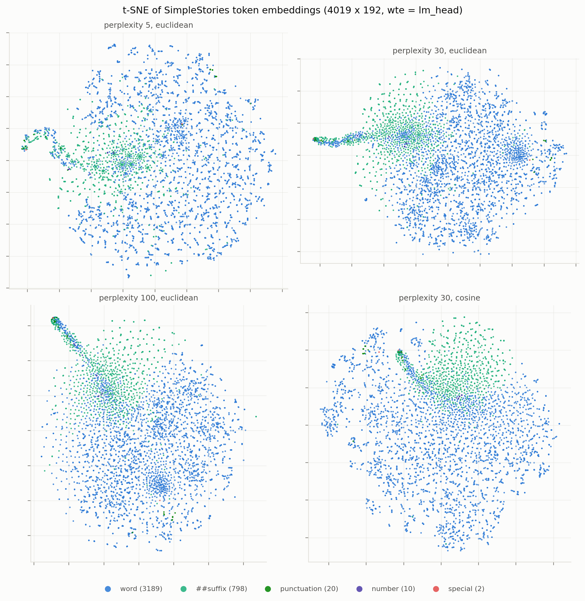
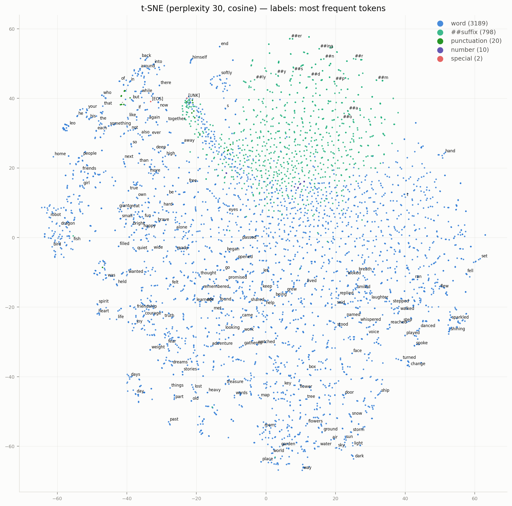
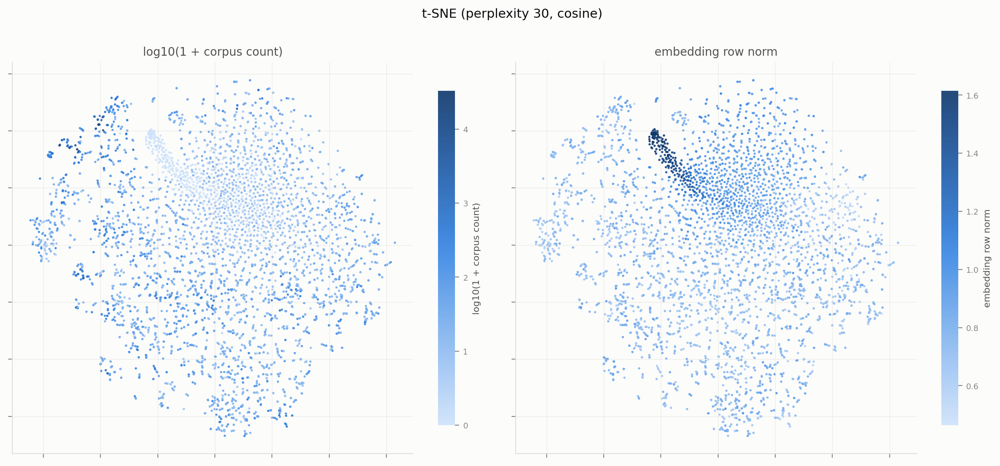
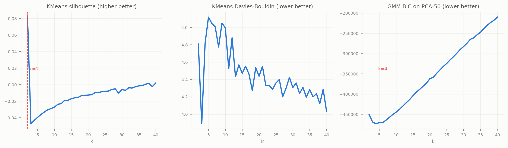
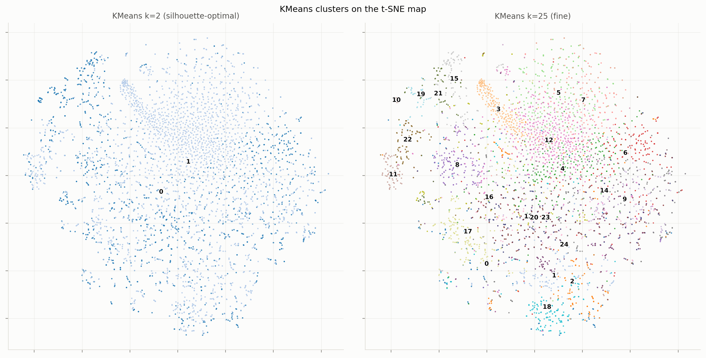
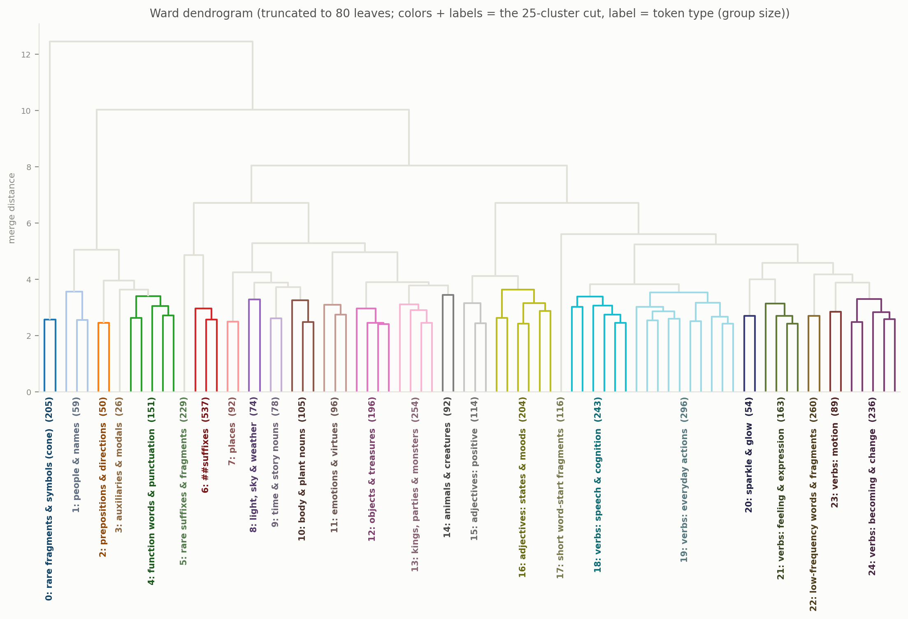
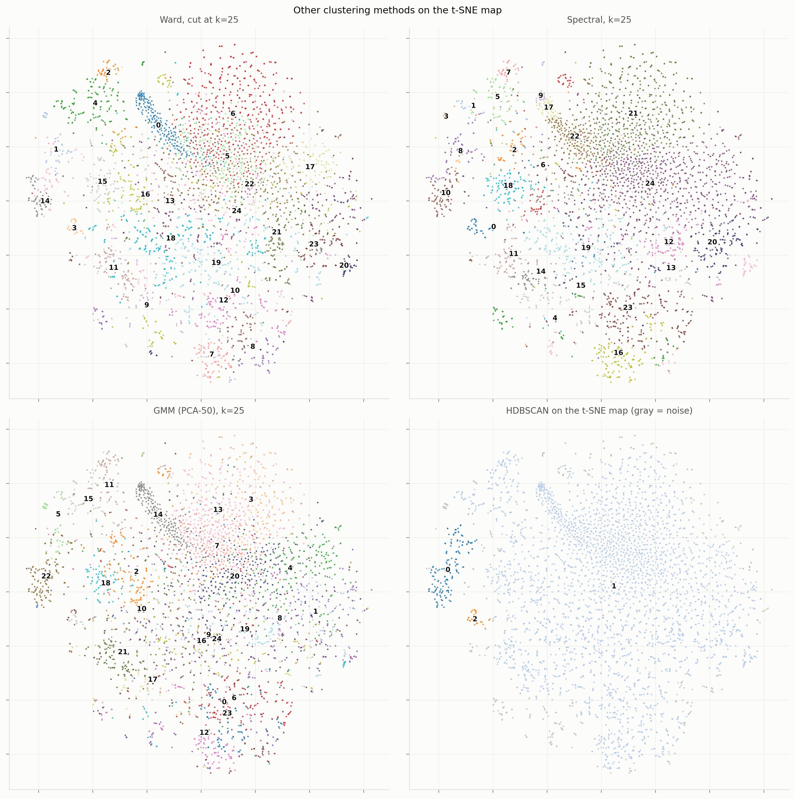
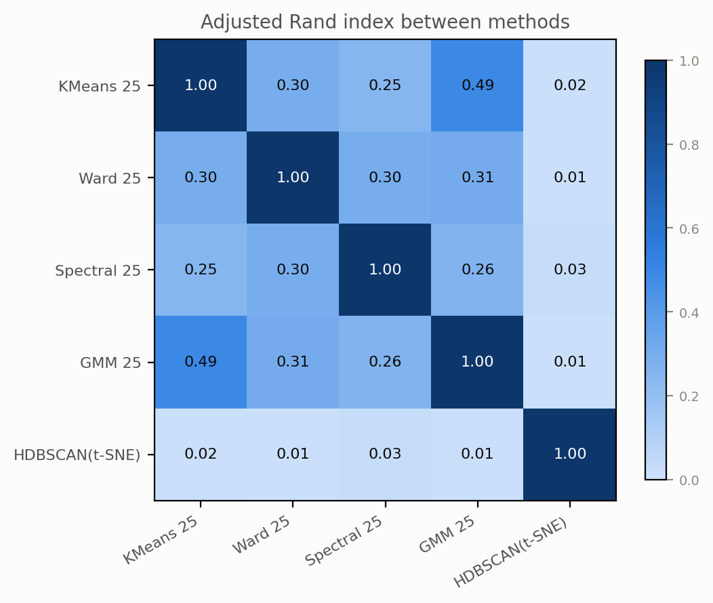

# SimpleStories token embeddings: t-SNE maps & clustering

*2026-08-25. Code and outputs in `simple-emb-clusters/`; see "Files" at the end. Everything runs locally in ~5 min (the data is only 4019×192, so Modal would add more overhead than it saves).*

## Setup

The object of study is the token-embedding matrix of the 2-layer SimpleStories model:

$$E \in \mathbb{R}^{4019 \times 192}, \qquad E = W_{\text{wte}} = W_{\text{lm\_head}}$$

The input embedding and the unembedding are **tied** (verified bit-exact in the checkpoint), so this one matrix carries both roles — worth keeping in mind when interpreting the geometry below.

Token metadata used throughout:

- **Token classes** from the WordPiece-style tokenizer: 3189 whole words, 798 `##`‑continuations, 20 punctuation, 10 digits, 2 specials (`[UNK]`, `[EOS]`). The tokenizer lowercases, so there are **no capitalized tokens**.
- **Corpus frequencies**: counts over 1500 training stories (438,506 tokens) fetched from `SimpleStories/SimpleStories`. 324 tokens (8%) never occur in this sample. (Caveat: the loader strips `[EOS]`, so its count reads 0 here even though it really occurs once per story.)

Distances: token embeddings are compared by **cosine**; for clustering, rows are normalized to unit norm, where euclidean and cosine agree monotonically: $\|\hat x-\hat y\|^2 = 2(1-\cos\theta)$.

## t-SNE

t-SNE minimizes $\mathrm{KL}(P\|Q)$ between Gaussian neighbor affinities $p_{ij}$ in 192-d and Student-t affinities $q_{ij} \propto (1+\|y_i-y_j\|^2)^{-1}$ in 2-d; the perplexity $2^{H(p_i)}$ sets the effective neighbor count. Four runs (perplexity 5/30/100 euclidean, and 30 cosine — the "main" map used everywhere below):

The structure is robust across perplexity and metric. The annotated map is the one to spend time on (open at full size):

**What the map shows:**

- **Suffixes separate.** The 798 `##`-continuations occupy their own coherent region (upper right), with productive grammatical suffixes (`##ing`, `##ed`, `##ly`, `##s`) on its outer rim and single-letter continuations deeper inside.
- **A dense tendril of rare tokens** grows out of the clump at `[UNK]` — see the frequency/norm coloring below. It contains never- or nearly-never-used tokens: word-prefix fragments that the tokenizer almost never needs because the full words exist as tokens (`astron`, `determ`, `wiz`, `puzz`), plus unused symbols (`$`, `#`).
- **Semantic neighborhoods everywhere in the word cloud:** function words + punctuation together (upper left, with `the`, `and`, `.`), pronouns beside them, an animals + people island (far left: `bird`, `fish`, `dragon`, `robot`, `girl`, `boy`), first names (`leo`, `mia`, `alex`), adjectives, abstract nouns (`friendship`, `courage`, `joy`), a broad band of past-tense narrative verbs (`said`, `smiled`, `whispered`, `danced`), gerunds, and a nature/scene region (bottom right: `garden`, `sky`, `sun`, `snow`, `storm`).

Coloring the same map by corpus frequency and by embedding norm:

The two panels are near-mirror images: **frequency is a dominant organizing axis, and rare tokens have the largest norms** — corr$(\log_{10}(1{+}n_c),\ \|E_c\|) = -0.56$ over the vocabulary.

### The rare-token cone

The 324 never-seen tokens form a tight, high-norm cone:

| statistic | never-seen (324) | seen (3695) |
|---|---|---|
| mean norm | **1.22** | 0.77 |
| mean pairwise cosine | **0.755** | 0.262 |

This is the classic rare-token geometry of tied-embedding models, and the training gradient explains it. For a token $c$ that never occurs as a label, each step's cross-entropy gradient on its unembedding row is

$$\frac{\partial \mathcal{L}}{\partial w_c} = \mathbb{E}\big[\,\mathrm{softmax}_c(W h)\, h\,\big] \;>\; 0 \ \text{along } \mathbb{E}[h],$$

with no opposing $-h$ term from ever being the correct label. So every unused row drifts in the *same* direction $-\mathbb{E}[h]$ (making its logit negative in typical contexts), producing a shared high-norm cone; tying puts that cone into the input embedding too. Note the whole cloud is anisotropic (mean pairwise cosine 0.285, where ≈0 would be isotropic), consistent with a shared mean direction.

## Clustering

All methods run on the unit-normalized rows (except where noted). Model-selection first:

| method | selection rule | result |
|---|---|---|
| KMeans, k = 2…40 | silhouette $s = \frac{b-a}{\max(a,b)}$ | **k = 2** best, $s = 0.082$; $s < 0$ for all 3 ≤ k ≤ 35 |
| GMM (PCA-50), k = 2…40 | BIC $= -2\log L + p\log n$ | **k = 4**, with a very flat 2–6 region |
| HDBSCAN on 192-d | density (mutual-reachability) | **0 clusters** — 100% noise |
| HDBSCAN on the 2-d t-SNE map | density | 3 clusters, 10% noise |

The headline negative result: **the embedding cloud has almost no discrete cluster structure.** A silhouette of 0.08 at k=2 is barely above "overlapping", and density-based clustering in the native space finds nothing separable at all. The one real split (KMeans k=2) is not semantic but **frequency**: cluster 0 = 1227 high-frequency tokens (median count 86; all the top function words), cluster 1 = 2792 lower-frequency tokens (median 11, includes the suffixes and the rare cone). The embedding cloud is a *continuum with semantic neighborhoods*, not a union of separated clusters.

HDBSCAN on the t-SNE map agrees: one giant cluster containing nearly everything, plus exactly two density-separated islands — **animate beings** (people + animals: `girl`, `boy`, `bird`, `dragon`, …) and **auxiliaries/modals** (`was`, `had`, `could`, `is`, `will`, …). Full listing in [clusters_hdbscan.md](clusters_hdbscan.md).

### Fine clustering as a directory (k = 25)

Even without discrete structure, a fine partition is a useful *directory* of the neighborhoods. KMeans k=25 (chosen for interpretability, not by any metric):

The clusters are strikingly interpretable — a part-of-speech × semantics organization. Highlights (full listing with frequent + central tokens per cluster in [clusters_kmeans.md](clusters_kmeans.md)):

| cluster (size) | gloss | examples |
|---|---|---|
| 21 (68) | core function words & punctuation | `.` `,` `the` `a` `and` `to` `he` `she` |
| 19 (47) | pronouns & determiners | `her` `it` `his` `their` `you` `this` |
| 16 (93) | modals & auxiliaries | `must` `should` `might` `cannot` `didn` |
| 15 (114) | prepositions & particles | `into` `up` `back` `through` `around` |
| 20 (156) | base-form verbs | `be` `find` `help` `see` `make` |
| 13 (176) | narrative past-tense verbs | `felt` `said` `found` `looked` `smiled` |
| 9 (179) | expressive/motion past verbs | `nodded` `cheered` `sparkled` `gasped` |
| 23 (165) | gerunds | `knowing` `sharing` `laughing` `flying` |
| 8 (154) | adjectives | `small` `bright` `happy` `brave` |
| 14 (195) | decay/negative adjectives & verbs | `heavy` `faded` `broken` `dusty` `forgotten` |
| 17 (197) | abstract nouns | `friendship` `happiness` `courage` `wonder` |
| 1 (140) | objects & artifacts | `stone` `map` `box` `key` `ship` |
| 18 (163) | places | `garden` `village` `forest` `castle` |
| 2 (135) | nature & body plurals | `clouds` `hands` `leaves` `wings` |
| 24 (139) | food & festivity | `music` `games` `party` `candy` |
| 22 (92) | people | `girl` `boy` `friend` `woman` |
| 11 (85) | animals & creatures | `bird` `dragon` `robot` `turtle` |
| 10 (16) | first names | `leo` `mia` `alex` `samuel` |
| 5 (305) | productive suffixes | `##ing` `##ed` `##ly` `##es` |
| 7 (177) | short/single-letter suffixes | `##e` `##n` `##d` `##t` |
| 3 (214) | rare-token cone (fragments, symbols) | `astron` `determ` `$` `que` |
| 12 (485), 4 (247), 6 (169) | low-frequency words & word fragments | `unsure` `bef` `choo` `st` |

### Method comparison

Ward (dendrogram below: merges minimizing the increase in within-cluster SSE), spectral (k-NN graph), GMM, and HDBSCAN, all cut/fit at k=25 where applicable.

In the dendrogram, each colored subtree is one cluster of the 25-cluster cut, labeled with its cluster id (the same ids — and, coincidentally, the same colors — as the "Ward, cut at k=25" panel of the methods figure below), a hand-written token-type gloss, and the group size (full per-group token listing in [clusters_ward.md](clusters_ward.md)). The high-level branching is itself interpretable: the most separated branch holds the rare-token cone + names/people + function words; suffixes and fragments split off next; then nouns (places → nature → objects → animals) separate from the big verb/adjective territory on the right:

- Pairwise adjusted Rand between KMeans/Ward/Spectral/GMM is only **0.25–0.49** — consistent with partitioning a continuum: methods agree on the neighborhoods but draw arbitrary borders differently. (For reference, ARI = 1 is identical partitions, 0 is chance.)
- What *is* stable across every method: the **rare-token cone** is isolated as its own cluster (KMeans 3, Ward 0, GMM 14, and the dendrogram's most separated early branch), and the suffix region and function-word core reappear each time.
- NMI between cluster labels and the coarse token classes (word/suffix/punct/…) is ~0.19–0.21 for all k=25 methods: the classes are visible in the clustering but far from the whole story — most of the partition is semantic, not just class.

## Takeaways

1. The embedding is organized primarily by **frequency** (which also sets norm, corr −0.56) and secondarily by an interpretable **part-of-speech × semantics continuum**; discrete, well-separated clusters mostly don't exist (silhouette ≤ 0.08, HDBSCAN finds nothing in 192-d).
2. The robust discrete objects are: the **rare/unused-token cone** (high norm, pairwise cos 0.76 — a training artifact of tied embeddings, not semantics), the **suffix region**, the **function-word core**, and two density islands (**animate beings**, **auxiliaries**).
3. For interpretability work on this model, cluster labels are best treated as a browsable directory (see the k=25 table), not as natural kinds. The [UNK]-adjacent cone is worth excluding when computing "semantic" directions from embeddings, since it is large-norm and frequency-driven.

## Files

| file | contents |
|---|---|
| `common.py` | data loading (embeddings, tokens, classes, frequencies), shared plot style |
| `run_tsne.py` | the four t-SNE runs + Figures 1–3 |
| `run_clustering.py` | all clustering methods, model selection, listings, Figures 4–8 |
| `run_extras.py` | rare-token cone / anisotropy / k=2 statistics (`cache/extras.json`) |
| `run_dendrogram_labeled.py` | the labeled Ward dendrogram (glosses hand-written from `clusters_ward.md`) |
| `clusters_kmeans.md`, `clusters_ward.md`, `clusters_hdbscan.md` | full per-cluster token listings |
| `figures/*.png` | all figures |
| `cache/` | cached embeddings, frequencies, t-SNE coords, labels, metrics |

Rerun order: `run_tsne.py` → `run_clustering.py` → `run_extras.py` (caches make reruns fast; delete `cache/` to recompute).
