# Layer-0 attention patterns of the sink seed 45 model

**Model:** sink seed 45 = `t-87f91319` (4L Pile model with untied head and one learned
zero-value attention-sink logit per head), loaded with `load.load_sink(45)` — i.e. with the
**corrected RoPE spectrum** (see `sink-models/rope_report.md`), so these attention patterns
are trustworthy at all ranges.

**Data / method:** the first 1000 cached Pile rows (`context-loss/hide/cache/pile_rows.pt`),
truncated to the 512-token context. Layer 0's attention input is exactly
$x_i = \mathrm{rms}_1(W_E[t_i])$ (pre-norm, first block), so per-head attention is recomputed
directly, including the sink slot (GPT-OSS convention): with per-head logits
$\ell_{ij} = q_i\cdot k_j/\sqrt{128}$ and the learned scalar $s_h$,

$$A_{ij} = \frac{e^{\ell_{ij}}}{e^{s_h} + \sum_{j'\le i} e^{\ell_{ij'}}},\qquad
A_{i,\mathrm{sink}} = \frac{e^{s_h}}{e^{s_h} + \sum_{j'\le i} e^{\ell_{ij'}}} .$$

The sink column is dropped before the value average, so sink mass = attention paid to zero.
Compute: `hide/compute.py` → `hide/cache/l0_attn_stats.npz` and `hide/ov_compute.py` →
`hide/cache/ov_stats.npz`; figures/tables: `hide/report.py`.
All positions kept (EOS included); token-level stats use query positions ≥ 64 and, for
received mass, keys with a full 64-query following window.

## Head summary

| head | sink logit $s_h$ | mean sink mass (qpos ≥ 64) | mean content mass | mean $n_\mathrm{eff}$ | content share $d\le 8$ | $d\le 32$ |
|---:|---:|---:|---:|---:|---:|---:|
| 0 | 2.82 | 0.907 | 0.091 | 1.6 | 0.81 | 0.91 |
| 1 | 2.13 | 0.089 | 0.900 | 58.3 | 0.31 | 0.62 |
| 2 | 2.63 | 0.885 | 0.113 | 1.8 | 0.86 | 0.97 |
| 3 | 1.91 | 0.558 | 0.423 | 18.2 | 0.34 | 0.58 |
| 4 | 3.26 | 0.752 | 0.239 | 6.8 | 0.44 | 0.71 |
| 5 | 2.64 | 0.878 | 0.121 | 1.8 | 0.86 | 0.96 |

$n_\mathrm{eff} = e^H$ of the full (keys + sink) distribution; content share = fraction of
non-sink mass within query−key distance $d$.

**The six heads split into three groups:**

- **Heads 0, 2, 5 — near-pure previous-token heads, parked in the sink ~90% of the time.**
  Their content mass is dominated by $d = 1$ (offset profile below), with 81–86% of it within
  $d \le 8$; $n_\mathrm{eff} \approx 1.7$ means a typical query effectively touches the sink
  plus at most one key. They act as *conditional bigram heads*: for most tokens they write
  ~nothing (sink), and wake up on specific trigger tokens (tables below).
- **Head 1 — the context head.** Only 0.09 mean sink mass, $n_\mathrm{eff} \approx 58$, and
  the flattest distance profile (only 62% of content within $d \le 32$, measurable mass at
  $d > 256$). This is the one L0 head that reads broadly by default.
- **Heads 3, 4 — intermediate.** Sink mass 0.56 / 0.75, $n_\mathrm{eff}$ 18 / 6.8, medium-range
  profiles (58% / 71% of content within $d \le 32$).

## Spread of sink mass across individual queries

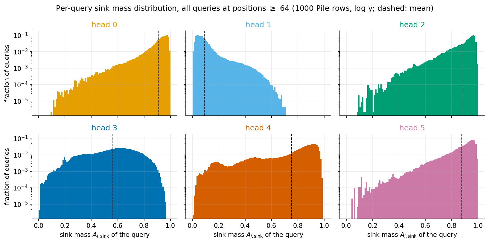

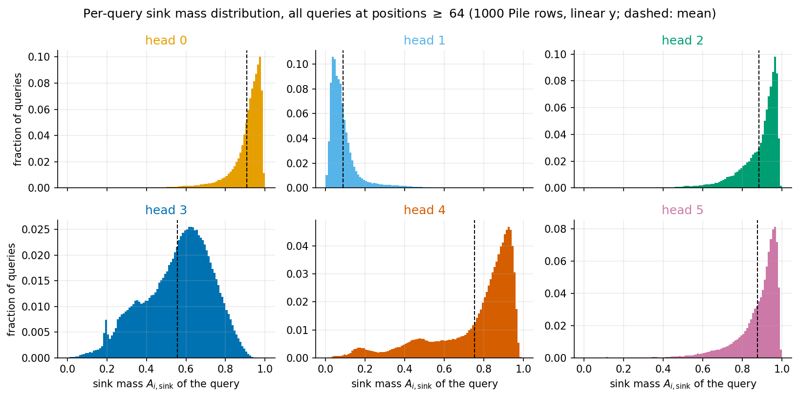

Same data twice: log y (top; shows the tails) and linear y (bottom, per-head y scale;
shows where the bulk actually sits). Distribution of $A_{i,\mathrm{sink}}$ over all ~448k individual
queries (positions ≥ 64; log y, bin width 0.01). Tail fractions:

| head | P(sink < 0.1) | P(sink < 0.5) | P(sink > 0.9) | P(sink > 0.98) |
|---:|---:|---:|---:|---:|
| 0 | 0.000 | 0.008 | 0.702 | 0.086 |
| 1 | 0.729 | 0.997 | 0.000 | 0.000 |
| 2 | 0.000 | 0.011 | 0.602 | 0.039 |
| 3 | 0.004 | 0.333 | 0.003 | 0.000 |
| 4 | 0.005 | 0.153 | 0.276 | 0.000 |
| 5 | 0.000 | 0.015 | 0.568 | 0.049 |

The means hide very different shapes:

- **Heads 0, 2, 5**: the bulk sits in a sharp peak at 0.93–0.99 with a hard upper edge just
  below 1 (the $d{=}1$ key is always present, so a little always leaks to the previous
  token), and the low-sink side is a long, roughly exponential tail — ~1% of queries below
  0.5, essentially none below 0.1. The tail is the conditional-bigram behavior: the rare
  woken-up queries (the trigger tokens of the tables below) pull most of their mass out of
  the sink, but there is no separate low-sink mode.
- **Head 1** is the mirror image: peak at 0.02–0.05, monotone decay, nothing above ~0.75
  (P(sink > 0.5) = 0.3%) at these positions — the high-sink behavior it shows in the position
  plot lives entirely in the early-context transient, which is excluded here.
- **Head 3** is genuinely **broad** — closest to flat of all heads: a wide hump peaking near
  0.6 with substantial probability everywhere between ~0.1 and ~0.85, and almost nothing
  above 0.9. Its 0.56 mean is a real mixture of query-by-query engagement levels, not a
  fixed operating point.
- **Head 4** sits between the two regimes: a main lobe at 0.8–0.95 (28% of queries above
  0.9) plus a fat flat tail across the whole range and a small shoulder near 0.15 — 15% of
  its queries are below 0.5.

## Is it position dependent?

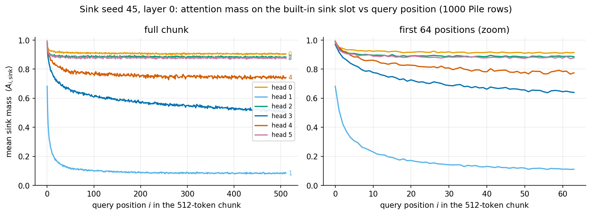

Mostly **no** — with two systematic exceptions:

1. **Very early positions.** At $i = 0$ the only choices are self and sink; all heads put
   0.68–0.99 on the sink there (head 1: 0.68 → it self-attends with the rest). Head 1's sink
   mass then decays quickly (0.52 at $i{=}1$, 0.25 at $i{=}8$,
   0.14 at $i{=}32$) as real context accumulates: the sink acts exactly as
   designed, absorbing mass while there is nothing to attend to yet.
2. **A slow drift in heads 3 and 4.** Head 3 falls from 0.62
   (positions 64–128) to 0.52 (384–511), head 4 from
   0.77 to 0.74 — longer context gives
   these medium/long-range heads more worth attending to, so they leave the sink slightly
   more often. Heads 0, 2, 5 are flat to < 0.01 over the same span.

There is **no residual position-0 attention sink**: mass on key 0 from queries ≥ 64 is
≤ 0.0008 in every head. The built-in sink slot fully replaces the emergent
first-token sink of the original pile_4l model (which parked 20–30% per head on key 0 in
its layers 2–3, per `endoftext-pos0/`).

## Distance profile

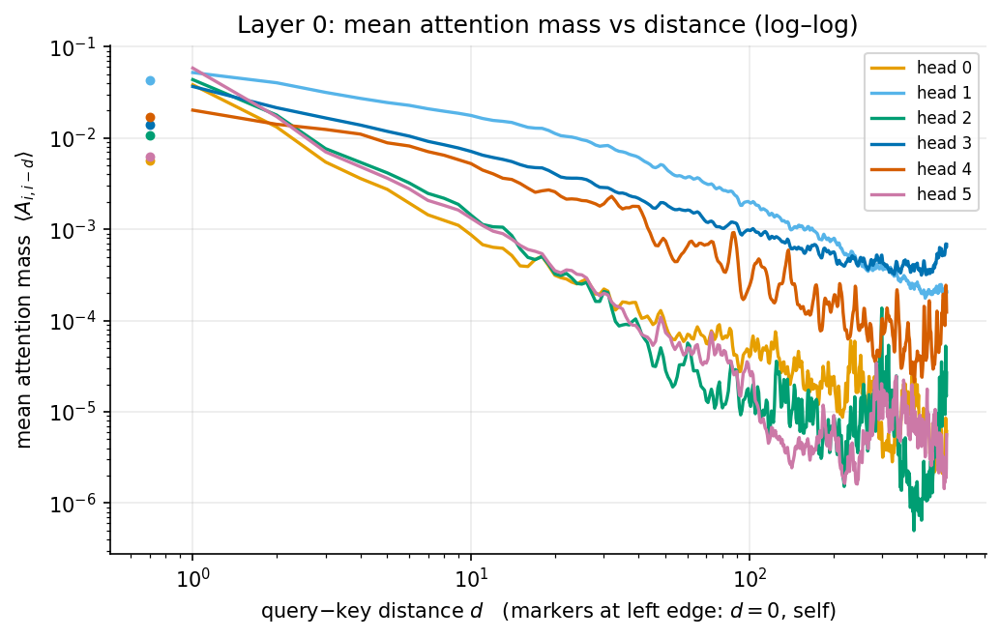

Mean mass at distance $d$ (conditional on the query having a key at that distance). All heads
peak at **$d = 1$** — layer 0 is previous-token-flavored across the board — but the decay
rates differ enormously: heads 0/2/5 fall ~2 orders of magnitude by $d \approx 10$, head 1
decays roughly like a power law and still has ~2×10⁻⁴ mean mass per key at $d \approx 448$
(times ~hundreds of far keys — that's where its $n_\mathrm{eff} \approx 58$ lives).
Self-attention ($d = 0$, markers) is weak in all heads; head 1 is the only one where it is
comparable to $d = 1$. The uptick at $d \gtrsim 300$ in heads 3/4 is far queries putting
mass on early-chunk keys (positions ≲ 60) — a mild residual chunk-start preference in the
*content* attention of the two medium-range heads, even though key 0 itself receives ≈ 0.

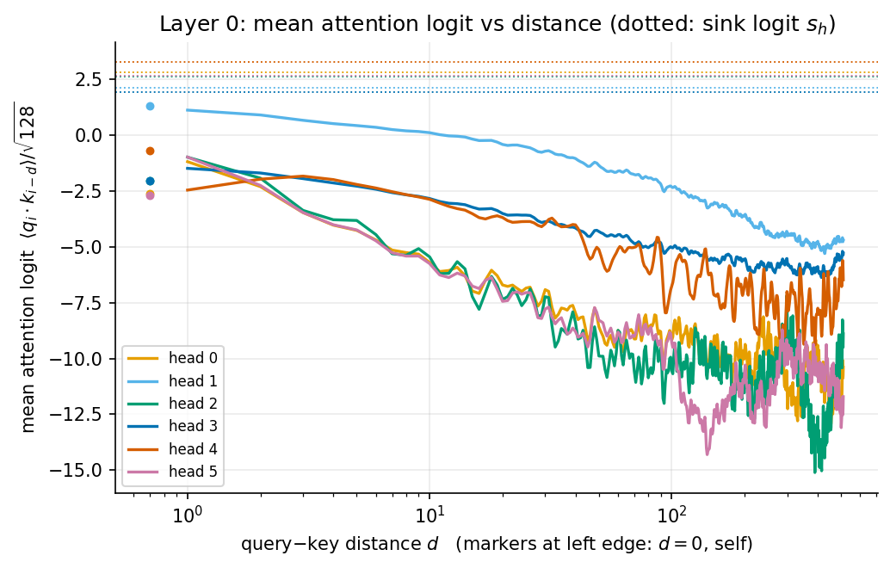

The same profile in **pre-softmax logit** units, $\langle \ell_{i,i-d}\rangle$ with
$\ell_{ij} = q_i\cdot k_j/\sqrt{128}$ (linear y — logits can be negative), with each
head's sink logit $s_h$ dotted in its color. This is the comparison the softmax actually
makes: a single key at distance $d$ beats the sink where its logit exceeds the dotted line
($A_{ij}/A_{i,\mathrm{sink}} = e^{\ell_{ij} - s_h}$). The striking fact: **no
head's mean logit reaches its sink logit at any distance** — even head 1's $d{=}1$ mean
(1.12) sits a full logit below its $s_1 = 2.13$. The heads
escape the sink in two different ways: **head 1 by aggregation** — its logits decay so slowly
(still ≈ 0 at $d \approx 10$, only ≈ −5 at $d \approx 500$) that hundreds of keys sum to far
more than the single sink term (500 keys at $e^0$ vs $e^{2.13} \approx 8.4$) — and **heads
0/2/5 by fluctuations**: their mean logits plunge to −10…−15 at range (far keys are actively
suppressed, guaranteeing the sink wins by default) and even their $d{=}1$ means are −1…−2.5,
so all their content attention comes from rare specific query/key token pairs whose logits
spike far above $s_h$ — the exponential low-sink tail of the query histograms above. Head 4
has both the largest sink logit (3.26) and the *lowest* $d{=}1$ mean logit — its
previous-token peak is the weakest, matching its more distributed profile.

## Which query tokens attend to content vs mostly sink?

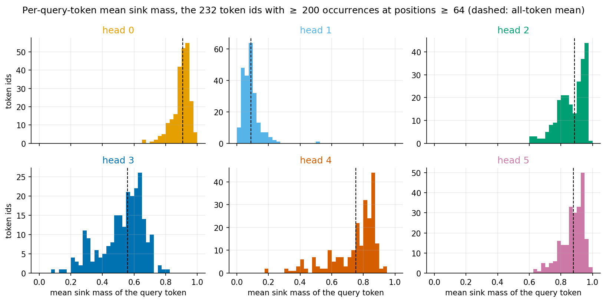

Per-query-token mean sink mass over the 232 token ids with ≥ 200 occurrences at
positions ≥ 64. The split is strikingly **syntax vs prose**:

**Lowest sink mass (these tokens' queries actually search the context) — all-head mean:**

| token | count | h0 | h1 | h2 | h3 | h4 | h5 | mean |
|---|---:|---:|---:|---:|---:|---:|---:|---:|
| `'\t'` | 842 | 0.86 | 0.07 | 0.73 | 0.09 | 0.39 | 0.70 | 0.47 |
| `'="'` | 601 | 0.65 | 0.06 | 0.61 | 0.23 | 0.60 | 0.68 | 0.47 |
| `'\n'` | 17097 | 0.79 | 0.04 | 0.67 | 0.36 | 0.20 | 0.82 | 0.48 |
| `'>'` | 766 | 0.76 | 0.02 | 0.76 | 0.22 | 0.32 | 0.80 | 0.48 |
| `'                '` | 296 | 0.84 | 0.02 | 0.68 | 0.29 | 0.40 | 0.72 | 0.49 |
| `'}'` | 1210 | 0.89 | 0.03 | 0.71 | 0.24 | 0.36 | 0.73 | 0.49 |
| `'<'` | 677 | 0.88 | 0.02 | 0.75 | 0.15 | 0.38 | 0.86 | 0.51 |
| `'"'` | 957 | 0.78 | 0.01 | 0.61 | 0.35 | 0.50 | 0.81 | 0.51 |
| `');'` | 440 | 0.82 | 0.02 | 0.76 | 0.24 | 0.42 | 0.80 | 0.51 |
| `' {'` | 486 | 0.86 | 0.04 | 0.64 | 0.17 | 0.55 | 0.81 | 0.51 |
| `'{'` | 1315 | 0.84 | 0.03 | 0.64 | 0.28 | 0.53 | 0.74 | 0.51 |
| `'        '` | 710 | 0.89 | 0.03 | 0.74 | 0.28 | 0.45 | 0.69 | 0.51 |
| `'",'` | 225 | 0.84 | 0.02 | 0.64 | 0.29 | 0.50 | 0.83 | 0.52 |
| `'    '` | 1189 | 0.89 | 0.03 | 0.74 | 0.33 | 0.45 | 0.72 | 0.53 |
| `' -'` | 1394 | 0.83 | 0.03 | 0.72 | 0.31 | 0.48 | 0.81 | 0.53 |
| `';'` | 1048 | 0.79 | 0.04 | 0.77 | 0.28 | 0.50 | 0.80 | 0.53 |
| `'            '` | 378 | 0.88 | 0.03 | 0.74 | 0.32 | 0.48 | 0.75 | 0.54 |
| `').'` | 561 | 0.90 | 0.05 | 0.83 | 0.30 | 0.31 | 0.85 | 0.54 |
| `'      '` | 245 | 0.90 | 0.03 | 0.74 | 0.38 | 0.51 | 0.70 | 0.54 |
| `'.'` | 15097 | 0.81 | 0.04 | 0.84 | 0.31 | 0.41 | 0.85 | 0.54 |

**Highest sink mass (these tokens ask layer 0 for nothing):**

| token | count | h0 | h1 | h2 | h3 | h4 | h5 | mean |
|---|---:|---:|---:|---:|---:|---:|---:|---:|
| `'<\|endoftext\|>'` | 290 | 0.96 | 0.52 | 0.96 | 0.68 | 0.77 | 0.98 | 0.81 |
| `' F'` | 258 | 0.98 | 0.10 | 0.96 | 0.72 | 0.90 | 0.95 | 0.77 |
| `' P'` | 219 | 0.98 | 0.09 | 0.97 | 0.69 | 0.88 | 0.96 | 0.76 |
| `' L'` | 208 | 0.98 | 0.09 | 0.97 | 0.66 | 0.90 | 0.97 | 0.76 |
| `' just'` | 200 | 0.90 | 0.11 | 0.97 | 0.76 | 0.86 | 0.91 | 0.75 |
| `' all'` | 452 | 0.93 | 0.11 | 0.95 | 0.72 | 0.87 | 0.90 | 0.75 |
| `' out'` | 261 | 0.83 | 0.22 | 0.96 | 0.79 | 0.93 | 0.76 | 0.75 |
| `' C'` | 250 | 0.97 | 0.07 | 0.96 | 0.64 | 0.87 | 0.95 | 0.74 |
| `' M'` | 267 | 0.98 | 0.07 | 0.96 | 0.64 | 0.87 | 0.93 | 0.74 |
| `' S'` | 332 | 0.96 | 0.09 | 0.97 | 0.65 | 0.86 | 0.93 | 0.74 |
| `' up'` | 224 | 0.82 | 0.18 | 0.96 | 0.80 | 0.93 | 0.75 | 0.74 |
| `' first'` | 225 | 0.95 | 0.08 | 0.95 | 0.71 | 0.89 | 0.85 | 0.74 |
| `' such'` | 291 | 0.94 | 0.10 | 0.96 | 0.64 | 0.87 | 0.93 | 0.74 |
| `' there'` | 323 | 0.93 | 0.13 | 0.94 | 0.67 | 0.86 | 0.90 | 0.74 |
| `' more'` | 355 | 0.92 | 0.13 | 0.96 | 0.71 | 0.84 | 0.87 | 0.74 |

- The content-attending queries are **code / math / markup structure tokens**: closing and
  opening delimiters (`'>'`, `'<'`, `'}'`, `'{'`, `');'`, `'),'`), attribute/equals signs,
  quotes, backslashes, indentation runs, tabs and newlines. These are exactly the tokens whose
  local meaning depends on matching structure earlier in the line/expression. Head-specific
  versions of the same story: head 3's strongest content queries are tab (0.09 sink)
  and `'<'`, head 4's are `' to'` (0.18) and newline
  (0.20), head 5's are `'-'`, `' of'`, `':'` and indentation.
- The sink-heavy queries are **plain-prose tokens**: sentence-initial capitals and openers
  (`' In'`, `' The'`, `' It'`, `' This'`), single capital letters (initials), and common
  adverbs/particles/quantifiers (`' just'`, `' all'`, `' out'`, `' up'`, `' first'`,
  `' more'`, `' which'`). For ordinary running text, layer-0 attention (beyond the
  previous-token peak) has little to offer, and the sink absorbs the mass.
- `'<|endoftext|>'` is the single most sink-heavy query (mean 0.81) —
  at a document start the preceding context is by definition irrelevant, and the built-in sink
  lets every head express that directly (in pile_4l this required the emergent massive-vector
  machinery).

## Which tokens receive a lot of attention?

Received mass = for key $j$, the mean of $A_{j+d,\,j}$ over the following 64 queries
($d = 1..64$; self excluded, key position ≥ 1, full window required). Top 20 by all-head
mean:

| token | count | h0 | h1 | h2 | h3 | h4 | h5 | mean |
|---|---:|---:|---:|---:|---:|---:|---:|---:|
| `'<\|endoftext\|>'` | 287 | 0.010 | 0.215 | 0.022 | 0.049 | 0.088 | 0.008 | 0.065 |
| `'//'` | 224 | 0.002 | 0.056 | 0.003 | 0.005 | 0.013 | 0.002 | 0.013 |
| `' [@'` | 223 | 0.005 | 0.032 | 0.004 | 0.008 | 0.009 | 0.003 | 0.010 |
| `' {'` | 464 | 0.005 | 0.023 | 0.002 | 0.007 | 0.009 | 0.005 | 0.008 |
| `'<'` | 643 | 0.003 | 0.025 | 0.003 | 0.006 | 0.008 | 0.003 | 0.008 |
| `'){'` | 221 | 0.001 | 0.008 | 0.008 | 0.005 | 0.006 | 0.018 | 0.008 |
| `'if'` | 266 | 0.003 | 0.018 | 0.006 | 0.008 | 0.008 | 0.004 | 0.008 |
| `');'` | 437 | 0.002 | 0.015 | 0.003 | 0.012 | 0.010 | 0.004 | 0.008 |
| `'_{'` | 391 | 0.002 | 0.025 | 0.004 | 0.006 | 0.006 | 0.003 | 0.007 |
| `'\n\n'` | 593 | 0.003 | 0.018 | 0.006 | 0.004 | 0.007 | 0.006 | 0.007 |
| `' $\\'` | 477 | 0.002 | 0.028 | 0.002 | 0.004 | 0.005 | 0.002 | 0.007 |
| `'mathcal'` | 207 | 0.001 | 0.019 | 0.005 | 0.005 | 0.003 | 0.006 | 0.006 |
| `'",'` | 228 | 0.003 | 0.012 | 0.004 | 0.009 | 0.004 | 0.003 | 0.006 |
| `'{\\'` | 337 | 0.002 | 0.019 | 0.002 | 0.004 | 0.005 | 0.002 | 0.006 |
| `' This'` | 235 | 0.002 | 0.017 | 0.001 | 0.006 | 0.005 | 0.002 | 0.006 |
| `' your'` | 256 | 0.001 | 0.022 | 0.001 | 0.004 | 0.004 | 0.001 | 0.006 |
| `' “'` | 205 | 0.001 | 0.013 | 0.003 | 0.005 | 0.008 | 0.002 | 0.005 |
| `' ='` | 1160 | 0.001 | 0.013 | 0.004 | 0.006 | 0.005 | 0.003 | 0.005 |
| `' $'` | 1086 | 0.003 | 0.016 | 0.002 | 0.004 | 0.004 | 0.002 | 0.005 |
| `'**'` | 389 | 0.002 | 0.007 | 0.003 | 0.009 | 0.008 | 0.001 | 0.005 |

- **`'<|endoftext|>'` is by far the strongest attention magnet** — head 1 gives a preceding
  EOS 0.215 of each following query's mass on average
  (≈ 14× a uniform share of its window), heads 3/4 0.049/0.088.
  Even with a built-in sink slot available, the model still marks document boundaries with
  real attention: EOS-as-key is *read* (boundary information), not just used as a parking spot.
  (As a *query*, EOS sinks: 0.96 / 0.52 / 0.96 / 0.68 / 0.77 / 0.98 per head — consistent with `eos-isolation`'s finding
  that L0 reads boundaries while later layers enforce isolation.)
- The other top receivers are again **structure openers**: `'//'`, `' [@'`, `' {'`, `'<'`,
  `'){'`, `'if'`, `'_{'`, `'mathcal'`, `'$'`, `'**'`, `'\n\n'`, opening quotes — the left
  ends of constructions whose right ends (the content-attending queries above) need them.
  Layer 0 looks like a **local bracket/construction-matching + previous-token layer**, with head 1
  additionally supplying broad context.
- The weakest receivers are mid-word fragments (`'o'`, `'ing'`, `'s'`, `'a'`) — nothing looks
  back at pieces of words.

## Which tokens — head by head

Per-head versions of the token tables above, heads ordered by **ascending mean sink mass**
(most content-attending first). Same conventions: query-token sink mass over positions ≥ 64
(≥ 200 occurrences), received mass = mean mass from the following 64 queries. Each
head also gets its own distance profile (log–log full range + linear zoom on $d \le 32$),
in attention-mass and in logit units. In the zoom panels the error bars are per-query
quantile bands (thick = p25–p75, thin = p5–p95) — note the distributions are heavily
skewed, so the mean line can sit *outside* the interquartile bar (e.g. head 4's mass at
$d{=}1$: the mean is dominated by the strong-attention tail while the median query gets
far less), which is exactly the mean-mass-vs-mean-logit discrepancy discussed above.

### Head 1 — mean sink mass 0.09

The context head: sink mass is near zero for almost everything except EOS; its content-side selectivity therefore shows in the *receivers* — EOS towers over everything (0.215), then comment/math openers.

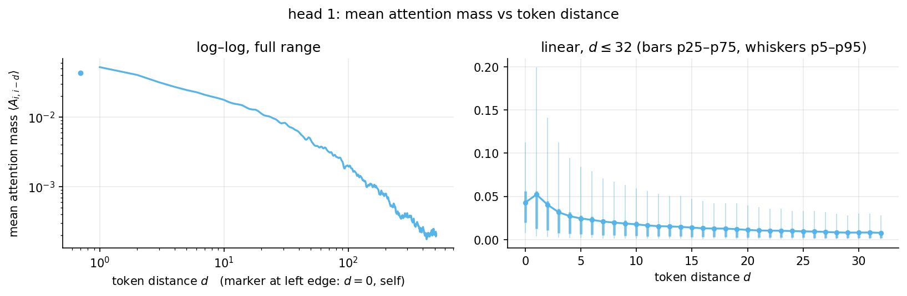

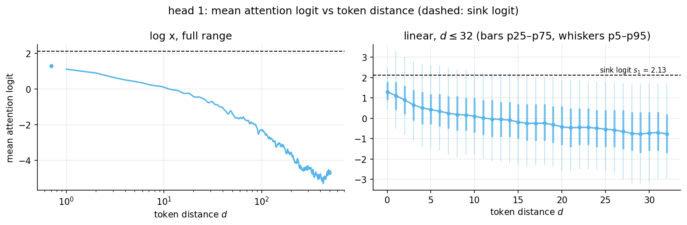

**Query tokens with the lowest sink mass** (most content-attending):

| token | count | sink mass |
|---|---:|---:|
| `'"'` | 957 | 0.01 |
| `'>'` | 766 | 0.02 |
| `');'` | 440 | 0.02 |
| `'",'` | 225 | 0.02 |
| `'                '` | 296 | 0.02 |
| `' $'` | 1107 | 0.02 |
| `'<'` | 677 | 0.02 |
| `' *'` | 712 | 0.02 |
| `'\\'` | 1328 | 0.02 |
| `' \\'` | 1075 | 0.02 |
| `'){'` | 230 | 0.03 |
| `' [@'` | 212 | 0.03 |
| `' &'` | 305 | 0.03 |
| `'        '` | 710 | 0.03 |
| `' "'` | 819 | 0.03 |

**Query tokens with the highest sink mass:**

| token | count | sink mass |
|---|---:|---:|
| `'<\|endoftext\|>'` | 290 | 0.52 |
| `'ing'` | 271 | 0.26 |
| `'in'` | 399 | 0.23 |
| `'y'` | 306 | 0.23 |
| `' out'` | 261 | 0.22 |
| `'o'` | 221 | 0.21 |
| `'mathcal'` | 206 | 0.21 |
| `'ref'` | 288 | 0.21 |
| `'](#'` | 201 | 0.20 |
| `'00'` | 213 | 0.19 |

**Top receiving tokens** (mean mass from the following 64 queries):

| token | count | received mass |
|---|---:|---:|
| `'<\|endoftext\|>'` | 287 | 0.215 |
| `'//'` | 224 | 0.056 |
| `' [@'` | 223 | 0.032 |
| `' $\\'` | 477 | 0.028 |
| `'<'` | 643 | 0.025 |
| `'_{'` | 391 | 0.025 |
| `' {'` | 464 | 0.023 |
| `' your'` | 256 | 0.022 |
| `'{\\'` | 337 | 0.019 |
| `'mathcal'` | 207 | 0.019 |
| `'$'` | 852 | 0.019 |
| `'\n\n'` | 593 | 0.018 |
| `'if'` | 266 | 0.018 |
| `' This'` | 235 | 0.017 |
| `' you'` | 695 | 0.017 |

### Head 3 — mean sink mass 0.56

The broad medium-range head. Strongest content queries are **tab (0.09 sink!) and code/markup structure** (`'<'`, `' {'`, `' ='`, `'_{'`); receivers are statement ends/separators (`');'`, `'",'`, `'**'`, `';'`) plus EOS and prose linkers (`' between'`, `' who'`).

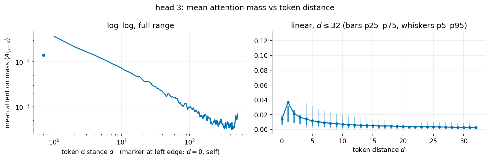

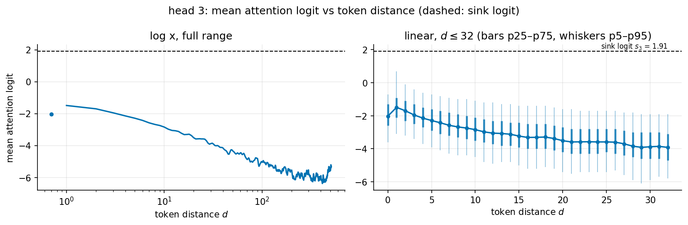

**Query tokens with the lowest sink mass** (most content-attending):

| token | count | sink mass |
|---|---:|---:|
| `'\t'` | 842 | 0.09 |
| `'<'` | 677 | 0.15 |
| `' {'` | 486 | 0.17 |
| `' ='` | 1177 | 0.21 |
| `'//'` | 207 | 0.21 |
| `'>'` | 766 | 0.22 |
| `'_{'` | 381 | 0.22 |
| `'="'` | 601 | 0.23 |
| `');'` | 440 | 0.24 |
| `'}'` | 1210 | 0.24 |
| `' [@'` | 212 | 0.26 |
| `'if'` | 256 | 0.27 |
| `' $\\'` | 469 | 0.28 |
| `'('` | 1855 | 0.28 |
| `'{'` | 1315 | 0.28 |

**Query tokens with the highest sink mass:**

| token | count | sink mass |
|---|---:|---:|
| `' up'` | 224 | 0.80 |
| `' out'` | 261 | 0.79 |
| `'ing'` | 271 | 0.76 |
| `' just'` | 200 | 0.76 |
| `' all'` | 452 | 0.72 |
| `' only'` | 263 | 0.72 |
| `' F'` | 258 | 0.72 |
| `' over'` | 212 | 0.71 |
| `' more'` | 355 | 0.71 |
| `' first'` | 225 | 0.71 |

**Top receiving tokens** (mean mass from the following 64 queries):

| token | count | received mass |
|---|---:|---:|
| `'<\|endoftext\|>'` | 287 | 0.049 |
| `');'` | 437 | 0.012 |
| `'",'` | 228 | 0.009 |
| `'**'` | 389 | 0.009 |
| `' [@'` | 223 | 0.008 |
| `' &'` | 312 | 0.008 |
| `'if'` | 266 | 0.008 |
| `' between'` | 277 | 0.007 |
| `' {'` | 464 | 0.007 |
| `';'` | 1010 | 0.007 |
| `'In'` | 239 | 0.007 |
| `'?'` | 495 | 0.007 |
| `' -'` | 1368 | 0.007 |
| `'The'` | 509 | 0.007 |
| `' who'` | 245 | 0.007 |

### Head 4 — mean sink mass 0.75

Wakes on **`' to'` and newlines** (plus sentence/clause punctuation) — infinitive/line-start constructions that need an antecedent; EOS and opening delimiters receive.

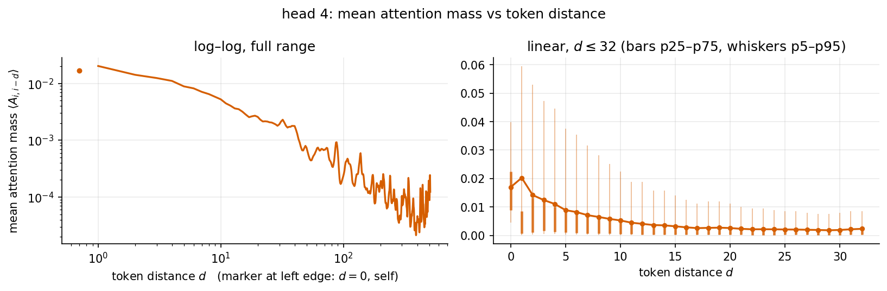

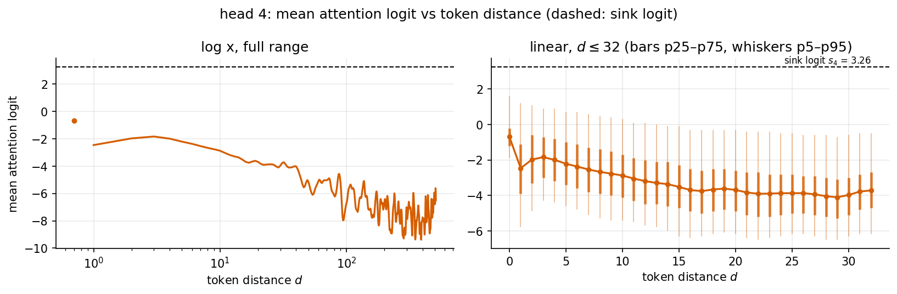

**Query tokens with the lowest sink mass** (most content-attending):

| token | count | sink mass |
|---|---:|---:|
| `' to'` | 5300 | 0.18 |
| `'\n'` | 17097 | 0.20 |
| `').'` | 561 | 0.31 |
| `'>'` | 766 | 0.32 |
| `'\n\n'` | 567 | 0.34 |
| `'}'` | 1210 | 0.36 |
| `'<'` | 677 | 0.38 |
| `'\t'` | 842 | 0.39 |
| `'                '` | 296 | 0.40 |
| `'.'` | 15097 | 0.41 |
| `'**'` | 433 | 0.41 |
| `'?'` | 481 | 0.42 |
| `'),'` | 446 | 0.42 |
| `' into'` | 236 | 0.42 |
| `');'` | 440 | 0.42 |

**Query tokens with the highest sink mass:**

| token | count | sink mass |
|---|---:|---:|
| `' up'` | 224 | 0.93 |
| `'ing'` | 271 | 0.93 |
| `' out'` | 261 | 0.93 |
| `'o'` | 221 | 0.91 |
| `' F'` | 258 | 0.90 |
| `' L'` | 208 | 0.90 |
| `' over'` | 212 | 0.89 |
| `' time'` | 267 | 0.89 |
| `' first'` | 225 | 0.89 |
| `' used'` | 248 | 0.88 |

**Top receiving tokens** (mean mass from the following 64 queries):

| token | count | received mass |
|---|---:|---:|
| `'<\|endoftext\|>'` | 287 | 0.088 |
| `'//'` | 224 | 0.013 |
| `');'` | 437 | 0.010 |
| `' {'` | 464 | 0.009 |
| `' [@'` | 223 | 0.009 |
| `'<'` | 643 | 0.008 |
| `'if'` | 266 | 0.008 |
| `' “'` | 205 | 0.008 |
| `').'` | 551 | 0.008 |
| `' between'` | 277 | 0.008 |
| `'**'` | 389 | 0.008 |
| `'),'` | 451 | 0.007 |
| `'\n\n'` | 593 | 0.007 |
| `' ('` | 2985 | 0.007 |
| `'('` | 1861 | 0.007 |

### Head 5 — mean sink mass 0.88

A previous-token head keyed to **hyphens, `' of'`, colons and indentation** — compound-word and list/key-value structure; `'){'` is its one outsize receiver.

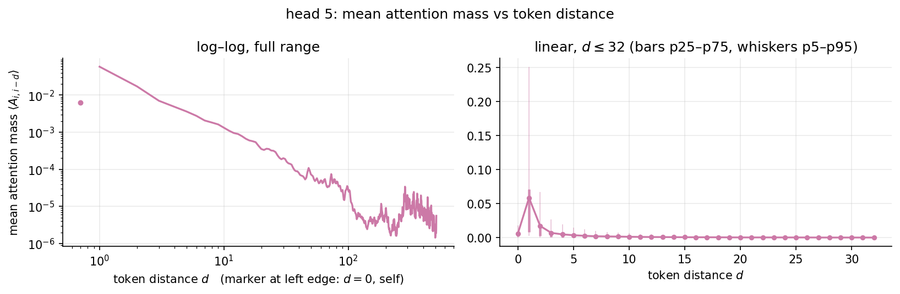

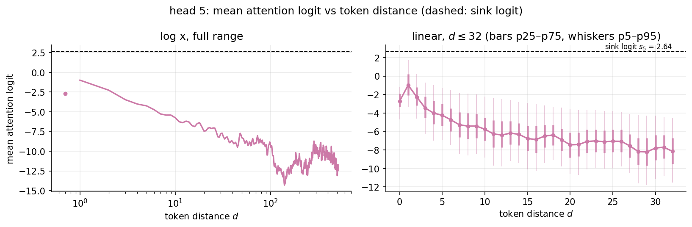

**Query tokens with the lowest sink mass** (most content-attending):

| token | count | sink mass |
|---|---:|---:|
| `'-'` | 5062 | 0.63 |
| `' of'` | 7142 | 0.63 |
| `':'` | 2188 | 0.66 |
| `'="'` | 601 | 0.68 |
| `'        '` | 710 | 0.69 |
| `'      '` | 245 | 0.70 |
| `'\t'` | 842 | 0.70 |
| `'type'` | 296 | 0.70 |
| `'   '` | 416 | 0.71 |
| `'                '` | 296 | 0.72 |
| `'    '` | 1189 | 0.72 |
| `'/'` | 1538 | 0.73 |
| `'}'` | 1210 | 0.73 |
| `'*'` | 1225 | 0.74 |
| `'{'` | 1315 | 0.74 |

**Query tokens with the highest sink mass:**

| token | count | sink mass |
|---|---:|---:|
| `' In'` | 343 | 0.98 |
| `'<\|endoftext\|>'` | 290 | 0.98 |
| `' It'` | 214 | 0.98 |
| `' L'` | 208 | 0.97 |
| `'P'` | 290 | 0.97 |
| `'B'` | 571 | 0.97 |
| `' The'` | 1014 | 0.97 |
| `' T'` | 272 | 0.96 |
| `' This'` | 233 | 0.96 |
| `' P'` | 219 | 0.96 |

**Top receiving tokens** (mean mass from the following 64 queries):

| token | count | received mass |
|---|---:|---:|
| `'){'` | 221 | 0.018 |
| `'<\|endoftext\|>'` | 287 | 0.008 |
| `'mathcal'` | 207 | 0.006 |
| `'\n\n'` | 593 | 0.006 |
| `' there'` | 329 | 0.005 |
| `' {'` | 464 | 0.005 |
| `'                '` | 277 | 0.004 |
| `');'` | 437 | 0.004 |
| `'if'` | 266 | 0.004 |
| `' such'` | 285 | 0.003 |
| `'('` | 1861 | 0.003 |
| `' It'` | 211 | 0.003 |
| `' ='` | 1160 | 0.003 |
| `' if'` | 300 | 0.003 |
| `'",'` | 228 | 0.003 |

### Head 2 — mean sink mass 0.89

A previous-token head that wakes on **quotes, braces and reference markers** (`'"'`, `'="'`, `'ref'`, `'{'`); receivers are code-line starts (`'){'`, `'if'`) and paragraph breaks.

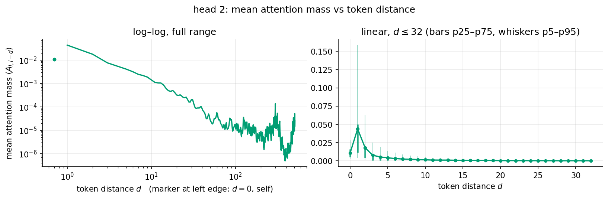

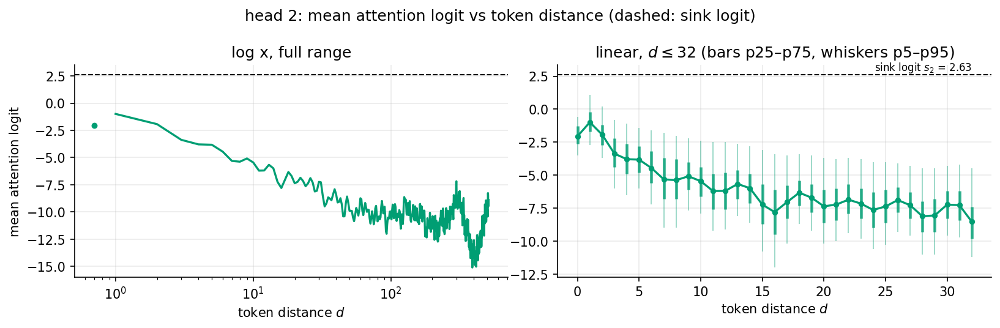

**Query tokens with the lowest sink mass** (most content-attending):

| token | count | sink mass |
|---|---:|---:|
| `'"'` | 957 | 0.61 |
| `'="'` | 601 | 0.61 |
| `'ref'` | 288 | 0.62 |
| `'",'` | 225 | 0.64 |
| `' {'` | 486 | 0.64 |
| `'{'` | 1315 | 0.64 |
| `'o'` | 221 | 0.67 |
| `'\n'` | 17097 | 0.67 |
| `'                '` | 296 | 0.68 |
| `']'` | 392 | 0.69 |
| `'}'` | 1210 | 0.71 |
| `'//'` | 207 | 0.71 |
| `'                        '` | 654 | 0.71 |
| `'{\\'` | 327 | 0.71 |
| `' -'` | 1394 | 0.72 |

**Query tokens with the highest sink mass:**

| token | count | sink mass |
|---|---:|---:|
| `' In'` | 343 | 0.98 |
| `' P'` | 219 | 0.97 |
| `' T'` | 272 | 0.97 |
| `' L'` | 208 | 0.97 |
| `' S'` | 332 | 0.97 |
| `' just'` | 200 | 0.97 |
| `' may'` | 300 | 0.97 |
| `' not'` | 956 | 0.97 |
| `' p'` | 204 | 0.97 |
| `' used'` | 248 | 0.97 |

**Top receiving tokens** (mean mass from the following 64 queries):

| token | count | received mass |
|---|---:|---:|
| `'<\|endoftext\|>'` | 287 | 0.022 |
| `'){'` | 221 | 0.008 |
| `'if'` | 266 | 0.006 |
| `'\n\n'` | 593 | 0.006 |
| `'mathcal'` | 207 | 0.005 |
| `'",'` | 228 | 0.004 |
| `'type'` | 285 | 0.004 |
| `' ='` | 1160 | 0.004 |
| `'\n'` | 17080 | 0.004 |
| `'_{'` | 391 | 0.004 |
| `' [@'` | 223 | 0.004 |
| `'                        '` | 657 | 0.003 |
| `'['` | 376 | 0.003 |
| `');'` | 437 | 0.003 |
| `' In'` | 361 | 0.003 |

### Head 0 — mean sink mass 0.91

Wakes mostly on **mid-word fragments and code/markup glue** (`'ing'`, `'in'`, `'](#'`, `'="'`, `'/'`) — consistent with a bigram/word-completion head; receivers are EOS and opening brackets.

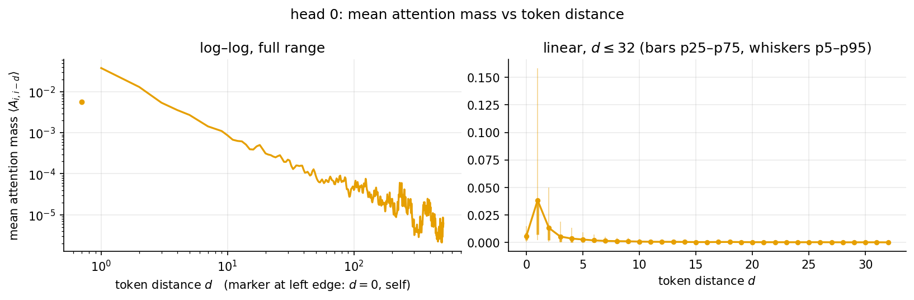

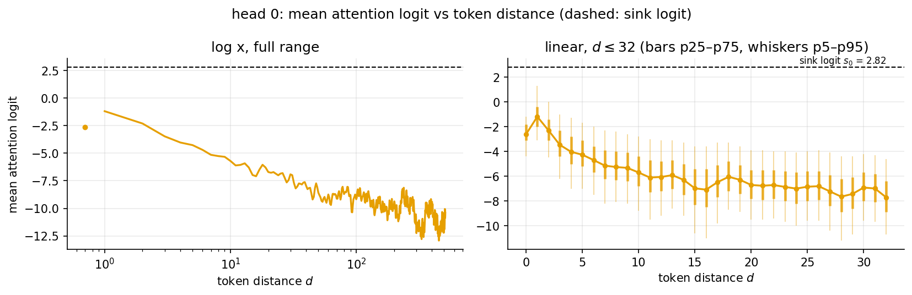

**Query tokens with the lowest sink mass** (most content-attending):

| token | count | sink mass |
|---|---:|---:|
| `'="'` | 601 | 0.65 |
| `'ing'` | 271 | 0.67 |
| `'](#'` | 201 | 0.72 |
| `'/'` | 1538 | 0.73 |
| `'in'` | 399 | 0.75 |
| `'('` | 1855 | 0.75 |
| `'.,'` | 341 | 0.76 |
| `'>'` | 766 | 0.76 |
| `'_'` | 2939 | 0.77 |
| `'"'` | 957 | 0.78 |
| `'\n'` | 17097 | 0.79 |
| `'B'` | 571 | 0.79 |
| `';'` | 1048 | 0.79 |
| `'e'` | 307 | 0.80 |
| `' "'` | 819 | 0.80 |

**Query tokens with the highest sink mass:**

| token | count | sink mass |
|---|---:|---:|
| `' p'` | 204 | 0.98 |
| `' L'` | 208 | 0.98 |
| `' M'` | 267 | 0.98 |
| `' F'` | 258 | 0.98 |
| `' P'` | 219 | 0.98 |
| `' T'` | 272 | 0.98 |
| `' s'` | 219 | 0.97 |
| `' C'` | 250 | 0.97 |
| `' S'` | 332 | 0.96 |
| `'In'` | 236 | 0.96 |

**Top receiving tokens** (mean mass from the following 64 queries):

| token | count | received mass |
|---|---:|---:|
| `'<\|endoftext\|>'` | 287 | 0.010 |
| `' {'` | 464 | 0.005 |
| `' [@'` | 223 | 0.005 |
| `'if'` | 266 | 0.003 |
| `' F'` | 258 | 0.003 |
| `'",'` | 228 | 0.003 |
| `'%'` | 283 | 0.003 |
| `'\n\n'` | 593 | 0.003 |
| `' $'` | 1086 | 0.003 |
| `'<'` | 643 | 0.003 |
| `' This'` | 235 | 0.002 |
| `');'` | 437 | 0.002 |
| `' $\\'` | 477 | 0.002 |
| `' i'` | 273 | 0.002 |
| `'ref'` | 281 | 0.002 |

## Do the sink-heavy heads compensate with a large OV circuit?

**Yes — and it is still true that they do little most of the time; both halves of the
question are right.** Per head, define the actual residual write of query $i$ (the sink slot
contributes exactly zero value):

$$w_i^h = W_O^h \sum_{j\le i} A_{ij}\, v_j,\qquad
\lVert w_i^h\rVert \;\lesssim\; c_i \cdot \max_j \lVert W_O^h v_j\rVert,
\qquad c_i = 1 - A_{i,\mathrm{sink}} .$$

| head | top OV $\sigma_1$ | $\lVert W_O^h W_V^h\rVert_F$ | mean $\lVert W_O^h v_j\rVert$ | mean $c_i$ | median $\lVert w\rVert$ | mean $\lVert w\rVert$ | p99 $\lVert w\rVert$ | mean $\lVert w\rVert$ at $c\approx 0.5$ |
|---:|---:|---:|---:|---:|---:|---:|---:|---:|
| 0 | 0.64 | 3.59 | 2.71 | 0.09 | 0.08 | 0.15 | 1.06 | 1.08 |
| 1 | 0.28 | 0.58 | 0.81 | 0.90 | 0.53 | 0.54 | 0.75 | 0.31 |
| 2 | 0.71 | 3.38 | 3.06 | 0.11 | 0.13 | 0.21 | 1.06 | 1.05 |
| 3 | 0.46 | 1.28 | 1.07 | 0.42 | 0.15 | 0.18 | 0.67 | 0.21 |
| 4 | 0.71 | 1.63 | 1.74 | 0.24 | 0.13 | 0.20 | 0.94 | 0.42 |
| 5 | 0.60 | 3.29 | 2.65 | 0.12 | 0.13 | 0.22 | 1.19 | 1.04 |

(Reference scale: the residual stream at this point is the raw embedding, mean norm
0.77.)

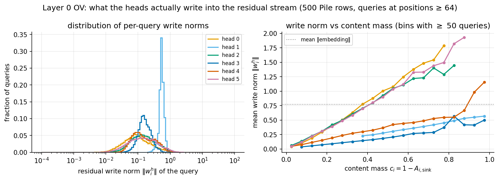

- **The compensation is real and large.** The sink-heavy heads 0/2/5 have the *biggest* OV
  circuits in the layer: per-key write norm $\lVert W_O^h v_j\rVert$ averages 2.6–3.1 vs
  **0.81 for head 1** — 3–4× larger — and the same factor shows in the static
  $\lVert W_O W_V\rVert_F$ (3.3–3.6 vs 0.58). The right panel makes it graphic: per unit of
  content mass, heads 0/2/5 write ~2 units of residual norm, head 1 only ~0.6 (its writes are
  further shrunk by averaging over ~58 keys, which partially cancel). At the same content
  mass $c = 0.5$, heads 0/2/5 write ≈ 1.0 — bigger than head 1 *ever* writes (its p99 is
  0.7, because its softmax never concentrates).
- **And yet, most of the time they still do relatively little.** Median write norms: heads
  0/2/5 = 0.08–0.13 vs head 1 = 0.50 — the 3–4× OV boost only partially offsets the ~10×
  smaller typical content mass. Relative to the residual stream (norm ≈ 0.77) the sinky
  heads' typical write is ~10–16%, i.e. a genuine near-no-op, while head 1's typical write
  is ~65% of the stream norm.
- The two facts together are exactly the **conditional-head design**: a large OV multiplier
  means the head does not need much softmax mass to act — waking up to $c \approx 0.25$
  already writes ~0.5, comparable to head 1's typical output — and the sink keeps the head
  silent (write ∝ $c$) the rest of the time. The write norm is almost perfectly linear in
  content mass (right panel), so for these heads the sink fraction *is* the head's activation
  level, with heavy tails: their p99 writes (1.0–1.1) exceed anything head 1 produces.
- Heads 3/4 are again intermediate, and head 3 is notably **weak per unit mass** (~0.3–0.5
  per unit $c$, the flattest line): its broad medium-range attention averages many keys, so
  even at high content mass its net write stays small — closer to head 1's
  averaging-and-cancelling regime than to the sharp bigram heads.

## Take-aways

1. Layer 0 of the sink model spends most of its attention budget on the built-in sink: 4 of 6
   heads park 75–91% of their mass there (weighted by the learned logits $s_h$ = 2.82, 2.13, 2.63, 1.91, 3.26, 2.64).
2. The sink usage is essentially **token-driven, not position-driven**: profiles are flat in
   query position (except the trivial early-context transient and a mild drift in heads 3/4),
   and per-token sink mass separates syntax tokens (attend) from prose tokens (sink).
3. The emergent pos-0 sink of pile_4l is gone (key-0 mass ≈ 0), but **EOS keys still attract
   outsize genuine attention** — boundary reading survives; boundary *parking* moved into the
   architecture.
4. Head roles: 0/2/5 = sink-defaulted previous-token/bigram heads; 1 = broad context head
   (the only head that is mostly *not* in the sink); 3/4 = medium-range, mildly
   position-sensitive.
5. The sink-heavy heads carry the **largest OV circuits** (per-key writes 3–4× head 1's):
   small post-softmax content mass is partially compensated by a large value/output
   multiplier, making them low-duty-cycle but strong-when-active conditional heads — though
   their *typical* write is still a near-no-op (~10–15% of the stream norm vs ~65% for
   head 1).
