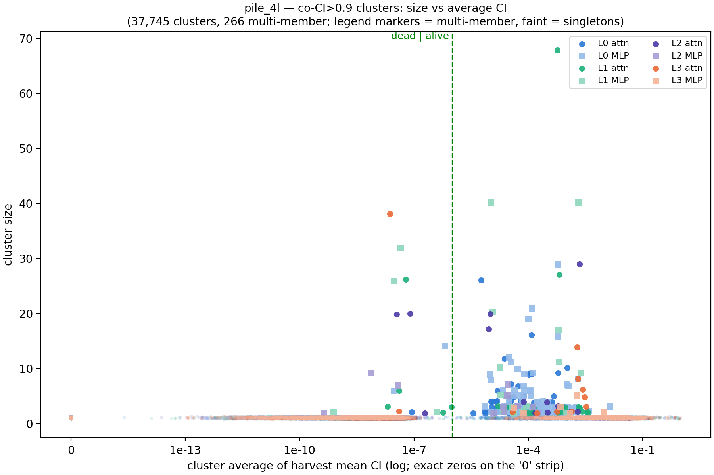
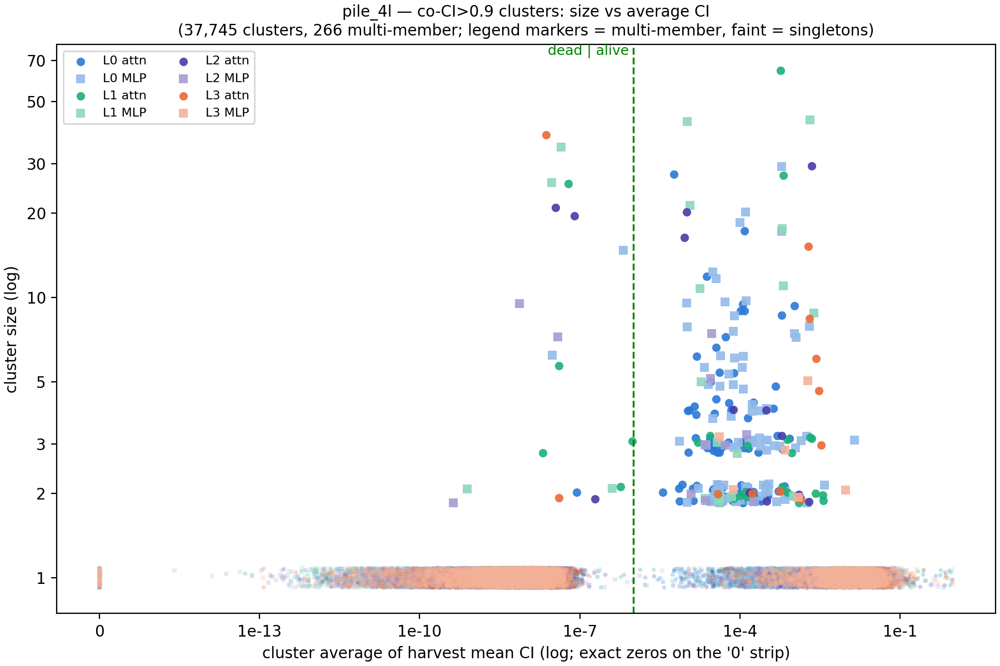
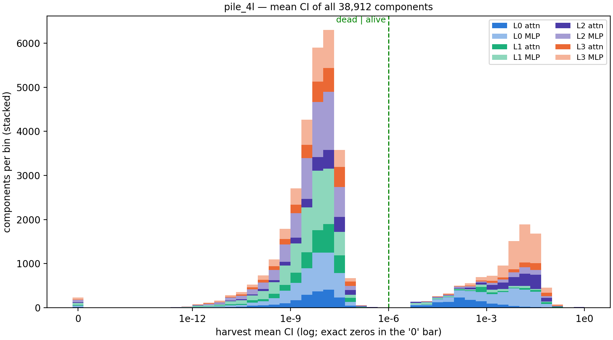
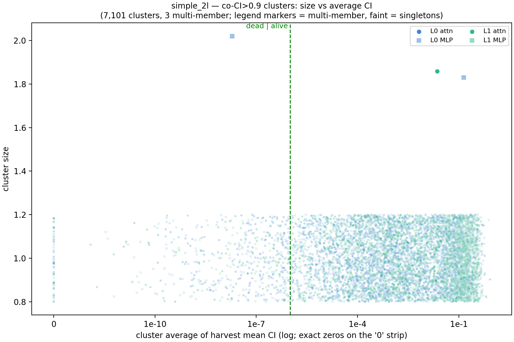

# Cluster size vs average CI — co-CI>0.9 clusters, all components

Each point is one cluster from the threshold rules of [report_all_clustered09.md](report_all_clustered09.md) (co-CI r > 0.9 chains, joins blocked at r ≤ 0.0) over **all** components of every matrix — dead and alive, singletons included (size 1; y is jittered ±0.2 so they don't fully overplot). x = mean over members of the harvest mean CI, log scale; clusters whose average is exactly 0 sit on the '0' strip at the left edge. The dashed green line is the alive/dead cutoff (mean CI = 1e-6). Hue = layer; dark circles = attention matrices, light squares = MLP matrices.

## pile_4l

37,745 clusters (266 with ≥ 2 members, largest 68); 231 zero-CI clusters on the '0' strip. CI from 4,000 cached Pile training rows (2.05M tokens).

Same plot, log y:

### Mean-CI histogram, all pile components

Per-component (not per-cluster) harvest mean CI, all 38,912 components, stacked by layer and attn/MLP (same colors as the scatters; exact zeros in the '0' bar).

### The 10 biggest alive clusters (size ≥ 20; dead clusters omitted)

Function summarized (by Claude, 2026-09-02) from the members' local autointerp labels (`interp.db`). The omitted dead clusters (6 of them, sizes 20-38, avg CI ~1e-8) all carry noise-level low-confidence labels — autointerp saw only residual firings.

| matrix | size | avg mean CI | alive | what the members' autointerp says |
|---|---|---|---|---|
| h.1.attn.v_proj | 68 | 5.8e-04 | 68/68 | Document boundaries: detects end-of-text/section starts, suppresses cross-document continuation, initiates new-document content (the L1 EOS machinery). |
| h.1.mlp.c_fc | 40 | 2.1e-03 | 40/40 | Structural-boundary / punctuation detectors that suppress continuation at delimiters and boundaries (includes 600, 743, 2807 of the pos-0 massive-vector trigger set). |
| h.1.mlp.c_fc | 40 | 1.0e-05 | 40/40 | Academic figure/table references: detects and produces 'Table N'/'Fig. N' labels and citations. |
| h.0.mlp.down_proj | 29 | 6.1e-04 | 29/29 | Document/section boundaries: end-of-text -> new-section/topic starts, suppresses continuation (MLP-1 boundary machinery). |
| h.2.attn.k_proj | 29 | 2.2e-03 | 29/29 | Structural/document boundary keys — the L2 attention-sink key block (first-token seq-start + EOS boundary-both groups merged). |
| h.1.attn.k_proj | 27 | 6.4e-04 | 27/27 | Document-boundary keys: end-of-text -> new document/topic transition (the L1k EOS block). |
| h.0.attn.q_proj | 26 | 5.7e-06 | 26/26 | The hacker-news title/username hyphen group (per the site descriptions); local labels are vaguer — hyphens, separators, section/metadata boundaries. |
| h.0.mlp.c_fc | 21 | 1.3e-04 | 21/21 | Articles & determiners: detects 'the'/'a' and common function words, mostly suppressing them. |
| h.1.mlp.down_proj | 20 | 1.2e-05 | 20/20 | Academic figure/table references (write side; pairs with the c_fc table/figure cluster). |
| h.2.attn.v_proj | 20 | 1.0e-05 | 20/20 | Academic figure/table references again at L2 (value side): detects/suppresses 'Table N'/'Fig. N' reference markers. |

## simple_2l

7,101 clusters (3 with ≥ 2 members, largest 2); 55 zero-CI clusters on the '0' strip. CI from 6,000 cached SimpleStories stories (1.72M tokens).

