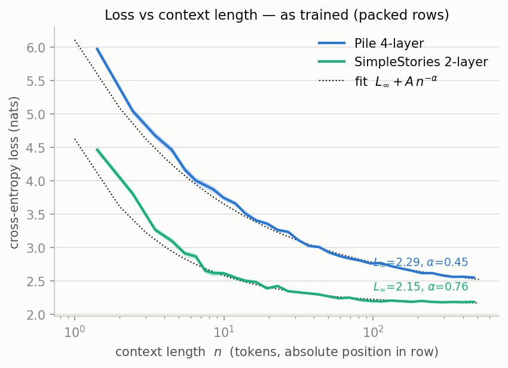
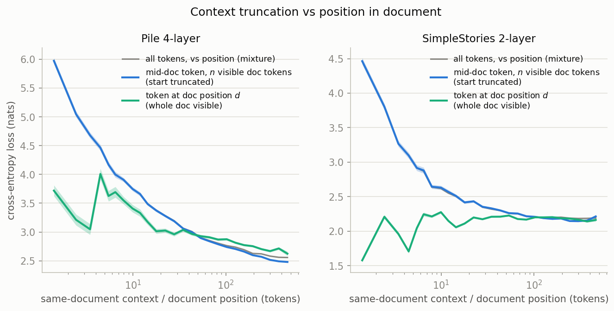
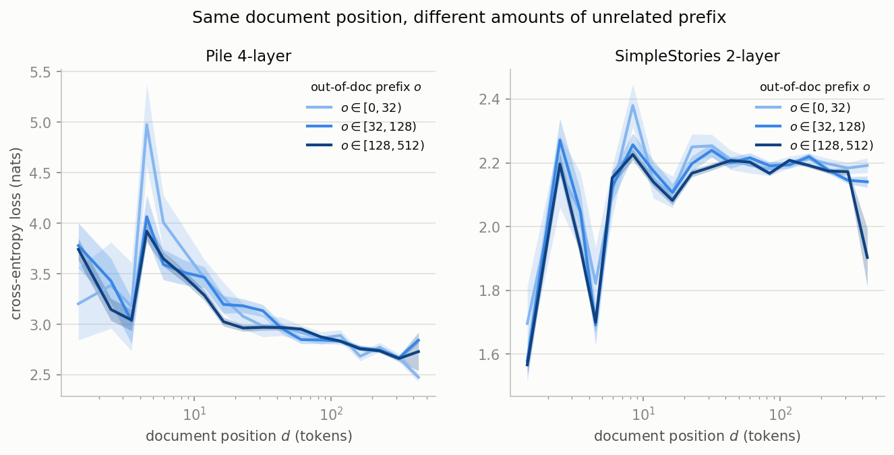

# How loss depends on context length

**Question:** how does per-token cross-entropy of the two target models (Pile 4-layer, SimpleStories 2-layer) depend on the amount of preceding context?

**TL;DR**

1. Both models follow a saturating power law in *same-document* context length $n$:
   $L(n) \approx L_\infty + A\,n^{-\alpha}$, with $\alpha \approx 0.45$ (Pile) and $\alpha \approx 0.78$ (SimpleStories).
2. The **Pile model keeps profiting from context through its entire 512-token window** (loss still falling at $n=512$: fit $L_\infty = 2.20$ vs measured $L(512) \approx 2.48$ nats). The **SimpleStories model saturates by $n \approx 100$** tokens — consistent with median story length 264 and shallow narrative structure. Half of the total loss drop is already gained by $n \approx 5$ for both models.
3. **Only the current document counts.** At fixed within-document context, adding up to 512 tokens of preceding *unrelated* documents changes loss by approximately nothing, for both models. Equivalently: predicting the first token of a new document is as hard as predicting with no context at all — and both models do this at the empirical entropy floor of document openings.
4. Loss vs *position in the document* (with full context visible) is **not monotone**: formulaic openings are easy, then Pile documents show an "what-is-this-document-about" entropy **spike at positions ≈ 4–6** (up to ~4–5 nats) before context accumulates.

## Setup

Data matches training exactly: packed rows of 513 tokens (512 predictions each), documents concatenated with EOS/EOT separators mid-row.

- **Pile 4-layer:** 4,000 pre-tokenized rows of `danbraunai/pile-uncopyrighted-tok-shuffled` (2.05M predictions). EOT id 0. Mean document length in the stream ≈ 1,450 tokens → most tokens' documents start *before* their row.
- **SimpleStories 2-layer:** 6,000 stories (mean length 287, median 264, max 763 tokens), tokenized and packed with `[EOS]` (id 1) separators exactly as the training pipeline (`tokenize_and_concatenate`) does → 3,362 rows (1.72M predictions).

For each predicted token (target at position $t$, 0-indexed, i.e. $n = t{+}1$ context tokens visible) we record the loss $\ell = -\log p(x_{t+1} \mid x_{\le t})$ in nats and the within-document distance $d$ = number of tokens since the last EOS in the context. Every token then falls in one of three classes:

| class | meaning | interpretation of its curve |
|---|---|---|
| $d = -1$ (no EOS in context) | mid-document token, document start cut off by the row boundary | loss vs **truncated same-document context** $n$ — the cleanest "loss vs context length" |
| $d \ge 0$ | document started inside the row, whole document visible | loss vs **position in document** $d$ (no truncation) |
| $d = 0$ specifically | predicting the first token of a new document | **cold open** — no usable context |

## Result 1 — loss vs context length, as trained

Mean loss vs absolute position $n$ (all tokens), with weighted fits of $L(n) = L_\infty + A\,n^{-\alpha}$:

| model | mean loss | $L_\infty$ | $A$ | $\alpha$ |
|---|---|---|---|---|
| Pile 4-layer | 2.707 nats (3.91 bits) | $2.293 \pm 0.010$ | $3.82 \pm 0.03$ | $0.448 \pm 0.006$ |
| SimpleStories 2-layer | 2.226 nats (3.21 bits) | $2.152 \pm 0.003$ | $2.48 \pm 0.04$ | $0.760 \pm 0.013$ |

Restricting to the clean truncated-context tokens ($d=-1$; same-document context exactly $n$) barely changes the exponents — the mixture curve is dominated by them:
$L_\infty = 2.203 \pm 0.014$, $\alpha = 0.454 \pm 0.008$ (Pile); $L_\infty = 2.123 \pm 0.009$, $\alpha = 0.782 \pm 0.023$ (SimpleStories).

How fast the benefit accrues (truncated-context curve, drop from $L(1)$ to the plateau):

| | $L(1)$ | plateau | 50% of drop | 75% | 90% |
|---|---|---|---|---|---|
| Pile | 5.97 | 2.48 (still falling) | $n=5$ | $n=18$ | $n=56$ |
| SimpleStories | 4.46 | 2.18 (flat from ~100) | $n=3$ | $n=7$ | $n=18$ |

The Pile tail keeps declining: window means 2.62 → 2.51 → 2.48 nats over $n \in [128,256), [256,384), [384,512)$. The SimpleStories tail is flat (2.18 → 2.15 → 2.17). So the 4-layer model would plausibly benefit from a longer window, while the 2-layer model exhausts its context use at ~100 tokens.

## Result 2 — truncation vs position in document

Separating the two meanings of "context length":

- **Blue (truncated context):** smooth power-law decay — this is the real "value of $n$ tokens of context".
- **Green (position in document, full context):** *not* a decay curve. Openings are formulaic (Pile $d\in\{1..3\}$: ~3.0–3.7 nats, *below* the truncated curve at the same $x$), then Pile loss spikes to ~4.0 nats at $d \approx 4\text{–}6$ — after the boilerplate, the model briefly faces maximal uncertainty about what the document *is* — before decaying as real context accumulates. SimpleStories: a zigzag over the first ~5 tokens (e.g. $L(d{=}1) = 1.57$: after the opening word the continuation is highly constrained), then dead flat at ≈ 2.19 nats from $d \approx 6$ on.
- At large $d$ the Pile green curve sits ~0.2 nats *above* the blue one. This is composition, not context: blue tokens at large $n$ come only from documents ≥ 512 tokens, and long documents (code, logs, tables) are systematically easier per token. Survivorship affects the green tail the same way (only long documents reach large $d$).

**Cold opens ($d=0$):** Pile 5.81 nats, SimpleStories 5.71 nats — almost exactly the no-context loss $L(1)$ (5.97 / 4.46 is $L(1)$ over *mid-document* tokens; for openings the relevant floor is the opening distribution itself). Both models sit essentially at the empirical entropy of document openings (Pile: ≥ 5.3 nats from 1,416 sampled openings, a lower bound; SimpleStories: ≈ 5.60 nats — 805 distinct first tokens in 6,000 stories; the dataset's openings are diverse by construction, so the high cold-open loss is *optimal*, not underfitting). For reference, full unigram entropies are 7.84 (Pile) and 5.91 (SimpleStories) nats.

## Result 3 — out-of-document context is worthless

At fixed document position $d$, splitting tokens by the amount $o$ of *unrelated* preceding text ($o \in [0,32)$, $[32,128)$, $[128,512)$): the three bands coincide within error for both models, across all $d$. The only hint of an effect is at the Pile entropy spike ($d \approx 4\text{–}6$), where tokens with almost no prefix ($o < 32$) show a larger spike (~5.0 vs ~3.9 nats) — small samples there (wide CI), and $o$ correlates with the previous document's length, so we do not over-interpret it.

Together with the cold-open result: **effective context = current document only.** Neither model retrieves anything useful across an EOS boundary — relevant for circuit analyses: attention to pre-EOS positions should carry ~no counterfactual loss effect.

## Caveats

- Error bands are SEMs treating tokens as independent; tokens within a row are correlated, so true uncertainties are somewhat larger.
- Curves marginalize over document type; comparisons *across* $x$-values inherit composition effects (noted above for the large-$d$/large-$n$ tails). The within-document curves also include EOS-prediction targets (< 0.3% of tokens; excluding them shifts plateaus by < 0.004 nats).
- Evaluation uses the *train* split (as in training; both models saw ~1 epoch scale data, memorization unlikely to distort at this scale, but strictly this is train loss).
- The power law is a summary, not a law: it overshoots at $n \lesssim 3$ for both models (visible in Fig 1).

## Files

- [compute.py](compute.py) — fetches/caches data, runs both models, writes per-token `loss` / `dist` / `target_is_eos` arrays to `results/<model>.npz` (~10 min first run, GPU).
- [plots.py](plots.py) — binned curves, power-law fits, the three figures, `fit_stats.txt`.
- `cache/`, `results/` — gitignored, regenerated by `compute.py`.
