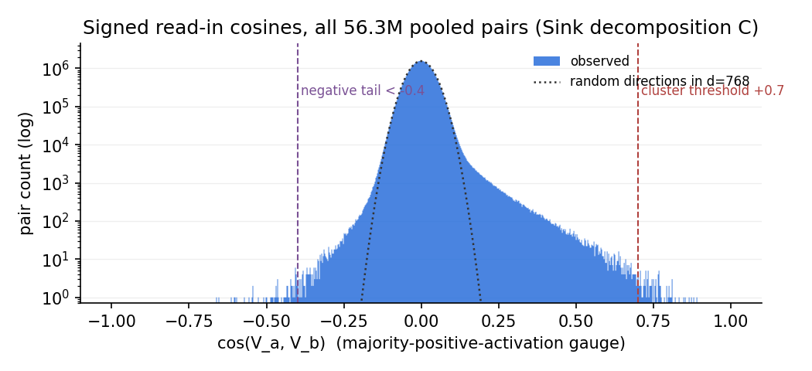
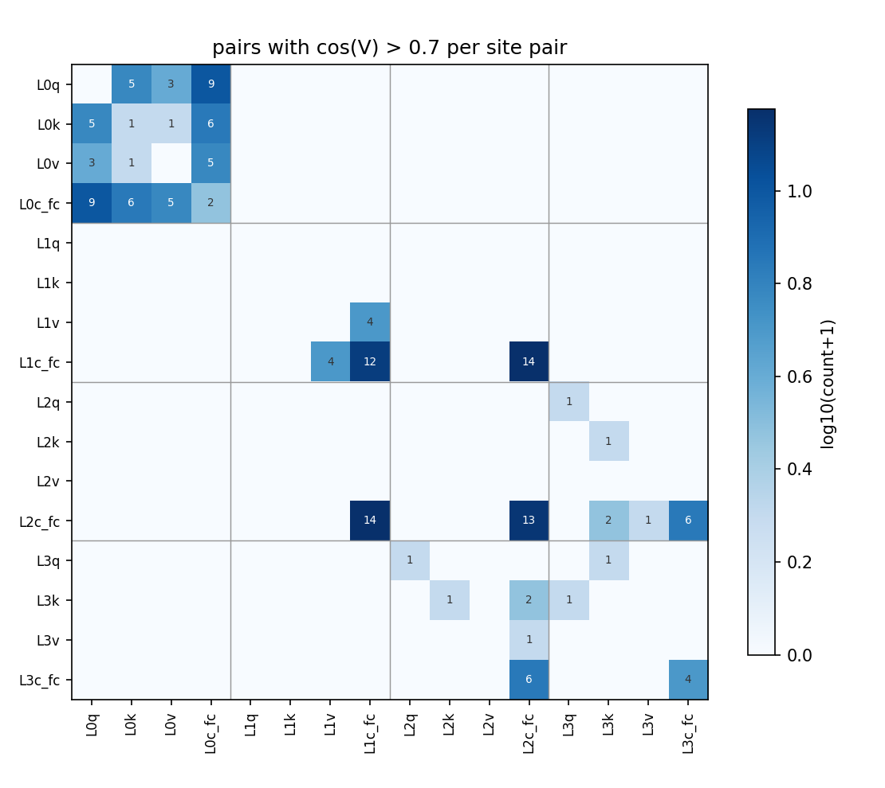
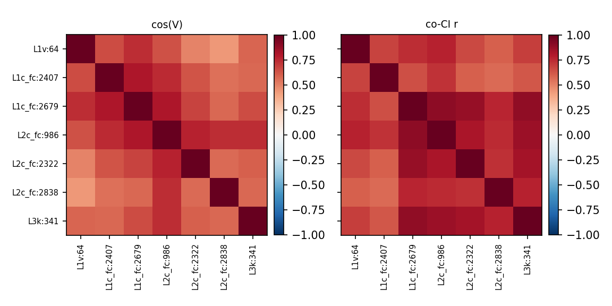
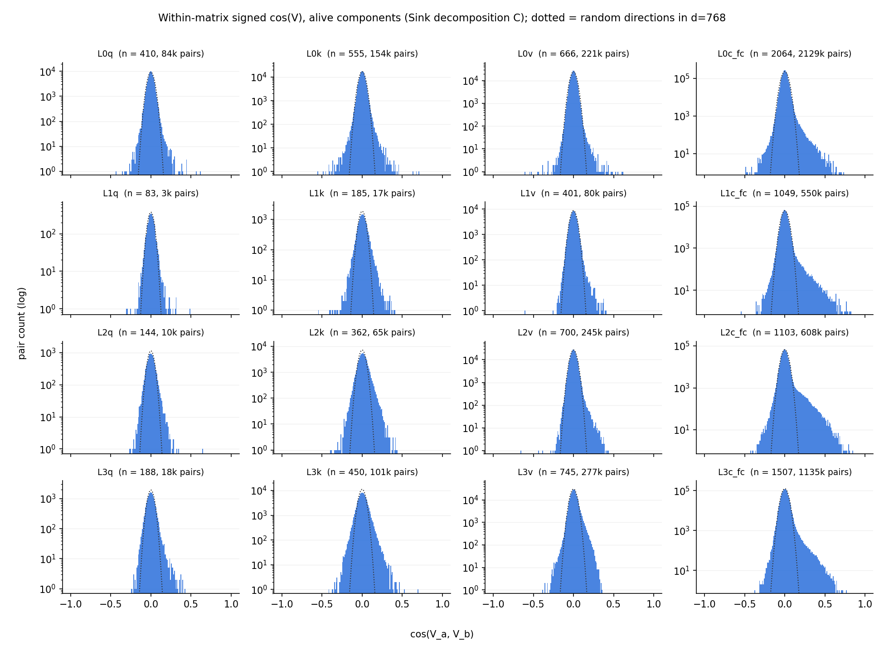
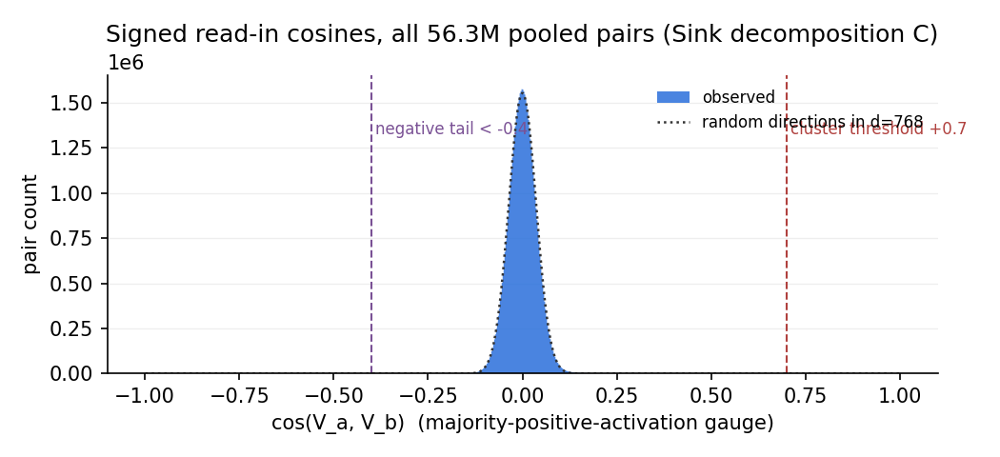
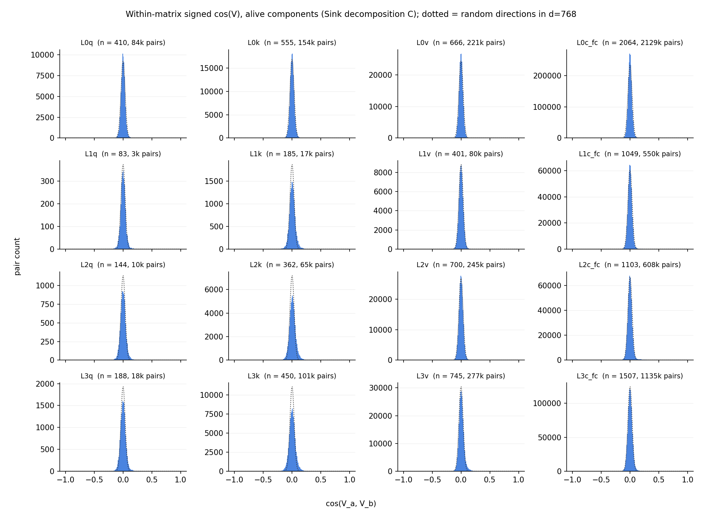

# Sink decomposition C (p-d60af588): signed read-in (V) cosines across the residual-stream-reading matrices

Sign convention: each component's $(U_c, V_c)$ gauge is flipped so its input activation $V_c\cdot x$ is positive on the majority of tokens where it fires (CI > 0.1) — the interactive cross-widget convention. Under it, $\cos(V_a,V_b) > 0$ means two components read the same stream direction with the same polarity; $< 0$, opposite polarities.

## Headlines

- **108 of 10612 pooled components (1%) sit in
  34 clusters** chained at cos > +0.7
  (32 same-matrix, 34 same-layer
  cross-matrix, 25 cross-layer pairs above +0.7).
- **The negative tail is thin: 62 pairs below -0.4, strongest
  -0.66** — under the activation gauge,
  strong read-in alignment is essentially always same-polarity; there is no
  sizable population of components reading the same feature with opposite
  sign at |cos| > 0.7.
- **Signed embedding alignment by layer** (clustered members' cos(V, wte[own
  top token]), median): L0 +0.70 /
  L1 +0.19 / L2 +0.12 /
  L3 +0.05.

| token | n(L0 cl.) | n(upper cl.) | cos(L0, wte) | cos(up, wte) | cos(L0, up) |
|---|---|---|---|---|---|
| `','` | 3 | 14 | +0.81 | +0.15 | +0.18 |
| `'2'` | 4 | 7 | +0.54 | +0.17 | +0.21 |
| `'\n'` | 5 | 4 | +0.14 | +0.05 | +0.06 |
| `' the'` | 2 | 4 | +0.81 | +0.24 | +0.29 |
| `'.'` | 3 | 3 | +0.81 | +0.05 | +0.05 |
| `' and'` | 3 | 2 | +0.83 | +0.26 | +0.27 |
| `' is'` | 2 | 3 | +0.74 | +0.15 | +0.16 |
| `' of'` | 2 | 2 | +0.77 | +0.25 | +0.12 |

  (Auto-generated: token = the modal top-1 activating token of the cluster,
  L0/upper cluster = the largest all-layer-0 resp. no-layer-0 cluster with
  that modal token, directions = member means under the activation gauge.)
- **Same-matrix aligned pairs**: median co-CI
  r = 0.78, median signed write cos(U) = +0.04
  (0 pairs > +0.7, 2 < -0.1).

- **C shares read-ins an order of magnitude less than new A.** 91 pairs above
  +0.7 vs new A's 1,089 (on a *larger* pooled set, 10,612 vs 8,657); max cos
  0.89 vs 0.95; 1% of components clustered vs 11%; largest cluster n = 7 vs
  n = 22. The pervasive "every reader of token X shares one direction"
  machinery of new A is only weakly present in the sink decomposition.
- **No EOS/boundary cluster.** New A's biggest cross-matrix cluster was the
  22-comp EOS/pos-0 sink read direction; C has no cluster with modal token
  `<|endoftext|>` at all — consistent with the sink-models finding that the
  built-in attention sinks remove the emergent boundary machinery these
  components read.
- **The L0-vs-upper split survives, but the re-encoding is less complete.**
  L0 members read toward the token embedding (median +0.70); upper-layer
  members are only weakly aligned — yet at L1 the median is +0.19 (new A:
  +0.03), and several matched tokens keep cos(up, wte) ≈ +0.15..0.26: in
  these targets the raw embedding remains partially readable (and read) in
  upper layers.
- **The negative tail's clearest motif is ± feature splits inside v_proj.**
  L2v:334 ↔ L2v:573 (cos V −0.65, co-CI r −0.41, cos U +0.45) and
  L1v:144 ↔ L1v:634 (−0.60, −0.42, +0.59): opposite-polarity reads of one
  axis, anti-co-firing, *similar* write directions — one feature axis split
  into a component per sign.

## Method

All **alive** components (sample mean CI > 1e-6 over the 4,000 cached Pile
rows) of the 16 matrices whose $V$ factor reads the residual stream —
`h.<l>.attn.{q,k,v}_proj` (input $\mathrm{rms}_1(h)$) and `h.<l>.mlp.c_fc`
(input $\mathrm{rms}_2(h)$), $l=0..3$ — pooled into one set of
**10612 components**; `o_proj` and `down_proj` are excluded. For every pair the
**signed** read-in alignment

$$\cos(V_a, V_b) = \frac{V_a \cdot V_b}{\lVert V_a\rVert\,\lVert V_b\rVert},$$

with each component first put in the majority-positive-activation gauge
(sign statistics over the same 2.05M tokens; `comp_signs()`). For random unit
vectors in $d=768$ the signed cosine is symmetric around 0 with
$\mathrm{std} = 1/\sqrt d \approx 0.036$
(and $E|\cos| = \sqrt{2/\pi d} \approx 0.029$). Scripts:
`hide/compute_signed.py` → `hide/cache/vcos_signed_C.npz`,
`hide/report_signed.py` (this report); decomposition p-d60af588 of target
`t-87f91319`.

**Gain-folding check:** folding the site RMSNorm gains into $V$ (effective
read on the unit stream is $g \odot V$) changes essentially nothing — pairs
above +0.4/+0.7 resp. below -0.4:
4114/91/62 raw vs
4165/94/63
gain-folded — so raw $V$ cosines are used throughout.

## Distribution

| threshold | 0.4 | 0.5 | 0.6 | 0.7 | 0.8 | 0.9 |
|---|---|---|---|---|---|---|
| pairs above +thr | 4114 | 1296 | 379 | 91 | 16 | 0 |
| pairs below -thr | 62 | 14 | 5 | 0 | 0 | 0 |

(56.3M pairs total; max +0.892, min
-0.661.)

Of the 91 pairs above +0.7: **32 same-matrix,
34 same-layer cross-matrix, 25
cross-layer**.

## Clusters (chaining at cos > +0.7)

Connected components of the cos > +0.7 graph: **34 clusters
with ≥ 2 members, covering 108 of 10612 components**. Clusters are
ordered by the number of distinct matrices involved (ties by size); members
by matrix, then mean CI descending.
Tables below: all clusters with ≥ 5 members in full, smaller ones compacted.
Per member: sample mean CI, share of CI>0.1 fires at position 0, signed
alignment of V with the member's own top token's embedding ("emb align"),
top activating tokens (share of summed CI). Below each table: member × member
heatmaps of cos(V) and co-CI r (cross-site values from
`hide/cache/cluster_ci_signed_C.npz`), members in table order, both on
the same RdBu scale.

### Cluster 1 — n = 7 (L1c_fc, L1v, L2c_fc, L3k); edge cos +0.73–+0.81

| matrix | component | mean CI | pos-0 fires | emb align | top tokens |
|---|---|---|---|---|---|
| L1v | 64 | 1.8e-02 | 1% | +0.08 | `'2'` `'1'` `'0'` `'3'` `'4'` |
| L1c_fc | 2407 | 2.0e-02 | 1% | +0.23 | `'2'` `'1'` `'0'` `'3'` `'4'` |
|  | 2679 | 1.2e-02 | 1% | +0.17 | `'2'` `'1'` `'0'` `'3'` `'4'` |
| L2c_fc | 986 | 1.3e-02 | 1% | +0.16 | `'2'` `'1'` `'0'` `'3'` `' 0'` |
|  | 2322 | 8.9e-03 | 1% | +0.12 | `'2'` `'1'` `'0'` `'3'` `' 0'` |
|  | 2838 | 7.3e-03 | 1% | +0.12 | `'2'` `'1'` `'3'` `'0'` `'4'` |
| L3k | 341 | 1.0e-02 | 1% | +0.10 | `'2'` `'1'` `'0'` `'3'` `'4'` |

### Smaller clusters (3–4 members, 14 of them) — grouped by kind

| members | kind | top tokens (first member) |
|---|---|---|
| L2k:472 L2c_fc:2662 L3q:152 L3k:26 | cross-layer | `'\n'` `'.'` `','` `' the'` |
| L1v:118 L1c_fc:1736 L1c_fc:2917 L2c_fc:237 | cross-layer | `' the'` `' The'` `'The'` `' this'` |
| L1c_fc:1161 L2c_fc:1994 L3c_fc:270 L3c_fc:2117 | cross-layer | `'\\'` `' \\'` `'{'` `' $\\'` |
| L1c_fc:3025 L2c_fc:637 L3c_fc:335 | cross-layer | `'s'` `' they'` `'S'` `' data'` |
| L2c_fc:2132 L3v:19 L3c_fc:233 | cross-layer | `'.'` `' the'` `','` `'\n'` |
| L1c_fc:299 L1c_fc:735 L1c_fc:1608 L2c_fc:2977 | cross-layer | `'\n'` `'  '` `'    '` `'\t'` |
| L1c_fc:920 L1c_fc:2444 L2c_fc:1426 | cross-layer | `'.'` `').'` `'?'` `')'` |
| L2c_fc:1483 L3c_fc:2155 L3c_fc:2386 | cross-layer | `' a'` `'A'` `'a'` `' A'` |
| L0q:321 L0k:257 L0v:316 L0c_fc:176 | same-layer | `','` `'2'` `'1'` `'0'` |
| L0q:333 L0k:513 L0v:536 L0c_fc:88 | same-layer | `'\n'` `'\n\n'` `','` `'\r\n'` |
| L0q:25 L0v:486 L0c_fc:1651 | same-layer | `'.'` `').'` `':'` `'?'` |
| L0q:263 L0v:353 L0c_fc:409 | same-layer | `','` `';'` `'),'` `'.,'` |
| L0q:583 L0v:697 L0c_fc:2692 | same-layer | `' and'` `' or'` `' but'` `'/'` |
| L2c_fc:449 L2c_fc:1303 L2c_fc:2358 | same-matrix | `' is'` `' be'` `' was'` `' are'` |

### Pairs (17 two-member clusters) — the 17 highest-cos shown, grouped by kind

| pair | cos V | kind | co-CI r | cos U | top tokens (a / b) |
|---|---|---|---|---|---|
| L1c_fc:1130 ↔ L2c_fc:2845 | +0.73 | cross-layer | 0.89 |  | `' time'` `' data'` `' new'` / `' time'` `' data'` `'type'` |
| L2c_fc:2156 ↔ L3c_fc:1837 | +0.73 | cross-layer | 0.71 |  | `'m'` `'M'` `' M'` / `'M'` `' M'` `'m'` |
| L2q:25 ↔ L3q:283 | +0.72 | cross-layer | 0.25 |  | `'\n'` `' the'` `'<\|endoftext\|>'` / `' the'` `' of'` `' a'` |
| L2c_fc:771 ↔ L3c_fc:2860 | +0.71 | cross-layer | 0.65 |  | `','` `"'s"` `'’'` / `' a'` `' their'` `"'s"` |
| L1c_fc:1488 ↔ L2c_fc:1619 | +0.70 | cross-layer | 0.77 |  | `' of'` `' to'` `' in'` / `' of'` `' to'` `' in'` |
| L1v:696 ↔ L1c_fc:160 | +0.77 | same-layer | 0.93 |  | `' a'` `' an'` `'A'` / `' a'` `' an'` `'a'` |
| L0q:710 ↔ L0c_fc:768 | +0.77 | same-layer | 0.66 |  | `' of'` `'of'` `"'s"` / `' of'` `' from'` `'of'` |
| L0q:524 ↔ L0c_fc:2514 | +0.77 | same-layer | 0.72 |  | `'_'` `'_{'` `'}_'` / `'_'` `'/'` `'_{'` |
| L0q:70 ↔ L0c_fc:988 | +0.76 | same-layer | 0.74 |  | `'-'` `'–'` `'--'` / `'-'` `'_'` `'/'` |
| L0q:83 ↔ L0v:27 | +0.74 | same-layer | 0.75 |  | `'  '` `'    '` `'\t'` / `'    '` `'  '` `'\t'` |
| L1v:605 ↔ L1c_fc:1985 | +0.73 | same-layer | 0.91 |  | `' and'` `' or'` `'/'` / `' and'` `' or'` `'/'` |
| L0k:398 ↔ L0c_fc:2184 | +0.71 | same-layer | 0.56 |  | `' is'` `' are'` `' was'` / `' is'` `' was'` `' are'` |
| L3c_fc:1853 ↔ L3c_fc:2642 | +0.77 | same-matrix | 0.84 | +0.11 | `','` `'),'` `'.,'` / `','` `'),'` `'",'` |
| L1c_fc:2374 ↔ L1c_fc:2580 | +0.75 | same-matrix | 0.76 | +0.04 | `'ID'` `'ED'` `'ST'` / `' CD'` `'ED'` `' be'` |
| L0c_fc:760 ↔ L0c_fc:1013 | +0.73 | same-matrix | 0.75 | +0.18 | `'2'` `'1'` `'0'` / `'2'` `'1'` `'0'` |
| L3c_fc:439 ↔ L3c_fc:2816 | +0.72 | same-matrix | 0.82 | +0.10 | `' the'` `' The'` `'The'` / `' the'` `' The'` `'The'` |
| L0c_fc:1767 ↔ L0c_fc:2046 | +0.71 | same-matrix | 0.37 | +0.10 | `' the'` `' a'` `' The'` / `' the'` `' The'` `' this'` |

## Negative tail (cos < -0.4)

62 pairs read the same stream direction with **opposite** polarity at
cos < -0.4 (vs 4114 positive pairs above
+0.4); the strongest 20 (co-CI r from the signed cluster-CI Gram —
its members include every component in a pair below -0.4):

| pair | cos V | kind | co-CI r | cos U | top tokens (a / b) |
|---|---|---|---|---|---|
| L0v:297 ↔ L0c_fc:176 | -0.66 | same-layer | 0.39 |  | `','` `' the'` `' a'` / `'2'` `'1'` `'0'` |
| L2v:334 ↔ L2v:573 | -0.65 | same-matrix | -0.41 | +0.45 | `','` `' the'` `'.'` / `'\n'` `'.'` `','` |
| L0q:321 ↔ L0v:297 | -0.61 | same-layer | 0.39 |  | `'2'` `'1'` `'0'` / `','` `' the'` `' a'` |
| L0v:297 ↔ L0v:316 | -0.60 | same-matrix | 0.56 | +0.09 | `','` `' the'` `' a'` / `','` `'2'` `'1'` |
| L1v:144 ↔ L1v:634 | -0.60 | same-matrix | -0.42 | +0.59 | `' the'` `'.'` `','` / `'\n'` `'.'` `','` |
| L0q:83 ↔ L0c_fc:1987 | -0.60 | same-layer | 0.10 |  | `'  '` `'    '` `'\t'` / `'\n'` `'  '` `'                        '` |
| L0v:27 ↔ L0c_fc:1987 | -0.57 | same-layer | 0.15 |  | `'    '` `'  '` `'\t'` / `'\n'` `'  '` `'                        '` |
| L0k:602 ↔ L0k:603 | -0.56 | same-matrix | 0.02 | +0.05 | `'\n'` `' the'` `'.'` / `'<\|endoftext\|>'` `'IN'` `'AT'` |
| L1k:533 ↔ L1k:602 | -0.55 | same-matrix | 0.11 | -0.10 | `'\n'` `'<\|endoftext\|>'` `' the'` / `' ('` `'('` `')'` |
| L1c_fc:489 ↔ L1c_fc:2921 | -0.54 | same-matrix | 0.33 | -0.20 | `' is'` `' on'` `' be'` / `' on'` `' over'` `' at'` |
| L0v:518 ↔ L0v:699 | -0.54 | same-matrix | -0.08 | +0.49 | `'.'` `'s'` `'a'` / `' the'` `' of'` `' to'` |
| L0v:297 ↔ L0v:334 | -0.53 | same-matrix | 0.43 | +0.12 | `','` `' the'` `' a'` / `'2'` `'4'` `'3'` |
| L0v:382 ↔ L0c_fc:1651 | -0.51 | same-layer | 0.39 |  | `'.'` `'-'` `'s'` / `'.'` `').'` `':'` |
| L0k:257 ↔ L0v:297 | -0.50 | same-layer | 0.50 |  | `'2'` `'1'` `'0'` / `','` `' the'` `' a'` |
| L1c_fc:1985 ↔ L2v:230 | -0.50 | cross-layer | 0.54 |  | `' and'` `' or'` `'/'` / `' and'` `' is'` `' be'` |
| L0k:281 ↔ L0k:338 | -0.49 | same-matrix | -0.00 | -0.00 | `' to'` `'######'` `'to'` / `' the'` `' this'` `'This'` |
| L0c_fc:143 ↔ L0c_fc:1646 | -0.48 | same-matrix | 0.29 | -0.24 | `' is'` `' be'` `' are'` / `' all'` `' any'` `' each'` |
| L0c_fc:1586 ↔ L0c_fc:1987 | -0.48 | same-matrix | 0.13 | +0.07 | `'    '` `'  '` `'\t'` / `'\n'` `'  '` `'                        '` |
| L0c_fc:1674 ↔ L0c_fc:1987 | -0.48 | same-matrix | 0.13 | +0.05 | `'  '` `'    '` `'\t'` / `'\n'` `'  '` `'                        '` |
| L0q:161 ↔ L0c_fc:96 | -0.47 | same-layer | 0.48 |  | `' ('` `'*'` `' *'` / `','` `'.'` `'\n'` |

## Do aligned readers co-fire / co-write?

For the 32 **same-matrix** pairs above +0.7: median co-CI
r = 0.78 (quartiles 0.72–0.86;
7 pairs > 0.9, 0 pairs < 0.1) and median
signed write cos(U) = +0.04 (0 pairs
> +0.7, 17 with |cos U| < 0.1,
2 < -0.1). The 59 **cross-site** pairs co-fire
similarly: median co-CI r = 0.74 (quartiles
0.60–0.83; 5 > 0.9,
7 < 0.1; from the cross-site CI Gram of all clustered
components, Modal job `hide/cluster_ci_signed_modal.py` →
`hide/cache/cluster_ci_signed_C.npz`). The 62 negative-tail
pairs with a defined r have median co-CI r = 0.29
(9 of them negative).
U factors of different sites live in different output spaces, so no cross-site
cos(U) is defined.

## Within-matrix cosine distributions

One panel per matrix: the distribution of signed cos(V) over all pairs of
alive components *within* that matrix (log count; dotted line = the analytic
random-directions null in $d = 768$, scaled to the panel's pair count).

## Linear-scale versions

The same distribution plots with a linear y axis (the log plots emphasize
the tails; these show where the actual mass sits).

