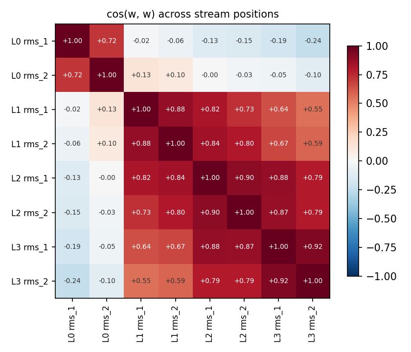
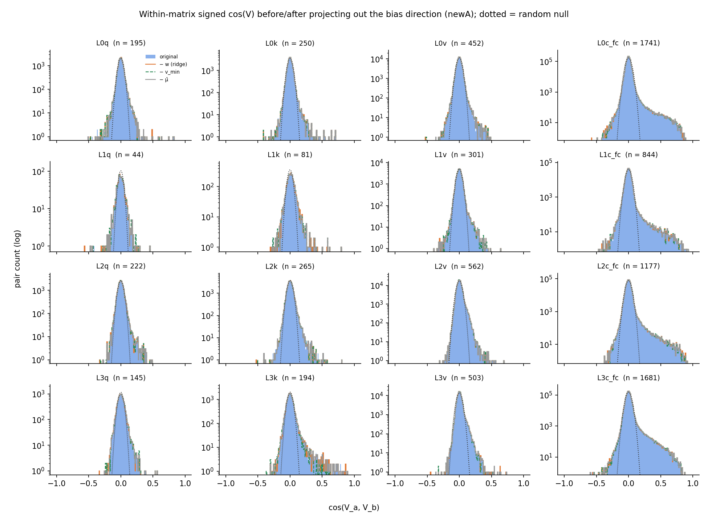
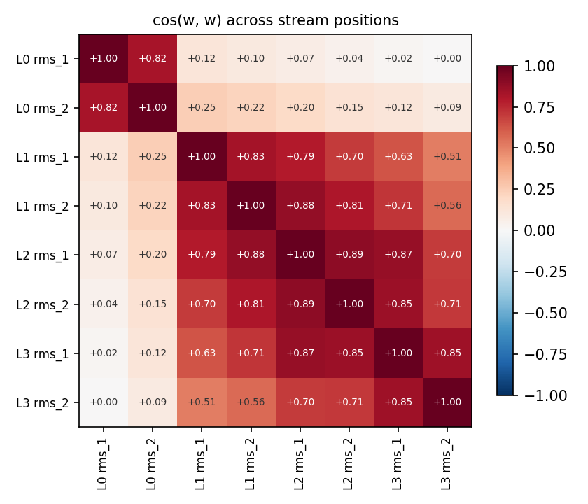
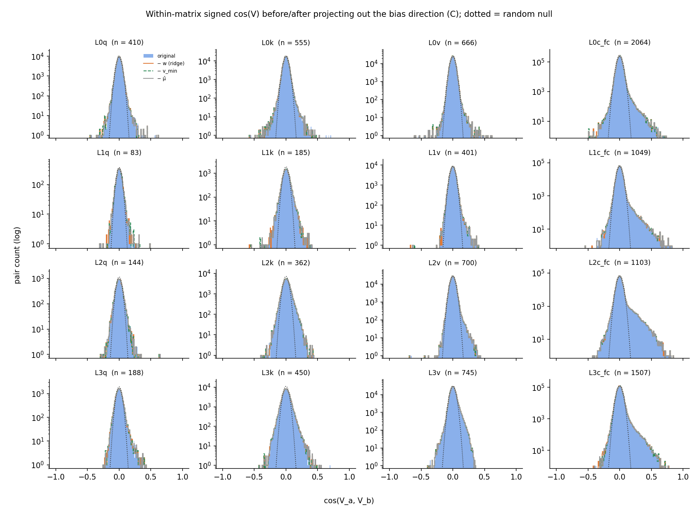
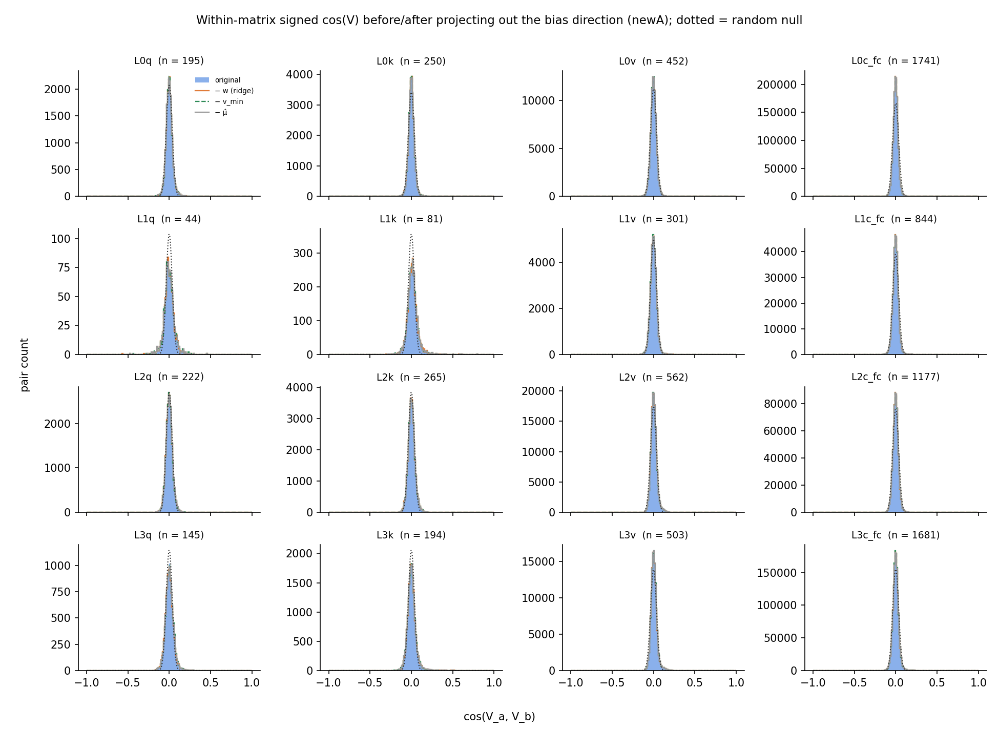
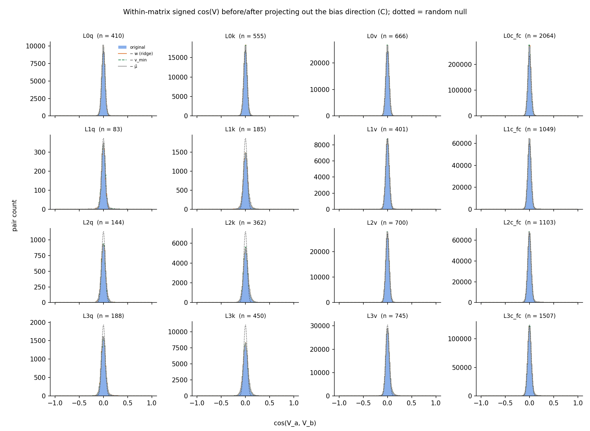

# The residual-stream bias direction, located per stream position — and its role in read-in cosine similarity

**Question (user, 2026-09-16):** find the bias direction at each position in
the residual stream (primary guess: the lowest-variance direction), then
project it out of the read-in components and check whether the within-matrix
cosine distributions become more symmetric and/or closer to the random null.

**Method.** For each norm site `h.<l>.rms_1` (feeds q/k/v) and `h.<l>.rms_2`
(feeds c_fc), the statistics of the *actual read-in input*
$x = g \odot h/\mathrm{rms}(h)$ (gain included) over 255k Pile positions
(500 cached rows; positions 0–1 and `<|endoftext|>` excluded as
massive-vector outliers; `hide/stream_stats.py` →
`hide/cache/stream_stats_{pile4l,sink45}.npz`). The C target is run with the
**corrected RoPE** (`load.load_sink(45)`), so its stream statistics are not
affected by the 2026-09-15 loader bug (the component gauge and mean-CI
annotations still are). Candidates per site:

- $v_\min$ — lowest-variance eigenvector of the input covariance $\Sigma$;
- $w \propto (\Sigma + \epsilon I)^{-1}\mu$ ($\epsilon = 10^{-3}\bar\lambda$)
  — maximizes $\mathrm{ratio}(d) = (\mu\cdot d)/\sqrt{d^\top\Sigma d}$,
  i.e. the direction whose constant offset is largest relative to how much
  the data varies along it: the natural definition of "the bias direction";
- $\hat\mu$ — the mean input direction.

## Headline findings

- **A strong bias direction exists at every stream position, in both
  models**: ratio(w) = 17–50 everywhere — a constant offset of tens of
  standard deviations. It always lives in the low-variance end of the
  spectrum (variance rank ≳ 745 of 768 from the top).
- **The lowest-variance direction is the bias direction only at some
  sites.** cos(v_min, w) ≈ 0.99 at L0/L2 rms_1 (both models) and most sink45
  sites — but at pile `h.1.rms_1` (the stream after block 0) v_min carries
  *no* mean at all (ratio 0.2, cos(v_min, w) = 0.01): the lowest-variance
  direction there is a frozen direction that is not the bias. This matches
  the token-embeds finding that MLP 1 destroys the embedding bias direction
  while new frozen directions appear later.
- **Projecting the bias direction out changes the within-matrix cosine
  distributions essentially not at all** (mean skew: newA +1.86 → +1.82,
  C +0.73 → +0.68; tail counts move by ~1%), **because the read-in
  components do not read it**: median |cos(V, w)| over all alive read-side
  components ≈ 0.032 in both decompositions — the random-direction baseline
  is 0.029 — and the single strongest alignment across all 16 matrices is
  only ~0.05. The positive skew and heavy tails of the cosine distributions
  are shared *feature/token* directions, not a shared bias component. (That
  a 17–50 σ constant offset is read by *no* component is itself notable —
  the decompositions route the bias around the component dictionary.)
- **The one direction whose removal does reshape a distribution is not the
  bias but the massive-vector/boundary direction**: in newA, v_min at
  `h.3.rms_1` (a *bulk*-low-variance direction — sink positions were
  excluded from the statistics — orthogonal to w there, cos 0.26) is read at
  |cos| 0.5–0.9 by exactly the known L3 EOS/pos-0 sink components; projecting
  it out collapses the L3k tail (pairs > 0.4: 83 → 18, skew +3.7 → +1.5) and
  L3v (14 → 2). In C the effect is absent — consistent with the built-in
  sinks removing that machinery.

---

# New A (p-8383f5e5, target t-9d2b8f02)

## Bias directions per stream position

Diagnostic $\mathrm{ratio}(d) = (\mu\cdot d)/\sqrt{d^\top\Sigma d}$ —
the constant offset along $d$ in units of the data's standard deviation along
$d$ (a strong bias direction has a large ratio). `var-rank(w)`: rank of the
variance along $w$ in the eigenvalue spectrum (0 = lowest-variance direction
of the site).

| site | ‖μ‖ | λ_min | λ_med | ratio(v_min) | ratio(w) | ratio(μ̂) | cos(v_min, w) | cos(v_min, μ̂) | cos(w, μ̂) | var-rank(w) |
|---|---|---|---|---|---|---|---|---|---|---|
| L0 rms_1 (q/k/v) | 3.3 | 3.3e-03 | 1.5e-01 | 43.9 | **45.0** | 1.9 | +0.99 | +0.77 | +0.81 | 1 |
| L0 rms_2 (c_fc) | 14.1 | 8.2e-02 | 3.2e-01 | 1.5 | **21.6** | 4.7 | +0.08 | +0.03 | +0.53 | 19 |
| L1 rms_1 (q/k/v) | 13.9 | 5.7e-03 | 2.2e-01 | 0.2 | **35.9** | 6.1 | +0.01 | +0.00 | +0.48 | 70 |
| L1 rms_2 (c_fc) | 16.9 | 7.1e-02 | 4.0e-01 | 25.0 | **36.4** | 6.1 | +0.73 | +0.39 | +0.61 | 3 |
| L2 rms_1 (q/k/v) | 12.1 | 5.8e-02 | 8.0e-01 | 31.0 | **31.5** | 4.1 | +1.00 | +0.62 | +0.64 | 1 |
| L2 rms_2 (c_fc) | 13.8 | 9.4e-02 | 4.2e-01 | 2.5 | **24.2** | 5.3 | +0.13 | +0.06 | +0.66 | 3 |
| L3 rms_1 (q/k/v) | 13.7 | 5.8e-02 | 8.4e-01 | 5.6 | **26.2** | 3.9 | +0.26 | +0.10 | +0.57 | 2 |
| L3 rms_2 (c_fc) | 16.5 | 8.1e-02 | 4.9e-01 | 17.9 | **26.5** | 4.9 | +0.80 | +0.31 | +0.54 | 1 |

**Nothing reads $w$.** Median $|\cos(V, w)|$ over all alive read-side
components: 0.032 (random baseline $\sqrt{2/\pi d} = 0.029$); the
single strongest alignment in any matrix is only 0.856. The 5 most
aligned components (signed, activation gauge), for the record:

| component | cos(V, w) | mean CI | top tokens |
|---|---|---|---|
| L0v:388 | +0.86 | 9.5e-01 | `'\n'` `'.'` `','` `' the'` |
| L0k:228 | +0.85 | 8.4e-01 | `'.'` `','` `' the'` `' of'` |
| L3k:40 | +0.76 | 8.4e-01 | `'\n'` `'.'` `','` `' the'` |
| L2q:228 | +0.69 | 8.4e-01 | `'.'` `','` `' the'` `'\n'` |
| L1k:229 | +0.66 | 9.4e-01 | `'\n'` `'.'` `','` `' the'` |

By contrast, the strongest readers of $v_\min$ at `h.3.rms_1` (the
bulk-low-variance direction that is *not* the bias there):

| component | cos(V, v_min) | mean CI | top tokens |
|---|---|---|---|
| L3v:190 | -0.89 | 3.0e-03 | `'<\|endoftext\|>'` `'\n'` `'.'` `' the'` |
| L3k:115 | -0.85 | 3.8e-03 | `'<\|endoftext\|>'` `'\n'` `','` `'.'` |
| L3k:745 | -0.84 | 2.5e-03 | `'<\|endoftext\|>'` `'\n'` `'.'` `' the'` |
| L3v:248 | -0.80 | 2.7e-03 | `'<\|endoftext\|>'` `'\n'` `'.'` `','` |
| L3k:484 | -0.80 | 2.6e-03 | `'<\|endoftext\|>'` `'\n'` `'.'` `' the'` |
| L3k:551 | -0.79 | 2.7e-03 | `'<\|endoftext\|>'` `'\n'` `'.'` `' the'` |
| L3k:312 | -0.73 | 2.7e-03 | `'<\|endoftext\|>'` `'\n'` `'.'` `' the'` |
| L3v:186 | -0.66 | 2.8e-03 | `'<\|endoftext\|>'` `'\n'` `'.'` `' the'` |

## Projecting the bias direction out of the read-ins

Per matrix, each candidate direction (of the matrix's own input site) is
projected out of every alive gauge-fixed read-in, rows renormalized, and the
within-matrix signed cosine distribution recomputed.

std × √d (random ≈ 1), skewness, and tail pair counts per variant
(orig → −w → −v_min → −μ̂), plus the matrix's median |cos(V, w)|:

| matrix | med \|cos(V,w)\| | std·√d | skew | pairs > 0.4 | pairs < −0.4 |
|---|---|---|---|---|---|
| L0q | 0.041 | 1.26 → 1.26 → 1.26 → 1.27 | +1.60 → +1.53 → +1.54 → +1.51 | 8 → 8 → 8 → 8 | 1 → 1 → 1 → 1 |
| L0k | 0.031 | 1.11 → 1.12 → 1.12 → 1.12 | +1.95 → +1.84 → +1.84 → +1.92 | 16 → 15 → 15 → 16 | 0 → 2 → 2 → 0 |
| L0v | 0.024 | 1.05 → 1.05 → 1.05 → 1.05 | +0.60 → +0.58 → +0.59 → +0.59 | 11 → 12 → 12 → 11 | 0 → 1 → 1 → 0 |
| L0c_fc | 0.024 | 0.99 → 0.99 → 0.99 → 0.99 | +3.15 → +3.14 → +3.17 → +3.15 | 911 → 914 → 910 → 911 | 3 → 4 → 4 → 3 |
| L1q | 0.032 | 1.81 → 1.89 → 1.82 → 1.83 | -0.10 → -0.56 → -0.14 → -0.16 | 1 → 1 → 1 → 1 | 2 → 2 → 2 → 2 |
| L1k | 0.033 | 1.86 → 1.86 → 1.85 → 1.86 | +1.91 → +1.85 → +1.91 → +1.88 | 7 → 7 → 6 → 7 | 0 → 0 → 0 → 0 |
| L1v | 0.025 | 1.15 → 1.15 → 1.14 → 1.15 | +0.94 → +0.94 → +0.90 → +0.94 | 9 → 9 → 9 → 9 | 0 → 0 → 0 → 0 |
| L1c_fc | 0.023 | 1.12 → 1.12 → 1.12 → 1.12 | +3.60 → +3.59 → +3.60 → +3.58 | 348 → 347 → 350 → 348 | 3 → 4 → 4 → 3 |
| L2q | 0.043 | 1.24 → 1.23 → 1.23 → 1.23 | +1.02 → +0.96 → +0.96 → +1.01 | 2 → 2 → 2 → 2 | 0 → 0 → 0 → 0 |
| L2k | 0.048 | 1.30 → 1.29 → 1.29 → 1.29 | +1.15 → +1.13 → +1.13 → +1.14 | 12 → 13 → 13 → 12 | 1 → 2 → 2 → 2 |
| L2v | 0.023 | 1.07 → 1.07 → 1.07 → 1.07 | +1.21 → +1.19 → +1.19 → +1.20 | 17 → 17 → 18 → 17 | 0 → 0 → 0 → 0 |
| L2c_fc | 0.021 | 1.14 → 1.14 → 1.13 → 1.14 | +3.55 → +3.54 → +3.46 → +3.55 | 666 → 662 → 659 → 666 | 0 → 0 → 0 → 0 |
| L3q | 0.044 | 1.41 → 1.42 → 1.41 → 1.41 | +0.79 → +0.73 → +0.79 → +0.78 | 2 → 2 → 2 → 2 | 0 → 0 → 0 → 0 |
| L3k | 0.047 | 1.84 → 1.81 → 1.51 → 1.83 | +3.71 → +3.80 → +1.47 → +3.72 | 83 → 81 → 18 → 82 | 0 → 0 → 0 → 0 |
| L3v | 0.025 | 1.06 → 1.06 → 1.04 → 1.06 | +1.53 → +1.52 → +1.15 → +1.52 | 14 → 14 → 2 → 14 | 0 → 1 → 0 → 0 |
| L3c_fc | 0.034 | 1.17 → 1.16 → 1.16 → 1.17 | +3.23 → +3.27 → +3.38 → +3.23 | 1476 → 1438 → 1472 → 1472 | 5 → 5 → 5 → 5 |

---

# Sink decomposition C (p-d60af588, target t-87f91319)

## Bias directions per stream position

Diagnostic $\mathrm{ratio}(d) = (\mu\cdot d)/\sqrt{d^\top\Sigma d}$ —
the constant offset along $d$ in units of the data's standard deviation along
$d$ (a strong bias direction has a large ratio). `var-rank(w)`: rank of the
variance along $w$ in the eigenvalue spectrum (0 = lowest-variance direction
of the site).

| site | ‖μ‖ | λ_min | λ_med | ratio(v_min) | ratio(w) | ratio(μ̂) | cos(v_min, w) | cos(v_min, μ̂) | cos(w, μ̂) | var-rank(w) |
|---|---|---|---|---|---|---|---|---|---|---|
| L0 rms_1 (q/k/v) | 6.0 | 5.8e-03 | 2.3e-01 | 49.6 | **49.8** | 2.4 | +1.00 | +0.63 | +0.64 | 1 |
| L0 rms_2 (c_fc) | 12.8 | 6.3e-02 | 3.7e-01 | 13.3 | **17.1** | 4.1 | +0.91 | +0.26 | +0.39 | 1 |
| L1 rms_1 (q/k/v) | 13.0 | 8.8e-03 | 3.0e-01 | 0.5 | **36.4** | 5.7 | +0.03 | +0.00 | +0.61 | 74 |
| L1 rms_2 (c_fc) | 16.3 | 6.7e-02 | 4.1e-01 | 24.5 | **37.3** | 6.1 | +0.70 | +0.39 | +0.64 | 2 |
| L2 rms_1 (q/k/v) | 14.6 | 7.4e-02 | 7.2e-01 | 32.0 | **33.1** | 5.0 | +0.99 | +0.60 | +0.63 | 1 |
| L2 rms_2 (c_fc) | 15.2 | 1.1e-01 | 3.9e-01 | 21.9 | **25.0** | 4.8 | +0.94 | +0.47 | +0.58 | 1 |
| L3 rms_1 (q/k/v) | 14.6 | 1.1e-01 | 9.5e-01 | 27.5 | **28.4** | 4.9 | +0.99 | +0.62 | +0.66 | 1 |
| L3 rms_2 (c_fc) | 16.2 | 1.2e-01 | 5.1e-01 | 10.0 | **19.0** | 4.2 | +0.62 | +0.21 | +0.48 | 3 |

**Nothing reads $w$.** Median $|\cos(V, w)|$ over all alive read-side
components: 0.031 (random baseline $\sqrt{2/\pi d} = 0.029$); the
single strongest alignment in any matrix is only 0.963. The 5 most
aligned components (signed, activation gauge), for the record:

| component | cos(V, w) | mean CI | top tokens |
|---|---|---|---|
| L0q:282 | +0.96 | 9.9e-01 | `'\n'` `'.'` `','` `' the'` |
| L3k:26 | +0.91 | 9.9e-01 | `'\n'` `'.'` `','` `' the'` |
| L0k:728 | +0.85 | 4.7e-01 | `'.'` `'\n'` `','` `' the'` |
| L2k:472 | +0.85 | 9.7e-01 | `'\n'` `'.'` `','` `' the'` |
| L0k:90 | +0.83 | 4.4e-01 | `'.'` `'\n'` `','` `' the'` |

By contrast, the strongest readers of $v_\min$ at `h.3.rms_1` (the
bulk-low-variance direction that is *not* the bias there):

| component | cos(V, v_min) | mean CI | top tokens |
|---|---|---|---|
| L3k:26 | +0.89 | 9.9e-01 | `'\n'` `'.'` `','` `' the'` |
| L3k:730 | +0.63 | 5.3e-01 | `'\n'` `'.'` `' the'` `','` |
| L3k:716 | +0.36 | 1.6e-05 | `',"'` `' make'` `' other'` `'?"'` |
| L3k:538 | +0.31 | 3.0e-02 | `' the'` `'-'` `'.'` `' a'` |
| L3k:216 | +0.28 | 7.0e-02 | `'\n'` `'.'` `','` `' the'` |
| L3v:93 | +0.18 | 4.2e-01 | `'\n'` `','` `'.'` `' the'` |
| L3v:234 | +0.15 | 7.5e-01 | `'\n'` `'.'` `','` `' the'` |
| L3v:260 | +0.13 | 4.4e-02 | `'\n'` `','` `'.'` `' -'` |

## Projecting the bias direction out of the read-ins

Per matrix, each candidate direction (of the matrix's own input site) is
projected out of every alive gauge-fixed read-in, rows renormalized, and the
within-matrix signed cosine distribution recomputed.

std × √d (random ≈ 1), skewness, and tail pair counts per variant
(orig → −w → −v_min → −μ̂), plus the matrix's median |cos(V, w)|:

| matrix | med \|cos(V,w)\| | std·√d | skew | pairs > 0.4 | pairs < −0.4 |
|---|---|---|---|---|---|
| L0q | 0.030 | 1.04 → 1.04 → 1.04 → 1.04 | +0.32 → +0.20 → +0.20 → +0.31 | 5 → 4 → 4 → 6 | 1 → 1 → 1 → 1 |
| L0k | 0.038 | 1.07 → 1.06 → 1.06 → 1.07 | +0.30 → +0.13 → +0.13 → +0.22 | 9 → 5 → 5 → 10 | 6 → 7 → 7 → 6 |
| L0v | 0.022 | 0.97 → 0.97 → 0.97 → 0.97 | +0.27 → +0.26 → +0.26 → +0.25 | 14 → 14 → 14 → 14 | 5 → 5 → 5 → 5 |
| L0c_fc | 0.050 | 0.97 → 0.95 → 0.95 → 0.97 | +0.69 → +0.67 → +0.67 → +0.69 | 156 → 148 → 148 → 157 | 7 → 8 → 7 → 7 |
| L1q | 0.023 | 1.31 → 1.33 → 1.31 → 1.31 | +0.68 → +0.57 → +0.67 → +0.65 | 1 → 1 → 1 → 1 | 0 → 0 → 0 → 0 |
| L1k | 0.032 | 1.51 → 1.51 → 1.51 → 1.51 | +0.20 → +0.10 → +0.20 → +0.18 | 1 → 1 → 1 → 1 | 2 → 3 → 3 → 2 |
| L1v | 0.019 | 1.09 → 1.09 → 1.08 → 1.09 | +0.33 → +0.31 → +0.32 → +0.32 | 1 → 1 → 1 → 1 | 1 → 1 → 1 → 1 |
| L1c_fc | 0.022 | 1.13 → 1.13 → 1.13 → 1.13 | +1.81 → +1.79 → +1.80 → +1.80 | 235 → 234 → 234 → 233 | 1 → 2 → 1 → 1 |
| L2q | 0.052 | 1.39 → 1.36 → 1.36 → 1.38 | +0.53 → +0.42 → +0.42 → +0.48 | 1 → 1 → 1 → 1 | 0 → 0 → 0 → 0 |
| L2k | 0.051 | 1.56 → 1.54 → 1.54 → 1.55 | +0.43 → +0.42 → +0.42 → +0.43 | 6 → 5 → 5 → 6 | 0 → 0 → 0 → 0 |
| L2v | 0.020 | 1.06 → 1.06 → 1.06 → 1.06 | +0.46 → +0.45 → +0.45 → +0.45 | 3 → 3 → 3 → 3 | 2 → 2 → 2 → 2 |
| L2c_fc | 0.029 | 1.42 → 1.42 → 1.42 → 1.42 | +2.71 → +2.72 → +2.72 → +2.71 | 828 → 833 → 839 → 829 | 2 → 2 → 2 → 2 |
| L3q | 0.044 | 1.39 → 1.38 → 1.38 → 1.39 | +0.73 → +0.67 → +0.67 → +0.71 | 1 → 1 → 1 → 1 | 0 → 0 → 0 → 0 |
| L3k | 0.056 | 1.59 → 1.57 → 1.57 → 1.59 | +0.38 → +0.33 → +0.33 → +0.37 | 11 → 9 → 9 → 11 | 1 → 1 → 1 → 1 |
| L3v | 0.024 | 1.26 → 1.25 → 1.25 → 1.26 | +0.69 → +0.68 → +0.67 → +0.69 | 0 → 0 → 0 → 0 | 0 → 0 → 0 → 0 |
| L3c_fc | 0.037 | 1.20 → 1.19 → 1.19 → 1.20 | +1.24 → +1.24 → +1.29 → +1.24 | 335 → 332 → 341 → 332 | 0 → 1 → 0 → 0 |

---

## Linear-scale versions

The same projection distribution plots with a linear y axis (the log plots
emphasize the tails; these show where the actual mass sits).

**New A:**

**Sink decomposition C:**

