# New A (p-8383f5e5): signed read-in (V) cosines across the residual-stream-reading matrices

Signed-cosine version of the original unsigned |cos| report (same pooled set, same clustering threshold), archived at [newA_report.md](../../archive/read-in-newA-unsigned-2026-09-16/newA_report.md). 
Sign convention: each component's $(U_c, V_c)$ gauge is flipped so its input activation $V_c\cdot x$ is positive on the majority of tokens where it fires (CI > 0.1) — the interactive cross-widget convention. Under it, $\cos(V_a,V_b) > 0$ means two components read the same stream direction with the same polarity; $< 0$, opposite polarities.

## Headlines

- **977 of 8657 pooled components (11%) sit in
  289 clusters** chained at cos > +0.7
  (351 same-matrix, 456 same-layer
  cross-matrix, 282 cross-layer pairs above +0.7).
- **The negative tail is thin: 217 pairs below -0.4, strongest
  -0.76** — under the activation gauge,
  strong read-in alignment is essentially always same-polarity; there is no
  sizable population of components reading the same feature with opposite
  sign at |cos| > 0.7.
- **Signed embedding alignment by layer** (clustered members' cos(V, wte[own
  top token]), median): L0 +0.66 /
  L1 +0.03 / L2 +0.01 /
  L3 +0.00.

| token | n(L0 cl.) | n(upper cl.) | cos(L0, wte) | cos(up, wte) | cos(L0, up) |
|---|---|---|---|---|---|
| `'<\|endoftext\|>'` | 6 | 22 | +0.87 | +0.05 | +0.04 |
| `'\\'` | 5 | 22 | +0.79 | -0.02 | +0.04 |
| `'-'` | 6 | 18 | +0.74 | +0.02 | +0.00 |
| `' ('` | 8 | 10 | +0.72 | +0.07 | +0.08 |
| `','` | 5 | 12 | +0.59 | -0.12 | -0.14 |
| `' the'` | 3 | 14 | +0.58 | -0.15 | -0.04 |
| `' and'` | 5 | 12 | +0.72 | +0.01 | -0.07 |
| `'.'` | 6 | 10 | +0.67 | +0.05 | +0.05 |
| `' for'` | 4 | 9 | +0.75 | +0.06 | +0.04 |
| `' in'` | 4 | 9 | +0.59 | -0.04 | -0.01 |
| `' a'` | 4 | 8 | +0.70 | -0.07 | -0.05 |
| `'_'` | 7 | 5 | +0.84 | -0.09 | -0.08 |
| `';'` | 8 | 2 | +0.77 | +0.06 | +0.05 |
| `'Ð'` | 2 | 8 | +0.13 | +0.03 | +0.23 |
| `' is'` | 3 | 6 | +0.55 | +0.03 | +0.02 |
| `' as'` | 5 | 4 | +0.79 | -0.04 | -0.03 |
| `' at'` | 4 | 5 | +0.76 | +0.04 | +0.05 |
| `' to'` | 6 | 3 | +0.75 | -0.05 | -0.04 |
| `'\n'` | 2 | 6 | +0.01 | +0.01 | +0.05 |
| `'  '` | 6 | 2 | +0.55 | +0.02 | +0.02 |
| `' that'` | 6 | 2 | +0.81 | -0.02 | -0.03 |
| `' on'` | 5 | 3 | +0.72 | -0.14 | -0.17 |
| `'/'` | 5 | 3 | +0.81 | -0.01 | -0.01 |
| `'s'` | 2 | 5 | +0.13 | -0.04 | +0.03 |
| `' I'` | 2 | 5 | +0.66 | +0.03 | +0.00 |
| `'*'` | 5 | 2 | +0.73 | -0.05 | -0.04 |
| `'<'` | 5 | 2 | +0.85 | +0.00 | +0.03 |
| `' "'` | 5 | 2 | +0.71 | +0.05 | +0.05 |
| `')'` | 4 | 3 | +0.79 | +0.00 | +0.04 |
| `' with'` | 4 | 3 | +0.77 | -0.06 | -0.08 |
| `' by'` | 2 | 4 | +0.74 | +0.01 | +0.04 |
| `' this'` | 3 | 2 | +0.72 | -0.00 | +0.04 |
| `' from'` | 3 | 2 | +0.78 | +0.02 | +0.02 |
| `'0'` | 3 | 2 | +0.71 | +0.02 | +0.02 |
| `' an'` | 2 | 3 | +0.41 | +0.02 | +0.04 |
| `'"'` | 2 | 2 | +0.66 | +0.04 | +0.07 |
| `' de'` | 2 | 2 | +0.15 | +0.05 | -0.01 |
| `' one'` | 2 | 2 | +0.62 | -0.02 | -0.00 |
| `' there'` | 2 | 2 | +0.79 | -0.03 | -0.01 |
| `' it'` | 2 | 2 | +0.74 | +0.09 | +0.06 |
| `' have'` | 2 | 2 | +0.65 | +0.04 | +0.07 |
| `' he'` | 2 | 2 | +0.72 | -0.04 | -0.02 |
| `' not'` | 2 | 2 | +0.76 | -0.11 | -0.09 |

  (Auto-generated: token = the modal top-1 activating token of the cluster,
  L0/upper cluster = the largest all-layer-0 resp. no-layer-0 cluster with
  that modal token, directions = member means under the activation gauge.)
- **EOS/boundary machinery:** cluster 10 (22 comps) has modal top token `<|endoftext|>`; median signed cos(V, wte[EOS]) over its members = +0.05.
- **Same-matrix aligned pairs**: median co-CI
  r = 0.61, median signed write cos(U) = +0.06
  (1 pairs > +0.7, 24 < -0.1).

- **The sign adds no surprises to the clusters — and that is the finding.**
  Of the 1,097 pairs with |cos| > 0.7 in the unsigned report, only 8 are
  negative under the gauge; the cluster structure is unchanged (289 clusters,
  977 vs 981 members — the 4 components that entered only via negative edges
  drop out). Co-firing components that read the same stream direction
  essentially always read it with the same polarity.
- **Layer 0 reads *toward* the token embedding.** The signed L0 median
  (+0.66) equals the unsigned one: under the majority-positive-activation
  gauge, every L0 token-reader cluster sits on the $+\mathrm{wte}$ side —
  positive activation means "token present", never the inverted read. Upper
  layers are orthogonal (medians +0.03/+0.01/+0.00), **not anti-aligned**:
  the re-encoding of token identity is a rotation to fresh directions, not a
  sign flip.
- **The negative tail has one dominant motif: L3 c_fc components reading the
  $-\mathrm{wte}$ side of a function word they tend to precede.** 18 of the
  20 strongest negative pairs put an L0 reader of token X against an L3 c_fc
  component whose read-in is $\approx -\mathrm{wte}[X]$ and whose top
  activating tokens are words that typically *precede* X — L3c_fc:917
  (fires on ` used`, ` have`) vs the ` to` readers, L3c_fc:2213 (` used`,
  ` available`) vs ` for`, L3c_fc:230 vs ` that` — all with co-CI r ≈ 0
  (median −0.00 over the tail): not anti-firing partners but readers of the
  opposite side of the same embedding axis, plausibly next-token-prediction
  machinery. The one true opposite-polarity same-trigger pair is
  L3v:145 ↔ L3c_fc:534 (both fire on `V`, cos −0.74, co-CI r 0.36).

## Method

All **alive** components (sample mean CI > 1e-6 over the 4,000 cached Pile
rows) of the 16 matrices whose $V$ factor reads the residual stream —
`h.<l>.attn.{q,k,v}_proj` (input $\mathrm{rms}_1(h)$) and `h.<l>.mlp.c_fc`
(input $\mathrm{rms}_2(h)$), $l=0..3$ — pooled into one set of
**8657 components**; `o_proj` and `down_proj` are excluded. For every pair the
**signed** read-in alignment

$$\cos(V_a, V_b) = \frac{V_a \cdot V_b}{\lVert V_a\rVert\,\lVert V_b\rVert},$$

with each component first put in the majority-positive-activation gauge
(sign statistics over the same 2.05M tokens; `comp_signs()`). For random unit
vectors in $d=768$ the signed cosine is symmetric around 0 with
$\mathrm{std} = 1/\sqrt d \approx 0.036$
(and $E|\cos| = \sqrt{2/\pi d} \approx 0.029$). Scripts:
`hide/compute_signed.py` → `hide/cache/vcos_signed_newA.npz`,
`hide/report_signed.py` (this report); decomposition p-8383f5e5 of target
`t-9d2b8f02`.

**Gain-folding check:** folding the site RMSNorm gains into $V$ (effective
read on the unit stream is $g \odot V$) changes essentially nothing — pairs
above +0.4/+0.7 resp. below -0.4:
12314/1089/217 raw vs
12290/1072/223
gain-folded — so raw $V$ cosines are used throughout.

## Distribution

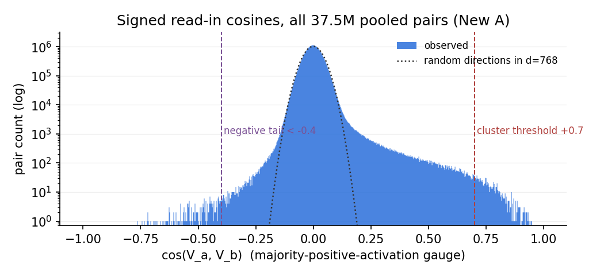

| threshold | 0.4 | 0.5 | 0.6 | 0.7 | 0.8 | 0.9 |
|---|---|---|---|---|---|---|
| pairs above +thr | 12314 | 6493 | 3016 | 1089 | 231 | 24 |
| pairs below -thr | 217 | 93 | 30 | 8 | 0 | 0 |

(37.5M pairs total; max +0.949, min
-0.764.)

Of the 1089 pairs above +0.7: **351 same-matrix,
456 same-layer cross-matrix, 282
cross-layer**.

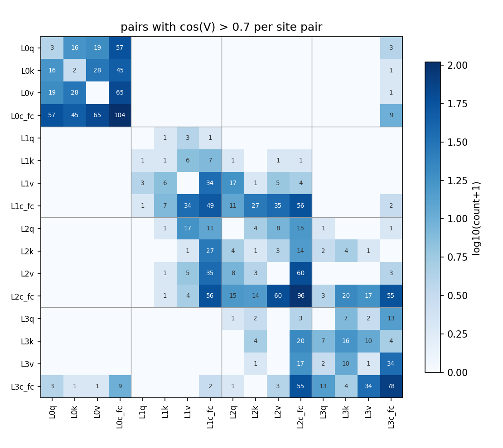

## Clusters (chaining at cos > +0.7)

Connected components of the cos > +0.7 graph: **289 clusters
with ≥ 2 members, covering 977 of 8657 components**. Clusters are
ordered by the number of distinct matrices involved (ties by size); members
by matrix, then mean CI descending.
Tables below: all clusters with ≥ 5 members in full, smaller ones compacted.
Per member: sample mean CI, share of CI>0.1 fires at position 0, signed
alignment of V with the member's own top token's embedding ("emb align"),
top activating tokens (share of summed CI). Below each table: member × member
heatmaps of cos(V) and co-CI r (cross-site values from
`hide/cache/cluster_ci_signed_newA.npz`), members in table order, both on
the same RdBu scale.

### Cluster 1 — n = 18 (L1c_fc, L1k, L1v, L2c_fc, L2k, L2v, L3c_fc, L3q, L3v); edge cos +0.70–+0.87

| matrix | component | mean CI | pos-0 fires | emb align | top tokens |
|---|---|---|---|---|---|
| L1k | 517 | 7.6e-03 | 0% | +0.09 | `'-'` `'$-'` `'‐'` |
| L1v | 241 | 1.4e-02 | 0% | +0.01 | `'-'` `' -'` `'+'` `' +'` `'--'` |
| L1c_fc | 2658 | 1.1e-02 | 0% | +0.13 | `'-'` `'+'` `' -'` `'--'` `'–'` |
|  | 874 | 5.3e-03 | 0% | +0.08 | `'-'` `'/'` `'–'` `'--'` `'‐'` |
|  | 2210 | 4.5e-03 | 0% | +0.13 | `'-'` `'–'` `'\xad'` `'$-'` |
| L2k | 451 | 9.1e-04 | 0% | +0.01 | `'-'` `'/'` `'–'` `'--'` `'‐'` |
| L2v | 604 | 8.6e-03 | 0% | +0.01 | `'-'` `' -'` `'+'` `'--'` `' –'` |
| L2c_fc | 1925 | 8.5e-03 | 0% | +0.04 | `'-'` `' -'` `'+'` `'--'` `'–'` |
|  | 1839 | 7.1e-03 | 0% | +0.03 | `'-'` `'–'` `'--'` `'/'` `'$-'` |
|  | 2138 | 4.8e-03 | 0% | +0.06 | `'-'` `'\xad'` `'$-'` |
| L3q | 131 | 3.7e-03 | 0% | -0.05 | `'-'` `'/'` `'\xad'` `'‐'` `'--'` |
| L3v | 88 | 4.4e-03 | 0% | -0.12 | `'-'` `'/'` `'="'` `'--'` `'.'` |
| L3c_fc | 408 | 7.5e-03 | 0% | -0.06 | `'-'` `'/'` `'–'` `'--'` `'$-'` |
|  | 863 | 6.2e-03 | 0% | -0.05 | `'-'` `'/'` `'$-'` `'--'` `' -'` |
|  | 1051 | 5.0e-03 | 0% | +0.01 | `'-'` `'\xa0'` `'\n'` `'    '` `'        '` |
|  | 2005 | 4.2e-03 | 0% | -0.04 | `'-'` `'/'` `'‐'` `'\xad'` `'$-'` |
|  | 2027 | 3.4e-03 | 0% | -0.03 | `'-'` `'$-'` `'‐'` `'*-'` `'--'` |
|  | 637 | 3.1e-03 | 0% | -0.01 | `'-'` `'/'` `'$-'` `'‐'` `'--'` |

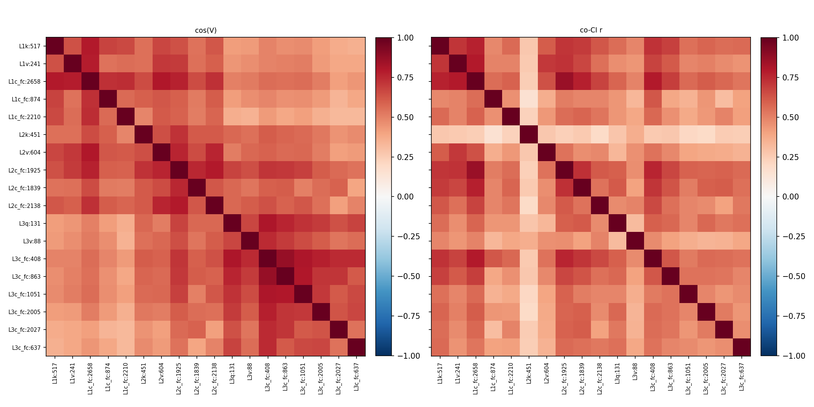

### Cluster 2 — n = 12 (L1c_fc, L1v, L2c_fc, L2k, L2q, L2v, L3c_fc, L3k, L3v); edge cos +0.71–+0.91

| matrix | component | mean CI | pos-0 fires | emb align | top tokens |
|---|---|---|---|---|---|
| L1v | 47 | 2.7e-02 | 0% | -0.08 | `','` `'),'` `';'` `'.,'` `'",'` |
| L1c_fc | 2506 | 2.7e-02 | 0% | -0.06 | `','` `'),'` `';'` `'",'` `'$,'` |
|  | 1446 | 2.6e-02 | 0% | -0.04 | `','` `';'` `'),'` `'.,'` `'",'` |
|  | 1903 | 2.3e-02 | 0% | -0.09 | `','` `'),'` `';'` `'.,'` `'$,'` |
| L2q | 631 | 1.7e-02 | 0% | -0.08 | `','` `';'` `'),'` `'",'` `'.,'` |
| L2k | 455 | 5.1e-03 | 0% | -0.15 | `','` `'),'` `'.,'` `'$,'` `'*,'` |
| L2v | 292 | 2.4e-02 | 0% | -0.14 | `','` `';'` `'),'` `'.,'` `'",'` |
| L2c_fc | 1893 | 2.7e-02 | 0% | -0.10 | `','` `';'` `'),'` `'.,'` `'],'` |
|  | 1777 | 2.4e-02 | 0% | -0.11 | `','` `'),'` `';'` `'.,'` `'",'` |
| L3k | 405 | 7.6e-03 | 0% | -0.14 | `','` `'),'` `';'` `'$,'` |
| L3v | 101 | 1.2e-02 | 0% | -0.15 | `','` `' ('` `';'` `'),'` `':'` |
| L3c_fc | 272 | 3.3e-02 | 0% | -0.11 | `','` `' ('` `';'` `'),'` `':'` |

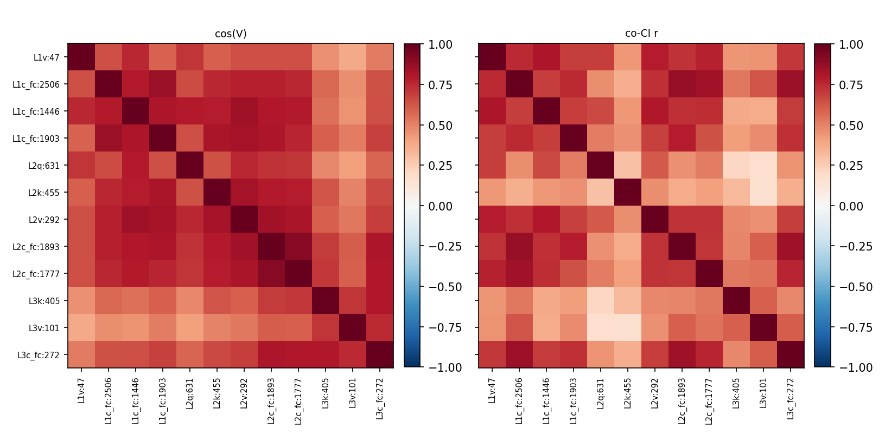

### Cluster 3 — n = 14 (L1c_fc, L1k, L1v, L2c_fc, L2q, L2v, L3c_fc, L3v); edge cos +0.72–+0.89

| matrix | component | mean CI | pos-0 fires | emb align | top tokens |
|---|---|---|---|---|---|
| L1k | 75 | 2.6e-02 | 0% | -0.05 | `' the'` `' The'` `'The'` `'the'` |
| L1v | 127 | 2.3e-02 | 0% | -0.06 | `' the'` `' The'` `'The'` `'the'` |
| L1c_fc | 1921 | 3.0e-02 | 0% | -0.05 | `' the'` `' The'` `'The'` `'the'` |
|  | 1478 | 9.0e-04 | 0% | -0.07 | `' the'` `' THE'` `' The'` `' his'` `'The'` |
|  | 1562 | 4.1e-04 | 12% | -0.12 | `' the'` `'the'` `' The'` `'The'` |
| L2q | 642 | 2.6e-02 | 0% | -0.14 | `' the'` `' The'` `'The'` `'the'` |
| L2v | 56 | 2.6e-02 | 0% | -0.10 | `' the'` `' The'` `'The'` `'the'` |
| L2c_fc | 981 | 3.3e-02 | 0% | -0.11 | `' the'` `' The'` `'The'` `"'s"` `' their'` |
|  | 355 | 2.9e-02 | 0% | -0.09 | `' the'` `' The'` `'The'` `'the'` |
|  | 554 | 1.3e-02 | 0% | -0.15 | `' the'` `' The'` `'The'` `'the'` |
| L3v | 16 | 1.5e-02 | 0% | -0.14 | `' the'` `' The'` `'The'` `' their'` `' its'` |
| L3c_fc | 2133 | 2.6e-02 | 0% | -0.18 | `' the'` `' The'` `'The'` `'the'` |
|  | 130 | 6.1e-04 | 0% | -0.24 | `' the'` `' his'` `'s'` `' The'` `"'s"` |
|  | 157 | 1.9e-04 | 0% | -0.20 | `' the'` `' The'` `'the'` `'The'` |

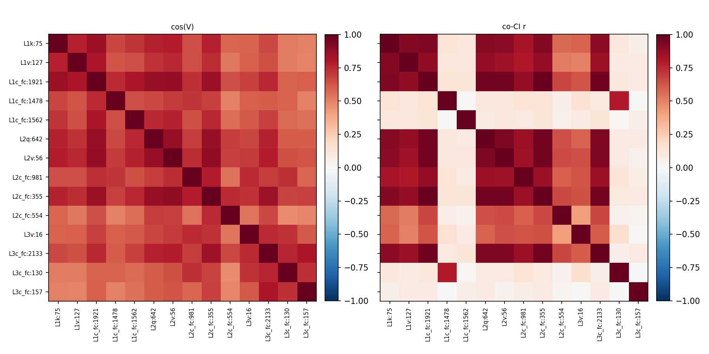

### Cluster 4 — n = 12 (L1c_fc, L1v, L2c_fc, L2k, L2q, L2v, L3c_fc); edge cos +0.70–+0.86

| matrix | component | mean CI | pos-0 fires | emb align | top tokens |
|---|---|---|---|---|---|
| L1v | 93 | 1.7e-02 | 0% | +0.04 | `' and'` `' or'` `' but'` `' than'` `'/'` |
| L1c_fc | 875 | 1.7e-02 | 0% | +0.04 | `' and'` `' or'` `' but'` `'and'` `' And'` |
|  | 332 | 1.5e-02 | 0% | +0.05 | `' and'` `' or'` `'/'` `' to'` `' &'` |
|  | 2684 | 6.5e-03 | 0% | -0.01 | `' and'` `' or'` `' &'` `'and'` `' but'` |
|  | 1691 | 2.0e-03 | 0% | +0.06 | `' and'` `' or'` `'and'` `' &'` `'And'` |
| L2q | 353 | 1.3e-02 | 0% | -0.03 | `' and'` `' or'` `' but'` `' then'` `'and'` |
| L2k | 215 | 1.0e-02 | 0% | +0.02 | `' and'` `' or'` `'/'` `' to'` `' &'` |
| L2v | 141 | 1.5e-02 | 0% | +0.02 | `' and'` `' or'` `'/'` `' but'` `'and'` |
| L2c_fc | 2339 | 2.2e-02 | 0% | +0.00 | `' and'` `','` `' or'` `' but'` `'/'` |
|  | 1086 | 1.3e-02 | 0% | -0.02 | `' and'` `' or'` `' but'` `'and'` `' &'` |
|  | 2562 | 6.5e-03 | 0% | -0.00 | `' and'` `' or'` `' but'` `'and'` `'or'` |
| L3c_fc | 187 | 1.6e-02 | 0% | -0.09 | `' and'` `' or'` `' but'` `' then'` `' than'` |

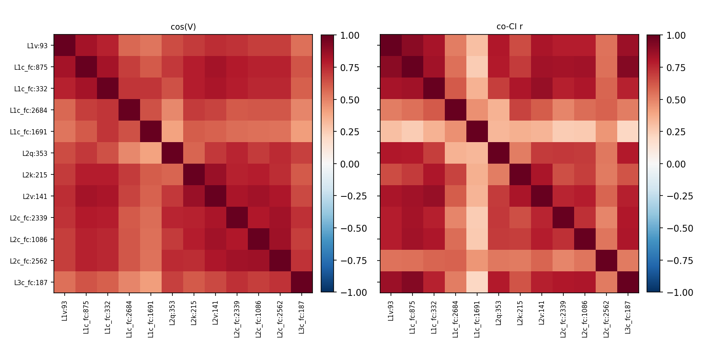

### Cluster 5 — n = 10 (L1c_fc, L2c_fc, L2q, L2v, L3c_fc, L3k, L3q); edge cos +0.71–+0.81

| matrix | component | mean CI | pos-0 fires | emb align | top tokens |
|---|---|---|---|---|---|
| L1c_fc | 2031 | 3.2e-02 | 0% | +0.07 | `'.'` `').'` `'?'` `'!'` `'$.'` |
| L2q | 354 | 3.6e-03 | 0% | +0.06 | `'.'` `').'` `'?'` `'!'` `'."'` |
| L2v | 300 | 2.0e-02 | 0% | +0.06 | `'.'` `').'` `'?'` `'!'` `'."'` |
| L2c_fc | 1612 | 3.0e-02 | 0% | +0.03 | `'.'` `'\n'` `').'` `'?'` `'  '` |
|  | 169 | 2.8e-02 | 0% | +0.06 | `'.'` `').'` `'?'` `'!'` `'."'` |
|  | 2820 | 1.9e-03 | 0% | +0.03 | `'.'` `').'` `'."'` `'".'` `'.”'` |
| L3q | 294 | 2.9e-02 | 0% | +0.07 | `'.'` `'\n'` `').'` `'  '` `'?'` |
| L3k | 294 | 5.2e-02 | 0% | +0.15 | `'\n'` `'.'` `':'` `'  '` `').'` |
| L3c_fc | 2634 | 7.4e-02 | 1% | +0.12 | `'\n'` `'.'` `':'` `').'` `'  '` |
|  | 1242 | 3.7e-02 | 0% | +0.00 | `'.'` `'\n'` `').'` `':'` `'  '` |

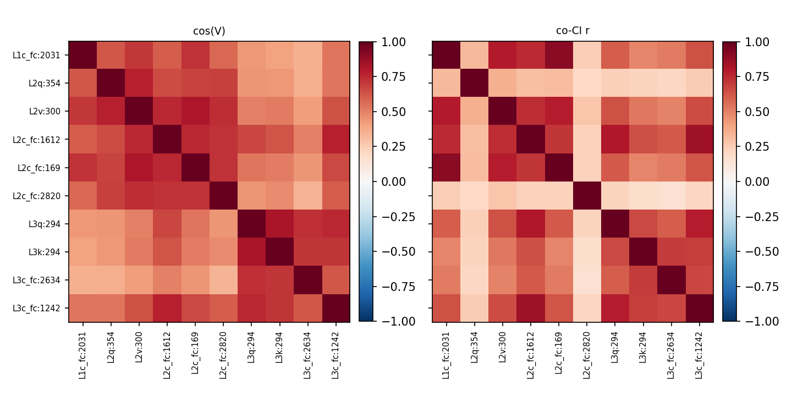

### Cluster 6 — n = 8 (L1c_fc, L1v, L2c_fc, L2q, L2v, L3c_fc, L3v); edge cos +0.71–+0.91

| matrix | component | mean CI | pos-0 fires | emb align | top tokens |
|---|---|---|---|---|---|
| L1v | 12 | 6.5e-03 | 1% | +0.01 | `"'s"` `' their'` `' his'` `' your'` `' my'` |
| L1c_fc | 1646 | 7.0e-03 | 0% | +0.01 | `"'s"` `' their'` `' his'` `' your'` `'s'` |
|  | 1878 | 4.9e-03 | 0% | +0.03 | `' their'` `"'s"` `' his'` `' your'` `' its'` |
| L2q | 566 | 3.7e-03 | 0% | -0.02 | `"'s"` `' their'` `' your'` `' his'` `' my'` |
| L2v | 33 | 7.2e-03 | 0% | +0.00 | `"'s"` `' their'` `' his'` `' your'` `'’'` |
| L2c_fc | 1294 | 9.0e-03 | 0% | -0.03 | `"'s"` `' their'` `' his'` `' your'` `'s'` |
| L3v | 56 | 4.6e-03 | 0% | -0.04 | `' his'` `' their'` `' my'` `' your'` `"'s"` |
| L3c_fc | 613 | 1.0e-02 | 0% | -0.07 | `"'s"` `' their'` `' his'` `' your'` `'s'` |

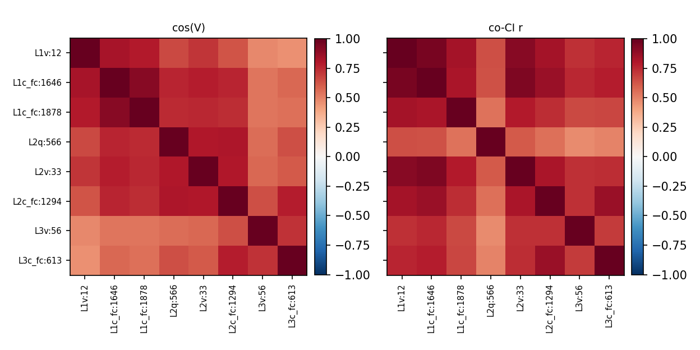

### Cluster 7 — n = 22 (L1c_fc, L1v, L2c_fc, L2q, L3c_fc, L3q); edge cos +0.70–+0.83

| matrix | component | mean CI | pos-0 fires | emb align | top tokens |
|---|---|---|---|---|---|
| L1v | 195 | 1.2e-02 | 0% | +0.02 | `'\\'` `' \\'` `' $\\'` `'{\\'` `'}\\'` |
| L1c_fc | 2876 | 9.1e-03 | 0% | +0.01 | `'\\'` `' \\'` `' $\\'` `'}\\'` `'{\\'` |
| L2q | 307 | 1.2e-02 | 0% | +0.01 | `'\\'` `' \\'` `' $\\'` `'<'` `'{\\'` |
| L2c_fc | 1293 | 1.4e-02 | 0% | +0.00 | `'\\'` `' \\'` `' $\\'` `'{\\'` `'}\\'` |
|  | 2356 | 6.6e-03 | 0% | +0.05 | `' \\'` `'\\'` `' $\\'` `'{\\'` `'}\\'` |
|  | 235 | 5.4e-03 | 0% | -0.00 | `'\\'` `' \\'` `'}\\'` `' $\\'` `'{\\'` |
|  | 1696 | 5.3e-03 | 0% | -0.00 | `'\\'` `' \\'` `' $\\'` `'}\\'` `'{\\'` |
|  | 2159 | 4.7e-03 | 0% | +0.02 | `'\\'` `' \\'` `'{\\'` `'}\\'` `' $\\'` |
|  | 1579 | 3.3e-03 | 0% | +0.00 | `'\\'` `' \\'` `' $\\'` `'}\\'` `'{\\'` |
|  | 44 | 2.7e-03 | 0% | +0.01 | `'\\'` `' \\'` `' $\\'` `'}\\'` `')\\'` |
| L3q | 626 | 5.1e-03 | 0% | +0.07 | `' \\'` `'\\'` `' $\\'` `'}\\'` `'{\\'` |
| L3c_fc | 170 | 1.1e-02 | 0% | -0.02 | `'\\'` `' \\'` `' $\\'` `'{\\'` `'}\\'` |
|  | 1471 | 8.9e-03 | 0% | -0.01 | `'\\'` `' \\'` `' $\\'` `'{\\'` `'}\\'` |
|  | 2432 | 6.6e-03 | 0% | +0.04 | `' \\'` `'\\'` `' $\\'` `'{\\'` `'}\\'` |
|  | 1676 | 6.4e-03 | 0% | -0.03 | `'\\'` `' \\'` `' $\\'` `'{\\'` `'}\\'` |
|  | 2478 | 6.2e-03 | 0% | -0.06 | `'\\'` `' \\'` `' $\\'` `'}\\'` `'{\\'` |
|  | 1046 | 5.6e-03 | 0% | +0.03 | `' \\'` `'\\'` `' $\\'` `'{\\'` `' $$\\'` |
|  | 2978 | 5.1e-03 | 0% | -0.06 | `'\\'` `' \\'` `' $\\'` `'{\\'` `'}\\'` |
|  | 2850 | 5.1e-03 | 0% | -0.02 | `'\\'` `' \\'` `' $\\'` `'{\\'` `' $$\\'` |
|  | 984 | 4.7e-03 | 0% | +0.07 | `' \\'` `'\\'` `' $\\'` `'}\\'` `'{\\'` |
|  | 1351 | 4.5e-03 | 0% | -0.05 | `'\\'` `' \\'` `' $\\'` `'{\\'` `'}\\'` |
|  | 382 | 4.2e-03 | 0% | -0.03 | `'\\'` `' \\'` `'}\\'` `' $\\'` `'{\\'` |

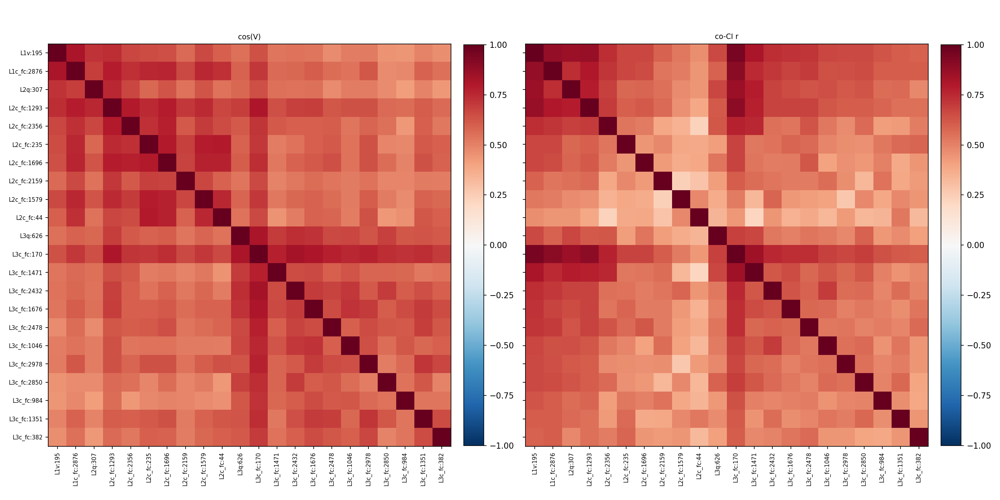

### Cluster 8 — n = 10 (L1c_fc, L2c_fc, L2q, L2v, L3c_fc, L3q); edge cos +0.70–+0.89

| matrix | component | mean CI | pos-0 fires | emb align | top tokens |
|---|---|---|---|---|---|
| L1c_fc | 1809 | 1.4e-02 | 0% | +0.10 | `' ('` `'('` `' ['` `'['` `'(\\'` |
|  | 2432 | 1.3e-02 | 0% | +0.13 | `' ('` `'('` `' ['` `'['` `'(\\'` |
|  | 2681 | 1.7e-03 | 1% | +0.10 | `' ('` `'('` `')('` `'(-'` `'**(-'` |
| L2q | 396 | 8.7e-03 | 0% | +0.04 | `' ('` `'('` `'(\\'` `'}('` `' ['` |
| L2v | 381 | 7.2e-03 | 0% | +0.02 | `' ('` `'('` `' ['` `' (*'` `'}('` |
| L2c_fc | 274 | 9.6e-03 | 0% | +0.05 | `' ('` `'('` `' ['` `'['` `'}('` |
|  | 2214 | 6.4e-03 | 0% | +0.07 | `' ('` `'('` `' ['` `'['` `')('` |
|  | 2884 | 4.9e-03 | 0% | +0.02 | `' ('` `'('` `' ['` `' (['` `' (*'` |
| L3q | 726 | 2.3e-03 | 0% | +0.03 | `' ('` `'('` `' (*'` |
| L3c_fc | 1378 | 6.8e-03 | 0% | +0.01 | `' ('` `'('` `' ['` `'['` `' (*'` |

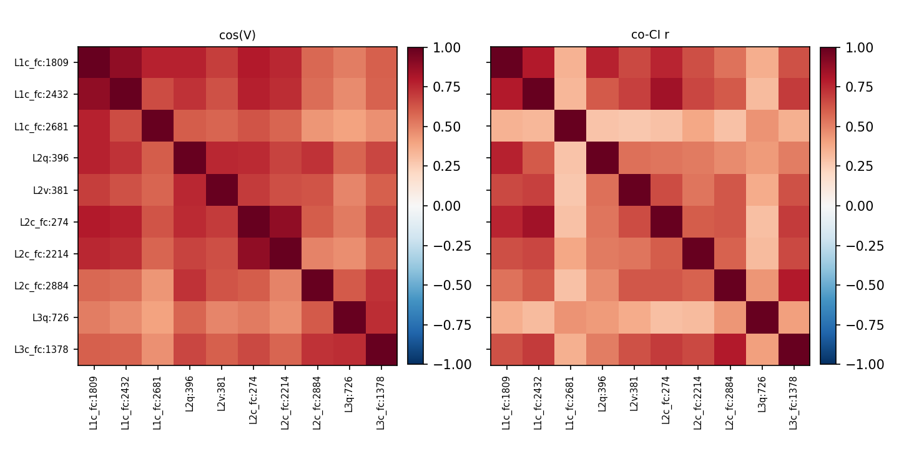

### Cluster 9 — n = 8 (L1c_fc, L1v, L2c_fc, L2q, L2v, L3v); edge cos +0.71–+0.87

| matrix | component | mean CI | pos-0 fires | emb align | top tokens |
|---|---|---|---|---|---|
| L1v | 54 | 1.4e-02 | 0% | -0.01 | `' a'` `' an'` `'A'` `' A'` `' one'` |
| L1c_fc | 490 | 1.3e-02 | 0% | -0.03 | `' a'` `' an'` `'A'` `' A'` `'a'` |
| L2q | 487 | 9.1e-03 | 0% | -0.08 | `' a'` `' an'` `' A'` `'A'` `'a'` |
| L2v | 2 | 1.2e-02 | 0% | -0.09 | `' a'` `' an'` `'a'` `'A'` `' A'` |
| L2c_fc | 1147 | 1.5e-02 | 0% | -0.05 | `' a'` `' an'` `' no'` `' A'` `' any'` |
|  | 1222 | 2.8e-03 | 0% | -0.06 | `' a'` `' an'` `' A'` `'A'` `'a'` |
|  | 2054 | 2.7e-03 | 0% | -0.04 | `' a'` `' an'` `' A'` `'a'` `'A'` |
| L3v | 20 | 8.2e-03 | 0% | -0.11 | `' a'` `' an'` `' A'` `'a'` `'A'` |

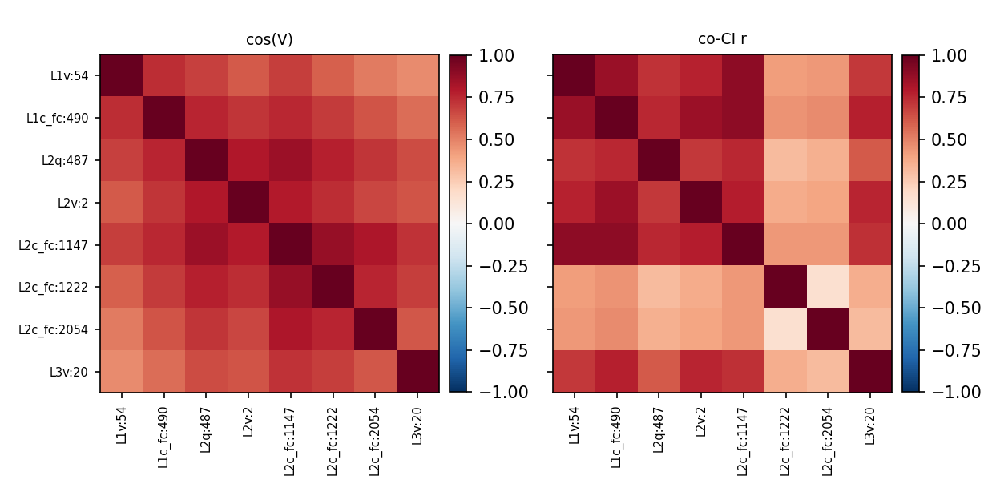

### Cluster 10 — n = 22 (L2c_fc, L2k, L3k, L3q, L3v); edge cos +0.70–+0.89

| matrix | component | mean CI | pos-0 fires | emb align | top tokens |
|---|---|---|---|---|---|
| L2k | 377 | 3.4e-03 | 54% | +0.03 | `'<\|endoftext\|>'` `'\n'` `'.'` `'  '` `' the'` |
|  | 700 | 2.7e-03 | 73% | +0.05 | `'<\|endoftext\|>'` `'\n'` `'.'` `' the'` `','` |
| L2c_fc | 1012 | 5.5e-03 | 32% | +0.05 | `'<\|endoftext\|>'` `'\n'` `'.'` `','` `' the'` |
|  | 2878 | 2.7e-03 | 73% | +0.06 | `'<\|endoftext\|>'` `'\n'` `'.'` `' the'` `','` |
|  | 792 | 2.0e-03 | 98% | +0.01 | `'\n'` `'.'` `' the'` `','` `' of'` |
|  | 2869 | 2.0e-03 | 98% | -0.02 | `'\n'` `'.'` `' the'` `','` `' of'` |
|  | 897 | 2.0e-03 | 99% | +0.01 | `'\n'` `'.'` `' the'` `','` `' of'` |
|  | 624 | 2.0e-03 | 100% | +0.07 | `'\n'` `'.'` `' the'` `','` `' of'` |
|  | 2440 | 2.0e-03 | 100% | +0.01 | `'\n'` `'.'` `' the'` `','` `' of'` |
| L3q | 129 | 9.6e-04 | 0% | +0.03 | `'<\|endoftext\|>'` `'\n'` `' high'` |
| L3k | 115 | 3.8e-03 | 44% | +0.03 | `'<\|endoftext\|>'` `'\n'` `','` `'.'` `' the'` |
|  | 510 | 2.8e-03 | 70% | +0.02 | `'<\|endoftext\|>'` `':'` `'\n'` `'.'` `' the'` |
|  | 551 | 2.7e-03 | 73% | +0.05 | `'<\|endoftext\|>'` `'\n'` `'.'` `' the'` `','` |
|  | 312 | 2.7e-03 | 73% | +0.00 | `'<\|endoftext\|>'` `'\n'` `'.'` `' the'` `','` |
|  | 484 | 2.6e-03 | 73% | +0.02 | `'<\|endoftext\|>'` `'\n'` `'.'` `' the'` `','` |
|  | 745 | 2.5e-03 | 77% | +0.03 | `'<\|endoftext\|>'` `'\n'` `'.'` `' the'` `','` |
|  | 629 | 2.4e-03 | 79% | +0.07 | `'<\|endoftext\|>'` `'\n'` `'.'` `' the'` `','` |
| L3v | 190 | 3.0e-03 | 59% | +0.05 | `'<\|endoftext\|>'` `'\n'` `'.'` `' the'` `','` |
|  | 230 | 2.8e-03 | 68% | +0.02 | `'<\|endoftext\|>'` `'\n'` `'.'` `' the'` `','` |
|  | 186 | 2.8e-03 | 68% | +0.04 | `'<\|endoftext\|>'` `'\n'` `'.'` `' the'` `','` |
|  | 248 | 2.7e-03 | 67% | +0.03 | `'<\|endoftext\|>'` `'\n'` `'.'` `','` `' the'` |
|  | 173 | 2.6e-03 | 75% | +0.02 | `'<\|endoftext\|>'` `'\n'` `'.'` `' the'` `','` |

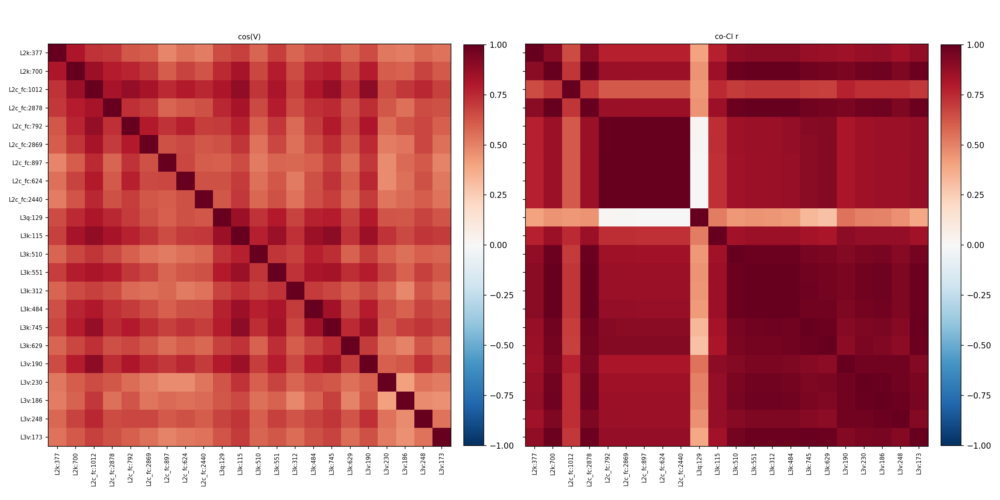

### Cluster 11 — n = 11 (L0c_fc, L0k, L0q, L0v, L3c_fc); edge cos +0.70–+0.88

| matrix | component | mean CI | pos-0 fires | emb align | top tokens |
|---|---|---|---|---|---|
| L0q | 400 | 3.8e-03 | 0% | +0.78 | `':'` `' :'` `'):'` `']:'` `" '"` |
| L0k | 478 | 2.9e-04 | 3% | +0.61 | `':'` `':"'` `'18'` |
| L0v | 461 | 4.1e-03 | 1% | +0.73 | `':'` `'):'` `'":'` `' :'` `']:'` |
| L0c_fc | 224 | 6.5e-03 | 0% | +0.73 | `':'` `'":'` `'::'` `' :'` `'):'` |
|  | 2417 | 4.3e-03 | 0% | +0.64 | `':'` `'):'` `' :'` `'":'` `']:'` |
|  | 3001 | 4.3e-03 | 0% | +0.71 | `':'` `'):'` `' :'` `']:'` |
|  | 2458 | 3.2e-03 | 0% | +0.67 | `':'` `' :'` `'):'` `':**'` |
|  | 2653 | 3.1e-03 | 0% | +0.68 | `':'` `' :'` `'):'` `']:'` `':**'` |
|  | 2076 | 3.0e-03 | 0% | +0.64 | `':'` `' :'` `'":'` `'):'` `':**'` |
|  | 2288 | 2.8e-03 | 0% | +0.68 | `':'` `'):'` `' :'` `']:'` `'":'` |
| L3c_fc | 1354 | 2.3e-02 | 0% | -0.04 | `'A'` `'1'` `' following'` `'Q'` `' this'` |

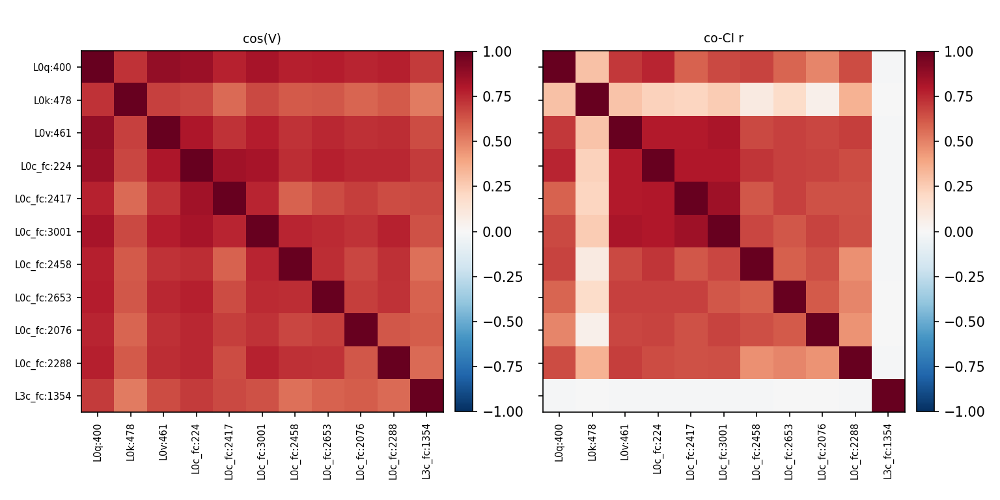

### Cluster 12 — n = 8 (L0c_fc, L0k, L0q, L0v, L3c_fc); edge cos +0.70–+0.94

| matrix | component | mean CI | pos-0 fires | emb align | top tokens |
|---|---|---|---|---|---|
| L0q | 188 | 4.0e-02 | 0% | +0.69 | `'\n'` `'\n\n'` `'\r\n'` `'\n\t'` `' \n'` |
|  | 192 | 1.1e-02 | 0% | +0.63 | `'\n'` `'\n\n'` `'\x0c'` |
| L0k | 128 | 4.2e-02 | 0% | +0.67 | `'\n'` `'\n\n'` `'<\|endoftext\|>'` `'\r\n'` `'\n\t'` |
| L0v | 136 | 4.1e-02 | 1% | +0.69 | `'\n'` `'\n\n'` `'<\|endoftext\|>'` `'\r\n'` `'\n\t'` |
| L0c_fc | 1181 | 4.3e-02 | 0% | +0.64 | `'\n'` `'\n\n'` `'<\|endoftext\|>'` `'\r\n'` `'\n\t'` |
|  | 2650 | 2.3e-02 | 0% | +0.61 | `'\n'` `'\n\n'` `'\r\n'` `'\n\t'` |
|  | 1656 | 2.2e-04 | 0% | +0.48 | `'\n'` `'**'` `'.**'` |
| L3c_fc | 858 | 1.0e-01 | 0% | +0.11 | `'.'` `'\n'` `','` `')'` `' the'` |

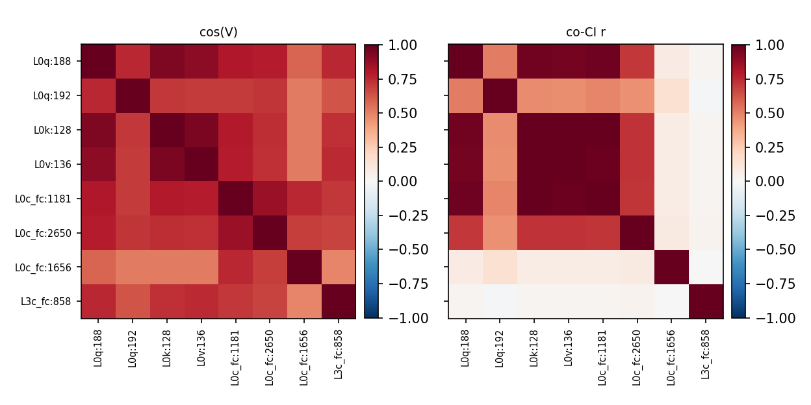

### Cluster 13 — n = 6 (L0c_fc, L0k, L0q, L0v, L3c_fc); edge cos +0.71–+0.95

| matrix | component | mean CI | pos-0 fires | emb align | top tokens |
|---|---|---|---|---|---|
| L0q | 9 | 1.5e-02 | 0% | +0.82 | `' of'` `'of'` `' OF'` |
| L0k | 578 | 1.5e-02 | 0% | +0.79 | `' of'` `'of'` `' Of'` |
| L0v | 637 | 1.4e-02 | 0% | +0.78 | `' of'` `'of'` `' OF'` |
| L0c_fc | 921 | 1.3e-02 | 0% | +0.73 | `' of'` `'of'` `'Of'` |
|  | 2683 | 3.3e-03 | 1% | +0.66 | `' of'` `'of'` `'Of'` `' Of'` `' OF'` |
| L3c_fc | 2156 | 5.9e-02 | 0% | -0.08 | `' one'` `' all'` `' some'` `' because'` `' out'` |

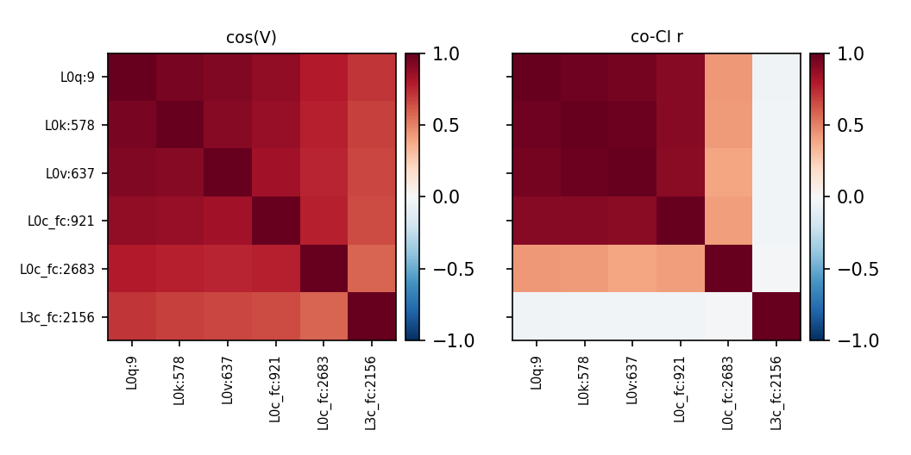

### Cluster 14 — n = 6 (L1c_fc, L1v, L2c_fc, L3c_fc, L3v); edge cos +0.72–+0.74

| matrix | component | mean CI | pos-0 fires | emb align | top tokens |
|---|---|---|---|---|---|
| L1v | 107 | 1.8e-02 | 0% | +0.03 | `' is'` `' be'` `' was'` `' are'` `' were'` |
| L1c_fc | 84 | 1.8e-02 | 0% | +0.05 | `' is'` `' be'` `' was'` `' are'` `' were'` |
|  | 2208 | 1.7e-02 | 0% | +0.08 | `' is'` `' be'` `' was'` `' are'` `' were'` |
| L2c_fc | 2208 | 2.4e-02 | 0% | +0.03 | `' is'` `' be'` `' was'` `' are'` `' were'` |
| L3v | 127 | 1.3e-02 | 0% | -0.06 | `' is'` `' was'` `' are'` `' be'` `' were'` |
| L3c_fc | 601 | 4.6e-02 | 0% | +0.02 | `' is'` `' be'` `' was'` `' are'` `' were'` |

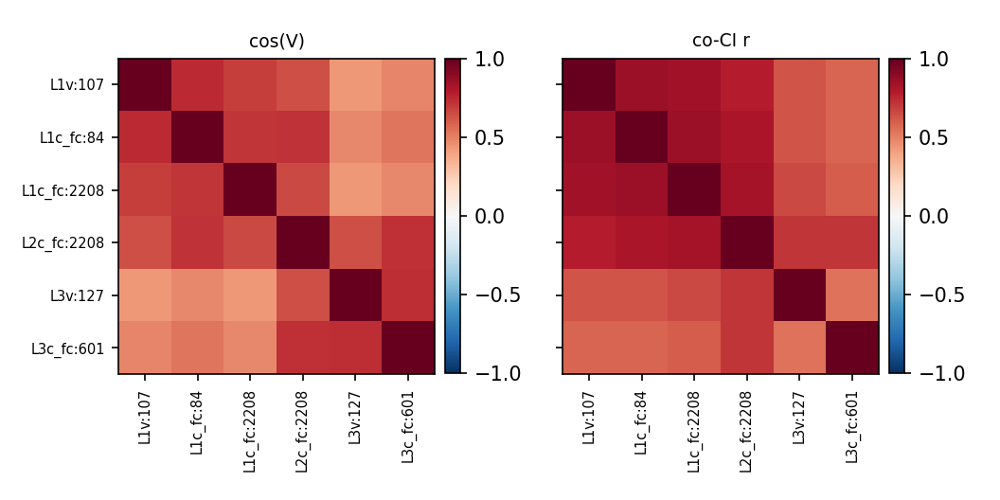

### Cluster 15 — n = 5 (L1c_fc, L1v, L2c_fc, L2v, L3c_fc); edge cos +0.71–+0.84

| matrix | component | mean CI | pos-0 fires | emb align | top tokens |
|---|---|---|---|---|---|
| L1v | 372 | 1.6e-02 | 0% | -0.05 | `'s'` `' patients'` `' people'` `' cells'` `' those'` |
| L1c_fc | 1200 | 2.4e-02 | 0% | -0.03 | `'s'` `' patients'` `' cells'` `' people'` `' data'` |
| L2v | 73 | 1.8e-02 | 0% | -0.03 | `'s'` `' people'` `' cells'` `' patients'` `'ers'` |
| L2c_fc | 1802 | 3.6e-02 | 0% | +0.01 | `' they'` `'s'` `' that'` `' data'` `' which'` |
| L3c_fc | 2322 | 2.8e-02 | 0% | -0.04 | `'s'` `' cells'` `' patients'` `'ers'` `' people'` |

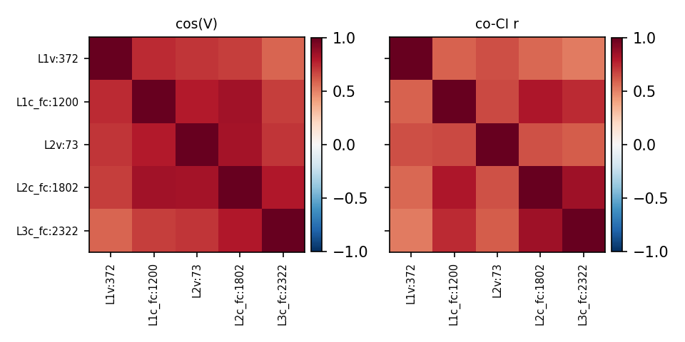

### Cluster 16 — n = 5 (L1c_fc, L2c_fc, L2v, L3c_fc, L3v); edge cos +0.73–+0.78

| matrix | component | mean CI | pos-0 fires | emb align | top tokens |
|---|---|---|---|---|---|
| L1c_fc | 144 | 1.5e-03 | 0% | +0.05 | `' C'` `'C'` `'c'` `' c'` `'ac'` |
| L2v | 442 | 1.8e-02 | 0% | -0.02 | `'C'` `'c'` `' C'` `' c'` `'a'` |
| L2c_fc | 790 | 4.3e-03 | 0% | +0.01 | `'C'` `' C'` `'c'` `' c'` `'ac'` |
| L3v | 238 | 1.7e-03 | 0% | -0.02 | `'C'` `' C'` `'c'` `' c'` `' cross'` |
| L3c_fc | 68 | 4.1e-03 | 0% | +0.01 | `'C'` `' C'` `'c'` `' c'` `'oc'` |

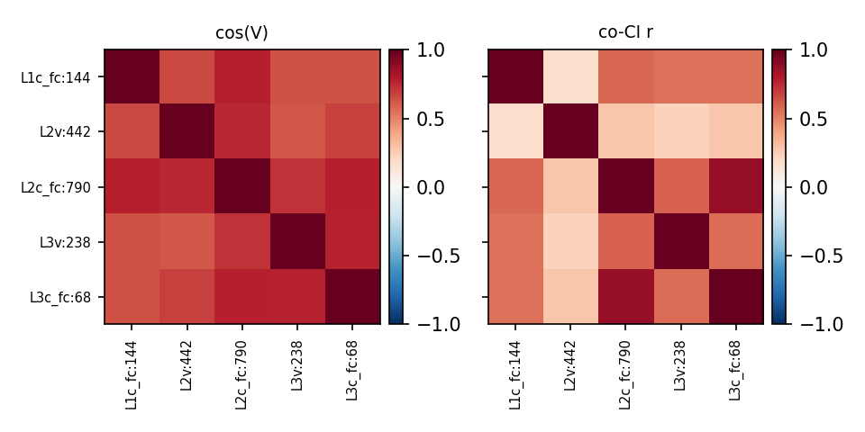

### Cluster 17 — n = 5 (L1c_fc, L2c_fc, L2v, L3c_fc, L3v); edge cos +0.71–+0.80

| matrix | component | mean CI | pos-0 fires | emb align | top tokens |
|---|---|---|---|---|---|
| L1c_fc | 832 | 2.1e-03 | 0% | +0.05 | `' T'` `'T'` `'t'` `' t'` `'at'` |
| L2v | 431 | 1.7e-02 | 0% | +0.02 | `'t'` `'T'` `' T'` `' t'` `' time'` |
| L2c_fc | 719 | 3.9e-03 | 0% | +0.06 | `' T'` `'T'` `'t'` `' t'` `'at'` |
| L3v | 184 | 1.3e-03 | 0% | +0.04 | `' T'` `'T'` `'t'` `' t'` `' Th'` |
| L3c_fc | 1581 | 3.6e-03 | 1% | +0.04 | `' T'` `'T'` `'t'` `' t'` `'at'` |

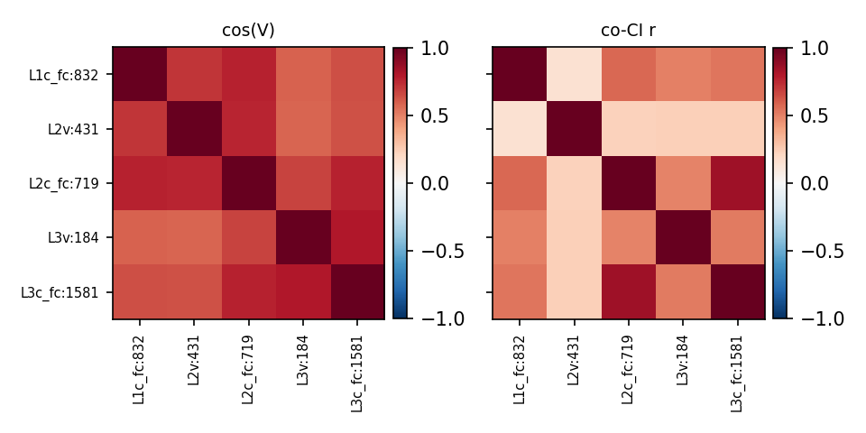

### Cluster 18 — n = 5 (L1c_fc, L2c_fc, L2v, L3c_fc, L3v); edge cos +0.70–+0.77

| matrix | component | mean CI | pos-0 fires | emb align | top tokens |
|---|---|---|---|---|---|
| L1c_fc | 1254 | 4.0e-03 | 0% | +0.03 | `' I'` `'I'` `' my'` `' i'` `' me'` |
| L2v | 328 | 4.6e-03 | 0% | -0.04 | `' I'` `'I'` `' my'` `' me'` `':'` |
| L2c_fc | 1440 | 4.2e-03 | 0% | +0.08 | `' I'` `'I'` `' my'` `' i'` `' me'` |
| L3v | 49 | 4.4e-03 | 0% | +0.02 | `' I'` `'I'` `' my'` `' would'` `' will'` |
| L3c_fc | 1466 | 3.4e-03 | 0% | +0.03 | `' I'` `'I'` `' my'` `' i'` `'i'` |

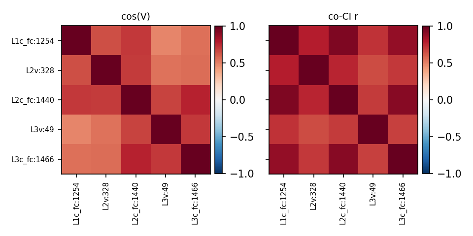

### Cluster 19 — n = 5 (L1c_fc, L2c_fc, L2v, L3c_fc, L3v); edge cos +0.71–+0.80

| matrix | component | mean CI | pos-0 fires | emb align | top tokens |
|---|---|---|---|---|---|
| L1c_fc | 1268 | 1.6e-03 | 0% | +0.01 | `'P'` `'p'` `' P'` `' p'` `'op'` |
| L2v | 461 | 1.8e-02 | 0% | +0.03 | `'p'` `'P'` `' P'` `' p'` `'q'` |
| L2c_fc | 687 | 4.8e-03 | 0% | +0.06 | `'p'` `'P'` `' P'` `' p'` `' pre'` |
| L3v | 128 | 1.9e-03 | 0% | +0.05 | `'p'` `'P'` `' P'` `' p'` `' pre'` |
| L3c_fc | 1509 | 2.9e-03 | 0% | -0.00 | `'P'` `'p'` `' P'` `' p'` `' pre'` |

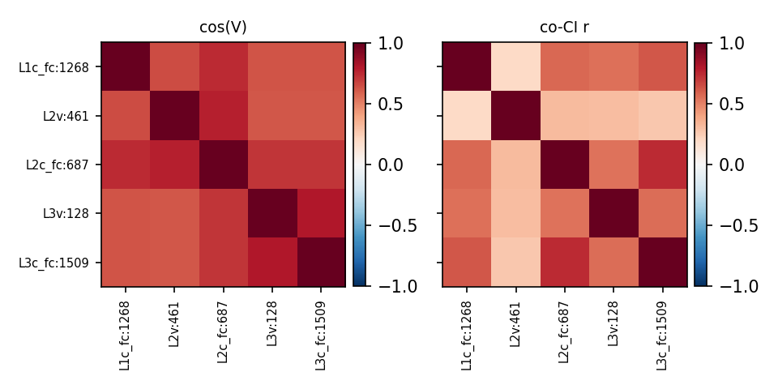

### Cluster 20 — n = 5 (L1c_fc, L2c_fc, L2v, L3c_fc, L3v); edge cos +0.72–+0.81

| matrix | component | mean CI | pos-0 fires | emb align | top tokens |
|---|---|---|---|---|---|
| L1c_fc | 1568 | 9.3e-04 | 0% | +0.01 | `' B'` `'B'` `'b'` `' b'` `'ab'` |
| L2v | 434 | 1.3e-02 | 0% | -0.01 | `'B'` `'b'` `' B'` `'a'` `'A'` |
| L2c_fc | 529 | 3.1e-03 | 0% | +0.08 | `'B'` `'b'` `' B'` `' b'` `'ab'` |
| L3v | 250 | 1.3e-03 | 0% | +0.04 | `' B'` `'B'` `'b'` `' b'` `' ab'` |
| L3c_fc | 1893 | 2.6e-03 | 0% | +0.04 | `'B'` `' B'` `'b'` `' b'` `'ab'` |

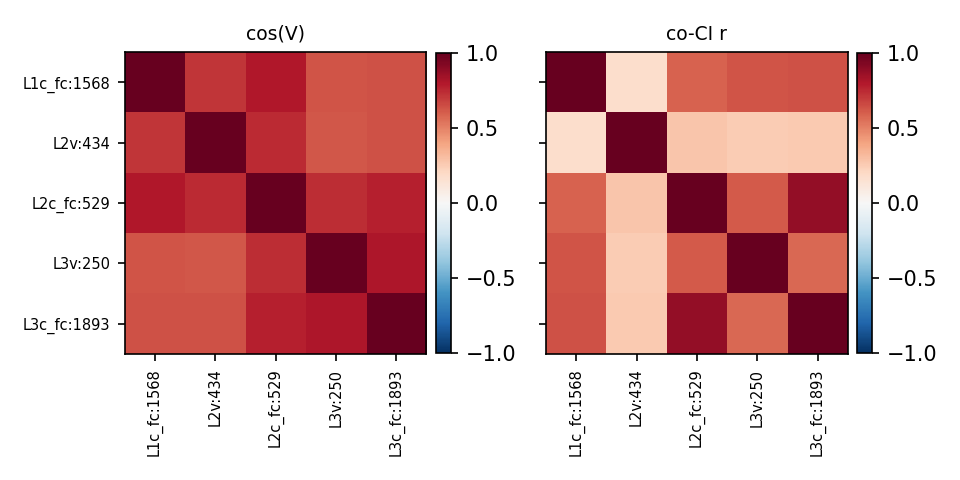

### Cluster 21 — n = 5 (L1c_fc, L2c_fc, L2v, L3c_fc, L3v); edge cos +0.71–+0.77

| matrix | component | mean CI | pos-0 fires | emb align | top tokens |
|---|---|---|---|---|---|
| L1c_fc | 2811 | 4.0e-03 | 0% | -0.10 | `'_'` `' _'` `'\\_'` `'__'` `'}_'` |
| L2v | 271 | 7.8e-03 | 0% | -0.13 | `'_'` `'_{'` `'^'` `'::'` `'->'` |
| L2c_fc | 579 | 4.0e-03 | 0% | -0.04 | `'_'` `'-'` `'\\_'` `'__'` `' _'` |
| L3v | 100 | 4.6e-03 | 0% | -0.03 | `'_'` `'.'` `'/'` `'::'` `' _'` |
| L3c_fc | 2785 | 4.5e-03 | 0% | -0.07 | `'_'` `'.'` `'-'` `'::'` `'->'` |

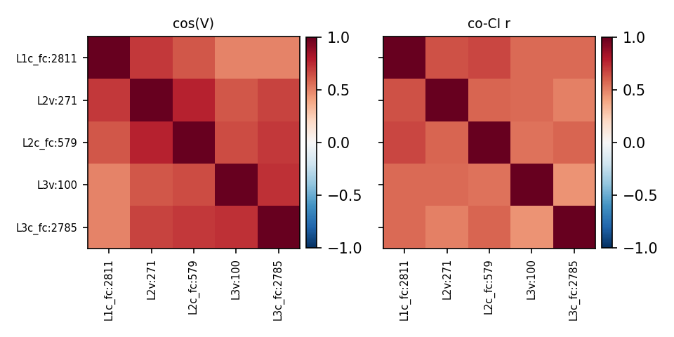

### Cluster 22 — n = 10 (L1c_fc, L1v, L2c_fc, L3c_fc); edge cos +0.70–+0.82

| matrix | component | mean CI | pos-0 fires | emb align | top tokens |
|---|---|---|---|---|---|
| L1v | 517 | 1.5e-02 | 1% | +0.02 | `'<\|endoftext\|>'` `','` `' de'` `'.'` `' a'` |
| L1c_fc | 2621 | 1.3e-02 | 1% | -0.03 | `','` `' de'` `'.'` `'\n'` `' a'` |
| L2c_fc | 402 | 1.3e-02 | 0% | +0.03 | `','` `' de'` `'.'` `' a'` `'\n'` |
|  | 695 | 1.0e-02 | 0% | -0.02 | `' de'` `' a'` `'Ð'` `"'"` `' la'` |
|  | 1504 | 1.0e-02 | 0% | -0.02 | `','` `' de'` `'en'` `'a'` `' la'` |
|  | 1210 | 7.7e-03 | 0% | +0.01 | `','` `'.'` `'\n'` `' a'` `'en'` |
|  | 2985 | 5.8e-03 | 0% | -0.06 | `' de'` `' a'` `','` `' la'` `' en'` |
|  | 16 | 5.0e-03 | 0% | -0.03 | `' de'` `' que'` `' la'` `' a'` `'en'` |
| L3c_fc | 2651 | 2.2e-02 | 0% | +0.07 | `','` `'.'` `' de'` `'1'` `'a'` |
|  | 695 | 8.6e-03 | 0% | -0.01 | `' de'` `','` `' la'` `' a'` `' en'` |

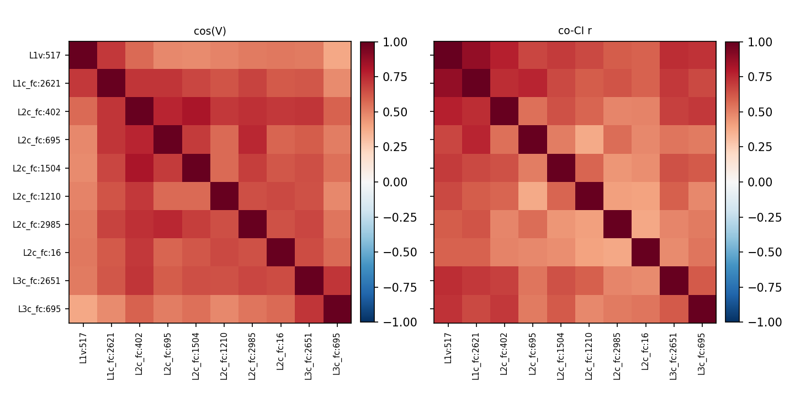

### Cluster 23 — n = 9 (L1c_fc, L1v, L2c_fc, L2v); edge cos +0.70–+0.83

| matrix | component | mean CI | pos-0 fires | emb align | top tokens |
|---|---|---|---|---|---|
| L1v | 177 | 4.1e-03 | 0% | +0.11 | `' for'` `' For'` `'for'` `'For'` |
| L1c_fc | 3005 | 4.3e-03 | 0% | +0.10 | `' for'` `' For'` `'for'` `'For'` |
|  | 361 | 4.3e-03 | 0% | +0.07 | `' for'` `' For'` `'for'` `'For'` |
|  | 2103 | 3.1e-03 | 0% | +0.04 | `' for'` `' For'` `'For'` `'for'` |
|  | 2982 | 2.5e-03 | 0% | +0.03 | `' for'` `' For'` `'for'` `'For'` `' FOR'` |
| L2v | 656 | 4.5e-03 | 0% | +0.04 | `' for'` `' For'` `'for'` `'For'` `'Solve'` |
| L2c_fc | 3071 | 4.5e-03 | 0% | +0.02 | `' for'` `' For'` `'For'` `'for'` |
|  | 259 | 3.1e-03 | 0% | +0.04 | `' for'` `' For'` `'if'` `'for'` `'For'` |
|  | 1968 | 1.3e-03 | 0% | +0.03 | `' for'` `' For'` `'for'` `'For'` `' FOR'` |

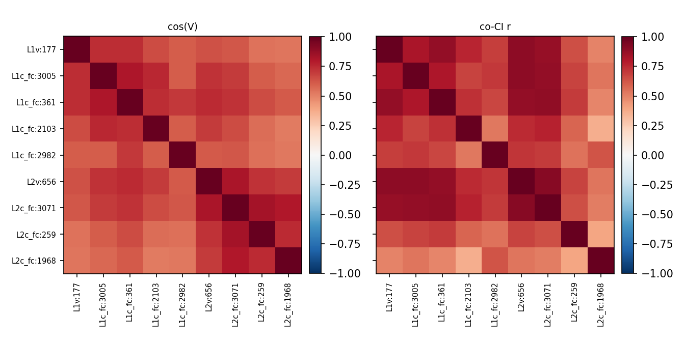

### Cluster 24 — n = 9 (L1c_fc, L2c_fc, L2v, L3c_fc); edge cos +0.71–+0.86

| matrix | component | mean CI | pos-0 fires | emb align | top tokens |
|---|---|---|---|---|---|
| L1c_fc | 26 | 1.0e-02 | 0% | +0.03 | `' in'` `' In'` `'In'` `'in'` `' into'` |
|  | 1644 | 5.7e-03 | 0% | -0.06 | `' in'` `' In'` `'In'` `'in'` `' into'` |
| L2v | 707 | 1.1e-02 | 0% | -0.06 | `' in'` `' In'` `'In'` `' into'` `'in'` |
| L2c_fc | 822 | 1.0e-02 | 0% | -0.06 | `' in'` `' In'` `'In'` `' into'` `'in'` |
|  | 1963 | 7.3e-03 | 0% | -0.04 | `' in'` `' In'` `'In'` `'in'` `' into'` |
|  | 345 | 2.2e-03 | 0% | -0.03 | `' in'` `' In'` `'In'` `' into'` |
| L3c_fc | 1407 | 1.1e-02 | 0% | -0.03 | `' in'` `' In'` `'In'` `' into'` `' during'` |
|  | 2510 | 6.0e-03 | 0% | -0.01 | `' in'` `' In'` `'In'` `'in'` `' into'` |
|  | 1442 | 5.5e-03 | 0% | -0.01 | `' in'` `' In'` `'In'` `' into'` `' within'` |

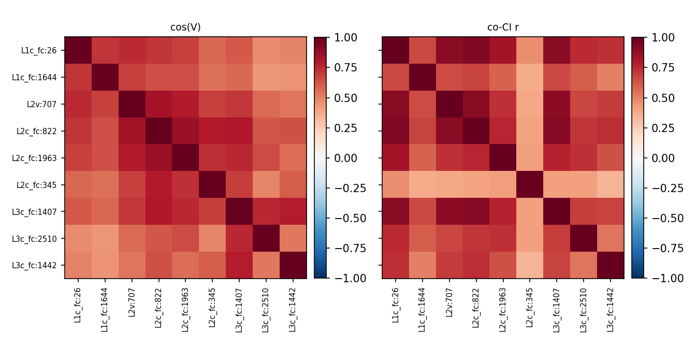

### Cluster 25 — n = 8 (L0c_fc, L0k, L0q, L0v); edge cos +0.71–+0.84

| matrix | component | mean CI | pos-0 fires | emb align | top tokens |
|---|---|---|---|---|---|
| L0q | 464 | 1.1e-03 | 0% | +0.73 | `';'` `'];'` `');'` `'.;'` `';\\'` |
| L0k | 208 | 1.1e-03 | 1% | +0.68 | `';'` `');'` `'.;'` `'$;'` `'%;'` |
| L0v | 356 | 4.4e-03 | 1% | +0.69 | `';'` `');'` `'();'` `' */'` `'];'` |
| L0c_fc | 1909 | 9.0e-03 | 0% | +0.62 | `';'` `'}'` `');'` `'>'` `'();'` |
|  | 1566 | 3.7e-03 | 0% | +0.68 | `';'` `':'` `');'` `'();'` `'];'` |
|  | 116 | 2.6e-03 | 0% | +0.72 | `';'` `');'` `'];'` `'";'` `'.;'` |
|  | 281 | 1.0e-03 | 1% | +0.59 | `';'` `');'` `'];'` `'$;'` `'.;'` |
|  | 862 | 5.6e-04 | 1% | +0.58 | `';'` `');'` `'];'` `' ;'` `'";'` |

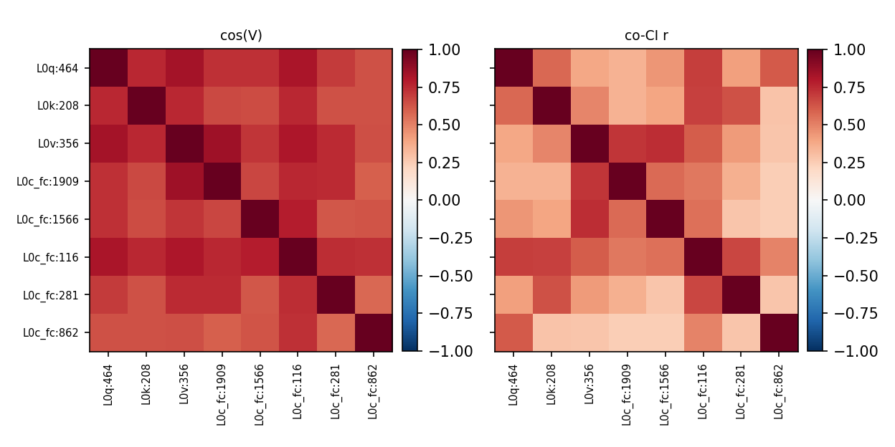

### Cluster 26 — n = 8 (L0c_fc, L0k, L0q, L0v); edge cos +0.70–+0.90

| matrix | component | mean CI | pos-0 fires | emb align | top tokens |
|---|---|---|---|---|---|
| L0q | 479 | 5.3e-03 | 0% | +0.59 | `'('` `' ('` `'()'` `'(\\'` `'("'` |
| L0k | 533 | 4.0e-03 | 0% | +0.67 | `' ('` `'('` `' ['` |
| L0v | 183 | 1.4e-02 | 3% | +0.54 | `' ('` `'('` `' ['` `'['` `'(\\'` |
|  | 201 | 3.5e-03 | 0% | +0.55 | `' ('` `' (*'` `' ($'` |
| L0c_fc | 2959 | 1.8e-02 | 0% | +0.58 | `' ('` `'('` `'['` `' ['` `'(\\'` |
|  | 796 | 8.3e-03 | 0% | +0.69 | `' ('` `'('` `' ['` `'['` `' (*'` |
|  | 1020 | 3.5e-03 | 0% | +0.60 | `' ('` `' (*'` `' \\['` `'('` |
|  | 1989 | 1.2e-03 | 1% | +0.52 | `'('` `' ('` `':('` `'(('` `')('` |

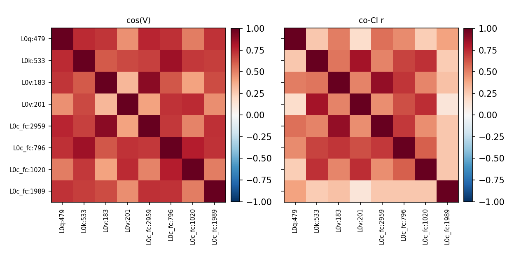

### Cluster 27 — n = 8 (L2c_fc, L3c_fc, L3k, L3v); edge cos +0.70–+0.80

| matrix | component | mean CI | pos-0 fires | emb align | top tokens |
|---|---|---|---|---|---|
| L2c_fc | 1523 | 4.2e-03 | 0% | +0.06 | `'Ð'` `'Ñ'` `' 0000000000000000000000000000000000'` `' '` `'�'` |
| L3k | 649 | 3.3e-03 | 0% | +0.04 | `'Ð'` `'Ñ'` `'�'` `' Ð'` `' '` |
| L3v | 17 | 4.8e-03 | 0% | +0.07 | `'Ð'` `' '` `'Ñ'` `'�'` `' Ð'` |
| L3c_fc | 1982 | 1.0e-02 | 1% | +0.05 | `' '` `'\n'` `'Ð'` `','` `'Ñ'` |
|  | 2308 | 4.2e-03 | 0% | +0.05 | `' '` `'Ñ'` `' 0000000000000000000000000000000000'` `'Ð'` `'�'` |
|  | 841 | 3.6e-03 | 0% | -0.02 | `'Ð'` `'Ñ'` `' 0000000000000000000000000000000000'` `' '` `' Ð'` |
|  | 215 | 2.7e-03 | 0% | +0.01 | `' '` `'Ñ'` `' 0000000000000000000000000000000000'` `'","'` `'ی'` |
|  | 1912 | 2.6e-03 | 0% | -0.00 | `'Ð'` `' '` `' Ð'` `'�'` `' 0000000000000000000000000000000000'` |

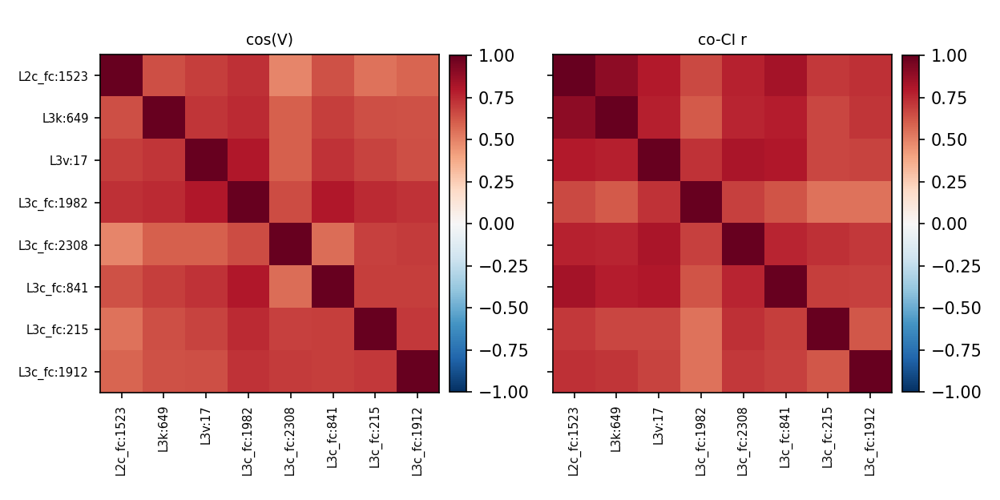

### Cluster 28 — n = 7 (L0c_fc, L0k, L0q, L0v); edge cos +0.70–+0.88

| matrix | component | mean CI | pos-0 fires | emb align | top tokens |
|---|---|---|---|---|---|
| L0q | 316 | 2.7e-04 | 0% | +0.72 | `'_'` `' _'` `'__'` `'_,'` `'._'` |
| L0k | 396 | 3.1e-03 | 1% | +0.78 | `'_'` `' _'` `'}_'` `'^'` `'}^'` |
| L0v | 458 | 5.2e-03 | 2% | +0.78 | `'_'` `'::'` `'->'` `'^'` `'}_'` |
| L0c_fc | 2908 | 1.6e-02 | 0% | +0.76 | `'_'` `'-'` `'/'` `'_{'` `'::'` |
|  | 713 | 6.8e-03 | 0% | +0.75 | `'_'` `'_{'` `'_{\\'` `' _'` `'\\_'` |
|  | 2838 | 3.6e-03 | 0% | +0.64 | `'_'` `'::'` `'->'` `' _'` `'\\_'` |
|  | 1628 | 1.9e-03 | 1% | +0.68 | `'_'` `'__'` `'_,'` `'._'` |

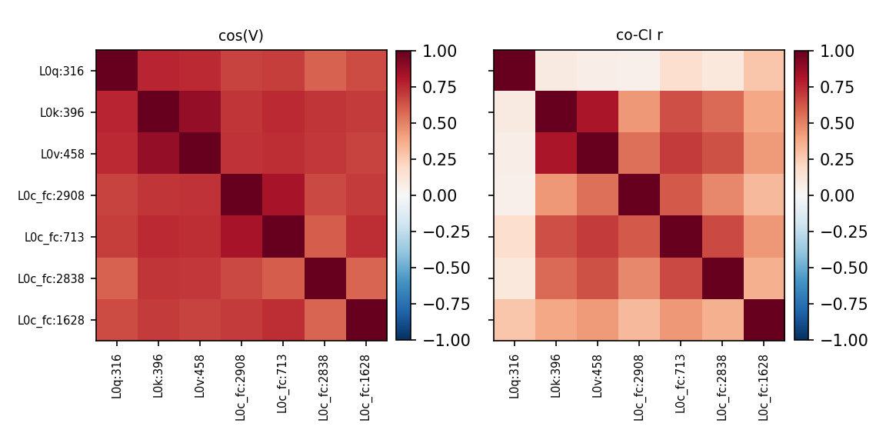

### Cluster 29 — n = 6 (L0c_fc, L0k, L0q, L0v); edge cos +0.71–+0.86

| matrix | component | mean CI | pos-0 fires | emb align | top tokens |
|---|---|---|---|---|---|
| L0q | 660 | 3.0e-02 | 0% | +0.68 | `'.'` `').'` `'.,'` `'."'` |
|  | 649 | 5.5e-03 | 0% | +0.58 | `'.'` `'..'` `'ubuntu'` |
| L0k | 1 | 3.5e-02 | 0% | +0.54 | `'.'` `':'` `').'` `'?'` `'$.'` |
| L0v | 129 | 3.3e-02 | 1% | +0.58 | `'.'` `').'` `'?'` `'."'` `'$.'` |
| L0c_fc | 20 | 4.1e-02 | 0% | +0.59 | `'.'` `').'` `'?'` `'::'` `'!'` |
|  | 2086 | 5.0e-03 | 1% | +0.56 | `'.'` `' .'` `'."'` |

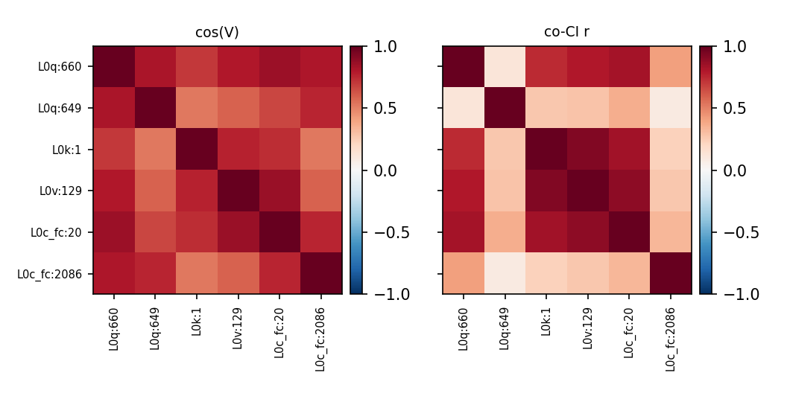

### Cluster 30 — n = 6 (L0c_fc, L0k, L0q, L0v); edge cos +0.71–+0.94

| matrix | component | mean CI | pos-0 fires | emb align | top tokens |
|---|---|---|---|---|---|
| L0q | 711 | 1.6e-02 | 0% | +0.66 | `'    '` `'  '` `'\t'` `'        '` `'                        '` |
| L0k | 139 | 1.6e-02 | 0% | +0.57 | `'  '` `'    '` `'\t'` `'        '` `'                        '` |
| L0v | 290 | 1.7e-02 | 4% | +0.57 | `'  '` `'    '` `'\t'` `'        '` `'                        '` |
| L0c_fc | 1371 | 1.6e-02 | 0% | +0.57 | `'  '` `'    '` `'\t'` `'        '` `'                        '` |
|  | 2779 | 1.2e-02 | 0% | +0.64 | `'    '` `'\t'` `'  '` `'        '` `'            '` |
|  | 2566 | 1.3e-04 | 20% | +0.69 | `'       '` `'  '` `'      '` `'        '` `'    '` |

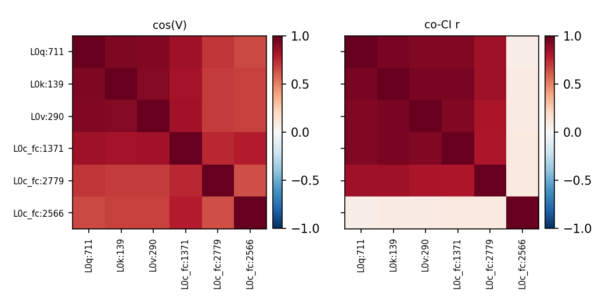

### Cluster 31 — n = 6 (L1c_fc, L1k, L1q, L1v); edge cos +0.72–+0.83

| matrix | component | mean CI | pos-0 fires | emb align | top tokens |
|---|---|---|---|---|---|
| L1q | 527 | 1.6e-03 | 0% | +0.03 | `'\n'` `'\n\n'` `'\r'` |
| L1k | 329 | 4.0e-03 | 0% | +0.02 | `'\n'` `'\n\n'` `'\r'` |
|  | 165 | 3.6e-03 | 0% | -0.00 | `'\n'` `'//'` `'  '` `' *'` `'\r'` |
| L1v | 513 | 6.1e-03 | 1% | +0.01 | `'\n'` `'\n\n'` `'  '` `'\xa0'` `'//'` |
| L1c_fc | 605 | 5.6e-03 | 1% | -0.01 | `'\n'` `'  '` `'\xa0'` `' *'` `'//'` |
|  | 970 | 5.4e-03 | 0% | +0.00 | `'\n'` `')'` `'*'` `'$'` `'"'` |

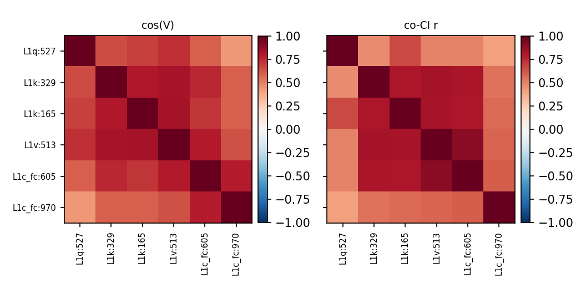

### Cluster 32 — n = 6 (L2c_fc, L2k, L2q, L2v); edge cos +0.72–+0.87

| matrix | component | mean CI | pos-0 fires | emb align | top tokens |
|---|---|---|---|---|---|
| L2q | 125 | 6.8e-03 | 0% | +0.02 | `'\n'` `'\n\n'` `'       '` |
| L2k | 575 | 1.1e-02 | 16% | +0.05 | `'\n'` `'<\|endoftext\|>'` `':'` `'.'` `'\n\n'` |
| L2v | 247 | 8.3e-03 | 0% | +0.01 | `'\n'` `'<\|endoftext\|>'` `':'` `'.'` `'\n\n'` |
|  | 285 | 6.8e-03 | 0% | -0.00 | `'\n'` `'\x0c'` `'       '` |
| L2c_fc | 2237 | 6.9e-03 | 0% | -0.01 | `'\n'` `'###'` `'.'` |
|  | 871 | 3.0e-03 | 0% | +0.01 | `'\n'` `'  '` `'       '` |

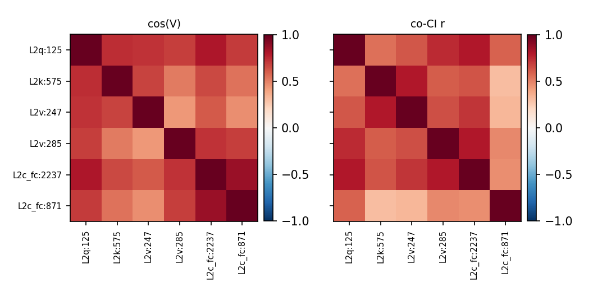

### Cluster 33 — n = 6 (L2c_fc, L2k, L2q, L2v); edge cos +0.75–+0.88

| matrix | component | mean CI | pos-0 fires | emb align | top tokens |
|---|---|---|---|---|---|
| L2q | 369 | 2.2e-02 | 0% | +0.10 | `'\n'` `'\n\n'` `'\r\n'` `'\n\t'` `' \n'` |
| L2k | 2 | 6.2e-03 | 0% | +0.14 | `'\n'` `'\n\n'` `'\n\t'` `' \n'` `'\r\n'` |
| L2v | 279 | 2.4e-02 | 0% | +0.04 | `'\n'` `'\n\n'` `'\n\t'` `'\r\n'` `' \n'` |
| L2c_fc | 2492 | 3.1e-02 | 0% | +0.10 | `'\n'` `'\n\n'` `'\r\n'` `'\n\t'` `' \n'` |
|  | 210 | 1.3e-02 | 0% | +0.12 | `'\n'` `'\n\n'` `'\r\n'` `'\n\t'` |
|  | 468 | 4.2e-03 | 0% | +0.03 | `'\n'` `'\n\n'` `'\r\n'` `' \n'` |

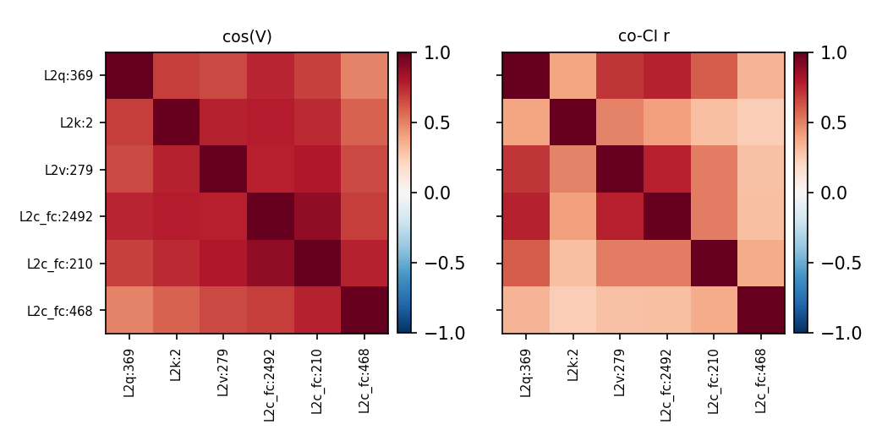

### Cluster 34 — n = 5 (L0c_fc, L0k, L0q, L0v); edge cos +0.75–+0.82

| matrix | component | mean CI | pos-0 fires | emb align | top tokens |
|---|---|---|---|---|---|
| L0q | 147 | 1.6e-03 | 0% | +0.78 | `' as'` `' like'` `'as'` |
| L0k | 325 | 1.5e-03 | 0% | +0.69 | `' as'` `' As'` `'As'` `' how'` `' so'` |
| L0v | 382 | 1.8e-03 | 1% | +0.70 | `' as'` `' As'` `'As'` `' than'` `'as'` |
| L0c_fc | 920 | 3.7e-03 | 0% | +0.70 | `' as'` `' like'` `' As'` `'as'` `'As'` |
|  | 1335 | 1.6e-03 | 0% | +0.64 | `' as'` `'as'` `' As'` |

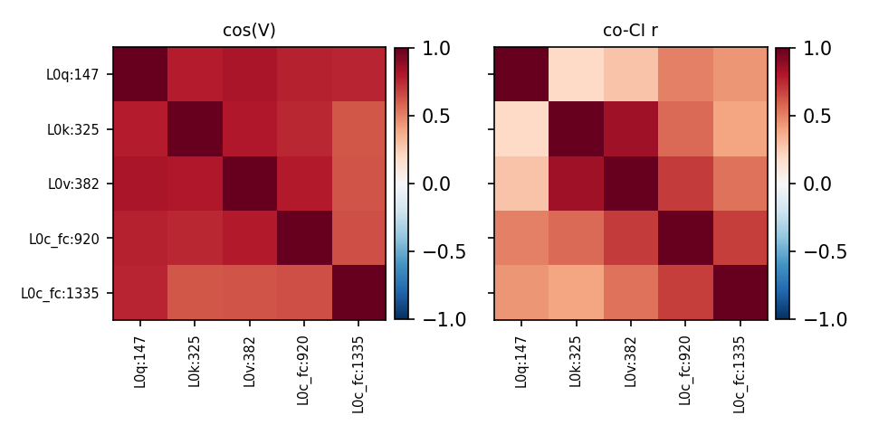

### Cluster 35 — n = 5 (L0c_fc, L0k, L0q, L0v); edge cos +0.70–+0.93

| matrix | component | mean CI | pos-0 fires | emb align | top tokens |
|---|---|---|---|---|---|
| L0q | 267 | 1.9e-02 | 0% | +0.57 | `','` `'.,'` `'),'` `'",'` `"',"` |
|  | 604 | 7.5e-03 | 0% | +0.62 | `','` `'),'` `'$,'` |
| L0k | 331 | 7.7e-03 | 1% | +0.49 | `','` `'),'` `'.,'` `' ,'` `"',"` |
| L0v | 300 | 2.6e-02 | 3% | +0.52 | `','` `'),'` `'.,'` `'",'` `"',"` |
| L0c_fc | 680 | 3.6e-02 | 0% | +0.58 | `','` `';'` `'),'` `'.,'` `'",'` |

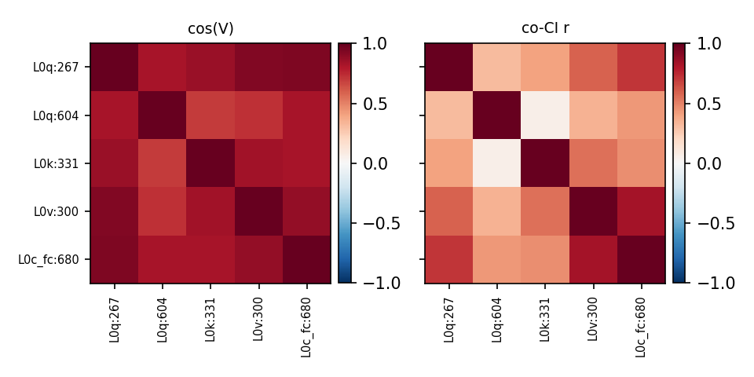

### Cluster 36 — n = 5 (L0c_fc, L0k, L0q, L0v); edge cos +0.72–+0.84

| matrix | component | mean CI | pos-0 fires | emb align | top tokens |
|---|---|---|---|---|---|
| L0q | 306 | 4.9e-03 | 0% | +0.73 | `'*'` `' *'` `'**'` `'*,'` `'*~'` |
| L0k | 309 | 2.6e-03 | 1% | +0.68 | `' *'` `'*'` `'**'` `' (*'` `' **'` |
| L0v | 351 | 4.0e-03 | 1% | +0.69 | `' *'` `'*'` `'**'` `' (*'` `' **'` |
| L0c_fc | 2556 | 5.4e-03 | 0% | +0.76 | `'*'` `' *'` `'**'` `' (*'` `')*'` |
|  | 2539 | 5.0e-03 | 0% | +0.66 | `'*'` `' *'` `'**'` `' (*'` `'/**'` |

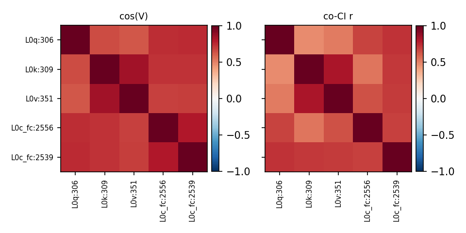

### Cluster 37 — n = 5 (L0c_fc, L0k, L0q, L0v); edge cos +0.83–+0.93

| matrix | component | mean CI | pos-0 fires | emb align | top tokens |
|---|---|---|---|---|---|
| L0q | 324 | 5.4e-03 | 0% | +0.70 | `' and'` `' or'` `' but'` `' &'` `'and'` |
| L0k | 448 | 1.1e-02 | 0% | +0.70 | `' and'` `' or'` `' but'` `'and'` |
| L0v | 392 | 1.3e-02 | 0% | +0.70 | `' and'` `' or'` `'and'` `' but'` `' And'` |
| L0c_fc | 1042 | 1.8e-02 | 0% | +0.69 | `' and'` `' or'` `' but'` `' &'` `'and'` |
|  | 491 | 5.9e-03 | 0% | +0.65 | `' and'` `' or'` `'and'` `' &'` `' but'` |

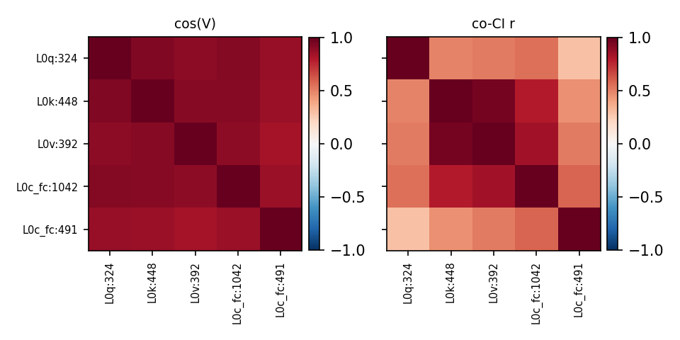

### Cluster 38 — n = 5 (L1c_fc, L1v, L2c_fc, L2v); edge cos +0.71–+0.84

| matrix | component | mean CI | pos-0 fires | emb align | top tokens |
|---|---|---|---|---|---|
| L1v | 200 | 1.9e-03 | 0% | +0.02 | `' at'` `' At'` `'at'` `'At'` `' near'` |
| L1c_fc | 2392 | 2.3e-03 | 0% | +0.07 | `' at'` `'at'` `' At'` `'At'` `' near'` |
| L2v | 670 | 2.7e-03 | 0% | +0.02 | `' at'` `' to'` `'at'` `' At'` `'At'` |
| L2c_fc | 1561 | 1.9e-03 | 0% | +0.02 | `' at'` `'at'` `' At'` `'At'` `' near'` |
|  | 1404 | 1.4e-03 | 0% | +0.05 | `' at'` `'at'` `' At'` `'At'` `' near'` |

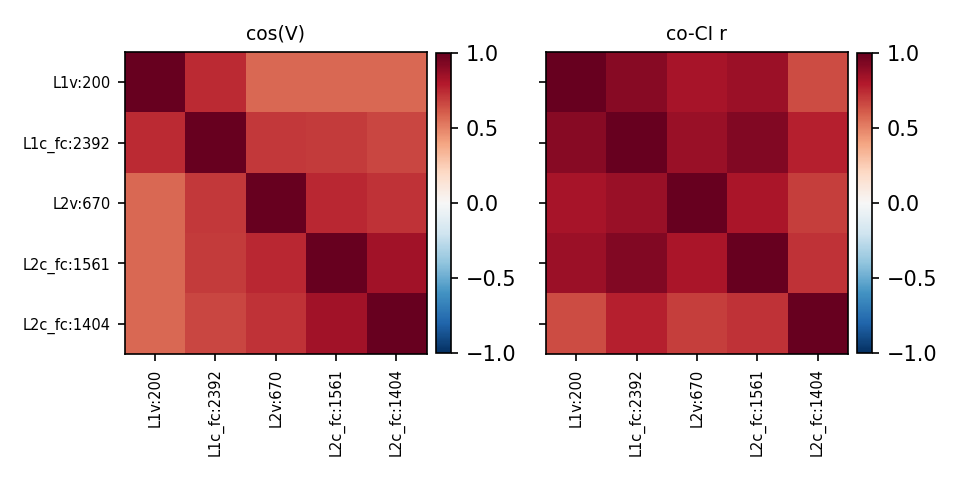

### Smaller clusters (3–4 members, 66 of them) — grouped by kind

| members | kind | top tokens (first member) |
|---|---|---|
| L1v:318 L1c_fc:622 L2q:618 L2v:576 | cross-layer | `' of'` `' The'` `' St'` |
| L1c_fc:880 L2v:432 L2c_fc:2420 L3c_fc:2970 | cross-layer | `'r'` `'R'` `' R'` `' r'` |
| L1c_fc:2931 L2v:456 L2c_fc:2995 L3c_fc:2556 | cross-layer | `'d'` `'D'` `' D'` `' d'` |
| L2q:486 L2k:354 L3q:629 L3k:610 | cross-layer | `' the'` `'\n'` `' The'` `' of'` |
| L2v:399 L2c_fc:1254 L3v:309 L3c_fc:1099 | cross-layer | `'m'` `'M'` `' M'` `' m'` |
| L2v:435 L2c_fc:1211 L3v:146 L3c_fc:1531 | cross-layer | `'G'` `'g'` `' G'` `' g'` |
| L2v:481 L2c_fc:1065 L3v:132 L3c_fc:1193 | cross-layer | `'f'` `'F'` `' F'` `' f'` |
| L0v:33 L0c_fc:1260 L0c_fc:2843 L3c_fc:1386 | cross-layer | `','` `'.'` `' of'` `' in'` |
| L0v:140 L0c_fc:1903 L0c_fc:2161 L3c_fc:2246 | cross-layer | `','` `'.'` `' of'` `' that'` |
| L1v:138 L1c_fc:2086 L1c_fc:2458 L2q:558 | cross-layer | `'1'` `'2'` `'0'` `'3'` |
| L1c_fc:124 L1c_fc:1471 L2v:190 L2c_fc:2169 | cross-layer | `' using'` `'ing'` `' being'` `' having'` |
| L1c_fc:774 L2c_fc:473 L2c_fc:2326 L3c_fc:2782 | cross-layer | `' the'` `','` `'.'` `' of'` |
| L1c_fc:1989 L2v:237 L2c_fc:445 L2c_fc:2711 | cross-layer | `' 2013'` `' 2015'` `' 2010'` `' 2011'` |
| L2v:424 L2c_fc:293 L3c_fc:534 L3c_fc:2013 | cross-layer | `'v'` `'V'` `' V'` `' v'` |
| L2v:503 L2c_fc:764 L3c_fc:2079 L3c_fc:2986 | cross-layer | `'k'` `'K'` `' K'` `' k'` |
| L2c_fc:773 L2c_fc:2405 L3v:717 L3c_fc:1059 | cross-layer | `' at'` `' the'` `' to'` `' a'` |
| L1c_fc:763 L2c_fc:1950 L3c_fc:1562 | cross-layer | `' the'` `','` `'\n'` `' of'` |
| L1c_fc:1976 L2q:556 L2k:560 | cross-layer | `'-'` `','` `'.'` `'_'` |
| L1c_fc:2796 L2q:302 L2k:302 | cross-layer | `'{'` `' "'` `','` `'.'` |
| L2v:366 L2c_fc:950 L3c_fc:2574 | cross-layer | `'/'` `'//'` `' /'` `')/'` |
| L2v:504 L2c_fc:2467 L3c_fc:2249 | cross-layer | `'H'` `'h'` `' H'` `' h'` |
| L2c_fc:151 L3v:228 L3c_fc:2071 | cross-layer | `'n'` `'N'` `' N'` `' n'` |
| L2c_fc:1000 L3v:754 L3c_fc:1942 | cross-layer | `' on'` `' the'` `' a'` `' over'` |
| L2c_fc:1303 L3v:486 L3c_fc:1451 | cross-layer | `' \\'` `' $'` `'\\'` `'{'` |
| L2c_fc:2963 L3v:503 L3c_fc:617 | cross-layer | `'\n'` `'>'` `'<'` `'.'` |
| L0c_fc:1143 L0c_fc:1915 L0c_fc:2422 L3c_fc:1896 | cross-layer | `'?'` `' you'` `' it'` `','` |
| L2c_fc:883 L2c_fc:1419 L3c_fc:1497 | cross-layer | `' of'` `'of'` `' OF'` |
| L2c_fc:1039 L3c_fc:183 L3c_fc:1753 | cross-layer | `' an'` `' An'` `"'"` `'An'` |
| L0q:449 L0k:640 L0v:700 L0c_fc:2182 | same-layer | `'2'` `'1'` `'0'` `'3'` |
| L0q:303 L0v:205 L0c_fc:1949 L0c_fc:2802 | same-layer | `')'` `').'` `'),'` `']'` |
| L0k:387 L0v:391 L0c_fc:651 L0c_fc:935 | same-layer | `' in'` `' In'` `'in'` `'In'` |
| L0k:520 L0v:175 L0c_fc:295 L0c_fc:1745 | same-layer | `' ='` `'='` `'return'` `'=\\'` |
| L1k:644 L1v:252 L1c_fc:1109 L1c_fc:2179 | same-layer | `' as'` `' like'` `' than'` `' As'` |
| L3q:65 L3v:247 L3c_fc:787 L3c_fc:3025 | same-layer | `'\n'` `'\n\n'` `'  '` `'\xa0'` |
| L0k:455 L0v:280 L0c_fc:1550 | same-layer | `'A'` `' A'` `'a'` `' An'` |
| L0k:465 L0v:475 L0c_fc:2139 | same-layer | `' is'` `' be'` `' was'` `' are'` |
| L0k:467 L0v:468 L0c_fc:58 | same-layer | `' this'` `' that'` `' these'` `' This'` |
| L0k:514 L0v:525 L0c_fc:2595 | same-layer | `'’'` `"'s"` `'s'` `"'"` |
| L0k:515 L0v:519 L0c_fc:2865 | same-layer | `' or'` `'or'` `' than'` `' either'` |
| L0k:762 L0v:734 L0c_fc:2881 | same-layer | `' [@'` `'](#'` `' \\[[@'` `' @'` |
| L1q:555 L1v:612 L1c_fc:2728 | same-layer | `'\n'` `'<\|endoftext\|>'` `':'` |
| L1q:565 L1k:565 L1v:376 | same-layer | `'\n'` `'.'` `' the'` `','` |
| L3q:565 L3v:162 L3c_fc:2304 | same-layer | `'-'` `'2'` `'1'` `' 1'` |
| L0q:654 L0c_fc:1033 L0c_fc:1833 L0c_fc:2235 | same-layer | `' with'` `' without'` `'with'` `'With'` |
| L0k:401 L0c_fc:573 L0c_fc:1270 L0c_fc:1482 | same-layer | `' at'` `' on'` `'at'` `' At'` |
| L0k:705 L0c_fc:376 L0c_fc:998 L0c_fc:2275 | same-layer | `'ER'` `'ED'` `' CD'` `'ST'` |
| L0v:432 L0c_fc:986 L0c_fc:1604 L0c_fc:2141 | same-layer | `' a'` `' an'` `'a'` `' one'` |
| L2v:339 L2c_fc:634 L2c_fc:1991 L2c_fc:2287 | same-layer | `' by'` `' through'` `' via'` `' using'` |
| L2v:378 L2c_fc:22 L2c_fc:2537 L2c_fc:2975 | same-layer | `' -'` `'\n'` `'*'` `' +'` |
| L3v:507 L3c_fc:1311 L3c_fc:1904 L3c_fc:3017 | same-layer | `'\n'` `' -'` `'*'` `' +'` |
| L0q:289 L0c_fc:809 L0c_fc:2147 | same-layer | `' from'` `'from'` `'From'` `' From'` |
| L0q:337 L0c_fc:964 L0c_fc:1975 | same-layer | `'{'` `' {'` `' ['` `'['` |
| L0v:497 L0c_fc:1030 L0c_fc:2786 | same-layer | `' the'` `' The'` `'The'` `'the'` |
| L0v:668 L0c_fc:43 L0c_fc:351 | same-layer | `'0'` `' 0'` `' zero'` |
| L1v:163 L1c_fc:240 L1c_fc:2888 | same-layer | `'.'` `'::'` `'->'` `' .'` |
| L1v:479 L1c_fc:577 L1c_fc:848 | same-layer | `' I'` `' it'` `' you'` `' we'` |
| L1v:480 L1c_fc:209 L1c_fc:635 | same-layer | `'/'` `'}{'` `' /'` `' per'` |
| L2v:735 L2c_fc:2118 L2c_fc:2893 | same-layer | `' with'` `' without'` `' the'` `' a'` |
| L0c_fc:213 L0c_fc:754 L0c_fc:759 L0c_fc:1669 | same-matrix | `' for'` `' For'` `'for'` `'For'` |
| L3c_fc:64 L3c_fc:353 L3c_fc:592 L3c_fc:843 | same-matrix | `'.'` `').'` `'?'` `' .'` |
| L1c_fc:115 L1c_fc:155 L1c_fc:2785 | same-matrix | `' with'` `' have'` `' has'` `' had'` |
| L2c_fc:215 L2c_fc:288 L2c_fc:652 | same-matrix | `' -'` `'\n'` `' +'` `'.'` |
| L2c_fc:471 L2c_fc:1318 L2c_fc:1409 | same-matrix | `')'` `'$'` `'}'` `'"'` |
| L2c_fc:794 L2c_fc:921 L2c_fc:3057 | same-matrix | `' on'` `'On'` `' On'` `' upon'` |
| L3c_fc:867 L3c_fc:987 L3c_fc:1251 | same-matrix | `' to'` `' To'` `'To'` `' into'` |
| L3c_fc:1269 L3c_fc:1603 L3c_fc:2523 | same-matrix | `'_'` `','` `'\n'` `'.'` |

### Pairs (168 two-member clusters) — the 30 highest-cos shown, grouped by kind

| pair | cos V | kind | co-CI r | cos U | top tokens (a / b) |
|---|---|---|---|---|---|
| L1c_fc:1192 ↔ L2k:630 | +0.95 | cross-layer | 0.64 |  | `'-'` `'_'` `'.'` / `'-'` `'_'` `'.'` |
| L1c_fc:2008 ↔ L2k:629 | +0.93 | cross-layer | 0.53 |  | `'-'` `'_'` `'.'` / `'-'` `'_'` `'.'` |
| L1c_fc:799 ↔ L2k:638 | +0.92 | cross-layer | 0.53 |  | `'-'` `'.'` `'_'` / `'-'` `'.'` `'_'` |
| L1c_fc:869 ↔ L2k:567 | +0.92 | cross-layer | 0.55 |  | `'_'` `'-'` `'.'` / `'_'` `'-'` `'.'` |
| L1c_fc:199 ↔ L2k:557 | +0.92 | cross-layer | 0.50 |  | `'-'` `' the'` `'.'` / `'-'` `'.'` `'_'` |
| L1c_fc:2754 ↔ L2k:626 | +0.91 | cross-layer | 0.58 |  | `'_'` `'.'` `'-'` / `'.'` `'_'` `'-'` |
| L1c_fc:1801 ↔ L2k:637 | +0.89 | cross-layer | 0.50 |  | `'-'` `' "'` `'.'` / `'-'` `'_'` `'.'` |
| L1c_fc:1938 ↔ L2k:574 | +0.88 | cross-layer | 0.46 |  | `'.'` `'_'` `'-'` / `'.'` `'_'` `'-'` |
| L1v:178 ↔ L2q:626 | +0.82 | cross-layer | 0.35 |  | `'0'` `'/'` `' 0'` / `'0'` `'/'` `' 0'` |
| L1c_fc:2493 ↔ L2k:561 | +0.81 | cross-layer | 0.52 |  | `','` `' and'` `'-'` / `','` `'-'` `'_'` |
| L1v:176 ↔ L2q:560 | +0.81 | cross-layer | 0.39 |  | `'1'` `'n'` `'m'` / `'1'` `'n'` `'m'` |
| L1c_fc:177 ↔ L2k:639 | +0.80 | cross-layer | 0.52 |  | `'_'` `'-'` `'.'` / `'_'` `'.'` `'-'` |
| L1c_fc:1891 ↔ L2k:624 | +0.80 | cross-layer | 0.67 |  | `'1'` `'0'` `' \\'` / `'1'` `'0'` `' \\'` |
| L1c_fc:697 ↔ L2k:618 | +0.79 | cross-layer | 0.40 |  | `','` `'.'` `' of'` / `','` `'.'` `'\n'` |
| L0q:705 ↔ L0c_fc:1269 | +0.83 | same-layer | 0.66 |  | `'s'` `'x'` `'a'` / `'s'` `'a'` `'ing'` |
| L1v:366 ↔ L1c_fc:2602 | +0.82 | same-layer | 0.62 |  | `'00'` `'10'` `'000'` / `'00'` `'000'` `'20'` |
| L0k:408 ↔ L0c_fc:1716 | +0.80 | same-layer | 0.50 |  | `' his'` `' my'` `' their'` / `"'s"` `' their'` `' his'` |
| L0v:227 ↔ L0c_fc:727 | +0.80 | same-layer | 0.75 |  | `' it'` `' It'` `'It'` / `' it'` `' It'` `' its'` |
| L0v:712 ↔ L0c_fc:2343 | +0.79 | same-layer | 0.74 |  | `' have'` `' has'` `' had'` / `' have'` `' has'` `' had'` |
| L2c_fc:1721 ↔ L2c_fc:2896 | +0.85 | same-matrix | 0.65 | +0.13 | `' S'` `' C'` `' F'` / `'B'` `'C'` `' C'` |
| L0c_fc:1474 ↔ L0c_fc:2454 | +0.85 | same-matrix | 0.82 | +0.14 | `'\n'` `':'` `'###'` / `'\n'` `':'` `'.'` |
| L1c_fc:1473 ↔ L1c_fc:1815 | +0.85 | same-matrix | 0.60 | -0.19 | `'\n'` `' -'` `'*'` / `'\n'` `' -'` `'.'` |
| L3c_fc:1721 ↔ L3c_fc:2820 | +0.81 | same-matrix | 0.36 | +0.20 | `'<'` `'</'` `' @'` / `'<'` `'</'` `' <'` |
| L0c_fc:958 ↔ L0c_fc:3005 | +0.81 | same-matrix | 0.33 | -0.11 | `'ed'` `' increased'` `'ized'` / `'ed'` `' used'` `' said'` |
| L0c_fc:1108 ↔ L0c_fc:1290 | +0.80 | same-matrix | 0.50 | -0.15 | `'000'` `' 100'` `'100'` / `'00'` `'000'` `'01'` |
| L0c_fc:1096 ↔ L0c_fc:1353 | +0.80 | same-matrix | 0.99 | +0.52 | `' take'` `' taken'` `' took'` / `' take'` `' took'` `' taken'` |
| L3c_fc:2154 ↔ L3c_fc:2167 | +0.80 | same-matrix | 0.54 | +0.04 | `'*'` `' -'` `' +'` / `' -'` `' +'` `'\n'` |
| L0c_fc:57 ↔ L0c_fc:2783 | +0.80 | same-matrix | 0.47 | -0.06 | `' 0'` `' 1'` `' 2'` / `' 0'` `' 2'` `' 1'` |
| L3c_fc:781 ↔ L3c_fc:2461 | +0.79 | same-matrix | 0.51 | +0.26 | `'-'` `'{'` `'](#'` / `'-'` `'{'` `' \\[[@'` |
| L2c_fc:2399 ↔ L2c_fc:2669 | +0.79 | same-matrix | 0.46 | +0.10 | `' to'` `' To'` `'to'` / `' to'` `' into'` `'to'` |

## Negative tail (cos < -0.4)

217 pairs read the same stream direction with **opposite** polarity at
cos < -0.4 (vs 12314 positive pairs above
+0.4); the strongest 20 (co-CI r from the signed cluster-CI Gram —
its members include every component in a pair below -0.4):

| pair | cos V | kind | co-CI r | cos U | top tokens (a / b) |
|---|---|---|---|---|---|
| L0q:342 ↔ L3c_fc:917 | -0.76 | cross-layer | -0.02 |  | `' to'` `'to'` `'To'` / `' used'` `' and'` `' have'` |
| L3v:145 ↔ L3c_fc:534 | -0.74 | same-layer | 0.36 |  | `' V'` `'V'` `'v'` / `' V'` `'V'` `'v'` |
| L0v:486 ↔ L3c_fc:917 | -0.73 | cross-layer | -0.02 |  | `' to'` `' To'` `'to'` / `' used'` `' and'` `' have'` |
| L0q:389 ↔ L3c_fc:230 | -0.72 | cross-layer | -0.01 |  | `' that'` `' which'` `' That'` / `' and'` `' is'` `','` |
| L0c_fc:1991 ↔ L3c_fc:230 | -0.72 | cross-layer | -0.01 |  | `' that'` `' which'` `' who'` / `' and'` `' is'` `','` |
| L0c_fc:1669 ↔ L3c_fc:2213 | -0.72 | cross-layer | -0.01 |  | `' for'` `' For'` `'For'` / `' used'` `' available'` `')'` |
| L0c_fc:649 ↔ L3c_fc:917 | -0.72 | cross-layer | -0.02 |  | `' to'` `'to'` `'To'` / `' used'` `' and'` `' have'` |
| L0c_fc:213 ↔ L3c_fc:2213 | -0.71 | cross-layer | -0.01 |  | `' for'` `' For'` `'for'` / `' used'` `' available'` `')'` |
| L0c_fc:759 ↔ L3c_fc:2213 | -0.69 | cross-layer | -0.01 |  | `' for'` `'for'` `' For'` / `' used'` `' available'` `')'` |
| L0c_fc:754 ↔ L3c_fc:2213 | -0.69 | cross-layer | -0.01 |  | `' for'` `' For'` `'for'` / `' used'` `' available'` `')'` |
| L2c_fc:293 ↔ L3v:145 | -0.68 | cross-layer | 0.34 |  | `'V'` `'v'` `' V'` / `' V'` `'V'` `'v'` |
| L0c_fc:858 ↔ L3c_fc:917 | -0.68 | cross-layer | -0.01 |  | `' to'` `'to'` `' To'` / `' used'` `' and'` `' have'` |
| L0q:660 ↔ L3c_fc:2616 | -0.66 | cross-layer | -0.05 |  | `'.'` `').'` `'.,'` / `' it'` `' time'` `'s'` |
| L0c_fc:425 ↔ L3c_fc:1877 | -0.65 | cross-layer | 0.00 |  | `' $'` `' $\\'` `'$'` / `' of'` `','` `' and'` |
| L0c_fc:1074 ↔ L3c_fc:1703 | -0.65 | cross-layer | -0.00 |  | `' he'` `' his'` `' her'` / `'.'` `','` `' of'` |
| L0c_fc:728 ↔ L3c_fc:230 | -0.64 | cross-layer | -0.01 |  | `' that'` `'that'` `' That'` / `' and'` `' is'` `','` |
| L0q:660 ↔ L3c_fc:1848 | -0.64 | cross-layer | -0.02 |  | `'.'` `').'` `'.,'` / `'1'` `'0'` `' 1'` |
| L0k:379 ↔ L3c_fc:734 | -0.64 | cross-layer | 0.01 |  | `' "'` `'"'` `' “'` / `'\n'` `','` `'.'` |
| L0v:150 ↔ L3c_fc:230 | -0.63 | cross-layer | -0.01 |  | `' that'` `' which'` `' who'` / `' and'` `' is'` `','` |
| L0c_fc:1251 ↔ L3c_fc:917 | -0.63 | cross-layer | -0.02 |  | `' to'` `'to'` `' into'` / `' used'` `' and'` `' have'` |

## Do aligned readers co-fire / co-write?

For the 351 **same-matrix** pairs above +0.7: median co-CI
r = 0.61 (quartiles 0.47–0.73;
34 pairs > 0.9, 8 pairs < 0.1) and median
signed write cos(U) = +0.06 (1 pairs
> +0.7, 196 with |cos U| < 0.1,
24 < -0.1). The 738 **cross-site** pairs co-fire
similarly: median co-CI r = 0.68 (quartiles
0.52–0.82; 87 > 0.9,
25 < 0.1; from the cross-site CI Gram of all clustered
components, Modal job `hide/cluster_ci_signed_modal.py` →
`hide/cache/cluster_ci_signed_newA.npz`). The 217 negative-tail
pairs with a defined r have median co-CI r = -0.00
(133 of them negative).
U factors of different sites live in different output spaces, so no cross-site
cos(U) is defined.

## Within-matrix cosine distributions

One panel per matrix: the distribution of signed cos(V) over all pairs of
alive components *within* that matrix (log count; dotted line = the analytic
random-directions null in $d = 768$, scaled to the panel's pair count).

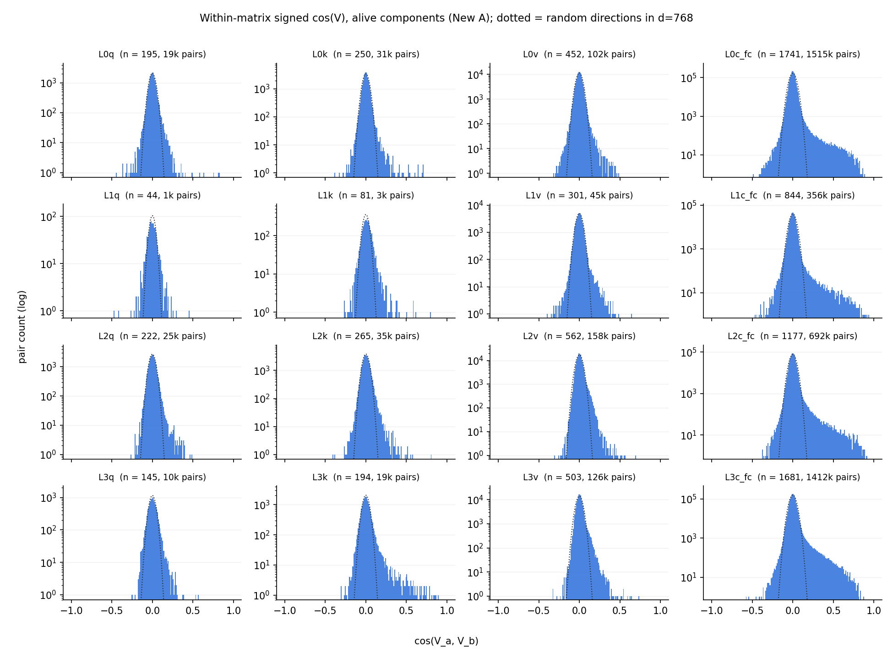

## Linear-scale versions

The same distribution plots with a linear y axis (the log plots emphasize
the tails; these show where the actual mass sits).

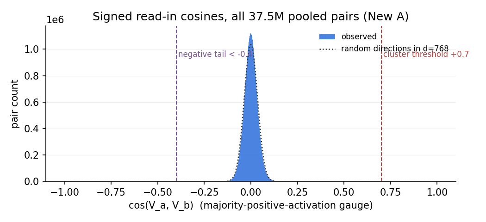

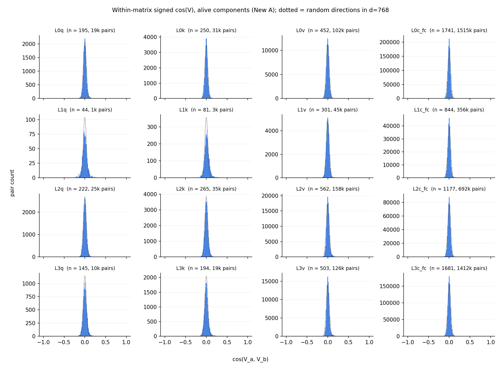
