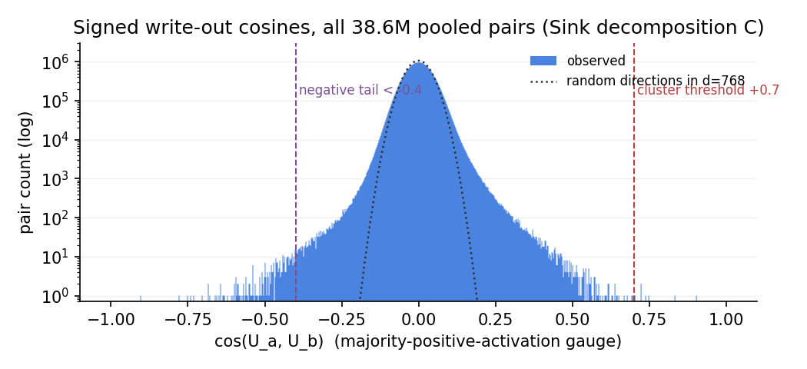
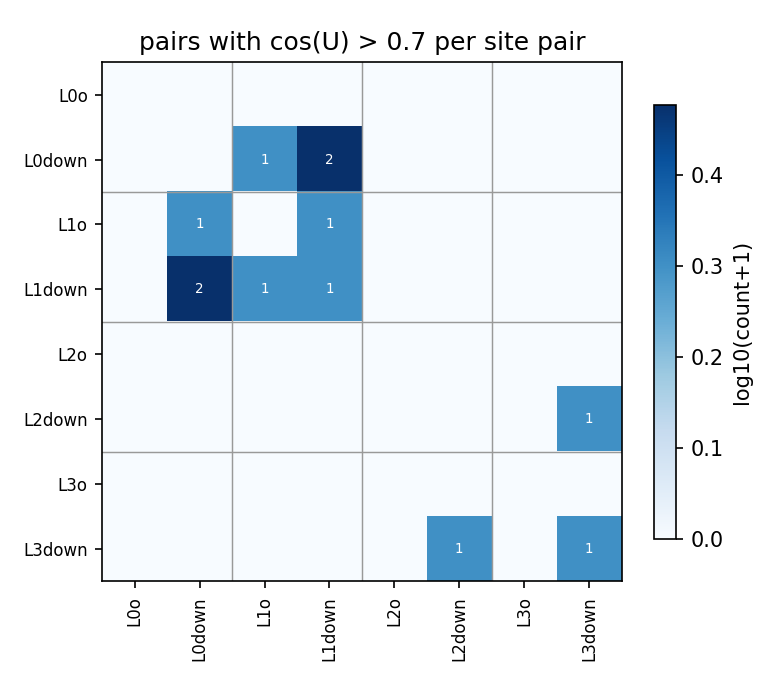
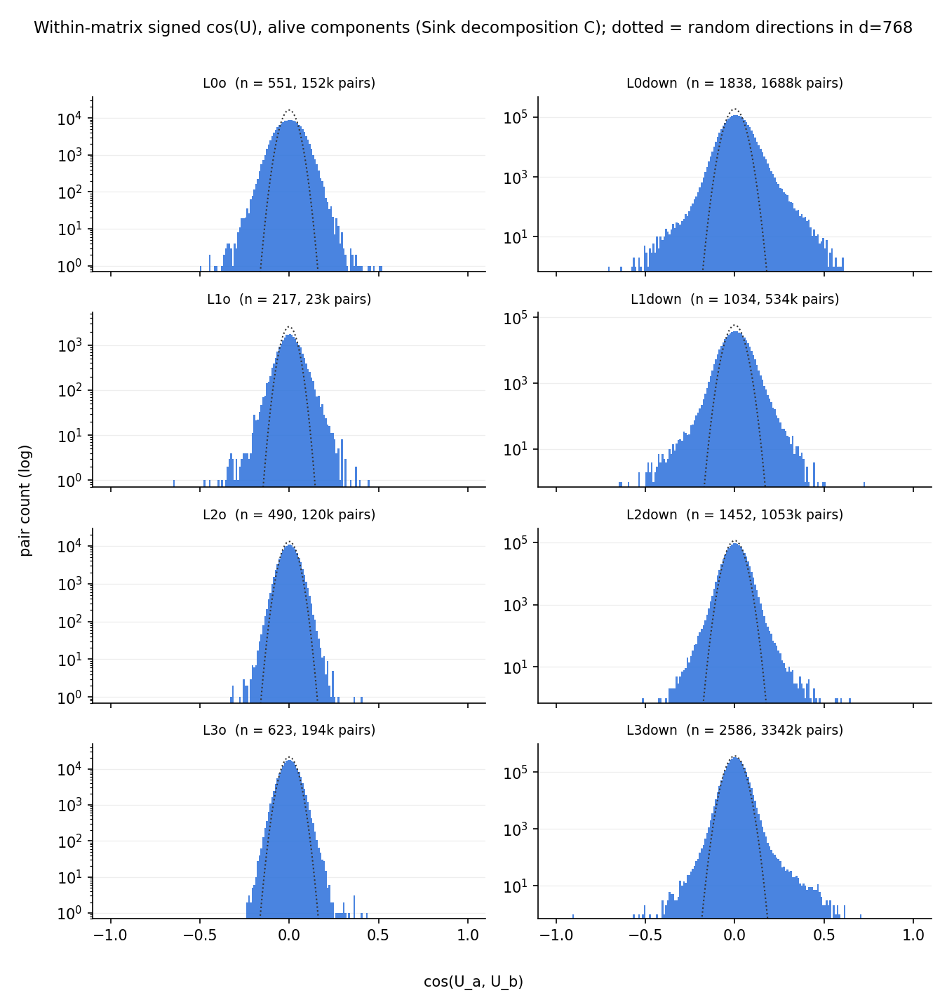
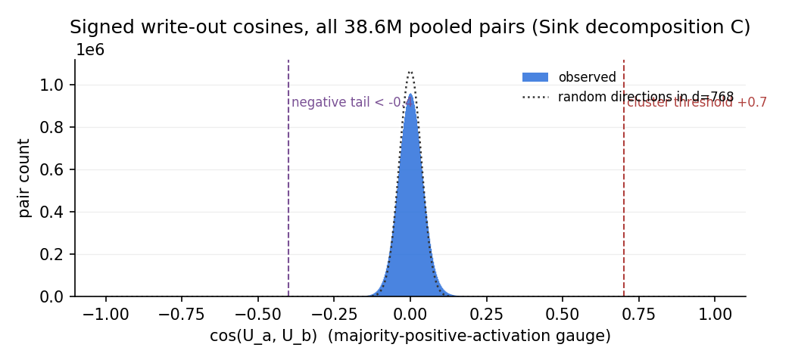
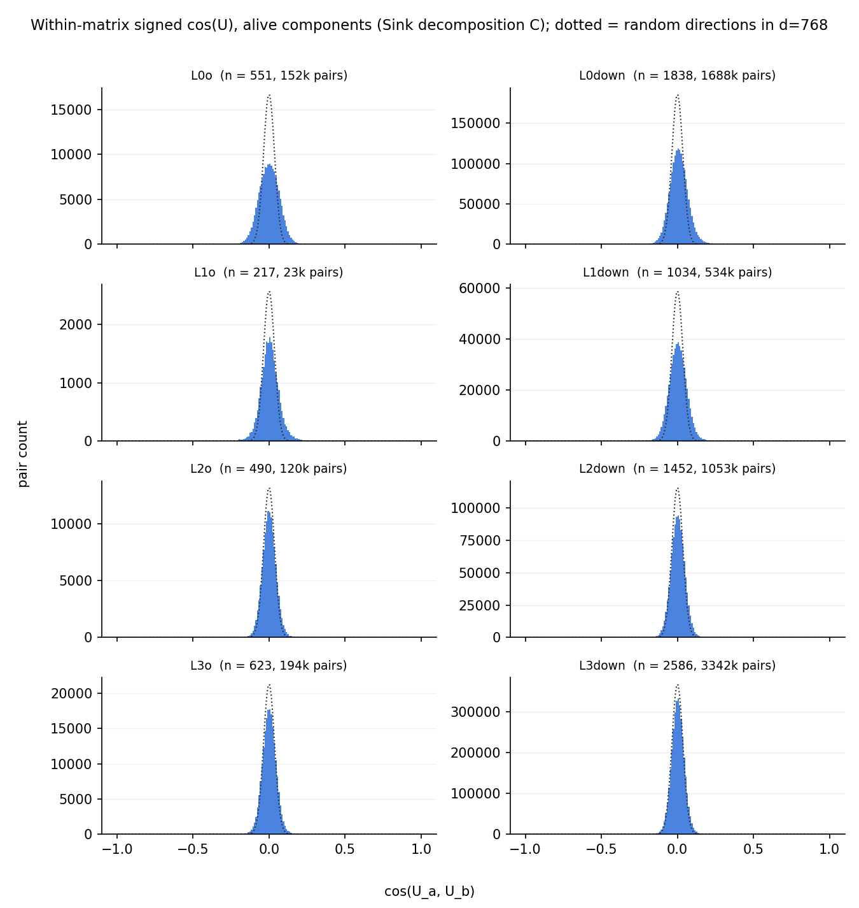

# Sink decomposition C (p-d60af588): signed write-out (U) cosines across the residual-stream-writing matrices

Write-side mirror of the signed read-in report (`../read-in/`): here the vectors compared are the components' **write directions** $U_c$ — the rank-one write into the residual stream is $a_c(x)\,U_c$ — for the 8 matrices that write to the stream, `h.<l>.attn.o_proj` and `h.<l>.mlp.down_proj`. Sign convention: each component's $(U_c, V_c)$ gauge is flipped so its input activation $V_c\cdot x$ is positive on the majority of tokens where it fires (CI > 0.1) — the interactive cross-widget convention. Under it, $\cos(U_a,U_b) > 0$ means two components write the same stream direction with the same polarity when active; $< 0$, opposite polarities.

## Headlines

- **7 of 8791 pooled components (0%) sit in
  2 clusters** chained at cos > +0.7
  (2 same-matrix, 1 same-layer
  cross-matrix, 4 cross-layer pairs above +0.7).
- **The negative tail is substantial: 324 pairs below -0.4
  (6 below -0.7), strongest -0.90** —
  vs 560 above +0.4 (7 above +0.7).
- **Signed unembedding alignment by layer** (clustered members' cos(U,
  unemb[own top token]), median): L0 +0.06 /
  L1 +0.06 / L2 -0.01 /
  L3 -0.01. (unemb = lm_head (untied head).)
- **Same-matrix aligned pairs**: median co-CI
  r = 0.02, median signed read cos(V) = +0.44
  (0 pairs > +0.7, 0 < -0.1).

- **Write-direction sharing is essentially absent in C**: 7 pairs above +0.7
  out of 38.6M (newA: 263), 2 clusters totalling 7 components, max cos 0.90.
  The read side already showed C sharing an order of magnitude less than
  newA; on the write side the collapse is even more complete.
- **The negative tail is boundary machinery again, but WITHOUT co-firing.**
  Nearly every strong negative pair joins `'\n'`/`'.'`-firing components
  across L0–L3 o/down matrices — yet their co-CI r ≈ 0.00 throughout (newA's
  strongest negative pairs co-fired at r 0.8–0.97). There is no co-firing
  write-then-cancel geometry — consistent with the built-in attention sinks
  removing the emergent massive-vector write+cancel circuit these
  decompositions otherwise learn.
- **The two same-matrix aligned pairs behave read-side-ish**: co-CI r ≈ 0.02
  with cos V +0.44 — nothing like newA's tightly co-firing write clusters.
- **⚠ RoPE caveat (2026-09-15):** the cos(U)/cos(V) geometry is pure weights
  and unaffected, but everything CI-derived for C — alive sets, mean CI, top
  tokens, pos-0 shares, the activation-sign gauge, and all co-CI r here
  (`cluster_ci_signed_C.npz` was computed through the public sink loader) —
  used the broken-RoPE forward (`sink-models/rope_report.md`).
  Token-identity/short-range statistics likely survive qualitatively;
  recompute pending the correct RoPE convention.

## Method

All **alive** components (sample mean CI > 1e-6 over the 4,000 cached Pile
rows) of the 8 matrices whose $U$ factor writes to the residual stream —
`h.<l>.attn.o_proj` and `h.<l>.mlp.down_proj`, $l=0..3$ — pooled into one set
of **8791 components**; the reading matrices (q/k/v/c_fc) are the subject of
the read-in reports. For every pair the **signed** write alignment

$$\cos(U_a, U_b) = \frac{U_a \cdot U_b}{\lVert U_a\rVert\,\lVert U_b\rVert},$$

with each component first put in the majority-positive-activation gauge
(sign statistics over the same 2.05M tokens; `comp_signs()`). Unlike the read
side there is no gain-folding question: the write $a_c(x)\,U_c$ enters the
raw residual stream directly (no norm between $U$ and the stream), so raw $U$
is exactly the write direction. For random unit vectors in $d=768$ the signed
cosine is symmetric around 0 with
$\mathrm{std} = 1/\sqrt d \approx 0.036$
(and $E|\cos| = \sqrt{2/\pi d} \approx 0.029$); the dotted
line in the histogram is this analytic null scaled to the pair count.
Scripts: `hide/compute_signed.py` → `hide/cache/ucos_signed_C.npz`,
`hide/report_signed.py` (this report); decomposition p-d60af588 of target
`t-87f91319`.

## Distribution

| threshold | 0.4 | 0.5 | 0.6 | 0.7 | 0.8 | 0.9 |
|---|---|---|---|---|---|---|
| pairs above +thr | 560 | 112 | 25 | 7 | 2 | 1 |
| pairs below -thr | 324 | 77 | 20 | 6 | 1 | 1 |

(38.6M pairs total; max +0.904, min
-0.903.)

Of the 7 pairs above +0.7: **2 same-matrix,
1 same-layer cross-matrix, 4
cross-layer**.

## Clusters (chaining at cos > +0.7)

Connected components of the cos > +0.7 graph: **2 clusters
with ≥ 2 members, covering 7 of 8791 components**. Clusters are
ordered by the number of distinct matrices involved (ties by size); members
by matrix, then mean CI descending.
Tables below: all clusters with ≥ 5 members in full, smaller ones compacted.
Per member: sample mean CI, share of CI>0.1 fires at position 0, signed
alignment of U with the member's own top token's unembedding ("unemb align"),
top activating tokens (share of summed CI). Below each table: member × member
heatmaps of cos(U) and co-CI r (cross-site values from
`hide/cache/cluster_ci_signed_C.npz`), members in table order, both on
the same RdBu scale.

### Smaller clusters (3–4 members, 2 of them) — grouped by kind

| members | kind | top tokens (first member) |
|---|---|---|
| L0down:2110 L1o:634 L1down:794 L1down:1608 | cross-layer | `'\n'` `'.'` `','` `' the'` |
| L2down:1795 L3down:1203 L3down:2474 | cross-layer | `'.'` `','` `' to'` `'\n'` |

### Pairs (0 two-member clusters) — the 0 highest-cos shown, grouped by kind

| pair | cos U | kind | co-CI r | cos V | top tokens (a / b) |
|---|---|---|---|---|---|

## Negative tail (cos < -0.4)

324 pairs write the same stream direction with **opposite** polarity at
cos < -0.4 (vs 560 positive pairs above
+0.4); the strongest 25 (co-CI r from the signed cluster-CI Gram —
its members include every component in a pair below -0.4):

| pair | cos U | kind | co-CI r | cos V | top tokens (a / b) |
|---|---|---|---|---|---|
| L3down:683 ↔ L3down:1409 | -0.90 | same-matrix | -0.01 | +0.10 | `'.'` `'\n'` `','` / `'.'` `'\n'` `' it'` |
| L1o:634 ↔ L2down:887 | -0.78 | cross-layer | -0.03 |  | `'\n'` `'.'` `','` / `'\n'` `'.'` `','` |
| L1o:144 ↔ L1down:1608 | -0.75 | same-layer | 0.01 |  | `'\n'` `'.'` `' the'` / `'\n'` `'.'` `','` |
| L0down:197 ↔ L1down:1608 | -0.74 | cross-layer | 0.02 |  | `'\n'` `' the'` `','` / `'\n'` `'.'` `','` |
| L1down:1608 ↔ L2down:887 | -0.73 | cross-layer | 0.00 |  | `'\n'` `'.'` `','` / `'\n'` `'.'` `','` |
| L0down:197 ↔ L0down:2110 | -0.70 | same-matrix | -0.00 | +0.04 | `'\n'` `' the'` `','` / `'\n'` `'.'` `','` |
| L0down:1942 ↔ L1down:1608 | -0.68 | cross-layer | 0.00 |  | `'\n'` `'\n\n'` `'\r\n'` / `'\n'` `'.'` `','` |
| L1o:144 ↔ L1down:794 | -0.68 | same-layer | 0.00 |  | `'\n'` `'.'` `' the'` / `'\n'` `'.'` `','` |
| L0down:2110 ↔ L2down:887 | -0.68 | cross-layer | -0.00 |  | `'\n'` `'.'` `','` / `'\n'` `'.'` `','` |
| L2o:468 ↔ L2down:887 | -0.66 | same-layer | -0.03 |  | `'\n'` `'.'` `','` / `'\n'` `'.'` `','` |
| L0down:1942 ↔ L1o:634 | -0.66 | cross-layer | 0.00 |  | `'\n'` `'\n\n'` `'\r\n'` / `'\n'` `'.'` `','` |
| L0down:2110 ↔ L1o:144 | -0.65 | cross-layer | 0.00 |  | `'\n'` `'.'` `','` / `'\n'` `'.'` `' the'` |
| L1o:144 ↔ L1o:634 | -0.64 | same-matrix | -0.00 | -0.07 | `'\n'` `'.'` `' the'` / `'\n'` `'.'` `','` |
| L1down:1608 ↔ L1down:1925 | -0.64 | same-matrix | 0.00 | +0.13 | `'\n'` `'.'` `','` / `'{'` `'{\\'` `'M'` |
| L1down:794 ↔ L1down:907 | -0.64 | same-matrix | 0.00 | +0.23 | `'\n'` `'.'` `','` / `' the'` `','` `'\n'` |
| L0down:197 ↔ L1o:634 | -0.63 | cross-layer | -0.13 |  | `'\n'` `' the'` `','` / `'\n'` `'.'` `','` |
| L0down:1942 ↔ L0down:2110 | -0.63 | same-matrix | -0.00 | +0.03 | `'\n'` `'\n\n'` `'\r\n'` / `'\n'` `'.'` `','` |
| L1o:144 ↔ L2o:468 | -0.62 | cross-layer | 0.01 |  | `'\n'` `'.'` `' the'` / `'\n'` `'.'` `','` |
| L1o:634 ↔ L2down:2844 | -0.61 | cross-layer | -0.02 |  | `'\n'` `'.'` `','` / `'\n'` `'.'` `','` |
| L1o:634 ↔ L1down:1925 | -0.60 | same-layer | 0.00 |  | `'\n'` `'.'` `','` / `'{'` `'{\\'` `'M'` |
| L0down:197 ↔ L1down:794 | -0.60 | cross-layer | -0.03 |  | `'\n'` `' the'` `','` / `'\n'` `'.'` `','` |
| L1down:907 ↔ L1down:1608 | -0.60 | same-matrix | 0.03 | +0.15 | `' the'` `','` `'\n'` / `'\n'` `'.'` `','` |
| L0down:2148 ↔ L1down:1608 | -0.59 | cross-layer | 0.00 |  | `'\t'` `' permissions'` `' Unless'` / `'\n'` `'.'` `','` |
| L0down:197 ↔ L2o:468 | -0.59 | cross-layer | -0.21 |  | `'\n'` `' the'` `','` / `'\n'` `'.'` `','` |
| L0down:728 ↔ L1down:1608 | -0.59 | cross-layer | 0.00 |  | `'](#'` `' {#'` `'){#'` / `'\n'` `'.'` `','` |

## Do aligned writers co-fire / co-read?

For the 2 **same-matrix** pairs above +0.7: median co-CI
r = 0.02 (quartiles 0.01–0.03;
0 pairs > 0.9, 2 pairs < 0.1) and median
signed read cos(V) = +0.44 (0 pairs
> +0.7, 0 with |cos V| < 0.1,
0 < -0.1). The 5 **cross-site** pairs above
+0.7 have median co-CI r = -0.00
(quartiles -0.00–0.01;
0 > 0.9, 4 < 0.1;
from the cross-site CI Gram of all clustered components, Modal job
`hide/cluster_ci_signed_modal.py` → `hide/cache/cluster_ci_signed_C.npz`).
The 324 negative-tail pairs with a defined r have median co-CI
r = 0.00
(91 of them negative).
V factors of different sites live in different input spaces, so no cross-site
cos(V) is defined.

## Within-matrix cosine distributions

One panel per matrix: the distribution of signed cos(U) over all pairs of
alive components *within* that matrix (log count; dotted line = the analytic
random-directions null in $d = 768$, scaled to the panel's pair count).

## Linear-scale versions

The same distribution plots with a linear y axis (the log plots emphasize
the tails; these show where the actual mass sits).

