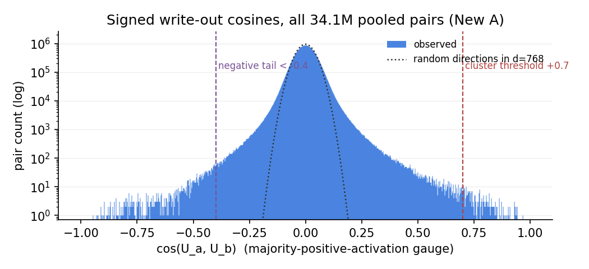
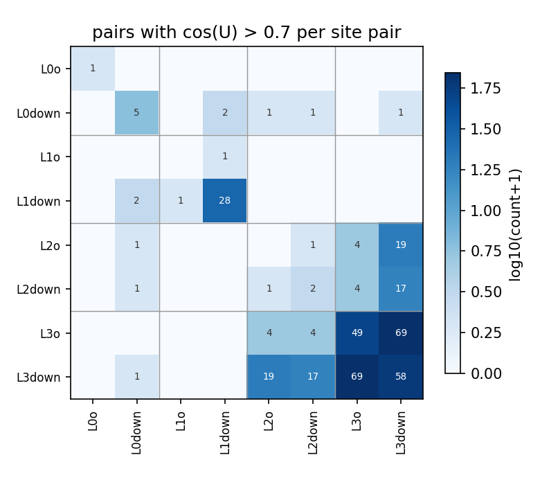
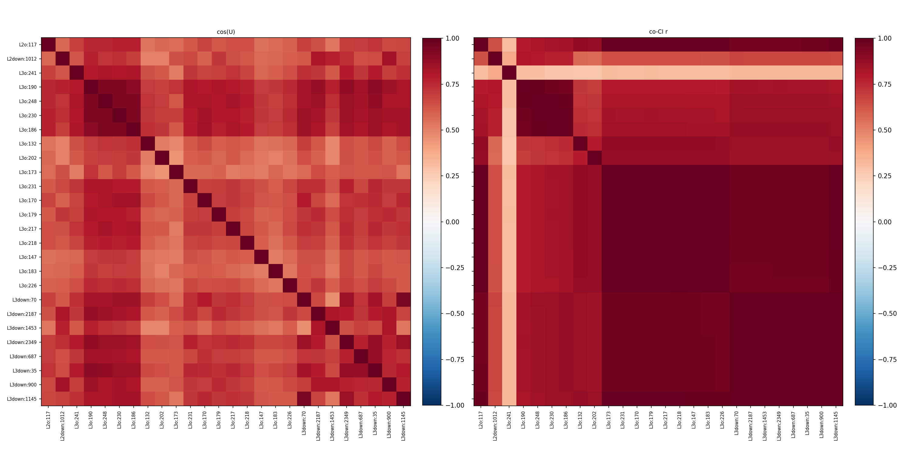
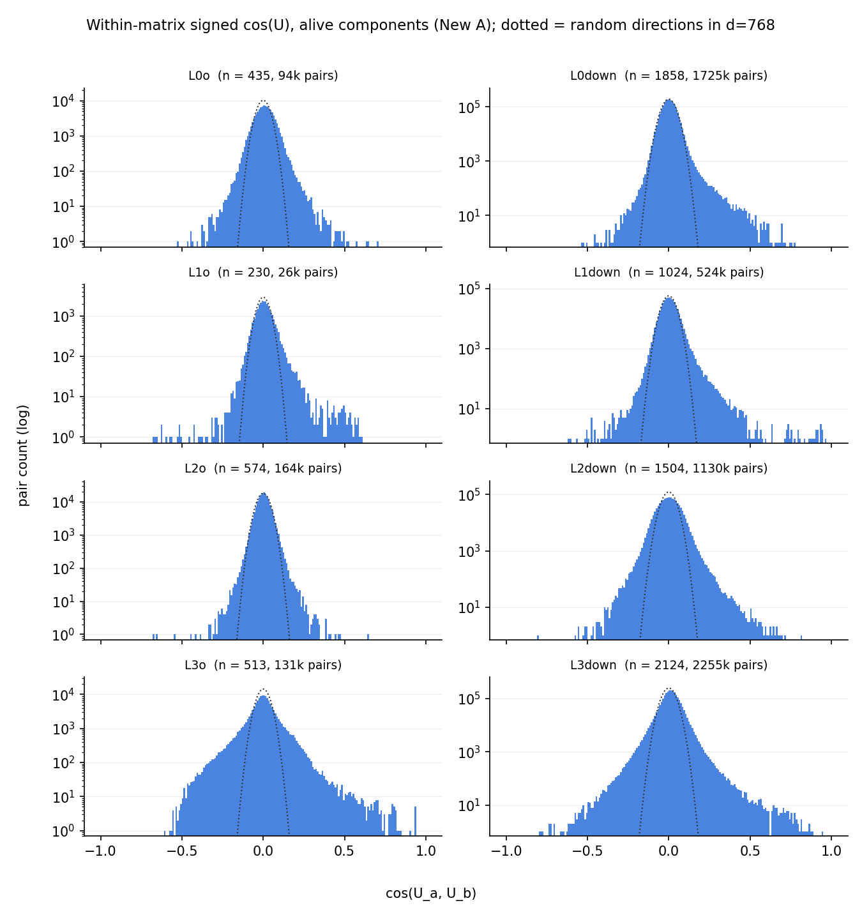
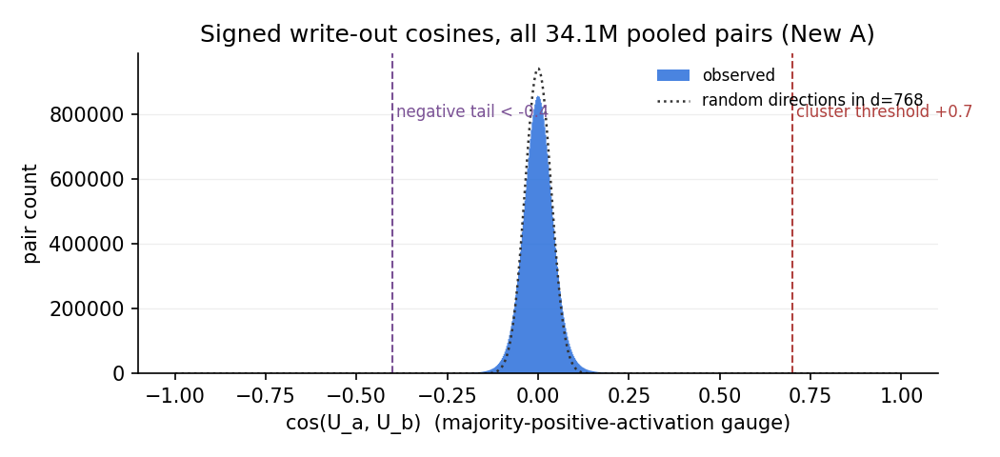
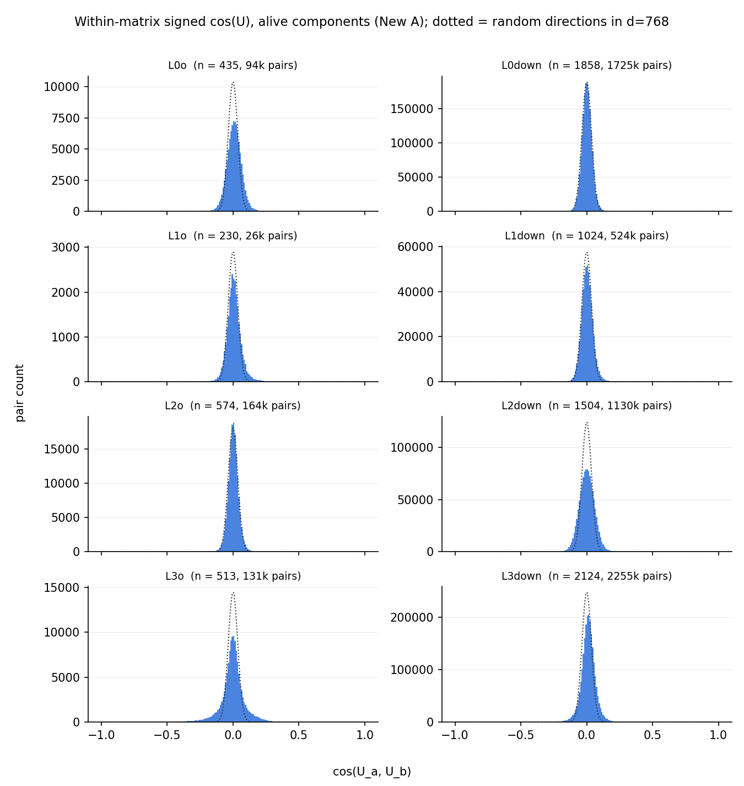

# New A (p-8383f5e5): signed write-out (U) cosines across the residual-stream-writing matrices

Write-side mirror of the signed read-in report (`../read-in/`): here the vectors compared are the components' **write directions** $U_c$ — the rank-one write into the residual stream is $a_c(x)\,U_c$ — for the 8 matrices that write to the stream, `h.<l>.attn.o_proj` and `h.<l>.mlp.down_proj`. Sign convention: each component's $(U_c, V_c)$ gauge is flipped so its input activation $V_c\cdot x$ is positive on the majority of tokens where it fires (CI > 0.1) — the interactive cross-widget convention. Under it, $\cos(U_a,U_b) > 0$ means two components write the same stream direction with the same polarity when active; $< 0$, opposite polarities.

## Headlines

- **170 of 8262 pooled components (2%) sit in
  60 clusters** chained at cos > +0.7
  (143 same-matrix, 71 same-layer
  cross-matrix, 49 cross-layer pairs above +0.7).
- **The negative tail is substantial: 1790 pairs below -0.4
  (148 below -0.7), strongest -0.95** —
  vs 3443 above +0.4 (263 above +0.7).
- **Signed unembedding alignment by layer** (clustered members' cos(U,
  unemb[own top token]), median): L0 +0.03 /
  L1 +0.00 / L2 +0.00 /
  L3 -0.02. (unemb = wte (tied — the unembedding).)

| token | n(L0 cl.) | n(upper cl.) | cos(L0, unemb) | cos(up, unemb) | cos(L0, up) |
|---|---|---|---|---|---|
| `'\n'` | 4 | 26 | +0.03 | -0.03 | -0.35 |
| `' of'` | 2 | 4 | -0.08 | -0.03 | -0.03 |

  (Auto-generated: token = the modal top-1 activating token of the cluster,
  L0/upper cluster = the largest all-layer-0 resp. no-layer-0 cluster with
  that modal token, directions = member means under the activation gauge.)
- **Same-matrix aligned pairs**: median co-CI
  r = 0.83, median signed read cos(V) = +0.03
  (3 pairs > +0.7, 26 < -0.1).

- **Write-direction sharing is ~4× rarer than read-direction sharing.** 263
  pairs above +0.7 (2% of components clustered) vs the read side's 1,089
  (11% clustered) on comparable pool sizes — components far more often read
  a common feature than write into a common channel.
- **Unlike the read side, the negative tail is a real population** — 1,790
  pairs < −0.4 and 148 < −0.7 (read side: 217 and 8) — and its strongest
  pairs are the boundary/sink machinery caught in the act of *write-then-
  cancel*: the L1 down_proj structural-boundary writers (2889, 778, 2028,
  486, 613 — top tokens `'\n'` `'.'` `' the'`) sit at cos −0.86..−0.95
  against L3 o_proj/down_proj EOS/pos-0 components that **co-fire with them**
  (co-CI r 0.79–0.97): anti-aligned writes on the same tokens, i.e. the
  layer-3 side actively cancels what layer 1 wrote — matching the
  endoftext-pos0 finding that attention 4 / late layers cancel the massive
  boundary vector before the unembedding.
- **Cluster 1 (26 comps, L2o/L2down/L3o/L3down, pos-0/EOS-dominated) is the
  cancellation side bundled**: the many components that co-write one shared
  direction opposite the L1 boundary writers.
- **No unembedding alignment anywhere**: layer medians +0.03/+0.00/+0.00/
  −0.02 — writers do not write along their own trigger token's unembedding,
  even in L3 (one step before the logits). Expected: the top activating token
  is the *input* trigger, and promoting it would predict repetition.
- **Aligned writers co-fire strongly but read near-orthogonally** (same-matrix
  median co-CI r 0.83, median cos(V) +0.03) — the mirror image of the read
  side (aligned readers write orthogonally, median |cos U| 0.08): shared
  write channel, split input features. The one true near-duplicate:
  L0down:1740 ↔ L0down:2092 (`http`/`https`, r 1.00, cos V +0.83, cos U
  +0.78).

## Method

All **alive** components (sample mean CI > 1e-6 over the 4,000 cached Pile
rows) of the 8 matrices whose $U$ factor writes to the residual stream —
`h.<l>.attn.o_proj` and `h.<l>.mlp.down_proj`, $l=0..3$ — pooled into one set
of **8262 components**; the reading matrices (q/k/v/c_fc) are the subject of
the read-in reports. For every pair the **signed** write alignment

$$\cos(U_a, U_b) = \frac{U_a \cdot U_b}{\lVert U_a\rVert\,\lVert U_b\rVert},$$

with each component first put in the majority-positive-activation gauge
(sign statistics over the same 2.05M tokens; `comp_signs()`). Unlike the read
side there is no gain-folding question: the write $a_c(x)\,U_c$ enters the
raw residual stream directly (no norm between $U$ and the stream), so raw $U$
is exactly the write direction. For random unit vectors in $d=768$ the signed
cosine is symmetric around 0 with
$\mathrm{std} = 1/\sqrt d \approx 0.036$
(and $E|\cos| = \sqrt{2/\pi d} \approx 0.029$); the dotted
line in the histogram is this analytic null scaled to the pair count.
Scripts: `hide/compute_signed.py` → `hide/cache/ucos_signed_newA.npz`,
`hide/report_signed.py` (this report); decomposition p-8383f5e5 of target
`t-9d2b8f02`.

## Distribution

| threshold | 0.4 | 0.5 | 0.6 | 0.7 | 0.8 | 0.9 |
|---|---|---|---|---|---|---|
| pairs above +thr | 3443 | 1348 | 614 | 263 | 85 | 17 |
| pairs below -thr | 1790 | 590 | 271 | 148 | 60 | 8 |

(34.1M pairs total; max +0.968, min
-0.946.)

Of the 263 pairs above +0.7: **143 same-matrix,
71 same-layer cross-matrix, 49
cross-layer**.

## Clusters (chaining at cos > +0.7)

Connected components of the cos > +0.7 graph: **60 clusters
with ≥ 2 members, covering 170 of 8262 components**. Clusters are
ordered by the number of distinct matrices involved (ties by size); members
by matrix, then mean CI descending.
Tables below: all clusters with ≥ 5 members in full, smaller ones compacted.
Per member: sample mean CI, share of CI>0.1 fires at position 0, signed
alignment of U with the member's own top token's unembedding ("unemb align"),
top activating tokens (share of summed CI). Below each table: member × member
heatmaps of cos(U) and co-CI r (cross-site values from
`hide/cache/cluster_ci_signed_newA.npz`), members in table order, both on
the same RdBu scale.

### Cluster 1 — n = 26 (L2down, L2o, L3down, L3o); edge cos +0.70–+0.94

| matrix | component | mean CI | pos-0 fires | unemb align | top tokens |
|---|---|---|---|---|---|
| L2o | 117 | 2.0e-03 | 100% | -0.03 | `'.'` `'\n'` `' the'` `','` `' of'` |
| L2down | 1012 | 5.0e-03 | 34% | -0.02 | `'<\|endoftext\|>'` `'\n'` `'.'` `','` `' the'` |
| L3o | 241 | 2.1e-02 | 8% | +0.02 | `' the'` `','` `'.'` `' of'` `'\n'` |
|  | 190 | 3.2e-03 | 58% | -0.02 | `'<\|endoftext\|>'` `'\n'` `' the'` `','` `'.'` |
|  | 248 | 3.0e-03 | 61% | +0.00 | `'<\|endoftext\|>'` `' the'` `'\n'` `'.'` `','` |
|  | 230 | 2.9e-03 | 65% | +0.01 | `'<\|endoftext\|>'` `'\n'` `' the'` `'.'` `','` |
|  | 186 | 2.8e-03 | 67% | +0.02 | `'<\|endoftext\|>'` `'\n'` `'.'` `' the'` `','` |
|  | 132 | 2.6e-03 | 69% | -0.00 | `' F'` `'F'` `'\n'` `'.'` `'f'` |
|  | 202 | 2.5e-03 | 71% | -0.02 | `' D'` `'D'` `'.'` `'d'` `'\n'` |
|  | 173 | 2.0e-03 | 98% | -0.09 | `'\n'` `'.'` `' the'` `','` `' of'` |
|  | 231 | 2.0e-03 | 98% | -0.02 | `'\n'` `'.'` `' the'` `','` `' of'` |
|  | 170 | 2.0e-03 | 98% | -0.05 | `'\n'` `'.'` `' the'` `','` `' of'` |
|  | 179 | 2.0e-03 | 98% | -0.05 | `'\n'` `'.'` `' the'` `','` `' of'` |
|  | 217 | 2.0e-03 | 98% | -0.02 | `'\n'` `'.'` `' the'` `','` `' of'` |
|  | 218 | 2.0e-03 | 98% | -0.03 | `'\n'` `'.'` `' the'` `','` `' of'` |
|  | 147 | 1.9e-03 | 99% | -0.01 | `'\n'` `'.'` `' the'` `','` `' of'` |
|  | 183 | 1.9e-03 | 99% | -0.04 | `'\n'` `'.'` `' the'` `','` `' of'` |
|  | 226 | 1.9e-03 | 100% | -0.04 | `'.'` `'\n'` `' the'` `','` `' of'` |
| L3down | 70 | 2.2e-03 | 88% | +0.01 | `'\n'` `'.'` `' the'` `','` `' of'` |
|  | 2187 | 2.1e-03 | 89% | -0.02 | `'\n'` `'.'` `' the'` `','` `' of'` |
|  | 1453 | 2.1e-03 | 89% | -0.03 | `'\n'` `'.'` `' the'` `','` `' of'` |
|  | 2349 | 2.1e-03 | 89% | -0.00 | `'\n'` `'.'` `' the'` `','` `' of'` |
|  | 687 | 2.1e-03 | 89% | -0.06 | `'\n'` `'.'` `' the'` `','` `' of'` |
|  | 35 | 2.1e-03 | 89% | -0.03 | `'\n'` `'.'` `' the'` `','` `' of'` |
|  | 900 | 2.1e-03 | 90% | -0.01 | `'\n'` `'.'` `' the'` `','` `' of'` |
|  | 1145 | 2.1e-03 | 91% | +0.02 | `'\n'` `'.'` `' the'` `','` `' of'` |

### Smaller clusters (3–4 members, 12 of them) — grouped by kind

| members | kind | top tokens (first member) |
|---|---|---|
| L0down:2825 L2o:317 L2down:2688 L3down:1787 | cross-layer | `'\n'` `'.'` `','` `' the'` |
| L2down:207 L3down:873 L3down:2189 | cross-layer | `'Category'` `'A'` `'1'` `' this'` |
| L2down:806 L3down:1166 L3down:1853 | cross-layer | `'1'` `'2'` `'0'` `'3'` |
| L2down:2099 L3down:1633 L3down:2171 | cross-layer | `'\n'` `'1'` `'2'` `'ref'` |
| L2down:2381 L3down:944 L3down:967 | cross-layer | `','` `' that'` `')'` `' used'` |
| L2down:2663 L3down:891 L3down:917 | cross-layer | `' and'` `' have'` `','` `' is'` |
| L0down:136 L0down:378 L0down:1058 L0down:1765 | same-matrix | `'\n'` `'.'` `','` `' the'` |
| L3down:685 L3down:1458 L3down:2128 L3down:2341 | same-matrix | `'.'` `'\n'` `','` `'}'` |
| L3down:69 L3down:243 L3down:3067 | same-matrix | `','` `'.'` `'\n'` `' ('` |
| L3down:253 L3down:490 L3down:1780 | same-matrix | `','` `' of'` `' in'` `' and'` |
| L3down:1526 L3down:1770 L3down:1938 | same-matrix | `'.'` `' the'` `','` `' of'` |
| L3down:1935 L3down:2048 L3down:2247 | same-matrix | `' number'` `' one'` `' out'` `' part'` |

### Pairs (45 two-member clusters) — the 30 highest-cos shown, grouped by kind

| pair | cos U | kind | co-CI r | cos V | top tokens (a / b) |
|---|---|---|---|---|---|
| L2o:456 ↔ L3down:134 | +0.84 | cross-layer | 0.72 |  | `' the'` `'.'` `','` / `'.'` `' the'` `','` |
| L2o:502 ↔ L3down:2449 | +0.81 | cross-layer | 0.77 |  | `' the'` `'.'` `','` / `'.'` `' the'` `'-'` |
| L2o:442 ↔ L3down:2263 | +0.81 | cross-layer | 0.74 |  | `' the'` `'.'` `','` / `'.'` `'-'` `' the'` |
| L2o:435 ↔ L3down:2092 | +0.80 | cross-layer | 0.71 |  | `' the'` `'.'` `','` / `'.'` `' the'` `','` |
| L2o:481 ↔ L3down:2460 | +0.79 | cross-layer | 0.82 |  | `' the'` `','` `'.'` / `' the'` `'-'` `'.'` |
| L2o:432 ↔ L3down:1939 | +0.78 | cross-layer | 0.72 |  | `' the'` `'.'` `','` / `'.'` `' the'` `'-'` |
| L2o:395 ↔ L3down:136 | +0.77 | cross-layer | 0.71 |  | `' the'` `'.'` `','` / `'.'` `'-'` `' the'` |
| L2o:399 ↔ L3down:329 | +0.77 | cross-layer | 0.73 |  | `' the'` `'.'` `','` / `'.'` `' the'` `','` |
| L2o:434 ↔ L3down:1066 | +0.76 | cross-layer | 0.79 |  | `' the'` `'.'` `','` / `' the'` `'-'` `'.'` |
| L2o:266 ↔ L3down:726 | +0.75 | cross-layer | 0.81 |  | `'.'` `'\n'` `','` / `'.'` `'\n'` `','` |
| L2o:461 ↔ L3down:638 | +0.74 | cross-layer | 0.77 |  | `' the'` `','` `'.'` / `' the'` `'.'` `','` |
| L2down:2172 ↔ L3down:2577 | +0.74 | cross-layer | 0.54 |  | `' obtained'` `' divided'` `' used'` / `','` `' and'` `' used'` |
| L2o:431 ↔ L3down:2788 | +0.73 | cross-layer | 0.76 |  | `' the'` `','` `'.'` / `' the'` `'.'` `','` |
| L2down:809 ↔ L3down:2702 | +0.73 | cross-layer | 0.48 |  | `' such'` `' well'` `' so'` / `','` `' such'` `' used'` |
| L2o:504 ↔ L3down:1619 | +0.72 | cross-layer | 0.60 |  | `' the'` `'.'` `','` / `'.'` `'-'` `' the'` |
| L1o:574 ↔ L1down:2110 | +0.81 | same-layer | 0.54 |  | `','` `' the'` `' of'` / `','` `' the'` `' and'` |
| L3o:478 ↔ L3down:180 | +0.78 | same-layer | 0.76 |  | `'\n'` `'1'` `' 0'` / `'\n'` `'1'` `' 0'` |
| L3o:504 ↔ L3down:2276 | +0.75 | same-layer | 0.72 |  | `' and'` `','` `' I'` / `' and'` `' I'` `' it'` |
| L3down:1075 ↔ L3down:3062 | +0.84 | same-matrix | 0.36 | -0.04 | `'\n'` `'.'` `' ('` / `'\n'` `'  '` `'.'` |
| L2down:767 ↔ L2down:1144 | +0.82 | same-matrix | 0.12 | -0.35 | `'.'` `' the'` `'\n'` / `'-'` `'.'` `'_'` |
| L3down:1521 ↔ L3down:2637 | +0.79 | same-matrix | 0.10 | +0.15 | `','` `' more'` `' if'` / `','` `')'` `'$'` |
| L0down:1740 ↔ L0down:2092 | +0.78 | same-matrix | 1.00 | +0.83 | `'http'` `'https'` `' http'` / `'http'` `'https'` `' http'` |
| L3down:1848 ↔ L3down:2616 | +0.77 | same-matrix | 0.33 | +0.15 | `'0'` `'1'` `'2'` / `' it'` `'1'` `'0'` |
| L3down:30 ↔ L3down:1384 | +0.76 | same-matrix | 0.19 | +0.51 | `' is'` `' of'` `' as'` / `' of'` `','` `' to'` |
| L3down:266 ↔ L3down:2771 | +0.75 | same-matrix | 0.38 | +0.26 | `'.'` `'\n\n'` `'\n'` / `'.'` `'\n'` `'\n\n'` |
| L3down:230 ↔ L3down:1456 | +0.74 | same-matrix | 0.11 | +0.09 | `' and'` `','` `' of'` / `' to'` `' than'` `' do'` |
| L3down:819 ↔ L3down:2111 | +0.74 | same-matrix | 0.53 | +0.37 | `'.'` `','` `' -'` / `','` `'_'` `' $'` |
| L3down:2224 ↔ L3down:2601 | +0.73 | same-matrix | 0.09 | -0.03 | `'\t'` `'____'` `'________________'` / `'x'` `'2'` `'p'` |
| L3down:1394 ↔ L3down:1566 | +0.73 | same-matrix | 0.22 | -0.01 | `' I'` `' and'` `' we'` / `' is'` `' be'` `' and'` |
| L3down:1777 ↔ L3down:2661 | +0.72 | same-matrix | 0.07 | +0.08 | `','` `' data'` `')'` / `'People'` `'Sportspeople'` `'icians'` |

## Negative tail (cos < -0.4)

1790 pairs write the same stream direction with **opposite** polarity at
cos < -0.4 (vs 3443 positive pairs above
+0.4); the strongest 25 (co-CI r from the signed cluster-CI Gram —
its members include every component in a pair below -0.4):

| pair | cos U | kind | co-CI r | cos V | top tokens (a / b) |
|---|---|---|---|---|---|
| L1down:2889 ↔ L3o:190 | -0.95 | cross-layer | 0.79 |  | `'\n'` `'.'` `' the'` / `'<\|endoftext\|>'` `'\n'` `' the'` |
| L1down:778 ↔ L3o:190 | -0.93 | cross-layer | 0.79 |  | `'\n'` `'.'` `' the'` / `'<\|endoftext\|>'` `'\n'` `' the'` |
| L1down:2889 ↔ L3o:230 | -0.93 | cross-layer | 0.83 |  | `'\n'` `'.'` `' the'` / `'<\|endoftext\|>'` `'\n'` `' the'` |
| L1down:2889 ↔ L3o:248 | -0.92 | cross-layer | 0.81 |  | `'\n'` `'.'` `' the'` / `'<\|endoftext\|>'` `' the'` `'\n'` |
| L1down:778 ↔ L3o:230 | -0.91 | cross-layer | 0.83 |  | `'\n'` `'.'` `' the'` / `'<\|endoftext\|>'` `'\n'` `' the'` |
| L1down:778 ↔ L3o:248 | -0.91 | cross-layer | 0.81 |  | `'\n'` `'.'` `' the'` / `'<\|endoftext\|>'` `' the'` `'\n'` |
| L1down:2028 ↔ L3o:190 | -0.91 | cross-layer | 0.83 |  | `'\n'` `'.'` `' the'` / `'<\|endoftext\|>'` `'\n'` `' the'` |
| L1down:2028 ↔ L3o:230 | -0.90 | cross-layer | 0.87 |  | `'\n'` `'.'` `' the'` / `'<\|endoftext\|>'` `'\n'` `' the'` |
| L1down:486 ↔ L3o:190 | -0.90 | cross-layer | 0.83 |  | `'\n'` `'.'` `' the'` / `'<\|endoftext\|>'` `'\n'` `' the'` |
| L1down:2889 ↔ L3o:186 | -0.90 | cross-layer | 0.84 |  | `'\n'` `'.'` `' the'` / `'<\|endoftext\|>'` `'\n'` `'.'` |
| L1down:613 ↔ L3o:190 | -0.90 | cross-layer | 0.79 |  | `'\n'` `'.'` `' the'` / `'<\|endoftext\|>'` `'\n'` `' the'` |
| L1down:2028 ↔ L3o:248 | -0.90 | cross-layer | 0.85 |  | `'\n'` `'.'` `' the'` / `'<\|endoftext\|>'` `' the'` `'\n'` |
| L1down:2028 ↔ L3o:186 | -0.89 | cross-layer | 0.87 |  | `'\n'` `'.'` `' the'` / `'<\|endoftext\|>'` `'\n'` `'.'` |
| L1down:778 ↔ L3o:186 | -0.88 | cross-layer | 0.84 |  | `'\n'` `'.'` `' the'` / `'<\|endoftext\|>'` `'\n'` `'.'` |
| L1down:778 ↔ L3down:2187 | -0.88 | cross-layer | 0.96 |  | `'\n'` `'.'` `' the'` / `'\n'` `'.'` `' the'` |
| L1down:613 ↔ L3o:230 | -0.88 | cross-layer | 0.83 |  | `'\n'` `'.'` `' the'` / `'<\|endoftext\|>'` `'\n'` `' the'` |
| L1down:2889 ↔ L3down:2349 | -0.88 | cross-layer | 0.96 |  | `'\n'` `'.'` `' the'` / `'\n'` `'.'` `' the'` |
| L1down:486 ↔ L3o:248 | -0.87 | cross-layer | 0.85 |  | `'\n'` `'.'` `' the'` / `'<\|endoftext\|>'` `' the'` `'\n'` |
| L1down:486 ↔ L3o:230 | -0.87 | cross-layer | 0.86 |  | `'\n'` `'.'` `' the'` / `'<\|endoftext\|>'` `'\n'` `' the'` |
| L1down:778 ↔ L3down:2349 | -0.87 | cross-layer | 0.96 |  | `'\n'` `'.'` `' the'` / `'\n'` `'.'` `' the'` |
| L1down:613 ↔ L3o:248 | -0.87 | cross-layer | 0.81 |  | `'\n'` `'.'` `' the'` / `'<\|endoftext\|>'` `' the'` `'\n'` |
| L1down:2889 ↔ L3down:35 | -0.87 | cross-layer | 0.97 |  | `'\n'` `'.'` `' the'` / `'\n'` `'.'` `' the'` |
| L1down:2889 ↔ L3down:2187 | -0.87 | cross-layer | 0.96 |  | `'\n'` `'.'` `' the'` / `'\n'` `'.'` `' the'` |
| L1down:778 ↔ L3down:900 | -0.86 | cross-layer | 0.97 |  | `'\n'` `'.'` `' the'` / `'\n'` `'.'` `' the'` |
| L1down:2352 ↔ L3o:190 | -0.86 | cross-layer | 0.96 |  | `'<\|endoftext\|>'` `'\n'` `'.'` / `'<\|endoftext\|>'` `'\n'` `' the'` |

## Do aligned writers co-fire / co-read?

For the 143 **same-matrix** pairs above +0.7: median co-CI
r = 0.83 (quartiles 0.38–0.99;
53 pairs > 0.9, 10 pairs < 0.1) and median
signed read cos(V) = +0.03 (3 pairs
> +0.7, 73 with |cos V| < 0.1,
26 < -0.1). The 120 **cross-site** pairs above
+0.7 have median co-CI r = 0.83
(quartiles 0.67–0.96;
31 > 0.9, 4 < 0.1;
from the cross-site CI Gram of all clustered components, Modal job
`hide/cluster_ci_signed_modal.py` → `hide/cache/cluster_ci_signed_newA.npz`).
The 1790 negative-tail pairs with a defined r have median co-CI
r = -0.00
(1033 of them negative).
V factors of different sites live in different input spaces, so no cross-site
cos(V) is defined.

## Within-matrix cosine distributions

One panel per matrix: the distribution of signed cos(U) over all pairs of
alive components *within* that matrix (log count; dotted line = the analytic
random-directions null in $d = 768$, scaled to the panel's pair count).

## Linear-scale versions

The same distribution plots with a linear y axis (the log plots emphasize
the tails; these show where the actual mass sits).

