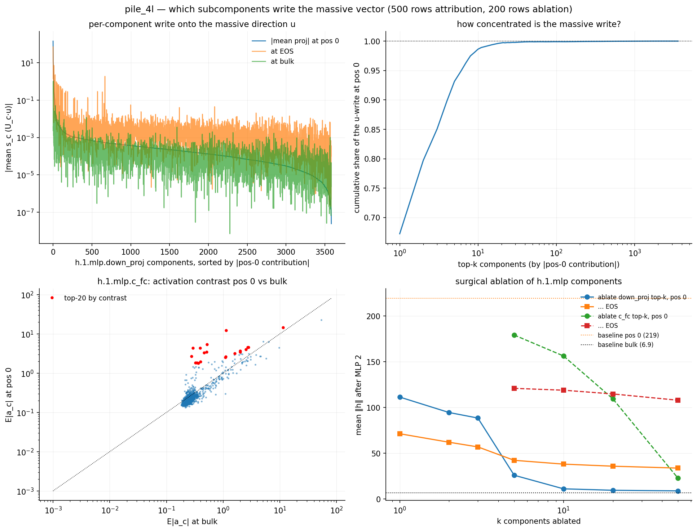
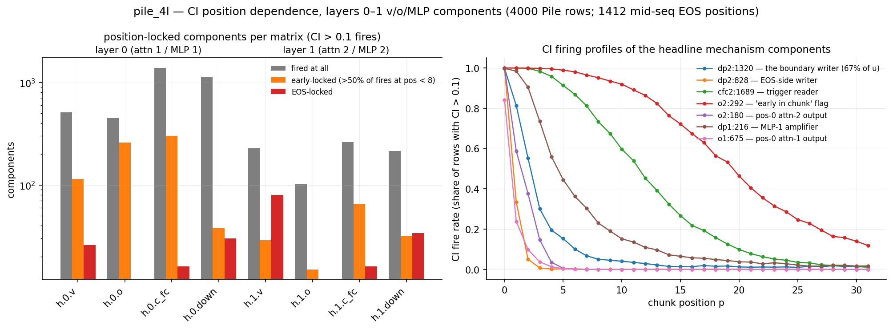

# Which VPD subcomponents implement the position-0 mechanism?

Session notes, 2026-08-31. Follow-up to [pos0_mechanism.md](pos0_mechanism.md),
which traced the *activation-level* chain (attn-1 truncation signal → MLP-1
amplification → attn-2 second copy → MLP-2 massive vector). Here we map each
stage onto the decomposition's subcomponents, two ways:

- **Mechanical attribution** (`hide/pos0_components.py`, local): for a
  decomposed Linear with input $x$, component $c$ contributes exactly
  $s_c \vec U_c$ to the output, $s_c = \vec V_c \cdot x$. So the write onto any
  direction $d$ decomposes exactly: $y \cdot d = \sum_c s_c (\vec U_c \cdot d)$.
  We tabulate mean per-component shares at position-0 / mid-seq-EOS / bulk
  samples, for $d = u$ (the massive direction) and the per-stage mean-difference
  directions; verified by **surgical ablation** (subtract
  $\mathrm{outer}(\vec U_c, \vec V_c)$ of the top-$k$ components from the actual
  weight, rerun).
- **Causal importance** (`hide/pos0_ci_compute_modal.py` → Modal A10G ~4 min →
  `hide/cache/pos0_ci.npz`; tables/figure `hide/pos0_ci_report.py`): per-position
  CI (lower_leaky) fire counts for **all** components of the layer-0/1
  v/o/c_fc/down_proj matrices over 4,000 Pile rows (2.05M tokens, 1,412 mid-seq
  EOS) — the complement of pile-qk-comps' q/k-only `pos_ci.npz`. *Early-locked*
  = ≥ 50 fires (CI > 0.1) and > 50% of them at chunk position < 8; *EOS-locked*
  analogously at EOS positions.

Labels below are from the local autointerp `interp.db` (the vaguer run — but
here they match the mechanism strikingly well).

## Headline: the massive vector is written by one component

The MLP-2 down-projection write onto the massive direction $u$ (total ≈ +219 at
position 0, +121 at EOS, +1.5 at bulk) is extremely concentrated:

| `h.1.mlp.down_proj` | pos 0 | EOS | bulk | label |
|---|---|---|---|---|
| **1320** | **+144.8** | **+71.1** | −0.00 | *"marks significant token boundaries and document starts"* [medium] |
| 2958 | +26.9 | +14.2 | −0.00 | "detects structural boundaries and formatting markers" |
| 686 | +11.5 | +9.5 | −0.00 | "document boundary and structural transition detection" |
| 1217 | +10.2 | +1.4 | −1.03 | "produces content words across diverse text domains" |
| 3478 | +7.3 | +3.4 | +0.03 | "detects and produces technical/scientific numerical tokens" |
| 1422 | +3.6 | +6.6 | +0.00 | "detects document/content boundaries and structure markers" |
| 828 | +0.6 | **+7.3** | +0.01 | "marks structural boundaries between document sections" |

Top-1 = 67% of the u-write, top-5 = 93%, top-10 = 98.6%. **Component 1320 is
the boundary writer**: CI fire rate 1.00 at position 0 *and* 1.00 at EOS
(graded decay over early positions: 0.81 at p=1, 0.55 at p=2; bulk rate 1.5% —
plausibly the paragraph-`'\n'` third sink site from report.md §5). The same
top-3 (1320, 2958, 686) write both sinks — the direct component-level
realization of the shared massive direction ($\cos = 0.96$) — while a few
specialize: 828 is EOS-side (+7.3 vs +0.6), and 3320 / 2120 write *negatively*
at EOS only ("document boundary detection", "new section initiation" [high]).

**Ablation** (200 rows; mean ‖h‖ after MLP 2, baseline pos 0 = 219.5, EOS =
125.4, bulk = 6.9): removing the top-10 down_proj components → pos 0 **11.2**,
EOS 38.2, bulk 7.9; random-20 control → no change (219.5). The position-0
massive vector is fully carried by ~10 nameable components; bulk behavior is
untouched.

## The trigger side (MLP-2 c_fc): distributed, and separate for pos-0 vs EOS

Top c_fc components by activation contrast $E|a_c|$ (pos 0 vs bulk):
**1689** (12.3 vs 1.1; *"suppresses tokens at structural boundaries"*; CI rate
1.00 at p = 0–1, 65 early-locked c_fc components total), 743, 600, 1893, 2807,
1608, 2396, 2673 — all labeled structural-boundary detectors. Ablating the
top-50 c_fc components kills the position-0 vector (219 → 22.9) but needs all
50 (top-20 only halves it) — the AND-gate's *input reading* is spread over
~dozens of c_fc components, unlike the write.

Crucially, **EOS is untouched by the pos-0 c_fc ablation** (125 → 108 at
top-50): the EOS trigger is read by a *disjoint* set of 16 EOS-locked c_fc
components (1130, 1040, 545, … — CI fire rate 1.00 at EOS, ~0 elsewhere). Two
trigger circuits (positional truncation signal vs EOS token identity), one
shared writer set — exactly the picture the activation-level analysis
suggested.

## Stage by stage upstream

- **Attention-1 creation (layer 0).** The q/k/v *pre-activations* are
  position-blind (their input is the embedding stream); position enters between
  v_proj and o_proj, inside the softmax. Consistently, the mean-difference
  attribution finds **no dedicated component**: the only o_proj component with
  a sizable projection on the attn-1 mean-diff direction is 389 — but it is the
  always-on dense component (mean CI 0.82, fires on 89% of *all* tokens,
  position-flat). The truncation signal at this stage is a diffuse shift
  distributed over many components — matching the per-head probe result (six
  heads × AUC ≈ 0.55–0.61 each). The CI network nevertheless *gates* strongly
  here: 260 of the 449 firing o_proj components and 115 v_proj components are
  early-locked (e.g. o:675 fires at rate 0.84 at pos 0, ~0 at bulk) — the
  decomposition assigns much of layer-0 attention's output specifically to
  early positions without any single component being "the" position signal.
- **MLP-1 amplification.** First stage with a dominant nameable component:
  `h.0.mlp.down_proj:216` (*"detects structural delimiters and punctuation
  boundaries"* [high]) carries ~1/3 of the mean-difference write, CI fire rate
  1.00/0.98/0.90 at p = 0/1/2 decaying to 0.0001 at bulk; supported by 2827,
  1480, 883, 995, 1471, 3174, 1755 (38 early-locked down_proj components, 302
  early-locked c_fc components).
- **Attention-2 second copy.** Here the decomposition has a *single dedicated
  positional component*: **`h.1.attn.o_proj:292`** — $|\cos(\vec U_{292},
  \hat\Delta_{a2})| = 0.98$ (its output direction essentially *is* the attn-2
  position-0 mean-difference direction), carrying +3.6 of the +4.2 total
  projection; CI fire rate 1.00 for p = 0–7, decaying to ~0.1 by p ≈ 30, bulk
  0.0003, EOS only 0.03 — a clean **"I am early in the chunk" flag**, and with
  86k fires the third-most-active component of its matrix. Sharper pos-0
  helpers: o:180, 552, 336, 923 (rate 1.00 at p=0, gone by p≈4); value side
  v:602, 127 (rate 1.00 at p = 0–1; 29 early-locked). This is also the layer
  whose q-side cold-start machinery was already found in pile-qk-comps
  (7/15 alive L1 q components early-locked).
- **EOS parallel chain.** Every matrix except the two o_proj has an EOS-locked
  block (L0: v 26, c_fc 16, down 30; L1: v 80, c_fc 16, down 34 — plus the
  known L1 k 27-component EOS group), converging on the shared writers
  (1320/2958/686) plus the EOS-specialists (828, 3320, 2120).

## Summary

$$\underbrace{\text{diffuse truncation shift}}_{\text{L0 o/v, no dedicated comp (260 CI-gated)}}
\;\to\; \underbrace{\text{dp}_1\text{:}216 + \sim 8}_{\text{MLP-1 amplifier}}
\;\to\; \underbrace{\text{o}_2\text{:}292}_{\text{"early" flag}}
\;+\; \underbrace{\text{cfc}_2\text{: }1689, 743, \ldots\ (\sim 50)}_{\text{AND-gate readers}}
\;\to\; \underbrace{\text{dp}_2\text{:}1320\ (+2958, 686)}_{\text{writes } 219\,u}$$

The division of labor is striking: *detection* is distributed (hundreds of
CI-gated components at layer 0, ~50 trigger readers), *representation* becomes
progressively more dedicated (one flag component at attention 2), and the
*write* is essentially a single component whose autointerp label already said
what it does: "marks significant token boundaries and document starts."

## Files

- `hide/pos0_components.py` → `pos0_components.png`,
  `hide/cache/pos0_components.npz` (attribution vectors + directions u,
  Δ_attn1, Δ_mlp1, Δ_attn2); ~3 min local GPU
- `hide/pos0_ci_compute_modal.py` → Modal (`modal run …`, ~4 min A10G) →
  `hide/cache/pos0_ci.npz` (72 MB: per-position CI fire counts/sums + EOS
  aggregates, all components, layers 0–1 v/o/c_fc/down)
- `hide/pos0_ci_report.py` → `pos0_ci.png` + the counts/profile tables
