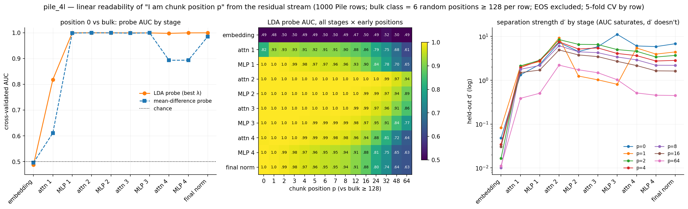
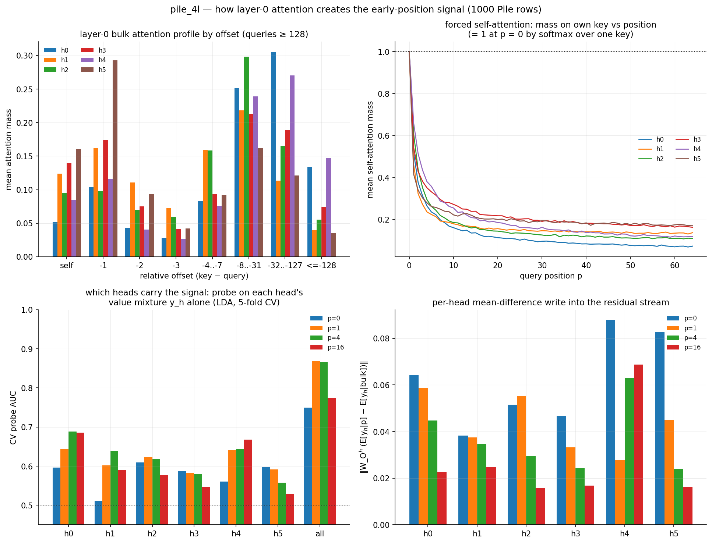
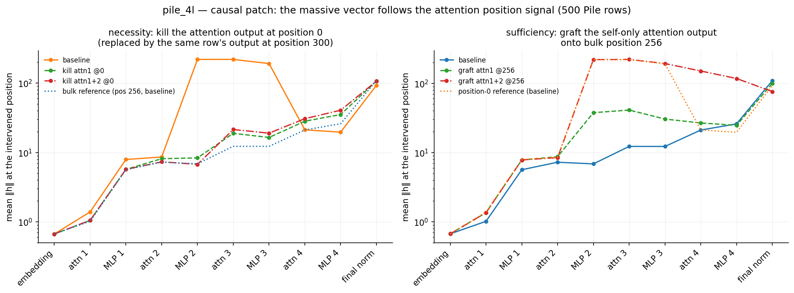

# How pile_4l knows it is at position 0

Session notes, 2026-08-29. Follow-up to [report.md](report.md), which found that the
model gives every chunk's first token (and, more weakly, mid-sequence EOS) the
massive-activation sink treatment. Question: **by what mechanism does the model
distinguish position 0 from every other position?** There are no positional
embeddings, so nothing in the architecture hands the model a position signal.

**Summary of the answer.** Position information enters exactly where it must:
in layer-1 attention, through the causal mask. At query position $p$ the softmax
runs over only $p+1$ keys, so the value mixture at early positions is *truncated* —
at $p=0$ it degenerates to the token's own value. Because every layer-0 head has a
position-structured (local) attention profile, this truncation shifts the output
distribution, creating a weak but genuine linear "I am early" signal spread across
all six heads. MLP 1 amplifies it, layer-2 attention (whose output is truncated the
same way) adds an independent second copy, and MLP 2 fires a fixed massive vector
— the same direction used for the EOS sink — iff both copies are present. Causal
patches confirm the chain in both directions: deleting the layer-1 attention output
at position 0 abolishes the massive vector; grafting self-only attention outputs
onto a mid-sequence position recreates it at full strength.

## 1. Where position information can and cannot come from

Constraints (all verified in `prev_paper/model_def.py`):

- The embedding is position-independent: $h^{(0)}_p = W_E[t_p]$.
- MLPs and RMSNorms act per position — they can *amplify* position information
  already in the stream, never create it.
- RoPE enters only inside the attention logits: $q_p^\top R_{p-j} k_j$ depends on
  the *relative* offset $p-j$, so it too gives no absolute-position readout by itself.
- The only cross-position operation is attention:

$$\mathrm{out}_p = \sum_h W_O^h \sum_{j \le p} a^{(h)}_{pj}\, v_j, \qquad
  a^{(h)}_{p\cdot} = \mathrm{softmax}_{j \le p}\!\left(\tfrac{q_p^\top R_{p-j} k_j}{\sqrt{d_h}}\right).$$

The causal mask makes the softmax support size $p+1$. That is the *only*
absolute-position dependence in the whole network, and it is an "absence" signal:
a query at small $p$ notices that the keys its head would normally attend to do
not exist. The extreme case is forced self-attention,

$$\mathrm{out}_0 = \sum_h W_O^h v_0 = W_O\, W_V\, \widetilde{h}^{(0)}_0
  \quad\text{(softmax over one key, values are not rotated),}$$

a deterministic function of the token at position 0 — the intervention scripts
exploit this closed form.

Important control: chunk boundaries fall at random points inside documents
(74.6% of chunks contain no EOS), so **the token distribution is identical at
every chunk position**. Any position readability is real position information,
not token statistics.

## 2. When "I am position p" becomes linearly readable: `pos0_probe.png`

`hide/pos0_probe.py` (1,000 Pile rows; forward pass cached to
`hide/cache/pos0_probe_acts.npz`, 328 MB, gitignored). For every stage and every
early position $p \in \{0..8, 12, 16, 24, 32, 48, 64\}$, a linear probe separates
"residual vector at position $p$" from "residual vector at a random bulk position
$\ge 128$" (6 per row), 5-fold cross-validated by row, EOS tokens excluded.
Two probes: shrinkage LDA, $w = (\Sigma_\text{bulk} + \lambda\,\overline{\sigma^2} I)^{-1}
(\mu_p - \mu_\text{bulk})$ with $\lambda$ from a small grid, and the plain
mean-difference direction. Reported: CV AUC and the held-out separation
$d' = |m_1 - m_0| / \sqrt{(v_1+v_0)/2}$ of the projected scores ($\mathrm{AUC} =
\Phi(d'/\sqrt2)$ for Gaussian classes; $d'$ keeps resolving after AUC saturates).

CV AUC (LDA) for $p=0$, and $d'$, by stage:

| stage | AUC p=0 | d′ p=0 | AUC p=64 | mean-diff AUC p=0 |
|---|---|---|---|---|
| after embedding | 0.487 | 0.05 | 0.485 | 0.496 |
| after attention 1 | 0.818 | 1.32 | 0.612 | 0.611 |
| after MLP 1 | 1.000 | 2.30 | 0.650 | 0.999 |
| after attention 2 | 1.000 | 7.23 | 0.939 | 1.000 |
| after MLP 2 | 1.000 | 4.53* | 0.892 | 1.000 |
| after MLP 3 | 1.000 | 11.2 | 0.771 | 1.000 |
| after attention 4 | 0.998 | 6.07 | 0.643 | 0.894 |
| after final norm | 1.000 | 6.81 | 0.628 | 0.985 |

Readings:

- **After the embedding: exact chance** (AUC 0.47–0.52 across all $p$) — the
  control works; no position information exists before attention.
- **Attention 1 creates the signal.** One attention sublayer takes $p=0$ from
  chance to AUC 0.82 ($d' = 1.3$), and the signal is graded in $p$: 0.93 at
  $p=1$–3, decaying smoothly to 0.61 at $p=64$. "Position 0" is not a binary
  flag but the extreme of an early-position continuum — consistent with
  position 1 sometimes receiving near-full sink treatment (report.md §5).
- **The attention-1 signal lives in low-variance directions**: the plain
  mean-difference probe gets only AUC 0.61 where LDA gets 0.82 — whitening by
  the bulk covariance is what exposes it. After MLP 1 the two agree (1.000 vs
  0.999): the MLP has rotated/amplified the signal into large mean shifts.
- **Amplification chain**: $d'$ at $p=0$ goes 0.05 → 1.3 (attn 1) → 2.3
  (MLP 1) → 7.2 (attn 2) → massive vector at MLP 2. From attention 2 onward the
  probe is essentially perfect out to $p \approx 24$.
- \* The $d'$ dips at MLP 2–MLP 3 for $p=0$ and especially $p=1$ (0.8–1.25
  despite AUC ≈ 1.0) are a bimodality artifact: some positions get the massive
  vector and some don't, so the projected class variance explodes while the
  classes stay perfectly ordered. AUC is the trustworthy number there.

**Massive-vector direction bonus** (follow-up 1 of report.md §8): the after-MLP-2
vectors are one fixed direction — mean pairwise cosine **0.997** among the 999
position-0 vectors, **0.999** among the 335 mid-sequence-EOS vectors, and
$\cos(\bar u_{\text{pos0}}, \bar u_{\text{EOS}}) = \mathbf{0.962}$: the
**position-0 sink and the EOS sink build the same massive vector**, just at
different scale (≈ 220 vs ≈ 128).

## 3. How attention 1 creates the signal: `pos0_attn1_mechanism.png`

`hide/pos0_attn1_mechanism.py` (1,000 rows; layer-0 attention matrices
recomputed as in `attention_mass.py`).

- **Every layer-0 head is local / position-structured.** Bulk offset profiles
  (queries ≥ 128): mass on the previous token ranges 0.10–0.29 (h5 is closest
  to a previous-token head at 0.29), and every head puts 50–80% of its mass
  within the last 32 tokens. None is anywhere near uniform — so for every head
  the truncated softmax at small $p$ is a real distribution shift.
- **Forced self-attention relaxes slowly.** Mean self-mass is 1.0 at $p=0$ by
  construction, ~0.5 at $p=1$–2, and approaches each head's bulk level
  (0.05–0.16) only around $p \approx 30$–60 — matching the smooth decay of
  probe AUC with $p$.
- **The signal is distributed across heads.** Probing each head's value mixture
  $y_h$ alone gives AUC 0.51–0.61 at $p=0$ (no single "position head" in layer
  0); all heads jointly give 0.75, and the full post-attention residual 0.82.
  Each head contributes its own small "my usual keys are missing" deviation and
  the probe sums six of them.
- Per-head mean-difference writes $\|W_O^h(\mathbb{E}[y_h|p] -
  \mathbb{E}[y_h|\text{bulk}])\|$ are 0.04–0.09 at $p=0$ (h4, h5 largest),
  full-layer 0.18 — small against a median post-attn-1 residual norm of ~1.0,
  which is why the mean-difference probe alone underperforms at this stage.
- Curious detail, consistent across both scripts: $p=0$ is slightly *less*
  readable after attention 1 than $p=1$–7 (0.82 vs 0.93). At $p=0$ the output
  is a bare single-token value — its within-class variance is the full spread
  of per-token values — whereas at small $p>0$ the output is a low-entropy
  mixture with the same truncation signature but less token noise.

## 4. Causal test: kill and graft the attention position signal: `pos0_patch.png`

`hide/pos0_patch.py` (500 rows). Interventions edit one position of one or two
attention sublayers' outputs via forward hooks; everything downstream reruns.

- **kill @ 0** (necessity): replace the attention output at position 0 with the
  same row's attention output at bulk position 300 — position 0 now receives a
  bulk-typical mixture instead of its self-only value. Variants: attn 1 only;
  attn 1 + attn 2.
- **graft @ 256** (sufficiency): replace the attention output at bulk position
  256 with the self-only output $W_O W_V \widetilde h_{256}$ for the token that
  sits there — position 256 now receives exactly what position 0 mechanically
  gets. Variants: attn 1 only; attn 1 + attn 2.

Mean $\|h\|$ after MLP 2 at the intervened position, and mean projection onto
the massive direction $u$:

| condition | ‖h‖ after MLP 2 | proj. on u |
|---|---|---|
| position 0, baseline | **219.3** | 219.2 |
| position 0, kill attn 1 | 8.3 | 1.4 |
| position 0, kill attn 1+2 | 6.7 | 1.5 |
| position 256, baseline | 6.9 | 1.4 |
| position 256, graft attn 1 | 37.6 | 35.2 |
| position 256, graft attn 1+2 | **219.4** | 219.3 |

- **Necessary:** killing the layer-1 attention output at position 0 alone
  abolishes the massive vector (219 → 8.3 ≈ bulk 6.9; projection 219 → 1.4).
  Everything downstream that makes position 0 special descends from that one
  sublayer's output. Notably, layer-2 attention at position 0 is *still*
  self-only in this run (that can't be patched away — it's the causal mask),
  yet its signal alone triggers nothing.
- **Sufficient:** grafting self-only outputs for attn 1 + attn 2 onto position
  256 reproduces the massive vector *exactly* (219.4, fully along $u$). The
  attn-1 graft alone gets a partial response (37.6).
- Together: **MLP 2's trigger is an AND-like nonlinear gate** on two copies of
  the position signal — the (MLP-1-amplified) layer-1 copy and the layer-2
  copy. Either alone produces at most a ~15% response; both together saturate
  it. A sensible design: each single copy is a noisy "few keys available"
  statistic, and requiring both suppresses false positives at ordinary
  positions.
- Bonus consistency check: in the graft run the massive vector *persists*
  through attention 4 (150 after attn 4, vs 21 at real position 0) — the
  attention-4 cancellation mechanism (report.md §7, candidate L3h1) is itself
  position-tuned and only partially recognizes a fake sink at position 256.

## 5. Relation to the L0 position-dependent CI components

`pile-qk-comps/L0/L0_position_dependence.md` found a handful of layer-0 q/k
subcomponents whose *causal importance* fires almost only at chunk positions
0–8 (the 'the' q-components, determiner/number k-components, etc.). Note the
input to layer-0 q/k is the pure embedding stream — position-independent — so
those components' pre-softmax activations cannot depend on position; the
position dependence lives in the decomposition's CI network (which reads the
whole sequence) deciding the components only *matter* early. That is exactly
what §1–§3 explain: layer-0 attention outputs are position-dependent *after*
the softmax truncation even though q/k/v activations are not, so a component's
contribution to the model's output can be early-position-specific. The CI
profiles are the decomposition's reflection of the mechanism traced here, not
an independent position signal.

## 6. Which subcomponents implement this?

Answered in the follow-up [pos0_components.md](pos0_components.md): detection
is distributed (no dedicated layer-0 component; ~260 CI-early-locked o_proj
components), MLP 1's amplifier is led by `h.0.mlp.down_proj:216`, the attention-2
copy is essentially one dedicated flag component (`h.1.attn.o_proj:292`, cos 0.98
with the copy direction), the MLP-2 trigger is read by ~50 c_fc components, and
the massive write itself is dominated by a single component,
`h.1.mlp.down_proj:1320` (67% of the write, shared with the EOS sink) —
verified by surgical ablation.

## 7. Files

- `pos0_mechanism_explained.md` — the chat explanation of §1 and of the
  offset-resolved mean-shift argument, with rendered equations (in particular
  the $\Delta\mu(p)$ decomposition, which is not spelled out elsewhere).
- `pos0_variance_signal.md` — **important refinement (2026-08-31)**: the
  attention-1 signal is only partly a mean shift. Linda's bimodal-code
  hypothesis, tested in two rounds, is confirmed in essence: projection
  pursuit finds ≥ 3 mutually orthogonal directions in the pre-o_proj value
  mixture along which the pos-0 distribution is genuinely bimodal (modes near
  ±c, zero mean shift, held-out-validated), readable only by rectification —
  binary token-class features serving as the hypothesized ±1 dimensions.
  Final reliability (99.8% pos-0 vs 1.9% pos-1 firing) comes from aggregating
  these channels + the cross-layer AND — see the Addenda there.

- `hide/pos0_probe.py` → `pos0_probe.png`, cache
  `hide/cache/pos0_probe_acts.npz` (~330 MB, float16 activations at 21
  positions × 10 stages, plus mid-seq EOS vectors; gitignored)
- `hide/pos0_attn1_mechanism.py` → `pos0_attn1_mechanism.png`
- `hide/pos0_patch.py` → `pos0_patch.png`
- All ~1–2 min each on the local GPU (default Python 3.11, `load.py` path).
