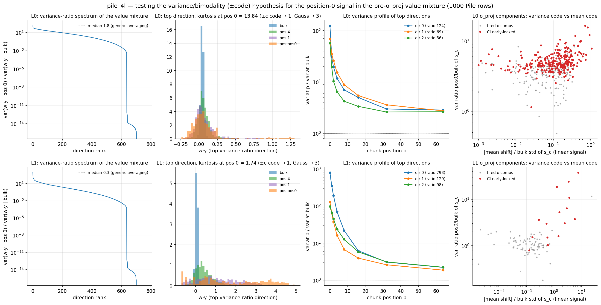

# The variance/bimodality position code (Linda's hypothesis, tested)

Session notes, 2026-08-31. Hypothesis (Linda, from first principles, before
looking at the model): the mean-shift account of the attention-1 position
signal ([pos0_mechanism_explained.md](pos0_mechanism_explained.md) §1) seems
too weak to explain the model's sharp position-0 behavior. Instead there could
be directions in value space where per-token values are $\pm c$-like, so that
the *mixture*

$$w \cdot y_p = \sum_{j \le p} a_{pj}\, (w \cdot v_j)$$

is exactly $\pm c$ at $p = 0$ (a single term), but concentrates near its mean
for large $p$ (averaging). No mean difference — a **variance/bimodality code**
— invisible to linear probes but readable by an MLP through an even
nonlinearity; with $k$ such dimensions, false positives at $p \ge 1$ fall like
$2^{-k}$.

Test (`hide/pos0_variance_signal.py`, 1,000 Pile rows, EOS excluded): capture
the o_proj *input* $y$ (concatenated per-head value mixtures) for layers 0–1;
solve the generalized eigenproblem
$\Sigma_{\text{pos0}}\, w = \lambda\, (\Sigma_{\text{bulk}} + \epsilon I)\, w$
to find the directions maximizing the variance ratio
$\lambda = \mathrm{var}(w \cdot y \mid p{=}0)/\mathrm{var}(w \cdot y \mid \text{bulk})$;
inspect their position profiles, kurtosis (two-point $\pm c$ → 1, Gaussian → 3),
and the **folded** readout $|w \cdot y - \bar y_\text{bulk}|$ (what a
rectifying MLP can read) vs the linear one; then check the read-in vectors
$V_c$ of the CI-position-locked o_proj components against these directions.

**Verdict — two rounds.** Round 1 (variance-ratio search + histograms,
`pos0_variance_hist.png`): no $\pm c$ code along the top variance-ratio
directions — sparse asymmetric spikes at L0 — and the hypothesis was
provisionally rejected (Addendum 1). Round 2 (the user then suggested
searching for bimodality *directly*; projection pursuit, Addendum 2):
**three mutually orthogonal L0 directions with genuinely bimodal pos-0
distributions — modes near $\pm c$, no mean shift, held-out-validated,
Gaussian-null-calibrated — the hypothesized code exists after all**; the
earlier search had simply optimized the wrong objective. The modes turn out
to be token *classes* (e.g. sentence-boundary/function tokens vs the rest),
i.e. pre-existing binary token features in value space, functioning exactly
as the hypothesized random-sign dimensions.

## Results: the variance channel is real — but its shape is not $\pm c$

**Layer 0 — a strong variance code with *zero* linear signal, but heavy-tailed
rather than $\pm$-bimodal.**

- The variance-ratio spectrum has a genuine dedicated tail: top direction
  $\lambda = 124$, ten directions above 47, against a generic-averaging median
  of only **1.8**. (Generic shrinkage is weak because layer-0 attention is
  peaked; the top directions live in heads h0/h1 — precisely the two
  longest-range, most-averaging heads, 65%/60% of energy in h0.)
- These directions carry **no linear signal at all**: linear AUC 0.47–0.55
  (chance), while the folded statistic alone reaches **AUC 0.87–0.89** —
  better than the full 768-d *linear* LDA probe on the residual (0.82). This
  is the nonlinearly-coded signal whose existence was implied by the probe
  jump across MLP 1 (linear AUC 0.82 → 1.00): the hypothesis explains that
  gap.
- Shape: pos-0 kurtosis 4–14 (heavy-tailed), not ≈ 1. So at layer 0 it is not
  a $\pm 1$ parity code but a **sparse spike code**: $w \cdot v(t) \approx 0$
  for most tokens, large for some — "an unaveraged single-token value" vs "an
  average", concentrated along the directions where bulk averaging shrinks
  hardest.
- The variance profile decays smoothly, reaching bulk around $p \approx 30$–60
  — the same early-position continuum as every other signature (and consistent
  with position 1 only *sometimes* getting sink treatment: the model's 0-vs-1
  distinction is in fact imperfect).

**Layer 1 — superficially closer, but not usable as support.** Top direction
$\lambda = 798$ with pos-0 **kurtosis 1.74** (near the two-point value 1),
folded AUC **0.995** vs linear 0.837; dirs 1–2 at $\lambda = 129/98$, kurt
2.8–4.1, fold 0.95–0.99. All three concentrate 67–80% of their energy in head
4. (Caveat: at layer 1 the input already contains layer-0-created position
information, so mean and variance codes mix; the bulk-typical direction here
has ratio 0.3 — pos-0 inputs are more stereotyped than bulk overall, making
the 798× outlier the more striking.)

## The components read it

- **L1 o_proj: the sharp pos-0 components are variance-code readers.** The
  CI-early-locked set splits cleanly: o:180 (var-ratio 37.6, pos-0 kurtosis
  **1.62**), o:541 (24.2, 2.09), o:336 (18.5, 2.23), o:662 (10.9, 2.41),
  o:784 (6.4, 1.89) — high variance ratio, near-two-point pos-0 distributions,
  read-in overlap with the top variance directions well above chance (cos²
  up to 0.19 vs 0.013). By contrast **o:292 — the "early in chunk" flag — is
  the *mean-code* reader** (z-shift 23.1, var-ratio 11.7): the two codes have
  separate dedicated readers at layer 1.
- **L0 o_proj: elevated but diffuse.** Early-locked components have median
  var-ratio 4.8 (top: 889 at 16.4, 1006 at 15.5, 675 at 12.1) vs 3.7 for
  other fired components, with tiny mean shifts (median z = 0.13) — variance-
  dominated reads — but their read-ins are barely aligned with the top-10
  variance directions (median cos² ≈ chance), and likewise MLP-1's early-locked
  c_fc components read $W_O \cdot(\text{top-10 dirs})$ only at ~2× chance
  (median cos² 0.014, max 0.08). At layer 0, both the code and its reading are
  spread over many directions/components, like everything else at that stage.

## Addendum 1 — user review (2026-08-31): rejected along the variance-ratio directions

Linda's assessment of the histograms (`pos0_variance_hist.png`): this is not
the predicted bimodal distribution. Layer 0 is not bimodal to the extent the
mechanism requires — the pos-0 distributions are a widened central lobe with
sparse asymmetric satellites (a few discrete levels occupied by a minority of
tokens), so most position-0 tokens do *not* light any given direction, and no
$\pm c$ parity code exists. The one near-bimodal direction (L1 dir 0, kurt
1.74) cannot support the hypothesis either: it carries a substantial mean
shift (linear AUC 0.837), and at layer 1 position information already exists
linearly in the input, so nothing forces a variance-only reading there.

**Where the reliability actually comes from.** The premise behind the
hypothesis is correct and now quantified: the final decision *is* nearly
binary — after MLP 2, the massive vector fires on **99.8%** of position-0
tokens vs **1.9%** of position-1 tokens (>100-norm criterion, 1,000 rows;
positions ≥ 2 at 0.0–0.1%). No single attention-1 channel comes close to that:
the whitened linear probe reads AUC 0.82 and the best folded variance channel
0.87–0.89. The model reaches 99.8% not through one clean code but by
**aggregation**: ~10 quasi-independent variance directions plus the linear
channel are combined and rectified by MLP 1 (after which linear AUC is already
1.000 at our sample resolution, though with heavy-tailed margins, d′ 2.3), and
the MLP-2 gate additionally ANDs in the independent second copy from layer-2
attention (patch result: either copy alone gives ≤ 17% of the response). This
plays the same role as the hypothesized "$k$ parity dimensions ⇒ $2^{-k}$
false positives" — $k$ weak continuous channels with independent noise
compound the same way — but with noisy sparse channels rather than exact
$\pm 1$ dimensions.

## Addendum 2 — projection pursuit (2026-08-31, later): the bimodal code exists

The mean-difference panel added to `pos0_variance_hist.png` showed a genuinely
bimodal pos-0 distribution along $\hat\Delta$ (kurt 1.68), prompting the user
to ask for a *direct* search for bimodality. `hide/pos0_bimodal_dirs.py`:
minimize the Pearson kurtosis of $w \cdot y$ (projection pursuit) over unit
directions in the whitened top-100-PC space of the L0 pos-0 samples —
optimized on half the rows, all statistics reported on the held-out half, with
a covariance-matched Gaussian null through the same pipeline (its held-out
kurtosis: 2.90, i.e. the optimizer cannot manufacture bimodality from
unstructured data at this $n$). Final run on all 4,000 cached rows (3,996
pos-0 samples, ~2,000 per half; an initial 1,000-row run gave the same picture
with a noisier rank curve). Deflation to 60 orthogonal directions
(→ `pos0_bimodal_dirs.png`; top row = the three most bimodal + 2-D scatter,
bottom row = kurtosis vs direction rank + reference directions of
intermediate bimodality at ranks 19/31/51):

| dir | held-out kurt | Ashman D | weights | var-ratio | lin AUC | fold AUC | $\|\cos(\hat\Delta)\|$ | max $\|\cos(\text{var dirs})\|$ |
|---|---|---|---|---|---|---|---|---|
| 0 | **1.62** | 2.54 | 0.17/0.83 | 7.7 | 0.564 | 0.865 | 0.10 | 0.06 |
| 1 | **1.60** | 3.46 | 0.63/0.37 | 8.1 | 0.536 | 0.864 | 0.10 | 0.03 |
| 2 | **1.59** | 3.69 | 0.69/0.31 | 7.9 | 0.461 | 0.867 | 0.02 | 0.02 |

- Sharp modes near $\pm c$ (whitened units) with the bulk distribution
  unimodal at 0 — visually and by every measure (kurtosis ≈ 1.6 vs null 2.90,
  Ashman D 2.5–3.7, Sarle BC ≈ 0.62 > 0.556) genuine bimodality, on held-out
  data.
- **No mean shift** (linear AUC 0.47–0.53) and **folded readout AUC 0.84–0.85
  each** — the exact functional signature the hypothesis predicted.
- The three directions are mutually orthogonal (deflation) and essentially
  orthogonal to both the mean-difference direction and the top variance-ratio
  directions — genuinely *new* channels that both earlier searches missed
  (their variance ratio is only 7–8, so they rank far down the round-1
  spectrum: variance ratio was the wrong objective).
- **The code is high-dimensional.** Kurtosis vs deflation rank (now smooth at
  $n \approx 2{,}000$ per half): a plateau at 1.5–1.8 through the first
  **19** orthogonal directions (all < 2.0; rank 19 at 2.01 still shows clear
  ±modes), then a steady climb that meets the Gaussian null (2.90) only
  around rank ~50–60 — where the reference histogram (rank 51, Ashman D 0.86)
  is indeed essentially unimodal. Fold-AUC decays slowly (0.87 → 0.75 by rank
  31). So the pos-0 value mixture carries ~20 strong binary-feature
  dimensions plus a sub-Gaussian tail out to ~50 — ample redundancy for the
  $2^{-k}$-style reliability argument. (Within the strongly bimodal plateau
  the individual directions are near-tied in kurtosis, so the pursuit only
  pins down the *subspace* — the specific directions and their token-lobe
  compositions rotate between runs/sample sizes.)
- The modes are not random sign assignments but token classes: in the 4,000-row
  run direction-0's lobes split e.g. `\n`, ` the`, `,`, ` to`, ` a` (low) vs
  `.`, ` of`, ` and`, `-`, ` in`, `_` (high) — always punctuation/function/
  formatting classes, though the exact partition rotates between runs (the
  near-tied plateau directions are only defined up to rotation). The 2-D
  scatter in dirs 0–1 shows corner concentrations rather than a crisp
  4-cluster grid — the binary dimensions are partially graded/dependent, with
  many tokens between the spikes.

Revised conclusion: layer 0 carries at least three near-orthogonal bimodal
"binary token feature" dimensions with zero mean shift — Linda's mechanism,
with the $\pm 1$ labels supplied by pre-existing linguistic token categories
rather than constructed at random. Together with the mean-difference channel
(itself bimodal, one-sided) and the sparse variance channels, these are the
weak-channel ensemble that MLP 1 aggregates into its near-perfect position-0
signal.

## Files

- `hide/pos0_variance_signal.py` → `pos0_variance_signal.png` +
  `hide/cache/pos0_variance_signal.npz` (top directions, spectra, per-component
  stats); ~2 min local GPU. Uses `hide/cache/pos0_ci.npz` for the CI-locked
  component sets.
- `hide/pos0_variance_hist.py` → `pos0_variance_hist.png` (close-up pos-0
  histograms of the top-3 variance directions + the mean-difference direction
  per layer — the basis of Addendum 1 and the trigger for Addendum 2).
- `hide/pos0_bimodal_dirs.py` → `pos0_bimodal_dirs.png` (projection pursuit;
  Addendum 2).
