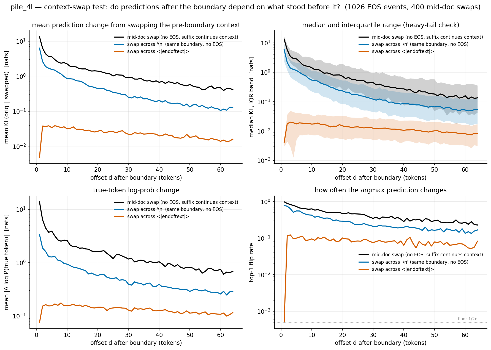
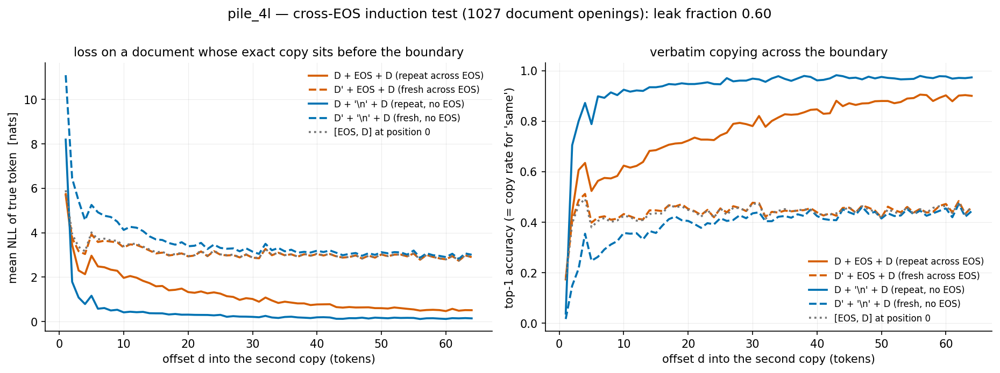
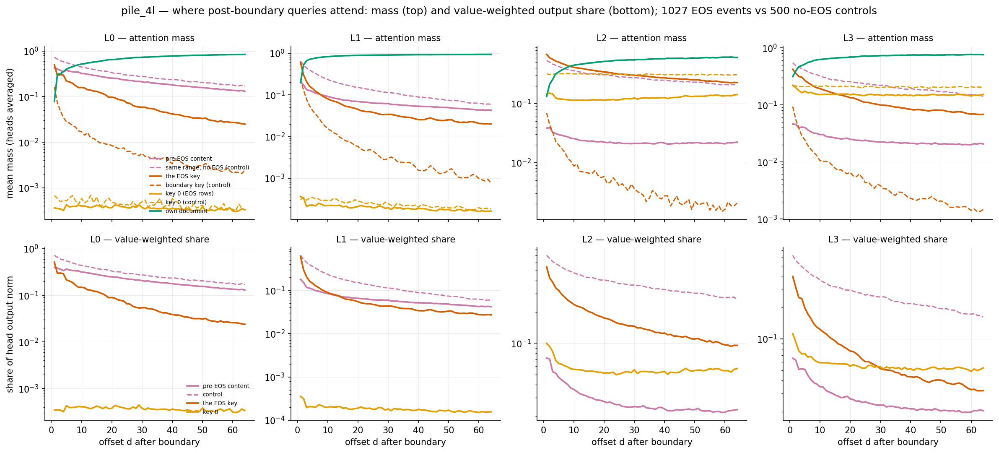
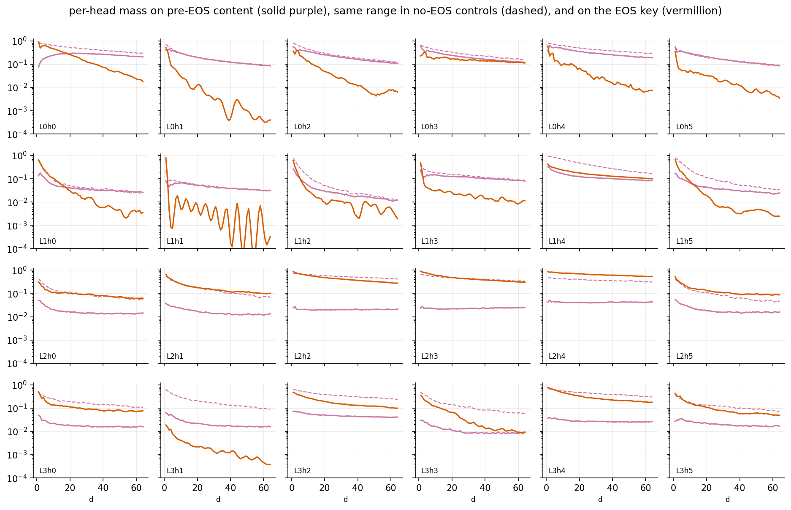
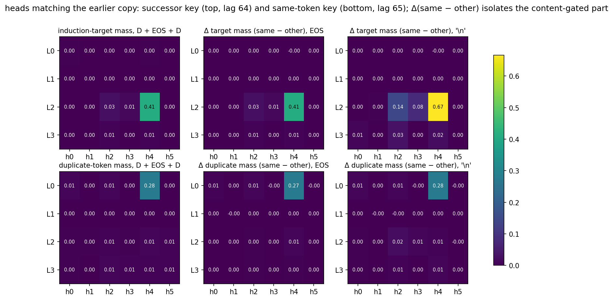
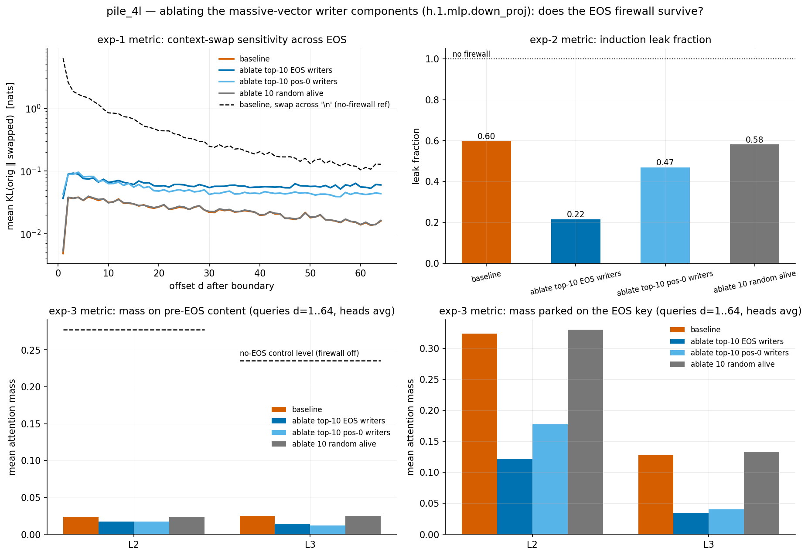
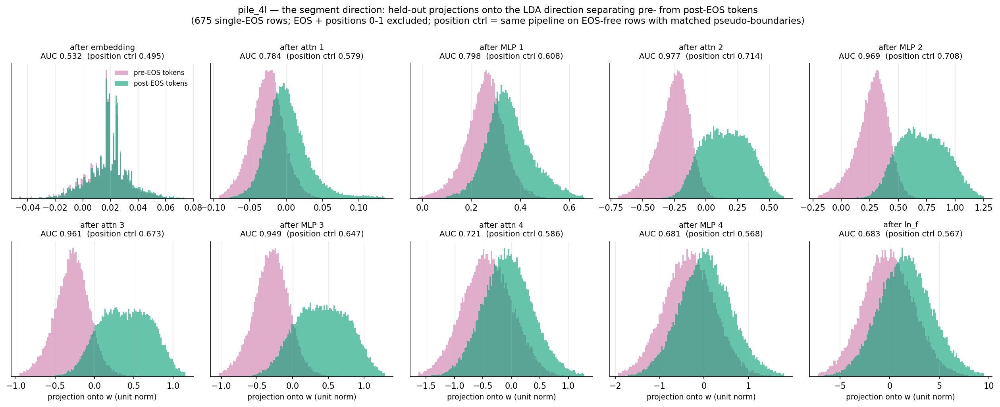

# eos-isolation — how well does pile_4l disregard context from before `<|endoftext|>`?

**Question.** Training chunks are 513-token windows cut from a stream of concatenated documents, so ~25% of chunks contain a mid-sequence `<|endoftext|>` (EOS). Everything before the EOS belongs to a *different, unrelated* document (the Pile stream is shuffled). How good is the model at disregarding that stale context when predicting tokens after the EOS?

**Prior context.** `context-loss/` found *correlationally* that out-of-document context is worth ~nothing (loss vs same-doc context length is unchanged by extra cross-EOS context). `endoftext-pos0/` found that mid-sequence EOS is an attention-sink site (massive activations, 0.07–0.45 mass parked per L2/L3 head, suppressed values). Here we test disregarding *causally* (intervene on the pre-EOS context), *adversarially* (make the pre-EOS context maximally useful), and *mechanistically* (where does post-EOS attention go).

**Data.** All 4,000 cached Pile rows (`context-loss/hide/cache/pile_rows.pt`, truncated to 512). An **event** is an EOS at position $p \in [64, 447]$ with no second EOS in $p+1..p+64$: 1,027 events. Everything below scores the 64 offsets $d = 1..64$ after the boundary (position $p+d$, i.e. logits at $p+d-1$; $d=1$ = predicting the new document's first token from the separator position). Scripts in `hide/` (local GPU, a few minutes each; caches in `hide/cache/`, delete to recompute).

---

## Experiment 1 — context-swap sensitivity (natural documents)

For each event, with context $X = x_{0..p-1}$, separator, and fresh document $D = x_{p+1..p+64}$, compare model predictions between the original and a context-swapped input, in two matched pairs:

$$\text{EOS pair:}\quad [X, \text{EOS}, D] \ \text{vs}\ [X', \text{EOS}, D] \qquad\qquad \text{'\textbackslash n' pair:}\quad [X, \text{'\textbackslash n'}, D] \ \text{vs}\ [X', \text{'\textbackslash n'}, D]$$

$X'$ is an equally long context from another row **ending at a genuine document end** (the $p$ tokens before that row's own EOS), so $[X', \text{EOS}]$ stays in-distribution. The `'\n'` pair is the identical intervention with the firewall token replaced by an ordinary (weak-sink) boundary token — same information structure, no EOS. A third condition anchors the scale: **mid-document swaps** on EOS-free rows ($[X, S]$ vs $[X', S]$ where suffix $S$ genuinely continues $X$; here $d=1$ is the first token after the swapped prefix). Per offset $d$:

$$\mathrm{KL}_d = D_{\mathrm{KL}}\!\left(P(\cdot \mid X, s, D_{<d})\,\|\,P(\cdot \mid X', s, D_{<d})\right),\qquad \Delta\mathrm{NLL}_d,\qquad \text{top-1 flip rate}.$$

| | mean KL (nats, d=1..64) | KL at d=1 | KL at d=64 | top-1 flips (d≥2) | mean&nbsp;\|ΔNLL\| |
|---|---|---|---|---|---|
| swap across **EOS** | **0.024** | 0.005 | 0.016 | 0.08–0.11 | ~0.15 |
| swap across `'\n'` | 0.553 | 6.33 | 0.128 | 0.2–0.7 | ~0.6 |
| mid-doc swap (ceiling) | 1.430 | 13.4 | 0.411 | 0.2–1.0 | ~1.5 |

**Findings.**

- **The firewall is strong: swapping the entire pre-EOS context moves post-EOS predictions by only ~0.02–0.04 nats — 23× less than the same swap across a `'\n'` boundary** (60× less than the mid-doc ceiling). Reverse KL and the signed ΔNLL (≈ +0.001, i.e. no systematic loss cost) agree.
- **It is most perfect exactly at the boundary**: at $d=1$ (predicting the document opener from the EOS position) KL = 0.005 and the top-1 prediction flipped in **0 of 1,026 events**. The model's "what starts a document" distribution is context-independent. Sensitivity rises slightly (~0.04) once a few real document tokens exist, then decays.
- **But it is not zero**: for $d \ge 2$, 8–11% of top-1 predictions flip under the swap, with mean $|\Delta \mathrm{NLL}| \approx 0.15$ nats. A measurable trickle of pre-EOS influence persists (mostly flips among near-tied candidates: mean KL stays ~0.03).
- The `'\n'` curve decays with $d$ (old context recedes as fresh context accumulates) while the EOS curve is flat and low from the start — the EOS achieves at $d=1$ what natural context dilution achieves only after hundreds of tokens.

## Experiment 2 — maximal-incentive leak (verbatim repeat across EOS)

Experiment 1 can't distinguish "the model firewalls the boundary" from "there was nothing worth reading" — natural pre-EOS context genuinely carries ~no information about the next document. So make it maximally useful: the pre-EOS context **is** the document being predicted. For 1,027 real 64-token document openings $D$ (and unrelated openings $D'$), score the second copy of $D$ in:

$$[D, s, D] \quad\text{vs}\quad [D', s, D], \qquad s \in \{\text{EOS}, \text{'\textbackslash n'}\}, \qquad \text{plus } [\text{EOS}, D] \text{ (no prefix)}.$$

$$\text{leak fraction}\quad \lambda \;=\; \frac{L(D',\text{EOS}) - L(D,\text{EOS})}{L(D',\text{'\textbackslash n'}) - L(D,\text{'\textbackslash n'})} \;\in\; [0, 1] \qquad (0 = \text{perfect firewall},\ 1 = \text{no firewall}).$$

Mean NLL on the second copy ($d = 2..64$; $d=1$ has no induction cue):

| | prefix = same doc $D$ | prefix = other doc $D'$ | gap | copy rate (top-1) |
|---|---|---|---|---|
| sep = **EOS** | 1.166 | 3.075 | 1.909 | **0.775** |
| sep = `'\n'` | 0.307 | 3.502 | 3.195 | 0.947 |
| no prefix, $[\text{EOS}, D]$ | 3.101 | | | 0.441 |

**Findings.**

- **The firewall is not an information block: $\lambda = 0.60$** (95% bootstrap CI [0.59, 0.60]). A verbatim copy before the EOS cuts second-copy loss by 1.91 nats and the model **copies across the EOS at 77.5% top-1** (vs 94.7% without EOS). Whatever the EOS does, the model still reads and uses pre-EOS content when it strongly matches.
- The boundary *delays* rather than blocks copying: without EOS the copy rate saturates (~0.95) by $d \approx 10$; across EOS it climbs slowly and reaches ~0.9 only by $d \approx 50$ (left panel of the figure: the vermillion solid curve converges toward the blue one from above).
- **A useless prefix + EOS is worth exactly nothing — as it should be**: $L(D', \text{EOS}) = 3.075 \approx L(\text{no prefix}) = 3.101$ (dashed vermillion sits on the gray dotted curve). And the EOS *helps* when the prefix is misleading: $L(D', \text{'\textbackslash n'}) - L(D', \text{EOS}) = 0.43$ nats — without the firewall, unrelated context actively hurts.

**Reconciling 1 & 2:** the EOS acts as a **prior reset, not an information barrier**. On natural (shuffled) data the reset is behaviorally near-perfect because stale context is useless anyway; when content strongly matches (repetition), 60% of the achievable benefit leaks through.

## Experiment 3 — mechanism: where does post-EOS attention go?

**Part A (natural rows).** Per-head attention recomputed for all 1,027 events and 500 no-EOS control rows (pseudo-boundaries drawn from the same $p$ distribution). Mass from queries at $p+d$ split by key range, plus the value-weighted share $s_R = \sum_{j\in R} A_{qj} w_j / \sum_j A_{qj} w_j$ with $w_j = \|W_O^h v_j\|$ (sink keys have suppressed values, so raw mass overstates them):

| | mass on pre-boundary content | | mass on boundary key | | value-wt. share from pre-boundary |
|---|---|---|---|---|---|
| | **EOS rows** | control | **EOS rows** | control | **EOS** / control |
| L0 | 0.225 | 0.307 | 0.090 | 0.012 | 0.220 / 0.304 |
| L1 | 0.068 | 0.149 | 0.058 | 0.013 | 0.064 / 0.149 |
| L2 | **0.023** | 0.287 | **0.325** | 0.007 | **0.029** / 0.380 |
| L3 | **0.025** | 0.237 | 0.128 | 0.008 | **0.027** / 0.271 |

- **The attention firewall lives in layers 2–3**: pre-EOS content mass is suppressed 12×/10× vs control (value-weighted share 13×/10×), and the missing mass is re-parked on the EOS key (0.325 vs 0.007 — the sink) and key 0. **Layer 0 barely suppresses at all** (0.225 vs 0.307 — its local heads keep reading the last few pre-EOS tokens verbatim), layer 1 halves. This is the residual channel behind Exp 1's small-but-nonzero KL and the entry point for Exp 2's leak.
- Key-0 mass drops 0.31 → 0.13 in L2 on EOS rows — the pos-0 → EOS sink hand-off seen in `endoftext-pos0/` from the key side.

**Part B (repeat stimuli, which heads carry the leak).** In the Exp-2 sequences the copies sit at a fixed lag, so for the query holding $D_i$ we measure mass on the key holding $D_i$ (duplicate-token, lag 65) and on the key holding $D_{i+1}$ (induction target, lag 64); the same-vs-other **delta** isolates the content-gated part (a purely positional preference cancels):

| head | measure | Δ mass, sep = EOS | Δ mass, sep = `'\n'` | EOS/`'\n'` ratio |
|---|---|---|---|---|
| **L0h4** | duplicate-token | +0.273 | +0.276 | **0.99** |
| **L2h4** | induction target | +0.412 | +0.666 | **0.62** |
| L2h2 | induction target | +0.026 | +0.144 | 0.18 |
| L2h3 | induction target | +0.014 | +0.078 | 0.17 |

- The leak is a textbook two-layer induction circuit straddling the boundary. **L0h4 is a duplicate-token head and is completely boundary-blind** (ratio 0.99): it attends from $D_i$ to the previous occurrence of $D_i$ wherever it is, EOS or not. **L2h4 is the main induction head, and it crosses the EOS at 62% strength — numerically matching the behavioral leak fraction 0.60.** The smaller induction heads L2h2/L2h3 *are* firewalled (0.17–0.18).
- L2h4 is precisely the **position/sink head** from `pile-qk-comps/` (slow-RoPE-plane components) and `endoftext-pos0/` (0.49 sink mass): the head that implements "park on the sink after a boundary" is the same head whose induction match overrides the parking when the content agrees. The firewall and its main hole share one QK circuit.

## Experiment 4 — is the position-0 sink machinery the firewall? (ablation)

The circumstantial case is strong: `endoftext-pos0/` showed pos-0 and mid-seq EOS share one massive-vector direction ($\cos = 0.962$) and one dominant writer (`h.1.mlp.down_proj:1320`, CI 1.00 at both sites); 6 of the top-10 writer components by $|$pos-0 contribution$|$ are also top-10 by $|$EOS contribution$|$; and the parking heads of Exp 3 are the known sink heads. But per-head, parking doesn't fully explain suppression (Spearman between per-head suppression factor and EOS-key mass over L2/L3 is only 0.46; L3h1 — the massive-vector *canceller* — suppresses 8.6× while parking 0.003).

Causal test: surgically ablate the massive-vector writers (subtract $\sum_c U_c V_c^\top$ from the actual `h.1.mlp.down_proj` weight) and re-measure all three firewall metrics. Variants: top-10 by $|$EOS write$|$ (94% of the EOS $u$-write), top-10 by $|$pos-0 write$|$ (the `pos0_components.md` set), 10 random alive components (control), and unablated baseline (validates this script's lite pipelines — it reproduces Exps 1–3 exactly).

| variant | KL$_\text{eos}$ | KL$_\text{'\textbackslash n'}$ | leak | copy EOS / `'\n'` | L2 mass: pre / EOS key / key 0 | ‖h‖ after MLP 2: pos0 / EOS |
|---|---|---|---|---|---|---|
| baseline | 0.024 | 0.553 | 0.60 | 0.775 / 0.947 | 0.024 / 0.324 / 0.126 | 221 / 127 |
| ablate top-10 EOS writers | 0.061 | 0.643 | 0.22 | 0.409 / 0.503 | 0.017 / 0.122 / 0.087 | 21 / 34 |
| ablate top-10 pos-0 writers | 0.052 | 0.811 | 0.47 | 0.575 / 0.747 | 0.017 / 0.177 / 0.015 | 11 / 39 |
| ablate 10 random alive | 0.024 | 0.541 | 0.58 | 0.762 / 0.944 | 0.024 / 0.330 / 0.126 | 221 / 125 |

**Findings.**

- **The parking rests on the pos-0 machinery**: killing the shared vector (norms 221/127 → ~15/36) collapses key-0 parking (L3: 0.154 → ~0.000) and cuts EOS-key parking 2–3× (L2 0.324 → 0.122–0.177, L3 0.128 → 0.034–0.040). The *residual* EOS-key parking is token-keyed: L2h4 still gives the EOS key 0.43–0.53 with the vector mostly gone.
- **But the firewall survives.** Mass on pre-EOS content does *not* return (0.017 vs no-EOS control ~0.21–0.29 — the freed mass goes to the *own document*, L3 own-doc 0.69 → 0.95), and the context-swap KL rises only 2.2–2.6× (0.024 → 0.052–0.061), staying **~12× below** the `'\n'` reference. So the massive-vector sink is where diverted attention *rests*, plus a ~2.5× contribution — the isolation itself is enforced by other EOS-conditioned machinery (the EOS token's own key, and the EOS-locked component blocks that exist in every matrix, cf. the L1 EOS machinery).
- The `'\n'` side weakens too (KL$_\text{'\textbackslash n'}$ 0.553 → 0.64/0.81): paragraph-`'\n'` is the known third, weak sink site of the same family, so the writers were providing partial isolation there as well — consistent with the family interpretation.
- **Side effect: the sink infrastructure is load-bearing for induction itself.** With writers ablated, *within*-`'\n'` copying collapses (NLL on the repeated copy 0.31 → 1.21/2.43, copy rate 0.95 → 0.75/0.50) and short-sequence NLLs rise ~0.4 nats across the board — plausibly because L2h4 (induction head *and* sink head) loses its resting place and its match spike dilutes. The leak fraction drops (0.60 → 0.47/0.22), i.e. relative cross-EOS induction is hit even harder, but interpret gently: it's a ratio measured on a damaged model.
- Random-10 control: null on every metric.

**Answer: yes, the pos-0 machinery is involved — it is the shared boundary-sink infrastructure that post-EOS attention parks on (and it even supports the induction machinery) — but it is *not* what enforces the isolation: ablating it leaves the firewall ~85% intact by the KL metric.**

## Experiment 5 — the segment direction

If the firewall discriminates query-side (it must, by causality: pre-EOS keys are computed before the EOS exists — in our matched stimuli they are bit-identical between the EOS and `'\n'` conditions), then post-EOS residual streams should carry an explicit "boundary behind me" state. Test: on the 675 rows with exactly one EOS (at position $p$), classify every token as pre ($2 \le t < p$) or post ($t > p$; EOS and sink positions 0–1 excluded), and at each of 10 stream stages fit the Fisher direction

$$w \;\propto\; \Sigma_w^{-1}(\mu_\text{post} - \mu_\text{pre}), \qquad \Sigma_w = \text{pooled within-class covariance} + 10^{-3}\tfrac{\operatorname{tr}\Sigma}{d} I$$

on half the rows and histogram the held-out projections. Because pre/post correlates with absolute position, the identical pipeline on EOS-free rows with matched pseudo-boundaries gives the **position floor**; the after-embedding stage gives the **token-statistics floor** (no context in embeddings).

| stage | emb | attn 1 | MLP 1 | attn 2 | MLP 2 | attn 3 | MLP 3 | attn 4 | MLP 4 | ln_f |
|---|---|---|---|---|---|---|---|---|---|---|
| AUC | 0.532 | 0.784 | 0.798 | **0.977** | 0.969 | 0.961 | 0.949 | 0.721 | 0.681 | 0.683 |
| d′ | 0.12 | 1.06 | 1.15 | **2.63** | 2.47 | 2.45 | 2.28 | 0.83 | 0.67 | 0.67 |
| position ctrl AUC | 0.495 | 0.579 | 0.608 | 0.714 | 0.708 | 0.673 | 0.647 | 0.586 | 0.568 | 0.567 |

**Findings.**

- **The segment state exists, and its lifetime matches the firewall's working layers.** Embeddings carry essentially nothing (0.532 ≈ the token-statistics floor — doc-opener unigram shift). Attention 1 creates a real signal (0.784), attention 2 broadcasts it to near-ceiling (0.977, d′ 2.63 — the L1 EOS machinery: the 68-comp `v_proj` / 27-comp `k_proj` blocks), and it stays at AUC 0.95–0.98 exactly through the stages whose attention implements the firewall (L2/L3 inputs).
- **Attention 4 deletes it** (0.977 → 0.721, further to 0.68 at `ln_f`) — the same layer that cancels the massive vectors cleans up the segment code once its job is done, so neither reaches the logits with full strength.
- **It is a quiet code, not the sink vector**: $|\cos(w, u)| \le 0.07$ at every stage (u = massive-vector direction). This is why Exp 4's ablation couldn't break the firewall — the segment state lives in a different subspace than the machinery we ablated.
- The position control peaks at only 0.714, so the separation is EOS-driven, not the position code.
- Direction geometry: attention 2 *rewrites* the code into a fresh direction ($\cos = 0.06$ with the MLP-1-stage direction), which then persists with partial rotations (adjacent-stage $|\cos|$ 0.63–0.86, and 0.98 across `ln_f`).
- The post-EOS histograms at the peak stages are broad and flat-topped while the pre-EOS lobe is narrow — consistent with a *graded* state (e.g. decaying with distance from the boundary); correlating the projection with offset $d$ is the natural follow-up.

## Conclusions

1. **On natural data the model disregards pre-EOS context almost perfectly**: full context replacement moves post-EOS predictions by ~0.02–0.04 nats (23× less than an identical no-EOS boundary swap), with zero opener flips at the boundary itself and no loss cost. Mechanism: L2/L3 heads dump would-be-context mass onto the EOS sink (whose value write is suppressed), i.e. the sink found in `endoftext-pos0/` *is* the firewall implementation.
2. **The firewall is a prior reset, not an information block.** L0/L1 local heads keep reading pre-EOS tokens, and the L0h4 → L2h4 duplicate-token/induction circuit passes verbatim-match information across the boundary at ~60% strength (77.5% cross-EOS copy rate). Training never removed this because on shuffled data the leak is harmless — the residual 8–11% top-1 flips of Exp 1 cost ≈ 0 nats on average, and blocking induction entirely would presumably cost more elsewhere.
3. The EOS earns its keep in both directions: useless prefix + EOS ≡ no prefix at all, and when the prefix is misleading the EOS saves 0.43 nats over a `'\n'` boundary.
4. **The pos-0 sink machinery is involved but is not the wall** (Exp 4): the shared massive-vector infrastructure is what the diverted attention parks on (killing it collapses the parking) and it contributes a factor ~2.5 of isolation, but the firewall survives its removal at ~12× — the isolation is enforced by other EOS-token-conditioned circuits. Unexpectedly, the same sink infrastructure is load-bearing for induction quality in general (within-`'\n'` copy rate halves under the ablation).
5. **The isolation is carried by an explicit segment state** (Exp 5): a linear "boundary behind me" direction, orthogonal to the massive vector ($|\cos| \le 0.07$), created by attention 1, broadcast to AUC 0.98 by attention 2's EOS machinery, held through exactly the L2/L3 firewall layers, and deleted again by attention 4 before the logits — the query-side code the causality argument requires.

## Gotchas / fine print

- $d=1$ is scored at the separator position itself; in the mid-doc ceiling there is no separator, so its $d=1$ prediction sits immediately after the last swapped token (small alignment asymmetry at $d=1$, irrelevant from $d=2$ on).
- The `'\n'`-substituted originals are mildly off-distribution (a document end followed by `'\n'` instead of EOS); the replacement contexts always end at genuine document ends by construction.
- Exp 2's `none` condition puts $[\text{EOS}, D]$ at positions 0..64 (EOS-at-position-0 is rare in training; positions also differ from the other conditions), so treat it as a reference line, not a matched condition.
- Part B's fixed lag (64/65) means raw target/duplicate mass conflates content match with positional preference; only the same−other deltas are content-gated. The EOS/`'\n'` ratio additionally cancels head-specific match strength.
- Top-1 flip rates count flips among near-tied candidates too; the KL/ΔNLL numbers are the calibrated size of the effect.
- Exp 4's ablation kills ~90% of the massive vector, not 100% (post-MLP-2 EOS norm 34–39 vs bulk 8; the top-10 sets cover 94%/92% of the $u$-write) — a contribution from the remaining stub can't be fully excluded. The ablated model is also mildly degraded globally (short-sequence NLLs +0.4 nats, bulk norm 7.5 → 8.1), so ablated-condition *ratios* (especially the leak fraction) are less clean than the baseline ones; the rand-10 control is null on everything.

## Files

- `hide/common.py` — event definition, partner (replacement-context) assignment, shared constants/colors.
- `hide/exp1_swap.py` → `exp1_swap.png`, cache `hide/cache/exp1.npz` (~4 min local GPU).
- `hide/exp2_induction.py` → `exp2_induction.png`, cache `hide/cache/exp2.npz` (~2 min).
- `hide/exp3_attention.py` → `exp3_attention.png`, `exp3_heads.png`, `exp3_leak_heads.png`, cache `hide/cache/exp3.npz` (~5 min).
- `hide/exp4_pos0_ablation.py` → `exp4_pos0_ablation.png`, cache `hide/cache/exp4.npz` (~20 min; writer sets from `endoftext-pos0/hide/cache/pos0_components.npz`, alive list from `coci-heatmaps/hide/cache/mean_ci_pile_4l.npz`).
- `hide/exp5_segment_direction.py` → `exp5_segment_direction.png`, cache `hide/cache/exp5.npz` (~6 min; 675 single-EOS rows + matched EOS-free position control, half/half row split for fit vs held-out).
