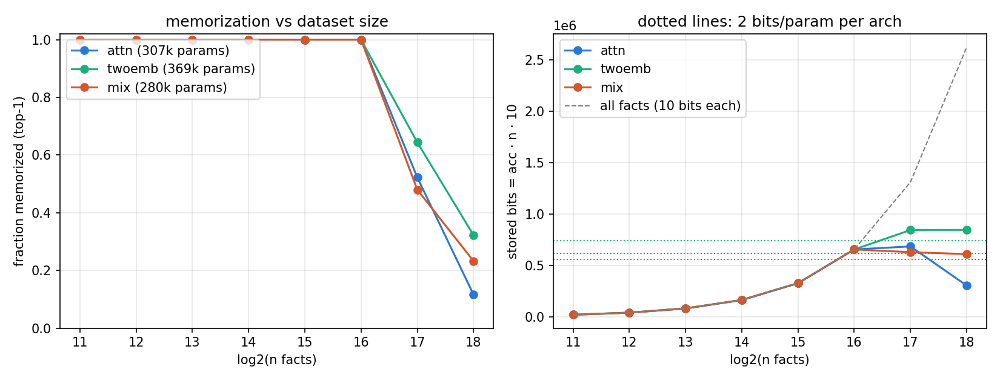

# memory-toy-model

Minimal 1-layer models trained to memorize random "facts", as a maximally
interpretable sandbox for later VPD decomposition. Three architectures, same
dimensions and data, differing only in how token 0's information reaches the
prediction:

| arch | pair combination before the MLP | extra params |
|---|---|---|
| `attn` | 3 sink-gated attention heads read $t_0$ (see below) | q/k/v/o (4×96²), sinks, rms_1 |
| `twoemb` | $h = \mathrm{wte}_0[t_0] + \mathrm{wte}[t_1]$ — second full embedding, no attention | wte0 (1024×96) |
| `mix` | $h = W_{mix}\,\mathrm{wte}[t_0] + \mathrm{wte}[t_1]$ — shared embedding, learned 96×96 mix, no attention | mix (96²) |

All then run the same MLP block + ln_f + untied lm_head:
$h \mathrel{+}= W_{down}\,\mathrm{gelu}(W_{fc}\,\mathrm{rms}_2(h))$, logits $= W_{lm}\,\mathrm{ln_f}(h)$.

## The `attn` model

- vocab 1024, d_model 96, 1 layer, 3 heads × head dim 32, MLP intermediate 384
- NewGELU, RMSNorm (eps 1e-6), no biases, **untied** lm_head
- **No positional encoding.** Self-attention is **masked**: position 1 attends only
  to key 0 plus a learned per-head **sink logit** $s_h$ (GPT-OSS zero-value slot).
  With one real key + sink, each head's softmax collapses to a sigmoid gate:

$$a_h = \sigma\!\left(\frac{q_h(t_1)\cdot k_h(t_0)}{\sqrt{32}} - s_h\right),
\qquad h_1 = \mathrm{wte}[t_1] + \sum_h a_h\, W_{OV}^h\, \mathrm{wte}[t_0]$$

  The residual path carries only $t_1$, the attention path only $t_0$ — perfectly
  clean path separation, and every activation is a function of the ordered pair.

## Task & data

Facts are random 3-token strings $(t_0, t_1) \to t_2$; all ordered input pairs are
unique, so each input has a unique correct completion; $t_2$ uniform, independent.
Loss on $t_2$ only. Train = test (pure memorization, nothing to generalize).
Datasets are **nested**: size $2^k$ = first $2^k$ rows of one shuffled table
(`hide/gen_data.py`, seed 0 → `hide/cache/facts_seed0.npz`, $2^{18}$ rows).

## Training

`hide/train_modal.py` — JAX, full-batch AdamW (wd 0.1 on ndim ≥ 2, cosine LR
peak 3e-3, ≤ 50k steps, early stop once acc = 1 holds for 1,000 steps), one Modal
A10G container per (arch, size $k = 11..18$); same init seed and identical nested
datasets across archs. Artifacts per run on volume `vpd-4layer` under
`/memory-toy/runs/f2e<k>[-twoemb|-mix]/`: `model_final.safetensors` (family-style
key names), `metrics.json`, `config.json`. Sweep tables →
`hide/cache/sweep_summary[_<arch>].json`.

Capacity prior: ~2 bits/param × ~3·10⁵ params vs 10 bits/fact ⇒ expect the
memorization boundary somewhere around $2^{14}$–$2^{16}$ facts.

## Results (2026-09-18 sweep, `hide/plot_capacity.py` → `capacity.png`)

| n facts | attn (307k) | twoemb (369k) | mix (280k) |
|---|---|---|---|
| ≤ 2¹⁵ | 100% (1k steps) | 100% (1k steps) | 100% (1k steps) |
| 2¹⁶ = 65,536 | 100% (3k steps) | 100% (1.5k steps) | 100% (3.75k steps) |
| 2¹⁷ = 131,072 | 52.3% | 64.4% | 48.0% |
| 2¹⁸ = 262,144 | 11.6% | 32.3% | 23.3% |

All three memorize $2^{16}$ facts perfectly and break between $2^{16}$ and
$2^{17}$; the ordering at overload follows parameter count (twoemb > attn ≈ mix
at 2¹⁷). Stored information $\mathrm{acc}\cdot n\cdot 10$ bits saturates at
~0.63–0.85 Mbit ≈ **2.2–2.3 bits/param** (right panel) — matching the
Allen-Zhu & Li 2 bits/param law. Exception: `attn` at 2¹⁸ stores only ~0.3 Mbit,
less than it stored at 2¹⁷ — an optimization failure at overload rather than a
capacity number (both 2¹⁷/2¹⁸ runs hit the 50k-step cap, and full-batch training
at 12× overload is slow; twoemb/mix keep their stored bits flat at 2¹⁸).
