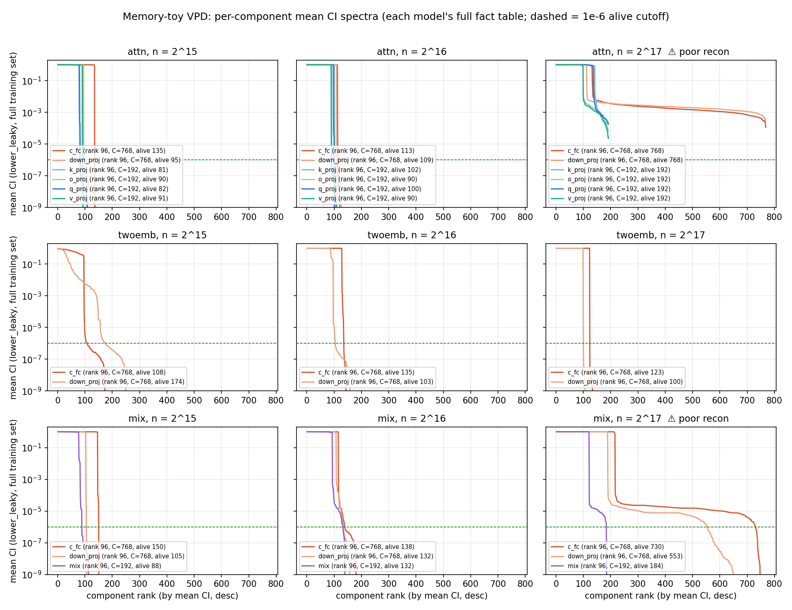
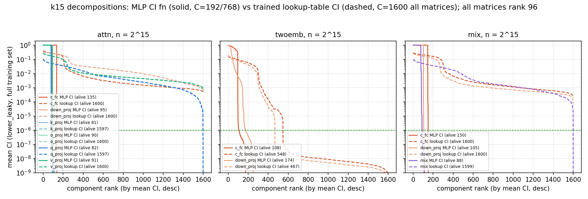
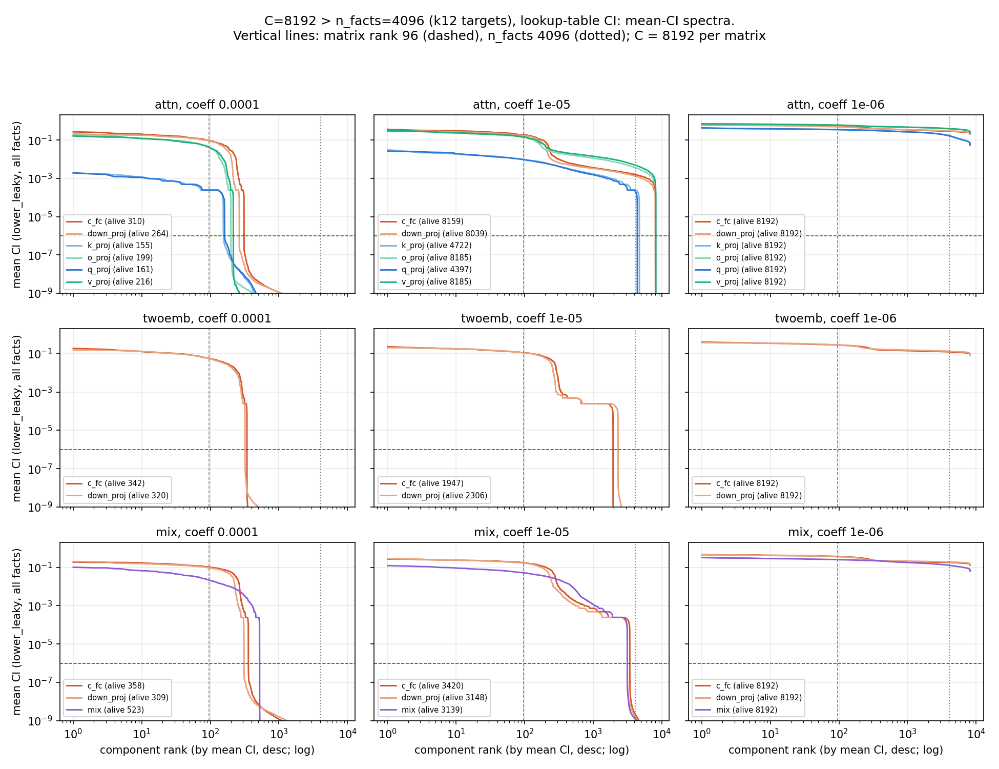

# VPD decompositions of the memory-toy models

**2026-09-19 (overnight run).** VPD decompositions of the memorization toys at
n = 2¹⁵/2¹⁶/2¹⁷ facts × all three architectures, Linears only (attn:
q/k/v/o/c_fc/down_proj; mix: mix/c_fc/down_proj; twoemb: c_fc/down_proj;
embeddings, lm_head, norms and sinks stay frozen).

## Setup

Public **param-decomp at latest main `5ffc73d79`** (fresh clone,
`hide/param-decomp-toy/`), via its toy-experiment path — the same loss stack as the
C-recipe ropefix run, single A10G per run. Our target/composition modules:
`hide/vpd/{memory_toy,run_memory_toy}.py`, launcher `hide/vpd_modal.py`.

Recipe (rationale: paper's VPD-recipe appendix + C recipe + the repo's own toy configs):
KL-on-logits reconstruction; MergedStochasticSubsetPPGD coeff 1.0, adv_fraction 0.5,
n_adv = 3, adversary Adam(0.01, 0.99) lr 0.01; importance-minimality γ annealed 1→0.01
at 90%, frequency term = coeff/3 (ref 65,536, EMA 200); NonlinearityLocality 3e-5
(neurons on c_fc); Faithfulness 1000 (+200-step warmup); AdamW 2e-3 cosine→0.1 both
groups; **C = 192 per 96×96 site, 768 per MLP site**; CI fn = global MLP [2048, 2048];
batch 2048, 30k steps; **neuron-aligned init**; eval = fresh-PGD 20×0.1 (shared-across-
batch sources) + CI-L0. Train = eval = the fact table. Every run verifies the loaded
target reproduces its recorded fact accuracy before decomposing.

## Pilot: importance-minimality coefficient (attn, k=16, 7 arms)

| coeff | PGD-recon KL (nats) | L0/datapoint (of 2,304) |
|---|---|---|
| 1e-6 | 0.00004 | 815 |
| 1e-5 | 0.00004 | 746 |
| 1e-4 | 0.00009 | 689 |
| **1e-3** | **0.00021** | **607** |
| 3e-3 | 0.095 | 534 |
| 1e-2 | 6.03 | 80 (collapsed) |
| 3e-2 | 25.0 | 45 (collapsed) |

Clean knee at 1e-3 — the largest coefficient with essentially perfect adversarial
reconstruction. Chosen for the finals; cells that collapsed at 1e-3 were re-run one
decade down (per-cell coeffs in the table).

## Final decompositions (best per cell)

| arch | n facts | coeff | PGD-recon KL | L0 total | L0 per site | run id |
|---|---|---|---|---|---|---|
| attn | 2¹⁵ | 1e-4 | 0.0009 | 567 | c_fc 135, down 94, q 80, k 78, v 90, o 90 | p-e4bc2787 |
| attn | 2¹⁶ | 1e-3 | 0.0008 | 597 | c_fc 112, down 109, q 97, k 101, v 90, o 88 | p-60992f8b |
| attn | 2¹⁷ | 1e-5 | **1.39 ⚠** | 724 | c_fc 134, down 116, q 135, k 141, v 99, o 99 | p-288f7d74 |
| twoemb | 2¹⁵ | 1e-3 | 0.055 | 95 | c_fc 66, down 29 | p-d0089058 |
| twoemb | 2¹⁶ | 1e-3 | 0.015 | 217 | c_fc 128, down 89 | p-57ab424d |
| twoemb | 2¹⁷ | 1e-3 | 0.047 | 222 | c_fc 123, down 99 | p-778b350a |
| mix | 2¹⁵ | 1e-4 | 0.0002 | 326 | c_fc 146, down 103, mix 77 | p-eb67f78a |
| mix | 2¹⁶ | 1e-3 | 0.015 | 313 | c_fc 115, down 106, mix 92 | p-b8d68a76 |
| mix | 2¹⁷ | 1e-5 | **0.43 ⚠** | 530 | c_fc 217, down 193, mix 121 | p-bad010ab |

Checkpoints: volume `vpd-4layer`, `/memory-toy/vpd/runs/<run id>/ckpts/<step>/`
(orbax; V/U + CI fn). Full metric trajectories in each run dir's `metrics.jsonl`.
All coeff variants that were trained are also on the volume
(run id = `p-` + md5(run key)[:8], run key = `final-<arch>-k<k>-imp<coeff>`).

## Findings

1. **7 of 9 cells decompose cleanly** (PGD-recon KL ≤ 0.055 nats under 20-step
   adversarial masking, faithfulness ~1e-7).

2. **Per-fact storage is dense, not sparse.** For the attn model at 2¹⁶, each fact
   uses ~100 components *per site* — right at the matrix rank (96) — and ~600 of
   2,304 total. Compare the paper's LM decompositions, where L0 ≪ rank. VPD is
   reporting that random-fact memorization stores every fact across-the-board in
   superposition: there is no small per-fact circuit. The MLP sites (rank 96, C 768)
   also stay at L0 ≈ 110–130 ≳ rank. The interesting structure is thus not sparsity
   per datapoint but which components exist at all (alive spectra — next analysis).

3. **The overloaded k=17 attn/mix targets resist decomposition** (⚠ rows). Swept
   coeff 1e-5…1e-3 and 60k steps: PGD-recon stays ≥ 0.43 (mix) / 1.39 (attn) nats —
   orders of magnitude above every other cell. These are exactly the two targets that
   were themselves optimization failures at 12× capacity overload (52%/48% fact
   accuracy, stored bits below their own k=16 value for attn). twoemb/k17 — the arch
   that kept storing its full ~0.85 Mbit at overload — decomposes fine (0.047 at the
   *strongest* coeff). Tentative reading: a model that failed to organize its
   memorization cleanly also lacks parameter structure that a faithful + minimal +
   adversarially-robust rank-one dictionary can capture.

4. Ordering of L0 by architecture at fixed n (k=16): twoemb 217 < mix 313 < attn 597.
   Fewer decomposed sites ⇒ fewer active components, roughly proportionally — no
   arch shows a qualitatively sparser code.

## Mean-CI spectra (added 2026-09-19)

Per-component mean CI (lower_leaky) over each model's **full training set**, components
sorted by descending mean CI per matrix (`hide/vpd_spectra_modal.py` → cache
`hide/cache/vpd_mean_ci.npz` → `hide/plot_vpd_spectra.py`).

- **Healthy cells are textbook step functions**: a plateau at mean CI ≈ 1 for ~80–150
  components per matrix, then a vertical cliff to ≤ 1e-6 — exactly the sharp alive/dead
  cutoff the paper's recipe appendix describes, with almost nothing in between.
- The plateau sitting at CI ≈ **1** ties the story together: the alive components are
  **always on** — combined with L0 ≈ alive count, every fact uses every alive component.
  The decomposition is a dense shared basis of ≈ rank-many directions per matrix, not a
  sparse per-fact code.
- **Alive counts barely grow with n** (attn q_proj: 82 → 100 → —; twoemb c_fc:
  108 → 135 → 123 across 4× more facts) and sit at ≈ the matrix rank (96) for the
  96-dim sites, ~110–150 of 768 for the MLP sites. More facts ⇒ same dictionary,
  used more densely — consistent with superposed distributed storage.
- **The two ⚠ cells look qualitatively different**: no cliff at all — in attn/k17 every
  component of every site is alive (all 2,304 > 1e-6) with a long shallow tail,
  mix/k17 nearly so (1,467 of 1,728). The failed decompositions never found discrete
  structure; this is the spectral signature of the reconstruction failure, not just a
  worse L0.
- Exception worth noting: twoemb/k15's down_proj has a small graded shoulder
  (~70 components between 1e-1 and 1e-6) rather than a clean cliff — the only healthy
  cell with an ambiguous alive boundary.

## Lookup-table CI diagnostic (2026-09-19, k15 cells)

Linda's suspicion: the dense spectra above might be a **CI-capacity artifact**, not a
fact about the models. Capacity math supports it: an arbitrary per-fact sparse CI
pattern carries ~n·C_total bits (attn/2¹⁶: ≈ 151 Mbit) while the global-MLP CI net
stores ~10.7M params × ~2 bits ≈ 21 Mbit — the CI net *could not have expressed* a
per-fact code even if the decomposition wanted one.

Diagnostic: replace the CI net with a **trained lookup table** — one preactivation per
(fact, component) per site (`hide/vpd/lookup_ci.py`; implemented by subclassing the
GlobalMLP CI classes so the engine accepts it, with one construction-seam wrapper; the
fact index reaches the CI fn as a capture tap). Legitimate because train = eval = a
finite fact table; note it is an **oracle** CI (memorized per datapoint, not computed
from activations). Re-ran the three k15 cells at their chosen coefficients, 30k steps.

⚠ First attempt was invalid: the engine casts CI inputs to bfloat16, which quantizes a
raw index tap — exactly 1,152 table rows trained = the number of bf16-representable
integers in [0, 2¹⁵) (facts silently shared CI rows, up to 128 per bucket). Fixed by
encoding the index as two base-256 digits, each bf16-exact. (Runs `lookup-*` on the
volume are the buggy ones; `lookup2-*` are valid.)

**Results:**

| cell | MLP CI: PGD / L0 | lookup CI: PGD / L0 | run id |
|---|---|---|---|
| attn k15 | 0.0009 / 567 | 0.0043 / **213** | p-c8039bae |
| twoemb k15 | 0.055 / 95 | 0.239 / **56** | p-737e7d72 |
| mix k15 | 0.0002 / 326 | 0.132 / **163** | p-364ac348 |

(run keys `lookup2-<arch>-k15-imp<coeff>`)

**The dense-storage conclusion was substantially a CI-fn artifact.** With unconstrained
per-fact CI:

- L0 per fact drops 1.7–2.7× (attn: 567 → 213; q/k sites 80 → **15** of 192).
- The spectra change shape completely: instead of a step function at mean CI ≈ 1
  (every alive component on for every fact), they are **graded** — mean CI starts at
  ~0.1–0.2 and decays smoothly over hundreds of components. Components now fire on
  *subsets* of facts (mean CI ≈ the fraction of facts using the component); more
  components participate in total (e.g. twoemb c_fc: 573 alive vs 108) but each fact
  touches few — a genuinely combinatorial code, invisible to the MLP CI fn.
- Reconstruction cost: attn stays healthy (0.004 nats); twoemb/mix degrade to
  0.13–0.24 nats — part of the extra sparsity is being paid for, and per-CI-type
  coefficient retuning would be needed for a clean frontier comparison.

**C = 1600 variant (user request — all components were alive in attn/mix):** re-ran the
three lookup cells with C = 1600 for *every* matrix (runs `lookup3-*`; the current
`vpd_mean_ci_lookup.png` shows these):

| cell | C=192/768 lookup: PGD / L0 | C=1600 lookup: PGD / L0 | alive per matrix |
|---|---|---|---|
| attn k15 | 0.0043 / 213 | 0.298 / 379 | 1597–1600 of 1600 (no cliff) |
| twoemb k15 | 0.239 / 56 | 0.223 / 58 | **548 / 467 of 1600 — a real cliff** |
| mix k15 | 0.132 / 163 | 0.308 / 190 | 1599–1600 of 1600 (no cliff) |

- **twoemb now shows a genuine alive/dead boundary**: ~500 components per MLP matrix in
  use (each fact touching ~30 of them), sharp drop past rank ~550/470, and the result
  is stable across dictionary sizes (L0 56 ↔ 58). That looks like the model's real
  component count for this arch/n.
- **attn and mix still fill whatever dictionary they get** (graded tail at mean CI
  ~1e-3 out to rank 1600) — but their reconstruction also degraded badly at C = 1600
  (0.30 nats vs 0.004/0.13 at the original C), so these two decompositions are partly
  broken and their spectra shouldn't be over-read; a minimality-coefficient re-sweep
  under lookup CI is the needed next step there (bigger C ⇒ more imp-min pressure per
  fact at fixed coeff, which is exactly the collapse direction).

**Coefficient re-sweep at C = 1600 (attn/mix; `--mode lookup-sweep`):** no healthy knee
exists —

| coeff | attn: PGD / L0 (of 9,600) | mix: PGD / L0 (of 4,800) |
|---|---|---|
| 1e-4 | 0.298 / 379 | 0.308 / 190 |
| 3e-5 | 0.159 / 1,218 | 0.187 / 353 |
| 1e-5 | 0.099 / 3,744 | 0.169 / 896 |
| 3e-6 | 0.022 / 8,472 | 0.038 / 3,384 |

Reconstruction only becomes decent where L0 explodes to most of the dictionary; every
C = 1600 point is **dominated by the original-C lookup run** (attn 0.0043 / 213,
mix 0.132 / 163). Enlarging the dictionary doesn't reveal hidden attn/mix structure —
it just makes the optimization strictly harder (~5× the component and table
parameters at the same 30k-step budget). Bottom line per arch: **twoemb** has a
bounded, dictionary-size-stable component set (~500/matrix, cliff); **attn/mix** use
every component they're given at some rate (graded tail, no cliff at either C) — their
best decompositions remain the original-C lookup runs.

Machinery: `hide/vpd/lookup_ci.py` + fact-idx plumbing in `memory_toy.py`/
`run_memory_toy.py`; launcher `--mode lookup` (currently `lookup3-*`, `c_all=1600`);
spectra via `vpd_spectra_modal.py --which lookup` → `hide/cache/vpd_mean_ci_lookup.npz`
→ `hide/plot_vpd_spectra_lookup.py` → `vpd_mean_ci_lookup.png`.

## C > n_facts: overcomplete dictionaries with lookup CI (2026-09-19, k12 targets)

Question (Linda): give the decomposition more components than facts — do facts claim
private components? Setup: the already-trained 2¹² targets (4,096 facts, 100%
memorized), **C = 8,192 per matrix (= 2·n)**, lookup-table CI, coeff grid
{1e-4, 1e-5, 1e-6} × all three archs (runs `lookup4-<arch>-k12-imp<c>-C8192`,
logged live to wandb).

| coeff | attn: PGD / L0 | twoemb: PGD / L0 | mix: PGD / L0 |
|---|---|---|---|
| 1e-4 | 0.031 / 85 | 0.0031 / **34** | 0.043 / 67 |
| 1e-5 | 0.013 / 348 | 0.0006 / 70 | 0.039 / 175 |
| 1e-6 | 0.022 / 16,306 | 0.00004 / 2,690 | 0.0003 / 5,046 |

- **All three archs now decompose cleanly AND sparsely** at coeff 1e-4: recon
  0.003–0.043 nats with per-fact L0 34–85. attn's per-site L0: **q/k = 3**,
  v/o = 14, c_fc = 28, down = 24 components per fact.
- **Facts do NOT claim private components.** Even with 2 slots per fact available,
  alive counts settle at a few hundred per matrix (attn 155–310, twoemb ~330,
  mix 309–523) — far below n = 4,096, a few × the matrix rank 96. Top components
  carry mean CI ~0.1–0.3, i.e. each serves 10–30% of facts. The code is
  **combinatorial sharing**: ~300 components per matrix, each fact drawing a few dozen
  (a few for q/k). Note (³⁰⁰ choose ³⁰) ≫ 4,096 — plenty of addressing capacity.
- The coeff ladder shows the whole regime cleanly: 1e-6 = under-pressured (everything
  alive, L0 ≈ dictionary), 1e-5 = intermediate, 1e-4 = sparse with healthy recon.
  Unlike the k15/C=1600 attempt, the smaller fact table (each fact visited every ~2
  steps at batch 2048) trains the tables well within 30k steps.
- attn's q/k sites are qualitatively special: their whole spectrum sits at mean CI
  ~1e-3 (vs ~0.1–0.3 for v/o/MLP) — sink-gate components fire on ~2% of facts each,
  the sparsest sub-code in the system.

## Caveats

- k=15/16/17 across archs use slightly different coefficients (table) — chosen per
  cell as the strongest coeff that keeps recon healthy, per the paper's tuning
  guidance. For strict cross-cell L0 comparisons, re-run any pair at a common coeff
  (runs are ~40 min each; `--mode cells --cells attn:15,... --coeff ...`).
- L0 here counts CI > 0 (threshold 0.0) per datapoint, from the CI_L0 eval.
- Alive-component counts/spectra (the paper's log-mean-CI diagnostic) are not yet
  extracted — the checkpoints on the volume have everything needed.
