# L0_k (co-CI clustering) — data-driven component groups (h.0.attn.k_proj)

Alternative to [L0_k.md](L0_k.md): same alive components and figures, but the groups come from the **measured co-CI data**, not the website descriptions. Average-linkage hierarchical clustering on distance 1 − r(CI) over the 2,048,000-token Pile sample, cut at distance 0.5 (so each cluster keeps average within-cluster r(CI) ≥ 0.5); clusters with ≥ 2 members become groups, largest first; singletons and never-varying components go to Ungrouped.

Per group with >1 member, three pairwise grids:

- **co-activation** — Pearson r of |a_c| = |‖U_c‖ (V_c·φ)| per token
- **co-CI** — Pearson r of the causal importance (lower_leaky) per token; gray = component never varied (no CI in sample)
- **input cosine** — |cos(V_a, V_b)| of read-in vectors (|·|: component sign is gauge)

'fires' below = tokens with CI > 0.1 in the sample. Within each group, components are ordered by component id (in the lists and on all grid axes).

## Groups

| group | n | members |
|---|---|---|
| [Cluster 1](#cluster-1) | 17 | 28 64 67 77 109 149 232 234 291 301 311 337 374 445 471 490 508 |
| [Cluster 2](#cluster-2) | 12 | 126 139 184 203 235 287 305 306 378 421 457 503 |
| [Cluster 3](#cluster-3) | 6 | 26 37 128 315 366 463 |
| [Cluster 4](#cluster-4) | 4 | 53 55 302 442 |
| [Cluster 5](#cluster-5) | 4 | 90 127 404 452 |
| [Cluster 6](#cluster-6) | 4 | 191 205 389 443 |
| [Cluster 7](#cluster-7) | 4 | 263 275 409 475 |
| [Cluster 8](#cluster-8) | 3 | 9 141 266 |
| [Cluster 9](#cluster-9) | 3 | 14 31 413 |
| [Cluster 10](#cluster-10) | 3 | 161 196 460 |
| [Cluster 11](#cluster-11) | 3 | 192 294 415 |
| [Cluster 12](#cluster-12) | 3 | 273 353 498 |
| [Cluster 13](#cluster-13) | 3 | 288 335 494 |
| [Cluster 14](#cluster-14) | 2 | 18 193 |
| [Cluster 15](#cluster-15) | 2 | 20 298 |
| [Cluster 16](#cluster-16) | 2 | 65 210 |
| [Cluster 17](#cluster-17) | 2 | 73 152 |
| [Cluster 18](#cluster-18) | 2 | 125 406 |
| [Cluster 19](#cluster-19) | 2 | 215 369 |
| [Cluster 20](#cluster-20) | 2 | 274 377 |
| [Cluster 21](#cluster-21) | 2 | 295 504 |
| [Ungrouped](#ungrouped) | 41 | 7 13 29 45 72 76 79 85 91 92 97 100 110 116 187 200 201 238 243 257 286 299 308 309 319 331 332 336 349 365 371 375 381 403 410 414 419 431 433 461 465 |

### Cluster 1 (17)

- **28** (mean CI 0.0001, fires 264): predicts ':' after 'q' to format 'q:'
- **64** (mean CI 0.0001, fires 243): fires on 'q' to predict ':' in q&a context
- **67** (mean CI 0.0001, fires 327): q and copyright token predictor
- **77** (mean CI 0.0001, fires 244): the token 'q' predicting ':' in q&a formats
- **109** (mean CI 0.0002, fires 377): predicts ':' after 'q' and 'also' after 'see'
- **149** (mean CI 0.0001, fires 245): the 'q' token predicting ':' in q&a format
- **232** (mean CI 0.0003, fires 578): structural markers and section headers
- **234** (mean CI 0.0001, fires 243): the 'Q' token predicting ':' in Q&A formats
- **291** (mean CI 0.0001, fires 242): predicts ':' after 'q' at start of document
- **301** (mean CI 0.0001, fires 252): predicts ':' after 'q' and '>' after 'ubottu'
- **311** (mean CI 0.0001, fires 243): predicting ':' after 'Q' at document start
- **337** (mean CI 0.0001, fires 243): fires on 'q' at start of document to predict ':'
- **374** (mean CI 0.0001, fires 243): the token 'q' predicting ':'
- **445** (mean CI 0.0001, fires 269): predicts ':' after 'q' and 'also' after 'see'
- **471** (mean CI 0.0001, fires 242): predicts ':' after 'q' in q&a format contexts
- **490** (mean CI 0.0001, fires 269): predicts ':' after 'Q' or 'See'
- **508** (mean CI 0.0001, fires 243): token 'q' predicting ':' in q&a format

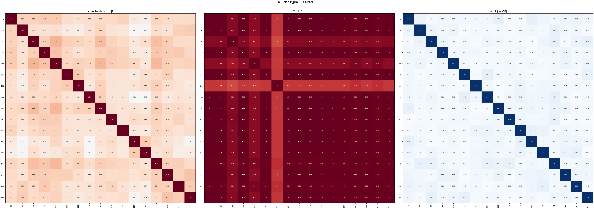

### Cluster 2 (12)

- **126** (mean CI 0.0006, fires 1519): document boundaries and 'Q' in Q&A starts
- **139** (mean CI 0.0007, fires 1680): activates on document boundaries and section starters
- **184** (mean CI 0.0006, fires 1457): fires purely on <|endoftext|>
- **203** (mean CI 0.0006, fires 1420): document separator (<|endoftext|>) detector
- **235** (mean CI 0.0004, fires 1138): fires on the <|endoftext|> token
- **287** (mean CI 0.0009, fires 2743): structural boundary and document separator tokens
- **305** (mean CI 0.0002, fires 592): fires on the end of text token
- **306** (mean CI 0.0003, fires 981): fires on <|endoftext|>, predicts new document starts
- **378** (mean CI 0.0004, fires 1404): fires on the <|endoftext|> separator token
- **421** (mean CI 0.0004, fires 1371): fires on the <|endoftext|> document separator token
- **457** (mean CI 0.0002, fires 637): fires exclusively on the <|endoftext|> separator token
- **503** (mean CI 0.0010, fires 2481): fires on the <|endoftext|> token

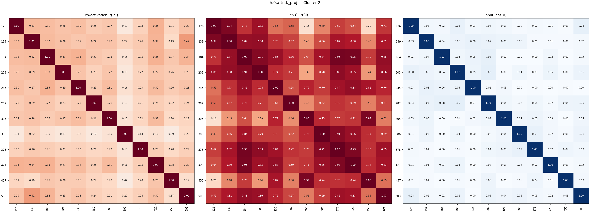

### Cluster 3 (6)

- **26** (mean CI 0.0000, fires 103): the token 'Which' predicting ' is' in math problems
- **37** (mean CI 0.0001, fires 169): fires on 'func' and 'which'
- **128** (mean CI 0.0000, fires 103): predicts " is" after "which"
- **315** (mean CI 0.0000, fires 103): fires on 'which' to predict ' is'
- **366** (mean CI 0.0000, fires 105): predicts ' is' after 'which' and '{' after 'xymatrix'
- **463** (mean CI 0.0001, fires 432): bimodal: html attributes predicting '="' vs which/world/pronouns

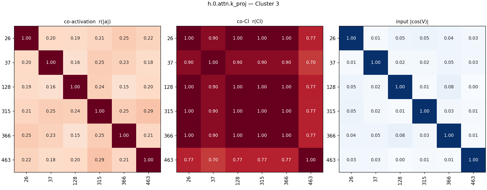

### Cluster 4 (4)

- **53** (mean CI 0.0001, fires 182): predicts open parenthesis or space after 'for' loops
- **55** (mean CI 0.0001, fires 185): predicts loop initialization syntax after 'for' keywords
- **302** (mean CI 0.0001, fires 189): for/foreach loop syntax initiation
- **442** (mean CI 0.0001, fires 175): fires on 'for' or 'foreach' loop keywords in code

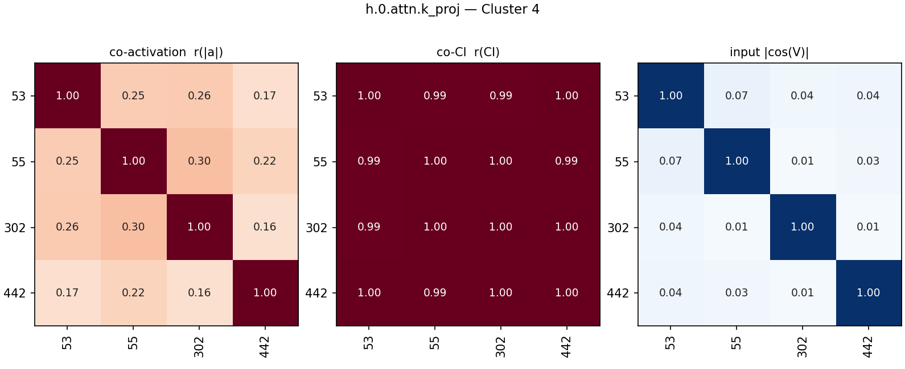

### Cluster 5 (4)

- **90** (mean CI 0.0006, fires 1753): foreign languages and the word 'not'
- **127** (mean CI 0.0013, fires 3615): non-english european language tokens
- **404** (mean CI 0.0014, fires 3940): fires on non-english words and math probabilities
- **452** (mean CI 0.0028, fires 7780): non-english european languages and accented characters

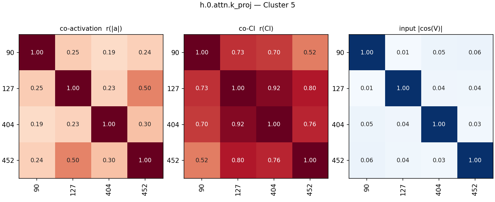

### Cluster 6 (4)

- **191** (mean CI 0.0002, fires 403): predicts syntax (especially colon) following structural keywords
- **205** (mean CI 0.0001, fires 307): the token 'a' predicting a colon (mainly q&a)
- **389** (mean CI 0.0003, fires 956): predicts colon after 'a' in q&a formats
- **443** (mean CI 0.0001, fires 329): the 'a' token preceding a colon in q&a formats

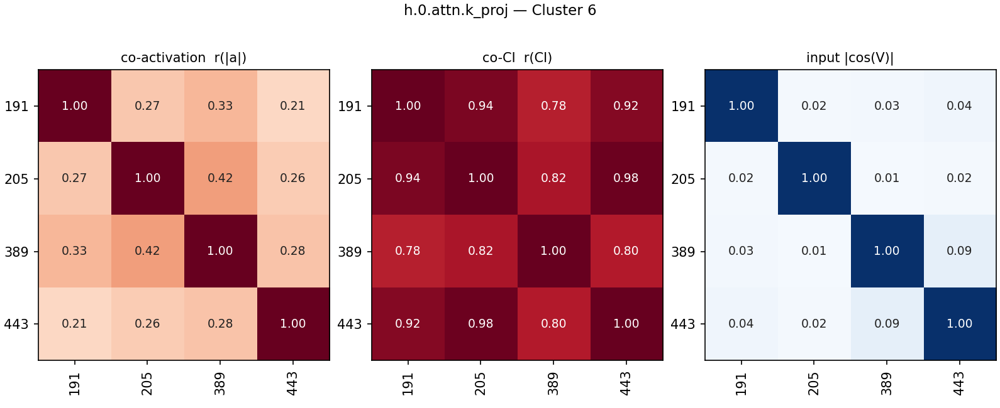

### Cluster 7 (4)

- **263** (mean CI 0.0000, fires 24): fires on 'see' in 'see also' section headers
- **275** (mean CI 0.0000, fires 32): Predicts 'also' after 'See'
- **409** (mean CI 0.0000, fires 32): predicts 'also' after 'see' in referential contexts
- **475** (mean CI 0.0000, fires 30): predicts ' also' after 'see' in 'see also' headings

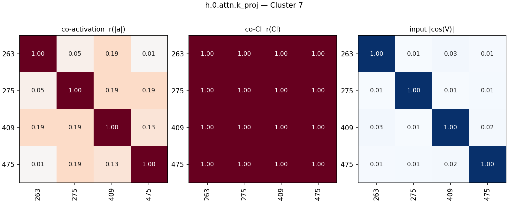

### Cluster 8 (3)

- **9** (mean CI 0.0000, fires 64): activates on ' of' and predicts following determiners
- **141** (mean CI 0.0003, fires 1053): fires on variations of the word "of"
- **266** (mean CI 0.0000, fires 195): fires on the token ' of'

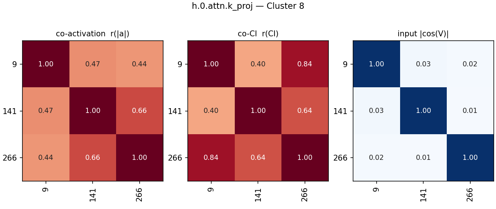

### Cluster 9 (3)

- **14** (mean CI 0.0001, fires 278): attention key component firing on numbers/digits
- **31** (mean CI 0.0001, fires 520): fires on numeric tokens predicting punctuation or units
- **413** (mean CI 0.0001, fires 415): fires on numbers to predict punctuation or units

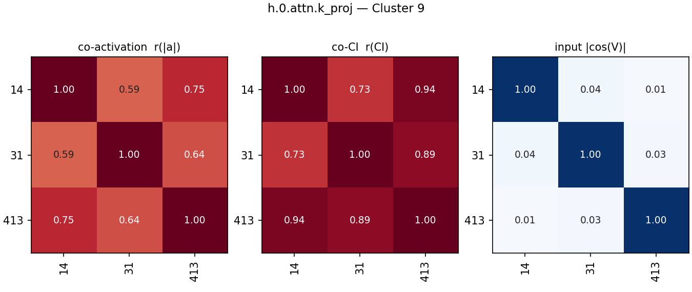

### Cluster 10 (3)

- **161** (mean CI 0.0001, fires 491): fires on '://' in URLs
- **196** (mean CI 0.0000, fires 176): predicts typical domain prefixes after '://' in urls
- **460** (mean CI 0.0002, fires 648): predicts domain names after url scheme (://)

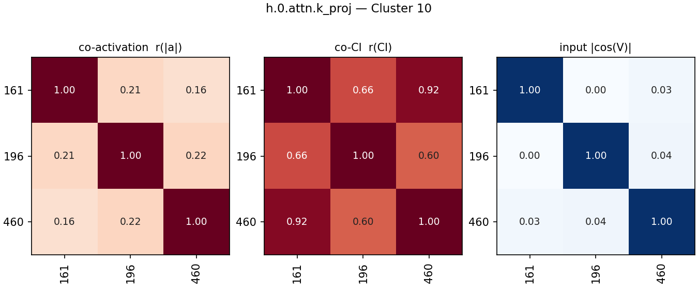

### Cluster 11 (3)

- **192** (mean CI 0.0000, fires 53): predicts ' from' after ' replacement' in probability problems
- **294** (mean CI 0.0000, fires 53): predicts ' from' after 'without replacement'
- **415** (mean CI 0.0000, fires 68): predicts ' from' after ' replacement' and ':' after 'abstract'

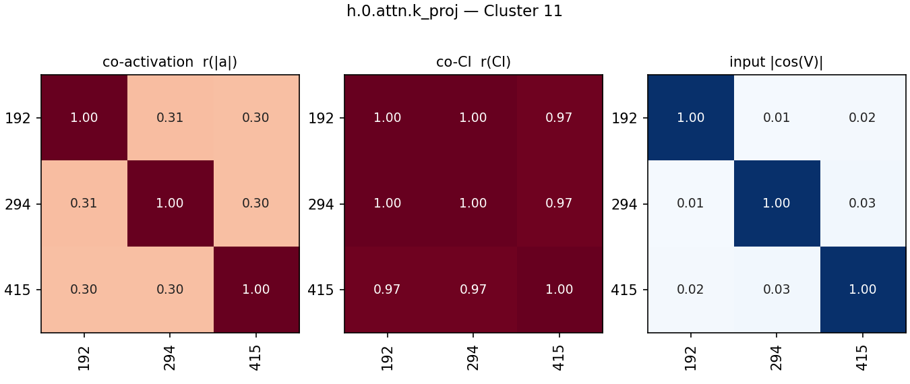

### Cluster 12 (3)

- **273** (mean CI 0.0000, fires 258): determiners (articles, possessives, quantifiers)
- **353** (mean CI 0.0004, fires 1281): fires on articles ('the', 'a', 'an')
- **498** (mean CI 0.0003, fires 1013): fires on articles 'the' and 'a'

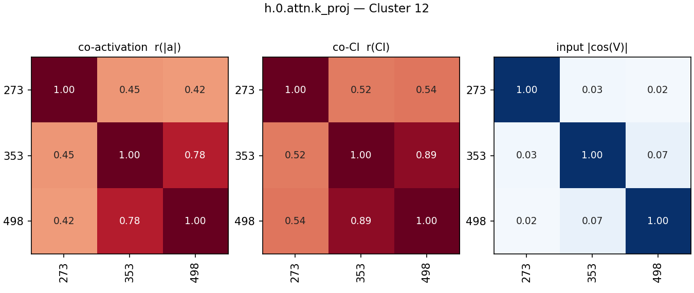

### Cluster 13 (3)

- **288** (mean CI 0.0004, fires 927): predicts a colon after 'category' and 'q'
- **335** (mean CI 0.0006, fires 1459): urls and categories (negative) vs latex integrals (positive)
- **494** (mean CI 0.0008, fires 1865): predicts standard trailing punctuation or symbols for specific keywords

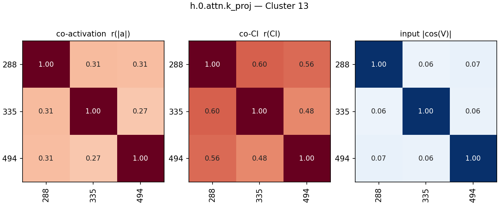

### Cluster 14 (2)

- **18** (mean CI 0.0001, fires 477): fires on <|endoftext|> to predict document starts
- **193** (mean CI 0.0002, fires 637): fires on the <|endoftext|> token

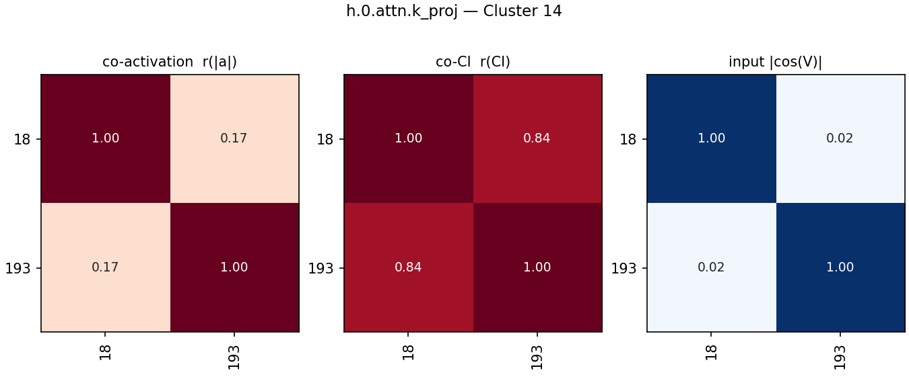

### Cluster 15 (2)

- **20** (mean CI 0.0003, fires 973): predicts '{' after 'frac' and '.' after 'doi'/'pone'
- **298** (mean CI 0.0003, fires 827): latex fraction commands (\frac) predicting opening brace

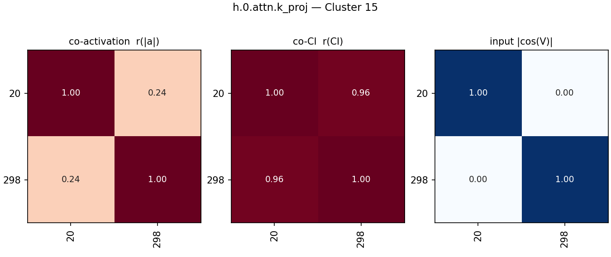

### Cluster 16 (2)

- **65** (mean CI 0.0001, fires 207): wikipedia footer section headers
- **210** (mean CI 0.0000, fires 79): predicts second word of wikipedia section headers

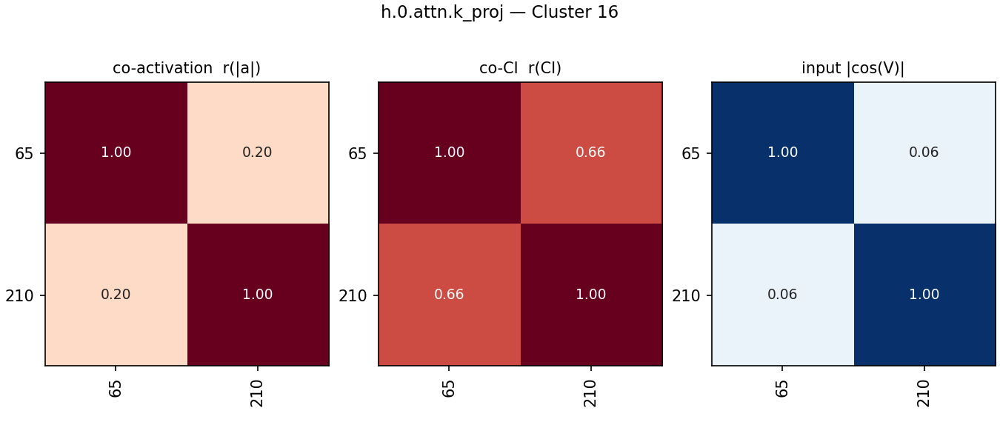

### Cluster 17 (2)

- **73** (mean CI 0.0001, fires 187): fires on markdown image syntax to predict captions
- **152** (mean CI 0.0001, fires 214): markdown image tags and 'see also' references

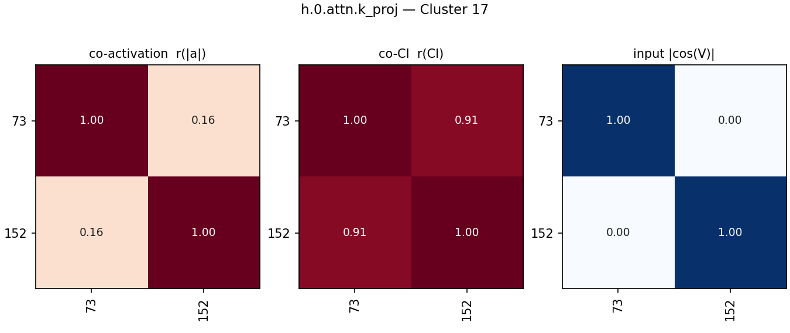

### Cluster 18 (2)

- **125** (mean CI 0.0005, fires 961): predicts '{' or newline after document structural markers
- **406** (mean CI 0.0005, fires 1124): predicts '{' after latex commands like begin and end

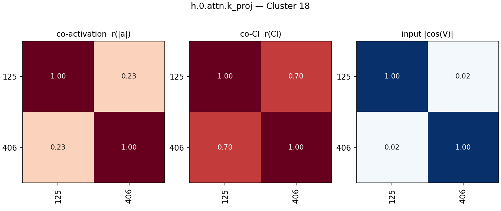

### Cluster 19 (2)

- **215** (mean CI 0.0001, fires 230): fires on function and class declaration keywords
- **369** (mean CI 0.0001, fires 249): bimodal: 'func' promoting '(' and 'not' promoting 'only'

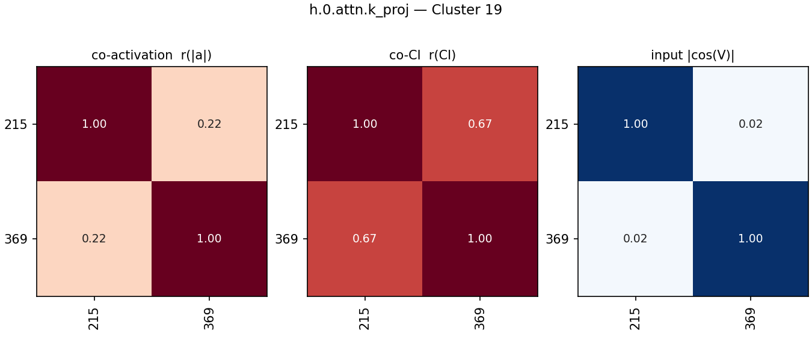

### Cluster 20 (2)

- **274** (mean CI 0.0007, fires 2370): predicting the second word in common collocations
- **377** (mean CI 0.0014, fires 3916): fires on 'as', 'so', and 'how'

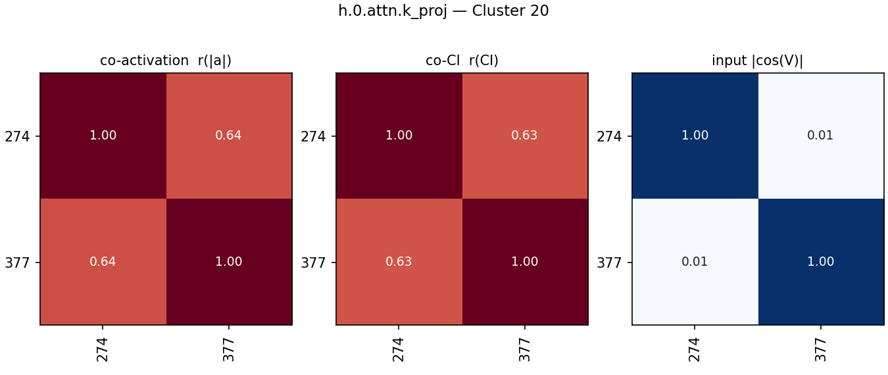

### Cluster 21 (2)

- **295** (mean CI 0.0011, fires 3070): predicts common fixed continuations like 'as' and 'to'
- **504** (mean CI 0.0006, fires 1830): fires on words that precede ' as'

### Ungrouped (41)

- **7** (mean CI 0.0005, fires 1562): citation identifier prefix predictor
- **13** (mean CI 0.0003, fires 600): fires on '~' indicating subscripts in scientific text
- **29** (mean CI 0.4686, fires 1179092): broadly active on most tokens
- **45** (mean CI 0.0003, fires 1132): fires on negative words to predict continuations
- **72** (mean CI 0.0002, fires 639): apostrophes predicting contraction endings
- **76** (mean CI 0.0070, fires 19864): indentation spaces and tabs in code
- **79** (mean CI 0.0001, fires 455): fires on code access modifiers (public/private/protected)
- **85** (mean CI 0.0005, fires 1285): predicts opening parenthesis after control flow keywords
- **91** (mean CI 0.0036, fires 11020): fires on prepositions
- **92** (mean CI 0.0001, fires 132): fires on comment separator lines predicting newline
- **97** (mean CI 0.0034, fires 10943): comma in a list of items or arguments
- **100** (mean CI 0.0000, fires 47): fires on 'xe' in hex escapes, predicts '2'
- **110** (mean CI 0.0030, fires 7673): html/xml tag and structural boundary marker
- **116** (mean CI 0.0001, fires 220): predicts continuations for 'each', 'package', and 'public'
- **187** (mean CI 0.0003, fires 1011): latex math commands predicting braces and subscripts
- **200** (mean CI 0.0002, fires 545): fires on superscript carets to predict superscript contents
- **201** (mean CI 0.0004, fires 998): predicts 'd' after series numbers in legal citations
- **238** (mean CI 0.0099, fires 24853): predicting periods after numbers, abbreviations, and urls
- **243** (mean CI 0.0001, fires 285): non-english european function words
- **257** (mean CI 0.0001, fires 304): opening parentheses and braces
- **286** (mean CI 0.0017, fires 4298): apostrophes predicting contraction and possessive endings
- **299** (mean CI 0.0740, fires 192780): punctuation symbols and highly specialized technical tokens
- **308** (mean CI 0.0017, fires 4749): opening formatting marks and quotes
- **309** (mean CI 0.3723, fires 865108): fires on common stop words and punctuation
- **319** (mean CI 0.0000, fires 82): predicts newline after a hyphen
- **331** (mean CI 0.0008, fires 3583): all-caps words
- **332** (mean CI 0.0023, fires 5972): opening quotation marks and string delimiters
- **336** (mean CI 0.0010, fires 2795): markdown and code structural boundaries
- **349** (mean CI 0.0023, fires 6151): capitalized prepositions beginning introductory phrases
- **365** (mean CI 0.0004, fires 1325): predicts newlines after trailing spaces, hyphens, or backslashes
- **371** (mean CI 0.0054, fires 14437): document boundaries and task beginnings
- **375** (mean CI 0.0002, fires 772): fires on conjunctions "and" and "or"
- **381** (mean CI 0.0000, fires 207): predicts common continuations of 'no'
- **403** (mean CI 0.0079, fires 20534): fires on initials, abbreviations, and numbers predicting periods
- **410** (mean CI 0.0000, fires 57): fires on 'end' and 'wind' to predict 'up'
- **414** (mean CI 0.0003, fires 986): predicts 'than' after comparatives
- **419** (mean CI 0.0099, fires 28469): fires on period / dot tokens
- **431** (mean CI 0.0007, fires 1648): fires on '<' in chat logs and ' into'
- **433** (mean CI 0.0000, fires 64): predicts 'only' or 'just' after 'not'
- **461** (mean CI 0.0035, fires 9573): latex formatting macros and commands in math mode
- **465** (mean CI 0.0376, fires 85364): newline tokens predicting formatting and indentation

## All pairs

All alive components in cluster order (black lines: cluster boundaries; last block: ungrouped).

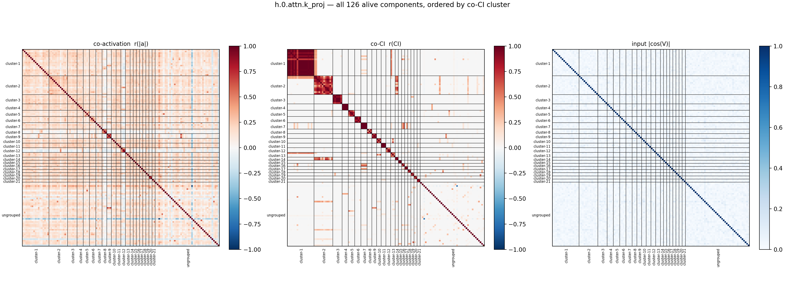

## Full co-CI grid

The co-CI panel alone, large, with every component index on both axes (same cluster order as above).

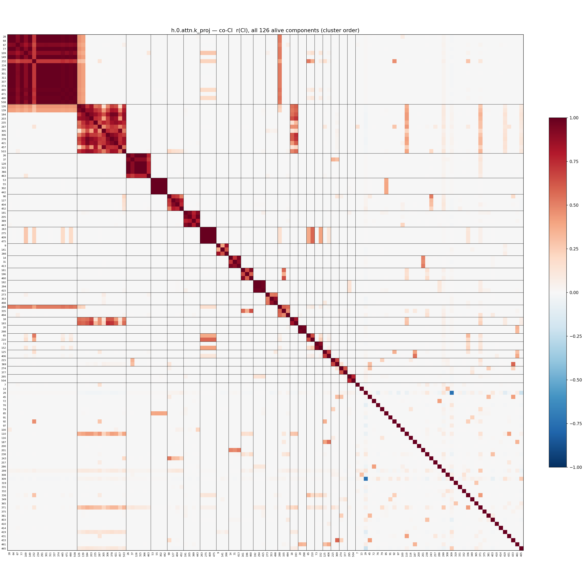
