# L0_k (co-CI > 0.9 clustering) — threshold-rule component clusters (h.0.attn.k_proj)

Alternative to [L0_k_coci.md](L0_k_coci.md) (average-linkage) with threshold rules instead (alive components only, as before): **(1)** two components with co-CI r(CI) > 0.9 are in the same cluster (pairs processed in descending r, chains allowed); **(2)** a component does not join a cluster if it has r(CI) ≤ 0.0 with any existing member (two clusters only merge if every cross pair is > 0); such joins are skipped (0 skipped here). r(CI) over the 2,048,000-token Pile sample. Clusters with ≥ 2 members become groups. **Ordering is by mean CI throughout**: groups by their members' average mean CI (descending), members within a group — and Ungrouped — by mean CI (descending).

Per group with >1 member, four pairwise grids:

- **co-activation** — Pearson r of |a_c| = |‖U_c‖ (V_c·φ)| per token
- **co-CI** — Pearson r of the causal importance (lower_leaky) per token; gray = component never varied (no CI in sample)
- **input cosine** — |cos(V_a, V_b)| of read-in vectors (|·|: component sign is gauge)
- **output cosine** — |cos(U_a, U_b)| of write vectors (same gauge)

'fires' below = tokens with CI > 0.1 in the sample. Grid axes use the same mean-CI order as the lists.

## Groups

| group | n | members |
|---|---|---|
| [Cluster 1](#cluster-1) | 2 | 404 127 |
| [Cluster 2](#cluster-2) | 2 | 139 126 |
| [Cluster 3](#cluster-3) | 5 | 184 203 378 421 306 |
| [Cluster 4](#cluster-4) | 2 | 20 298 |
| [Cluster 5](#cluster-5) | 2 | 457 305 |
| [Cluster 6](#cluster-6) | 2 | 460 161 |
| [Cluster 7](#cluster-7) | 3 | 191 443 205 |
| [Cluster 8](#cluster-8) | 16 | 109 67 490 445 28 301 149 374 291 64 234 337 311 77 471 508 |
| [Cluster 9](#cluster-9) | 2 | 413 14 |
| [Cluster 10](#cluster-10) | 2 | 152 73 |
| [Cluster 11](#cluster-11) | 4 | 55 53 302 442 |
| [Cluster 12](#cluster-12) | 5 | 37 315 26 128 366 |
| [Cluster 13](#cluster-13) | 3 | 415 192 294 |
| [Cluster 14](#cluster-14) | 4 | 409 475 275 263 |
| [Ungrouped](#ungrouped) | 72 | 29 309 299 465 419 238 403 76 371 91 461 97 110 452 349 332 286 308 377 295 336 503 287 331 494 274 431 504 335 90 85 406 7 125 365 288 201 235 353 187 498 414 45 232 141 389 13 200 72 193 375 31 18 79 65 463 257 92 243 369 116 215 381 266 210 273 319 196 9 100 410 433 |

### Cluster 1 (2)

- **404** (mean CI 1.42e-03, fires 3940): fires on non-english words and math probabilities
- **127** (mean CI 1.35e-03, fires 3615): non-english european language tokens

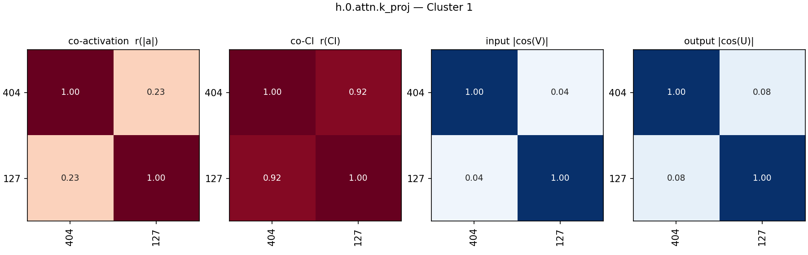

### Cluster 2 (2)

- **139** (mean CI 7.50e-04, fires 1680): activates on document boundaries and section starters
- **126** (mean CI 6.23e-04, fires 1519): document boundaries and 'Q' in Q&A starts

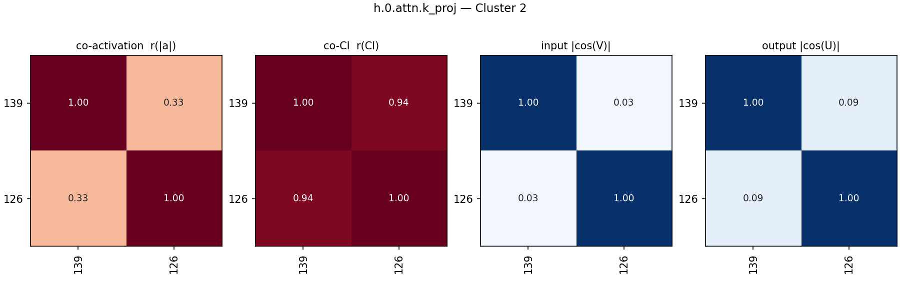

### Cluster 3 (5)

- **184** (mean CI 5.76e-04, fires 1457): fires purely on <|endoftext|>
- **203** (mean CI 5.71e-04, fires 1420): document separator (<|endoftext|>) detector
- **378** (mean CI 4.46e-04, fires 1404): fires on the <|endoftext|> separator token
- **421** (mean CI 4.30e-04, fires 1371): fires on the <|endoftext|> document separator token
- **306** (mean CI 3.15e-04, fires 981): fires on <|endoftext|>, predicts new document starts

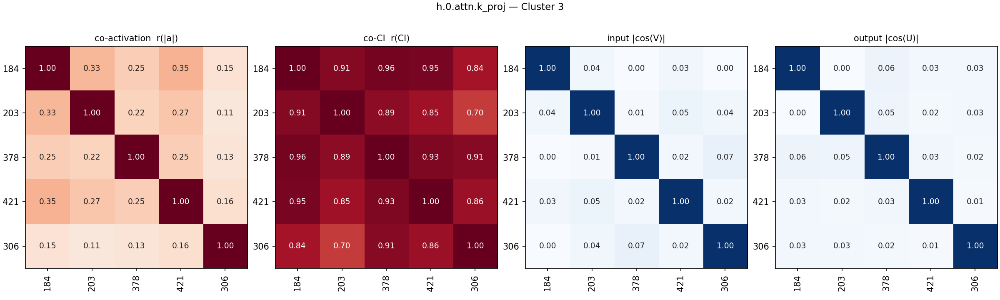

### Cluster 4 (2)

- **20** (mean CI 3.47e-04, fires 973): predicts '{' after 'frac' and '.' after 'doi'/'pone'
- **298** (mean CI 2.54e-04, fires 827): latex fraction commands (\frac) predicting opening brace

### Cluster 5 (2)

- **457** (mean CI 2.07e-04, fires 637): fires exclusively on the <|endoftext|> separator token
- **305** (mean CI 1.80e-04, fires 592): fires on the end of text token

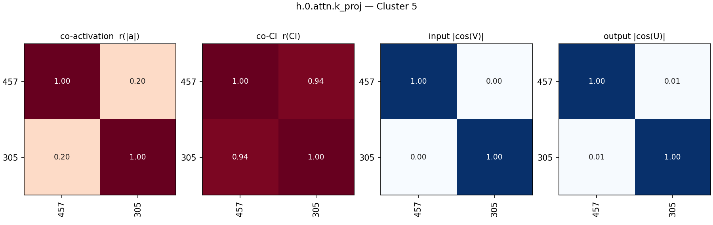

### Cluster 6 (2)

- **460** (mean CI 2.21e-04, fires 648): predicts domain names after url scheme (://)
- **161** (mean CI 1.40e-04, fires 491): fires on '://' in URLs

### Cluster 7 (3)

- **191** (mean CI 1.57e-04, fires 403): predicts syntax (especially colon) following structural keywords
- **443** (mean CI 1.39e-04, fires 329): the 'a' token preceding a colon in q&a formats
- **205** (mean CI 1.36e-04, fires 307): the token 'a' predicting a colon (mainly q&a)

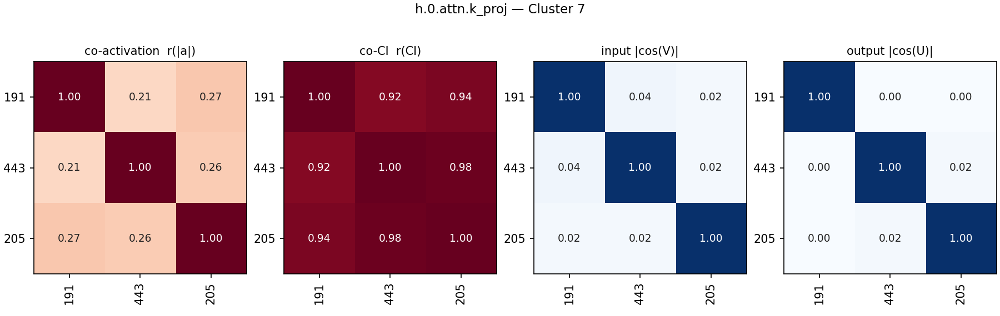

### Cluster 8 (16)

- **109** (mean CI 1.57e-04, fires 377): predicts ':' after 'q' and 'also' after 'see'
- **67** (mean CI 1.45e-04, fires 327): q and copyright token predictor
- **490** (mean CI 1.26e-04, fires 269): predicts ':' after 'Q' or 'See'
- **445** (mean CI 1.25e-04, fires 269): predicts ':' after 'q' and 'also' after 'see'
- **28** (mean CI 1.18e-04, fires 264): predicts ':' after 'q' to format 'q:'
- **301** (mean CI 1.17e-04, fires 252): predicts ':' after 'q' and '>' after 'ubottu'
- **149** (mean CI 1.16e-04, fires 245): the 'q' token predicting ':' in q&a format
- **374** (mean CI 1.16e-04, fires 243): the token 'q' predicting ':'
- **291** (mean CI 1.15e-04, fires 242): predicts ':' after 'q' at start of document
- **64** (mean CI 1.15e-04, fires 243): fires on 'q' to predict ':' in q&a context
- **234** (mean CI 1.15e-04, fires 243): the 'Q' token predicting ':' in Q&A formats
- **337** (mean CI 1.15e-04, fires 243): fires on 'q' at start of document to predict ':'
- **311** (mean CI 1.15e-04, fires 243): predicting ':' after 'Q' at document start
- **77** (mean CI 1.14e-04, fires 244): the token 'q' predicting ':' in q&a formats
- **471** (mean CI 1.14e-04, fires 242): predicts ':' after 'q' in q&a format contexts
- **508** (mean CI 1.13e-04, fires 243): token 'q' predicting ':' in q&a format

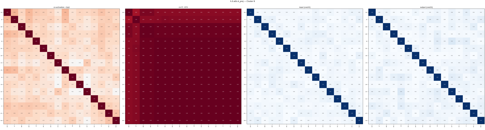

### Cluster 9 (2)

- **413** (mean CI 1.07e-04, fires 415): fires on numbers to predict punctuation or units
- **14** (mean CI 1.04e-04, fires 278): attention key component firing on numbers/digits

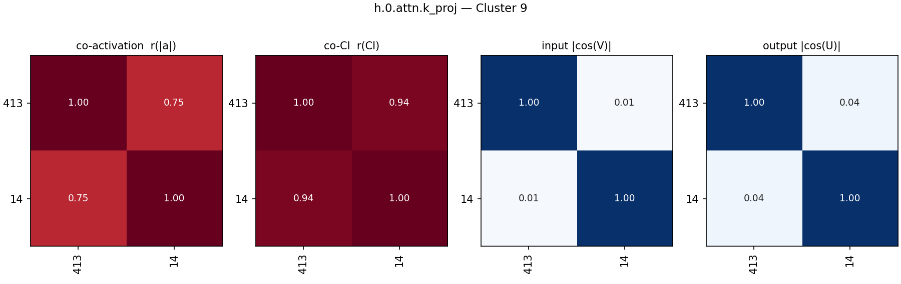

### Cluster 10 (2)

- **152** (mean CI 7.85e-05, fires 214): markdown image tags and 'see also' references
- **73** (mean CI 6.58e-05, fires 187): fires on markdown image syntax to predict captions

### Cluster 11 (4)

- **55** (mean CI 7.23e-05, fires 185): predicts loop initialization syntax after 'for' keywords
- **53** (mean CI 7.07e-05, fires 182): predicts open parenthesis or space after 'for' loops
- **302** (mean CI 6.92e-05, fires 189): for/foreach loop syntax initiation
- **442** (mean CI 6.43e-05, fires 175): fires on 'for' or 'foreach' loop keywords in code

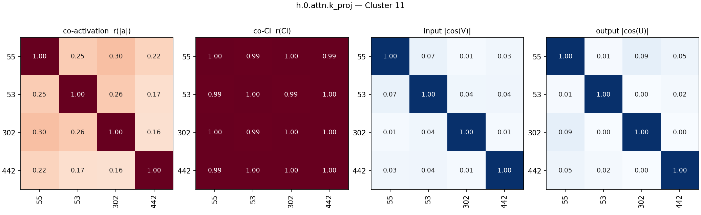

### Cluster 12 (5)

- **37** (mean CI 5.98e-05, fires 169): fires on 'func' and 'which'
- **315** (mean CI 3.76e-05, fires 103): fires on 'which' to predict ' is'
- **26** (mean CI 3.73e-05, fires 103): the token 'Which' predicting ' is' in math problems
- **128** (mean CI 3.64e-05, fires 103): predicts " is" after "which"
- **366** (mean CI 3.62e-05, fires 105): predicts ' is' after 'which' and '{' after 'xymatrix'

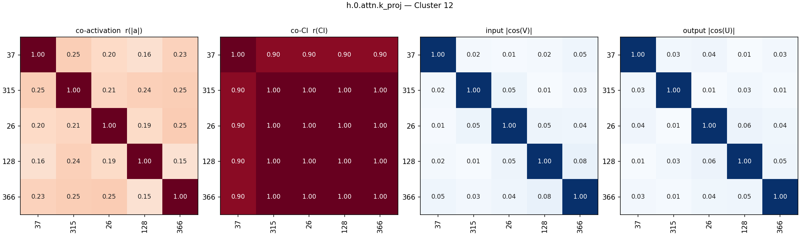

### Cluster 13 (3)

- **415** (mean CI 3.26e-05, fires 68): predicts ' from' after ' replacement' and ':' after 'abstract'
- **192** (mean CI 2.97e-05, fires 53): predicts ' from' after ' replacement' in probability problems
- **294** (mean CI 2.68e-05, fires 53): predicts ' from' after 'without replacement'

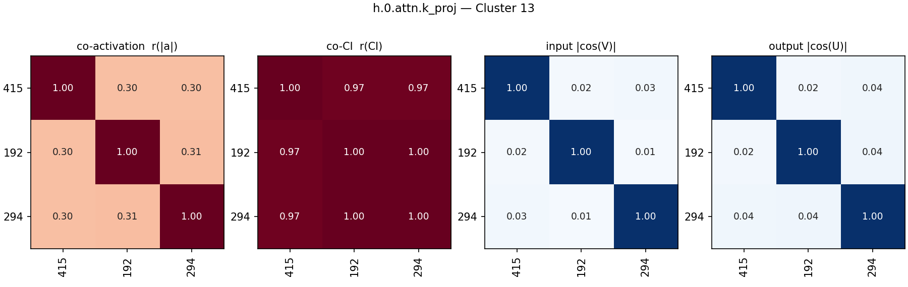

### Cluster 14 (4)

- **409** (mean CI 1.48e-05, fires 32): predicts 'also' after 'see' in referential contexts
- **475** (mean CI 1.42e-05, fires 30): predicts ' also' after 'see' in 'see also' headings
- **275** (mean CI 1.39e-05, fires 32): Predicts 'also' after 'See'
- **263** (mean CI 2.14e-06, fires 24): fires on 'see' in 'see also' section headers

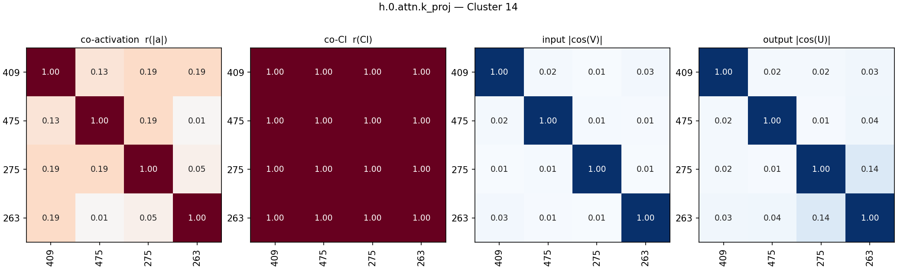

### Ungrouped (72)

- **29** (mean CI 4.69e-01, fires 1179092): broadly active on most tokens
- **309** (mean CI 3.72e-01, fires 865108): fires on common stop words and punctuation
- **299** (mean CI 7.40e-02, fires 192780): punctuation symbols and highly specialized technical tokens
- **465** (mean CI 3.76e-02, fires 85364): newline tokens predicting formatting and indentation
- **419** (mean CI 9.94e-03, fires 28469): fires on period / dot tokens
- **238** (mean CI 9.90e-03, fires 24853): predicting periods after numbers, abbreviations, and urls
- **403** (mean CI 7.93e-03, fires 20534): fires on initials, abbreviations, and numbers predicting periods
- **76** (mean CI 7.02e-03, fires 19864): indentation spaces and tabs in code
- **371** (mean CI 5.36e-03, fires 14437): document boundaries and task beginnings
- **91** (mean CI 3.56e-03, fires 11020): fires on prepositions
- **461** (mean CI 3.50e-03, fires 9573): latex formatting macros and commands in math mode
- **97** (mean CI 3.39e-03, fires 10943): comma in a list of items or arguments
- **110** (mean CI 3.03e-03, fires 7673): html/xml tag and structural boundary marker
- **452** (mean CI 2.80e-03, fires 7780): non-english european languages and accented characters
- **349** (mean CI 2.34e-03, fires 6151): capitalized prepositions beginning introductory phrases
- **332** (mean CI 2.33e-03, fires 5972): opening quotation marks and string delimiters
- **286** (mean CI 1.75e-03, fires 4298): apostrophes predicting contraction and possessive endings
- **308** (mean CI 1.71e-03, fires 4749): opening formatting marks and quotes
- **377** (mean CI 1.40e-03, fires 3916): fires on 'as', 'so', and 'how'
- **295** (mean CI 1.13e-03, fires 3070): predicts common fixed continuations like 'as' and 'to'
- **336** (mean CI 1.04e-03, fires 2795): markdown and code structural boundaries
- **503** (mean CI 9.54e-04, fires 2481): fires on the <|endoftext|> token
- **287** (mean CI 8.92e-04, fires 2743): structural boundary and document separator tokens
- **331** (mean CI 8.44e-04, fires 3583): all-caps words
- **494** (mean CI 8.32e-04, fires 1865): predicts standard trailing punctuation or symbols for specific keywords
- **274** (mean CI 7.35e-04, fires 2370): predicting the second word in common collocations
- **431** (mean CI 7.12e-04, fires 1648): fires on '<' in chat logs and ' into'
- **504** (mean CI 6.30e-04, fires 1830): fires on words that precede ' as'
- **335** (mean CI 6.13e-04, fires 1459): urls and categories (negative) vs latex integrals (positive)
- **90** (mean CI 5.57e-04, fires 1753): foreign languages and the word 'not'
- **85** (mean CI 5.27e-04, fires 1285): predicts opening parenthesis after control flow keywords
- **406** (mean CI 5.16e-04, fires 1124): predicts '{' after latex commands like begin and end
- **7** (mean CI 4.91e-04, fires 1562): citation identifier prefix predictor
- **125** (mean CI 4.63e-04, fires 961): predicts '{' or newline after document structural markers
- **365** (mean CI 4.44e-04, fires 1325): predicts newlines after trailing spaces, hyphens, or backslashes
- **288** (mean CI 4.36e-04, fires 927): predicts a colon after 'category' and 'q'
- **201** (mean CI 4.17e-04, fires 998): predicts 'd' after series numbers in legal citations
- **235** (mean CI 3.94e-04, fires 1138): fires on the <|endoftext|> token
- **353** (mean CI 3.80e-04, fires 1281): fires on articles ('the', 'a', 'an')
- **187** (mean CI 3.41e-04, fires 1011): latex math commands predicting braces and subscripts
- **498** (mean CI 3.28e-04, fires 1013): fires on articles 'the' and 'a'
- **414** (mean CI 3.08e-04, fires 986): predicts 'than' after comparatives
- **45** (mean CI 2.98e-04, fires 1132): fires on negative words to predict continuations
- **232** (mean CI 2.79e-04, fires 578): structural markers and section headers
- **141** (mean CI 2.75e-04, fires 1053): fires on variations of the word "of"
- **389** (mean CI 2.54e-04, fires 956): predicts colon after 'a' in q&a formats
- **13** (mean CI 2.54e-04, fires 600): fires on '~' indicating subscripts in scientific text
- **200** (mean CI 2.50e-04, fires 545): fires on superscript carets to predict superscript contents
- **72** (mean CI 1.98e-04, fires 639): apostrophes predicting contraction endings
- **193** (mean CI 1.85e-04, fires 637): fires on the <|endoftext|> token
- **375** (mean CI 1.83e-04, fires 772): fires on conjunctions "and" and "or"
- **31** (mean CI 1.45e-04, fires 520): fires on numeric tokens predicting punctuation or units
- **18** (mean CI 1.26e-04, fires 477): fires on <|endoftext|> to predict document starts
- **79** (mean CI 1.08e-04, fires 455): fires on code access modifiers (public/private/protected)
- **65** (mean CI 9.95e-05, fires 207): wikipedia footer section headers
- **463** (mean CI 9.62e-05, fires 432): bimodal: html attributes predicting '="' vs which/world/pronouns
- **257** (mean CI 7.64e-05, fires 304): opening parentheses and braces
- **92** (mean CI 7.15e-05, fires 132): fires on comment separator lines predicting newline
- **243** (mean CI 6.48e-05, fires 285): non-english european function words
- **369** (mean CI 6.41e-05, fires 249): bimodal: 'func' promoting '(' and 'not' promoting 'only'
- **116** (mean CI 6.08e-05, fires 220): predicts continuations for 'each', 'package', and 'public'
- **215** (mean CI 5.71e-05, fires 230): fires on function and class declaration keywords
- **381** (mean CI 4.54e-05, fires 207): predicts common continuations of 'no'
- **266** (mean CI 4.39e-05, fires 195): fires on the token ' of'
- **210** (mean CI 4.18e-05, fires 79): predicts second word of wikipedia section headers
- **273** (mean CI 4.05e-05, fires 258): determiners (articles, possessives, quantifiers)
- **319** (mean CI 3.71e-05, fires 82): predicts newline after a hyphen
- **196** (mean CI 2.44e-05, fires 176): predicts typical domain prefixes after '://' in urls
- **9** (mean CI 1.30e-05, fires 64): activates on ' of' and predicts following determiners
- **100** (mean CI 1.11e-05, fires 47): fires on 'xe' in hex escapes, predicts '2'
- **410** (mean CI 9.48e-06, fires 57): fires on 'end' and 'wind' to predict 'up'
- **433** (mean CI 7.13e-06, fires 64): predicts 'only' or 'just' after 'not'

## All pairs

All alive components in cluster order (black lines: cluster boundaries; last block: ungrouped).

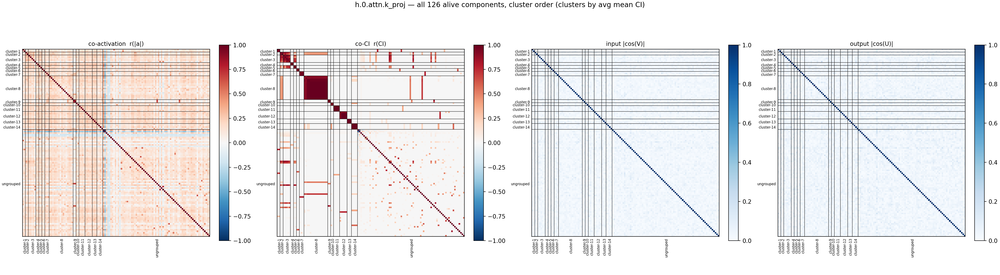

## Full co-CI grid

The co-CI panel alone, large, with every component index on both axes (same cluster order as above).

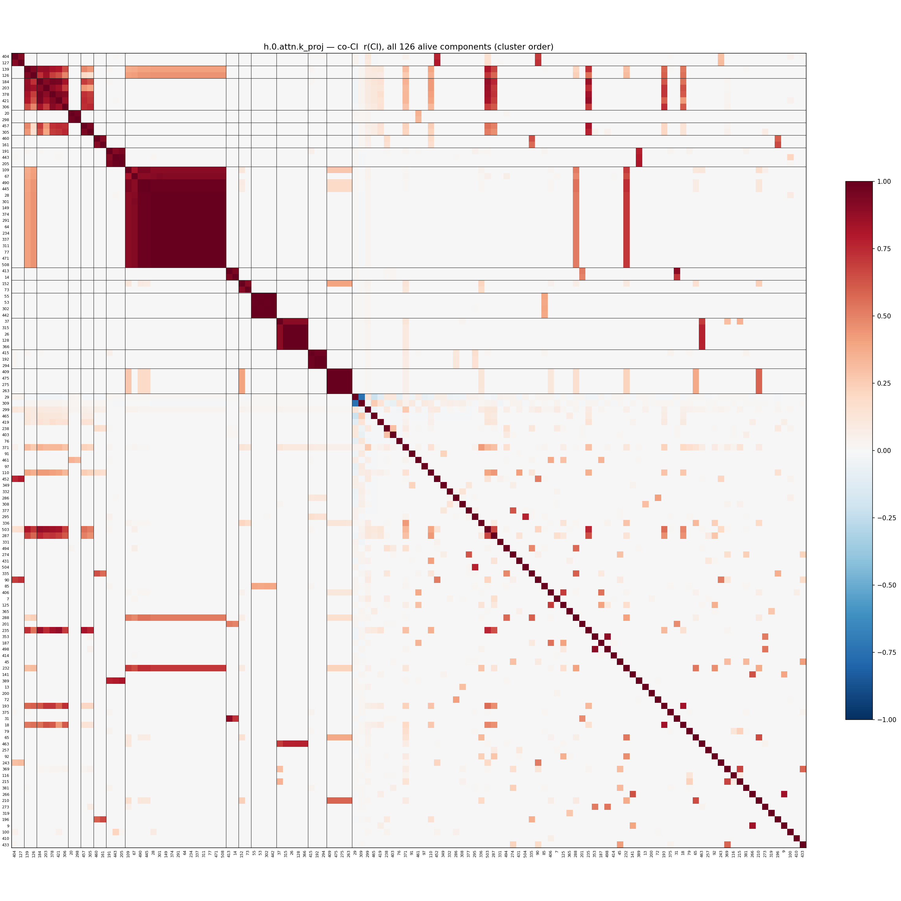
