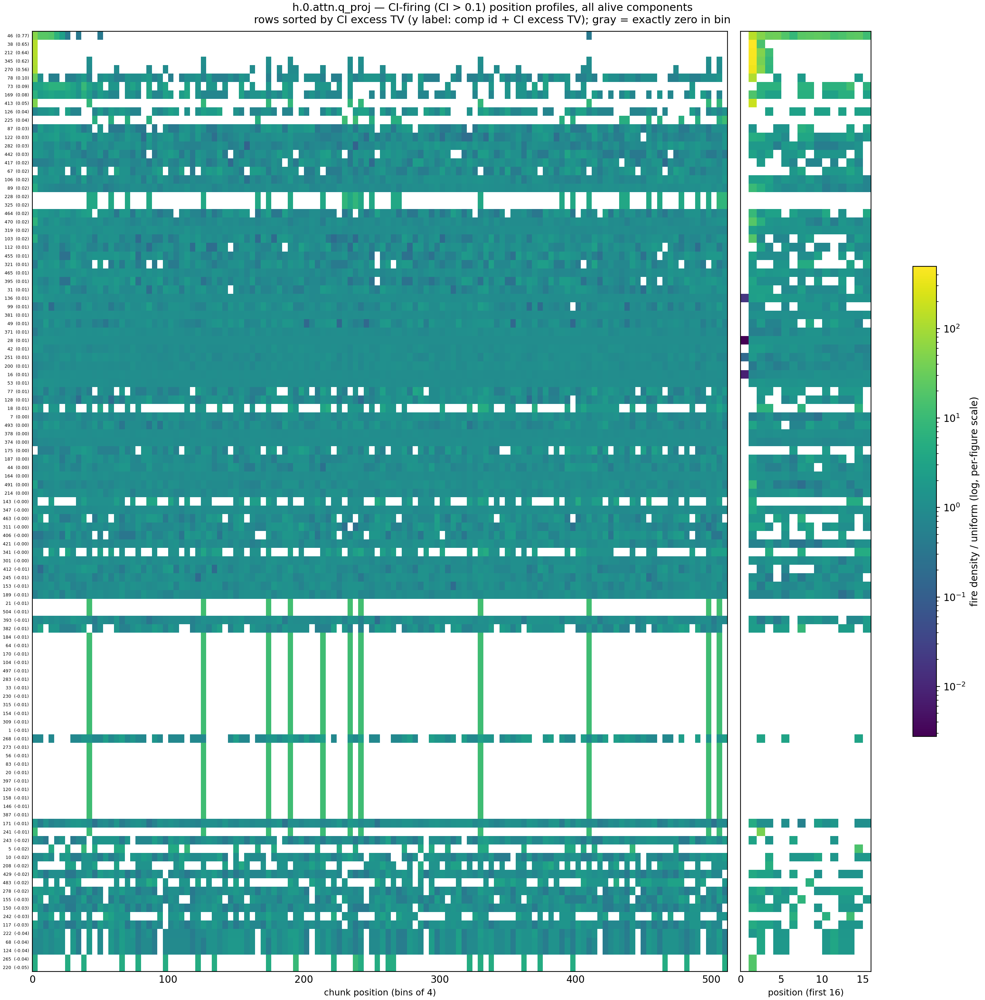
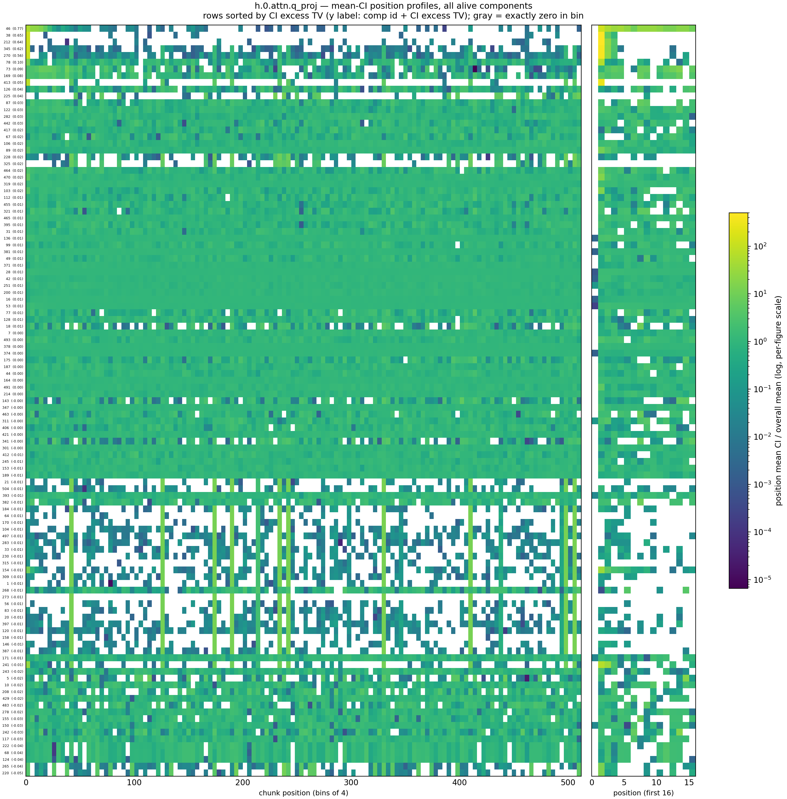
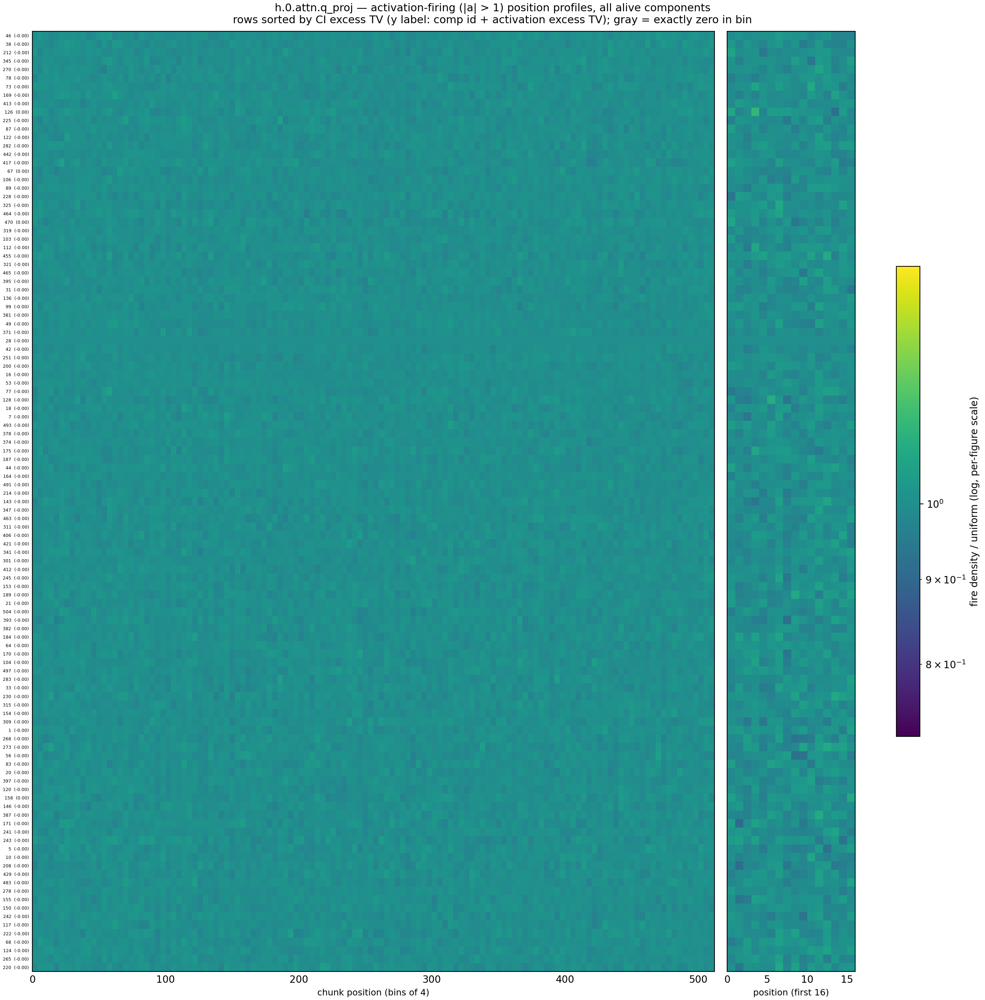
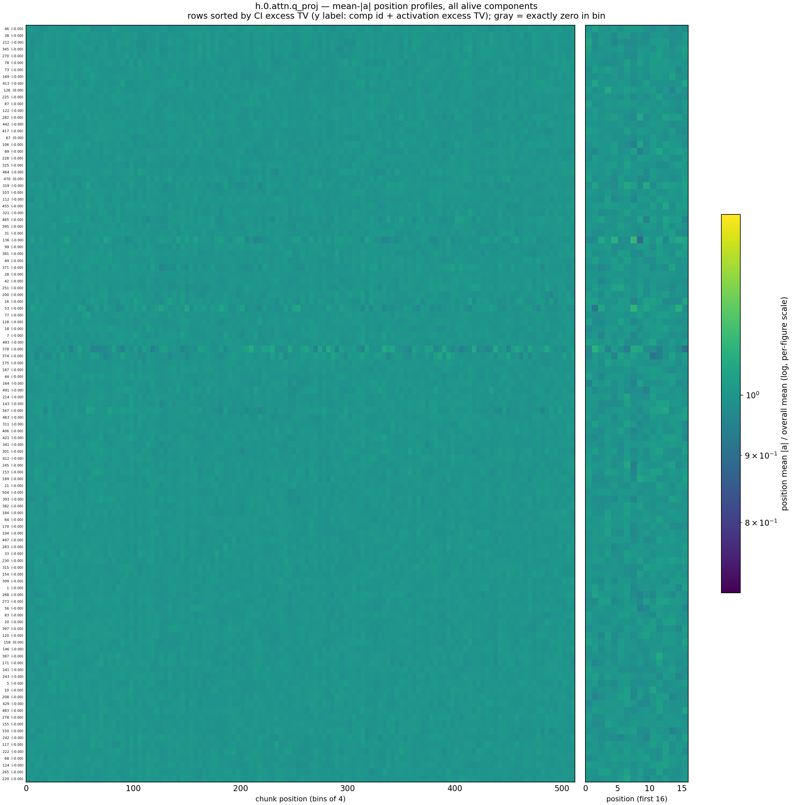
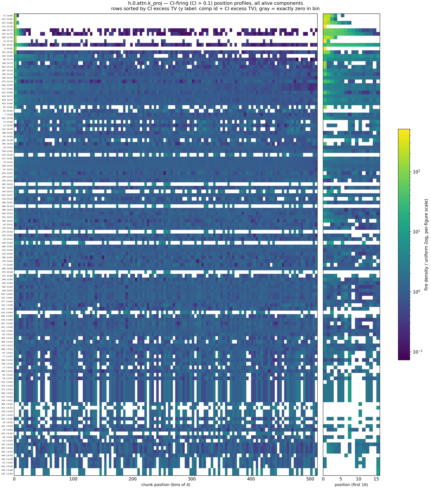
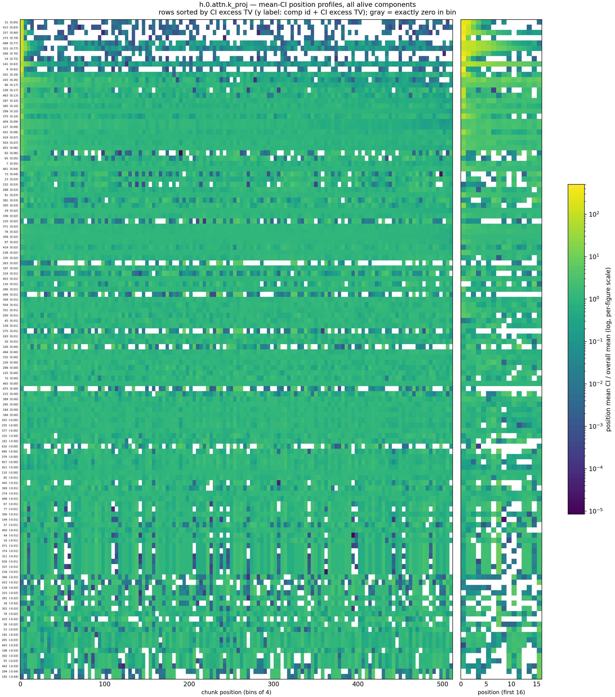
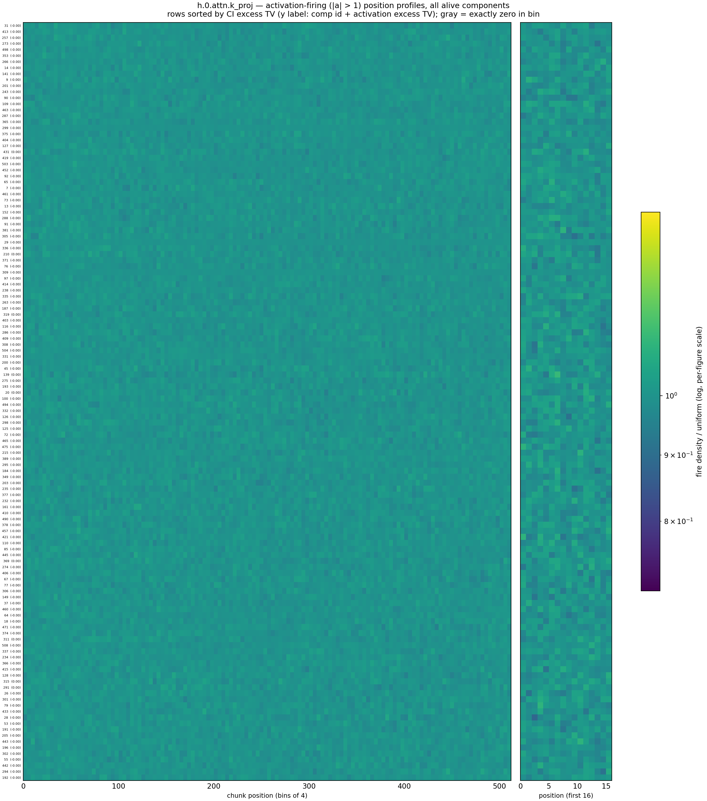
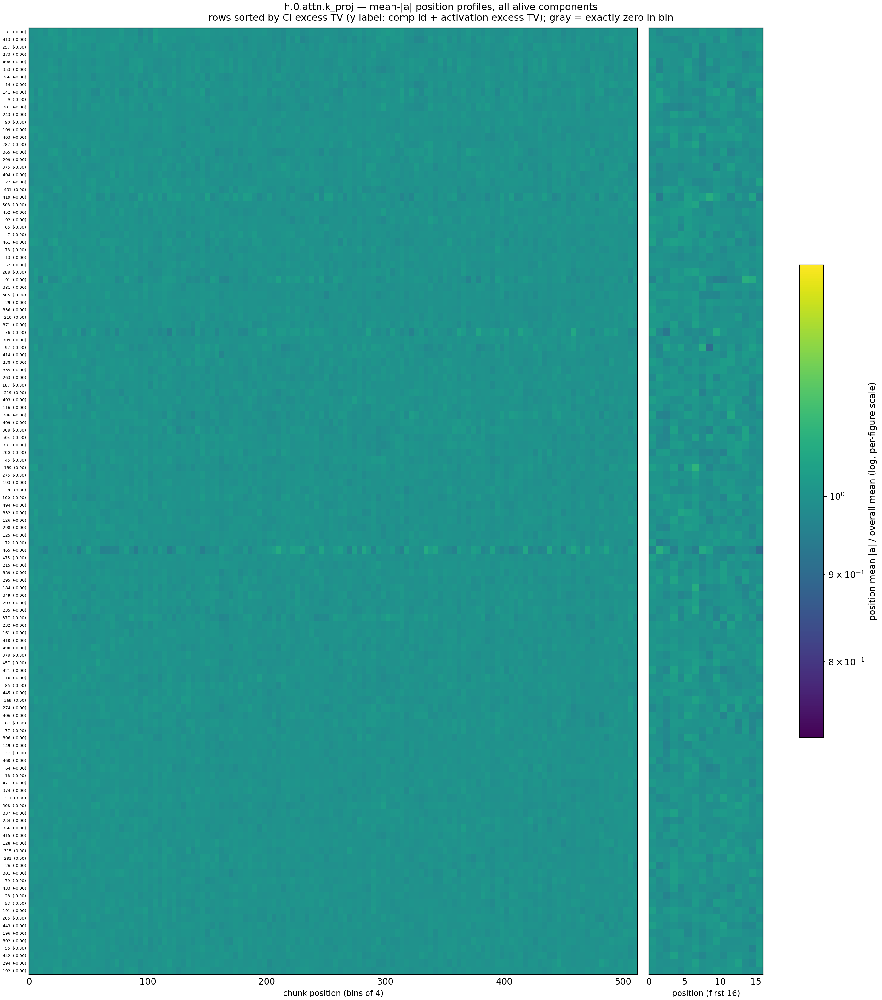

# L0 — q/k components with position-in-chunk-dependent causal importance

Per alive component of `h.0.attn.q_proj` / `h.0.attn.k_proj`: where in the 512-token chunk do its CI firings (CI > 0.1) happen? Over the 4,000 cached Pile rows every chunk position is seen exactly 4,000 times, and chunk boundaries fall at random points inside documents, so the token distribution is the same at every position (position 0 is *not* usually a document start — 74.6% of chunks contain no EOS). A component whose CI depends only on token/context therefore has a flat firing-position profile; any structure is genuine position dependence. Computed on Modal (`hide/pos_ci_compute_modal.py` → `hide/cache/pos_ci.npz`); tables/figures from `hide/pos_ci_report.py`.

**Metric:** profile $w_b$ = share of fires in position bin $b$ (64 bins × 8 positions); $TV = \tfrac12\sum_b |w_b - 1/64|$ (0 = position-independent, 1 = fully displaced from uniform). Raw TV is inflated for components with few fires, so we subtract the Monte-Carlo expectation for the same number of uniform fires: **excess TV** (≈ 0 for flat components). Components with excess TV ≥ 0.5 are **heavily** position-dependent (bold); the tables list everything ≥ 0.25.

**Activation firings (control):** the same profile/metric for *activation* firings, $|a_c| > 1$ with $a_c = \|U_c\|\,(V_c\cdot\varphi)$ (the norm of the component's rank-one write into the q/k output) — columns `a-fires`, `a-excess TV` and their own heatmaps. For **L0** the module input $\varphi$ is a function of the token id alone (post-embedding RMSNorm; position enters attention only via RoPE, downstream of q/k-space), so L0 activation profiles are position-independent by architecture — a null control for the pipeline. For L1 the input carries whatever layer 0 wrote, so positional activations are possible.

**Position 0 is special** (visible in the median-pos column): q components never have CI there — with only one visible key, softmax over a single logit is constant, so the query has zero causal effect at position 0 (holds for all layers: ≤ 37 stray q fires at pos 0 model-wide vs thousands at pos 1). k components show the mirror image: key 0 is read by every later query (the attention-sink site), so k CI is *largest* at position 0.

**Heatmaps:** four per matrix. *Firing* heatmaps show fire-count density relative to uniform (a value of 10 at a position = 10× more of the component's fires land there than a flat profile would put there). *Mean* heatmaps show the per-position mean of CI ($S_p/4000$) resp. $|a_c|$ ($A_p/4000$), divided by the component's overall mean — the same ratio-to-flat reading, but weighted by magnitude instead of binarized. Rows are sorted by CI excess TV in all four. Each figure's color scale spans its own data range (the scales are **not** comparable across figures).

## h.0.attn.q_proj

111 alive components; 5 heavy, 0 moderate. The remaining 106 have excess TV ≤ 0.10 (median -0.00) — position-independent within noise. Activation firings: max a-excess TV = 0.00 — no component's *activation* is position-dependent.

| comp | fires | TV | excess TV | median pos | % pos<8 | % pos<32 | a-fires | a-excess TV | label |
|---|---|---|---|---|---|---|---|---|---|
| **46** | 351 | 0.94 | 0.77 | 4 | 60 | 99 | 616440 | -0.00 | fires on newline tokens |
| **38** | 99 | 0.98 | 0.65 | 1 | 100 | 100 | 530062 | -0.00 | fires on 'the'/'The', predicting ordinals, superlatives, and sequential words |
| **212** | 91 | 0.98 | 0.64 | 1 | 100 | 100 | 574782 | -0.00 | the word 'the' |
| **345** | 122 | 0.90 | 0.62 | 1 | 92 | 92 | 572754 | -0.00 | fires on 'the' and 'The' |
| **270** | 142 | 0.82 | 0.56 | 1 | 84 | 84 | 601665 | -0.00 | fires on ' the' and separators before usernames |

## h.0.attn.k_proj

126 alive components; 10 heavy, 2 moderate. The remaining 114 have excess TV ≤ 0.17 (median 0.00) — position-independent within noise. Activation firings: max a-excess TV = 0.00 — no component's *activation* is position-dependent.

| comp | fires | TV | excess TV | median pos | % pos<8 | % pos<32 | a-fires | a-excess TV | label |
|---|---|---|---|---|---|---|---|---|---|
| **31** | 520 | 0.98 | 0.85 | 1 | 100 | 100 | 476104 | -0.00 | fires on numeric tokens predicting punctuation or units |
| **413** | 415 | 0.98 | 0.83 | 0 | 100 | 100 | 504595 | -0.00 | fires on numbers to predict punctuation or units |
| **257** | 304 | 0.98 | 0.80 | 1 | 100 | 100 | 377421 | -0.00 | opening parentheses and braces |
| **273** | 258 | 0.98 | 0.79 | 0 | 100 | 100 | 448579 | -0.00 | determiners (articles, possessives, quantifiers) |
| **498** | 1013 | 0.87 | 0.77 | 3 | 86 | 90 | 461229 | -0.00 | fires on articles 'the' and 'a' |
| **353** | 1281 | 0.85 | 0.77 | 3 | 80 | 89 | 454154 | -0.00 | fires on articles ('the', 'a', 'an') |
| **266** | 195 | 0.98 | 0.76 | 1 | 100 | 100 | 427625 | -0.00 | fires on the token ' of' |
| **14** | 278 | 0.91 | 0.72 | 0 | 92 | 93 | 427668 | -0.00 | attention key component firing on numbers/digits |
| **141** | 1053 | 0.72 | 0.63 | 8 | 48 | 78 | 391168 | -0.00 | fires on variations of the word "of" |
| **9** | 64 | 0.98 | 0.62 | 0 | 100 | 100 | 338335 | -0.00 | activates on ' of' and predicts following determiners |
| 201 | 998 | 0.39 | 0.29 | 72 | 41 | 43 | 538966 | -0.00 | predicts 'd' after series numbers in legal citations |
| 243 | 285 | 0.45 | 0.26 | 69 | 14 | 37 | 486416 | -0.00 | non-english european function words |

