# L0_q — component groups by expected CI co-firing (h.0.attn.q_proj)

All 111 alive components (harvest mean CI > 1e-6). Groups were formed by Claude (2026-08-28) reading each component's **full website description** (label + autointerp reasoning, fetched from the paper site) and grouping components expected to have high per-token CI-similarity: same trigger tokens/positions, subset-detectors of one pattern merged; patterns on different tokens kept apart; bimodal or vague descriptions left ungrouped. No activation/CI data was used to form the groups.

Per group with >1 member, four pairwise grids over a 2,048,000-token Pile sample (4000 cached rows):

- **co-activation** — Pearson r of |a_c| = |‖U_c‖ (V_c·φ)| per token
- **co-CI** — Pearson r of the causal importance (lower_leaky) per token; gray = component never varied (no CI in sample)
- **input cosine** — |cos(V_a, V_b)| of read-in vectors (|·|: component sign is gauge)
- **output cosine** — |cos(U_a, U_b)| of write vectors (|·|: same gauge)

'fires' below = tokens with CI > 0.1 in the sample. Within each group, components are ordered by component id (in the lists and on all grid axes).

## Groups

| group | n | members |
|---|---|---|
| [Hacker-news title|username hyphen](#hn-hyphen) | 26 | 1 20 21 33 56 64 83 104 120 146 154 158 170 184 228 230 241 273 283 309 315 387 397 413 497 504 |
| [Fires on the token ' as'](#as-token) | 4 | 7 208 421 491 |
| [Token right after 'as'/'how'/'so' (as X as …)](#as-interior) | 4 | 67 99 128 245 |
| [Colon in 'a:' (answer marker)](#a-colon) | 3 | 68 124 222 |
| ['Q' (after EOS) predicting ':'](#q-colon) | 3 | 155 382 463 |
| [Colons as structural prefixes/separators](#struct-colon) | 3 | 106 282 465 |
| [Fires on 'the'](#the) | 3 | 38 212 345 |
| [Closing brace of LaTeX \begin{...} → newline/alignment](#latex-begin-close) | 4 | 31 126 341 442 |
| [Opening brace after LaTeX commands](#latex-open-brace) | 3 | 10 153 301 |
| [Closing tilde in markdown subscripts](#md-tilde) | 2 | 395 455 |
| [Closing parenthesis in multiple-choice options](#mc-paren) | 2 | 117 150 |
| [Hyphens in citation keys → journal names](#citekey-hyphen) | 2 | 73 169 |
| [Commas & periods (sentence pauses)](#punct-pause) | 3 | 53 89 136 |
| [Fires on newline tokens](#newline) | 2 | 46 378 |
| [Quotes & apostrophes](#quotes) | 3 | 251 371 483 |
| [Interior of fixed prepositional/transitional phrases](#prep-phrase) | 5 | 42 112 175 200 417 |
| [Word completing 'not X' / 'no X'](#not-x) | 2 | 87 321 |
| ['See also' headings](#see-also) | 2 | 220 265 |
| [Ungrouped](#ungrouped) | 35 | 5 16 18 28 44 49 77 78 103 122 143 164 171 187 189 214 225 242 243 268 270 278 311 319 325 347 374 381 393 406 412 429 464 470 493 |

### Hacker-news title|username hyphen (26)

- **1** (mean CI 0.0000, fires 11): hyphen before username in hacker news posts
- **20** (mean CI 0.0000, fires 11): fires on hyphens before usernames in hn-style dumps
- **21** (mean CI 0.0000, fires 10): hyphen separating hacker news title and username
- **33** (mean CI 0.0000, fires 11): hyphen preceding username in link aggregator formats
- **56** (mean CI 0.0000, fires 11): hyphen before username in hacker news submissions
- **64** (mean CI 0.0000, fires 11): fires on hyphen preceding usernames in link aggregators
- **83** (mean CI 0.0000, fires 11): predicts submitter usernames after hyphens in hacker news
- **104** (mean CI 0.0000, fires 11): hyphen separating article title and username
- **120** (mean CI 0.0000, fires 11): predicts hacker news usernames after title hyphens
- **146** (mean CI 0.0000, fires 11): hyphen separating post title and author username
- **154** (mean CI 0.0000, fires 11): hyphen before author username in hacker news posts
- **158** (mean CI 0.0000, fires 11): hyphen before username in hacker news posts
- **170** (mean CI 0.0000, fires 11): hyphen separating post title and author username
- **184** (mean CI 0.0000, fires 11): fires on dash separating title and author/username
- **228** (mean CI 0.0000, fires 34): hyphen preceding usernames in hacker news formatting
- **230** (mean CI 0.0000, fires 11): hyphen separating article title from username
- **241** (mean CI 0.0000, fires 12): predicts username after hyphen in hacker news posts
- **273** (mean CI 0.0000, fires 11): hacker news post title to username separator hyphen
- **283** (mean CI 0.0000, fires 11): hyphen before usernames in hacker news post headers
- **309** (mean CI 0.0000, fires 11): fires on hyphen preceding usernames in hn posts
- **315** (mean CI 0.0000, fires 11): activates on hyphens preceding hacker news usernames
- **387** (mean CI 0.0000, fires 11): fires on hyphens before usernames in hn data
- **397** (mean CI 0.0000, fires 11): hyphen preceding username in hacker news posts
- **413** (mean CI 0.0000, fires 16): hyphen separating title and username in news posts
- **497** (mean CI 0.0000, fires 11): hyphen before username in hacker news metadata
- **504** (mean CI 0.0000, fires 10): Predicts author usernames after a hyphen

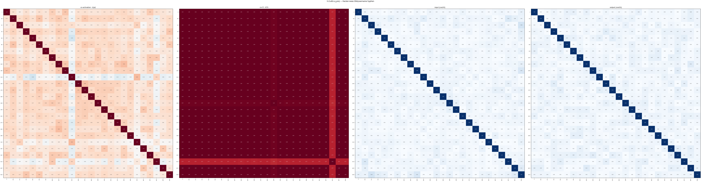

### Fires on the token ' as' (4)

- **7** (mean CI 0.0009, fires 2174): fires on the token ' as'
- **208** (mean CI 0.0000, fires 92): the token ' as' in 'as X as' and 'so as' constructs
- **421** (mean CI 0.0008, fires 1796): fires on the token ' as'
- **491** (mean CI 0.0009, fires 2395): fires on 'as' in phrases like 'such as'

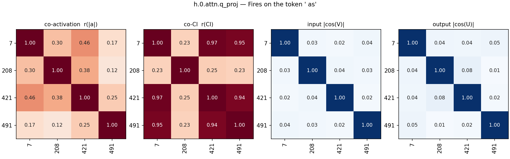

### Token right after 'as'/'how'/'so' (as X as …) (4)

- **67** (mean CI 0.0001, fires 303): predicts nouns after 'as a' (e.g. result)
- **99** (mean CI 0.0002, fires 666): predicts 'as' in 'as [word] as' phrases
- **128** (mean CI 0.0002, fires 704): predicting ' as' in 'as [word] as' constructions
- **245** (mean CI 0.0006, fires 1488): words following degree modifiers like as, how, so

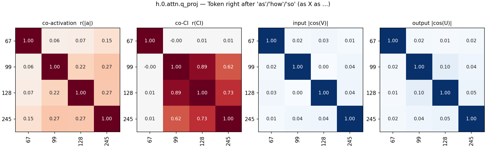

### Colon in 'a:' (answer marker) (3)

- **68** (mean CI 0.0001, fires 290): fires on the colon in 'a:' to predict a newline
- **124** (mean CI 0.0001, fires 290): fires on colon in 'a:' q&a format
- **222** (mean CI 0.0001, fires 305): fires on colon in 'a:' predicting newline

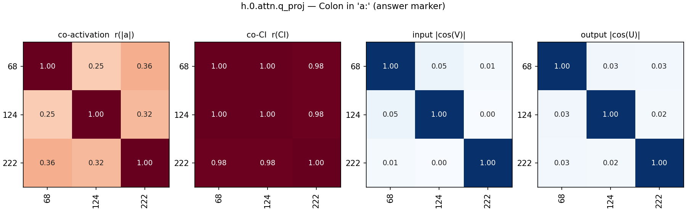

### 'Q' (after EOS) predicting ':' (3)

- **155** (mean CI 0.0001, fires 285): fires on 'q' to predict ':' in q&a context
- **382** (mean CI 0.0001, fires 242): predicting ':' after 'Q' at document start
- **463** (mean CI 0.0001, fires 339): predicts ':' after 'q' and completes hex codes

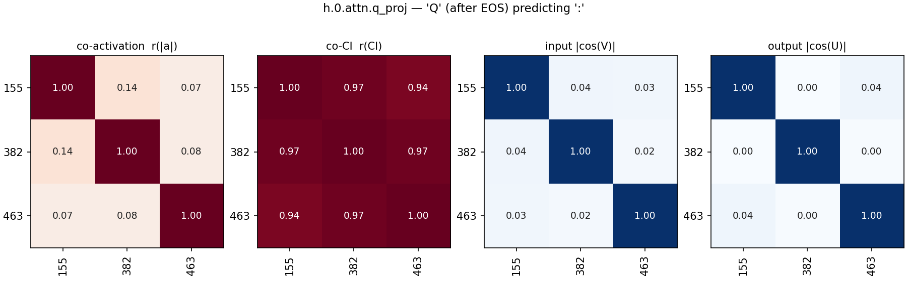

### Colons as structural prefixes/separators (3)

- **106** (mean CI 0.0006, fires 1557): activates on colons to predict category words
- **282** (mean CI 0.0005, fires 1091): colon token in structural prefixes (category:, q:)
- **465** (mean CI 0.0012, fires 3482): fires on colons used as structural separators

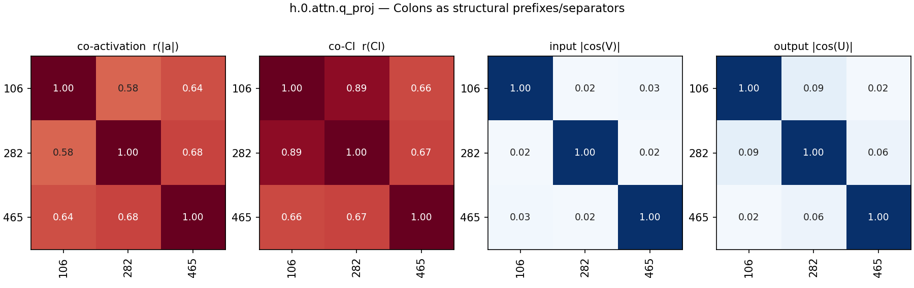

### Fires on 'the' (3)

- **38** (mean CI 0.0000, fires 99): fires on 'the'/'The', predicting ordinals, superlatives, and sequential words
- **212** (mean CI 0.0000, fires 91): the word 'the'
- **345** (mean CI 0.0000, fires 122): fires on 'the' and 'The'

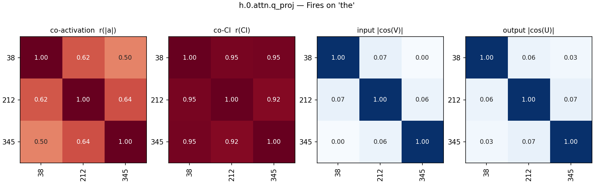

### Closing brace of LaTeX \begin{...} → newline/alignment (4)

- **31** (mean CI 0.0003, fires 623): predicts newline or alignment after latex closing brace
- **126** (mean CI 0.0001, fires 192): predicts latex alignment specifiers and newlines
- **341** (mean CI 0.0000, fires 106): predicts latex array alignment specifiers
- **442** (mean CI 0.0001, fires 343): latex environment closing brace predicting newline

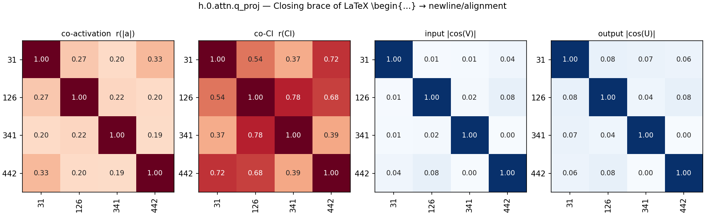

### Opening brace after LaTeX commands (3)

- **10** (mean CI 0.0000, fires 301): predicts equation or figure prefixes in latex labels
- **153** (mean CI 0.0006, fires 1345): predicts latex environments and label prefixes
- **301** (mean CI 0.0016, fires 4009): opening curly braces in latex commands

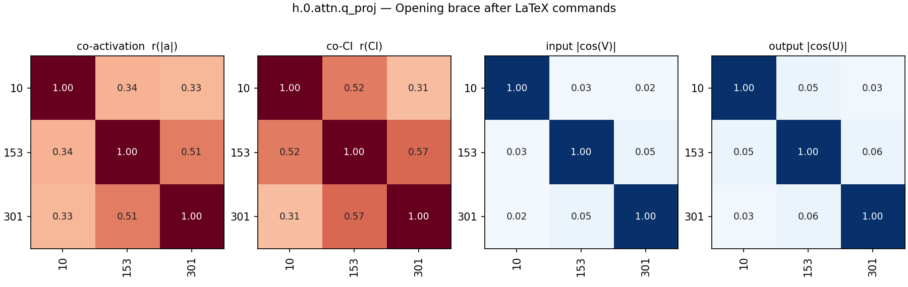

### Closing tilde in markdown subscripts (2)

- **395** (mean CI 0.0002, fires 485): closing tilde in markdown subscripts
- **455** (mean CI 0.0002, fires 523): closing tilde for markdown subscripts

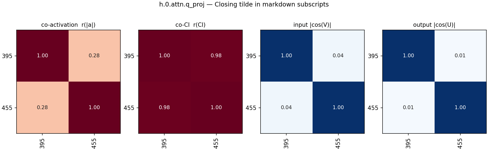

### Closing parenthesis in multiple-choice options (2)

- **117** (mean CI 0.0001, fires 340): closing parenthesis in multiple-choice option lists
- **150** (mean CI 0.0001, fires 329): closing parenthesis in multiple choice options

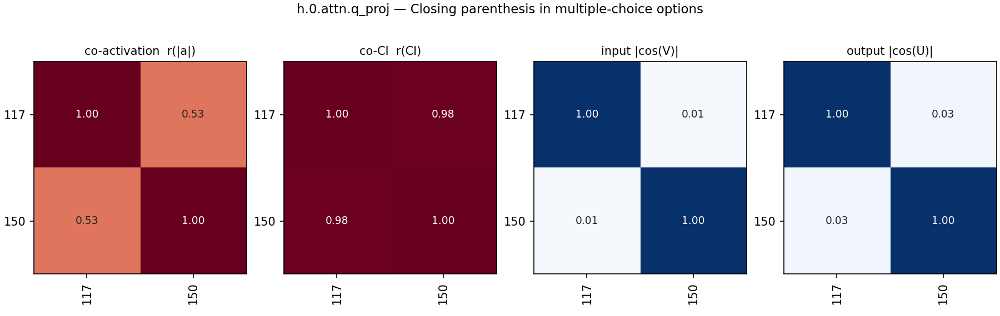

### Hyphens in citation keys → journal names (2)

- **73** (mean CI 0.0000, fires 82): hyphen preceding journal abbreviations in citations
- **169** (mean CI 0.0001, fires 182): hyphens in academic citation keys predicting journal names

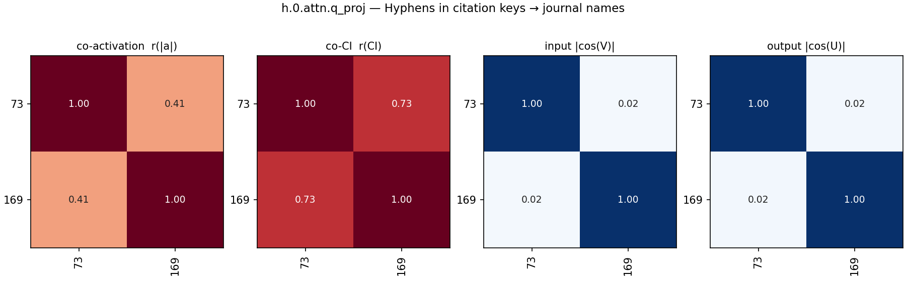

### Commas & periods (sentence pauses) (3)

- **53** (mean CI 0.0438, fires 106524): punctuation marks (periods and commas)
- **89** (mean CI 0.0016, fires 5650): commas following introductory phrases and transitions
- **136** (mean CI 0.0107, fires 27726): fires on commas

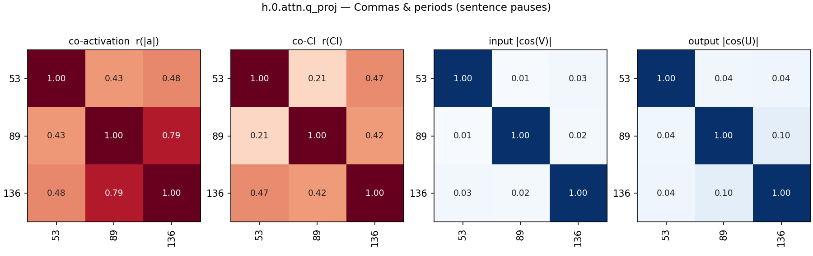

### Fires on newline tokens (2)

- **46** (mean CI 0.0001, fires 351): fires on newline tokens
- **378** (mean CI 0.0347, fires 78487): newline token detector

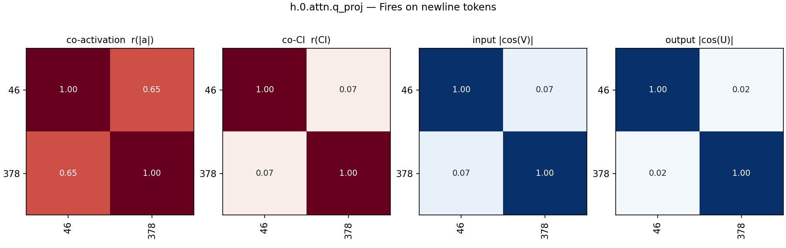

### Quotes & apostrophes (3)

- **251** (mean CI 0.0022, fires 5857): closing quotation marks
- **371** (mean CI 0.0037, fires 9426): quotes, apostrophes, asterisks, and tildes
- **483** (mean CI 0.0000, fires 86): closing single quotation marks

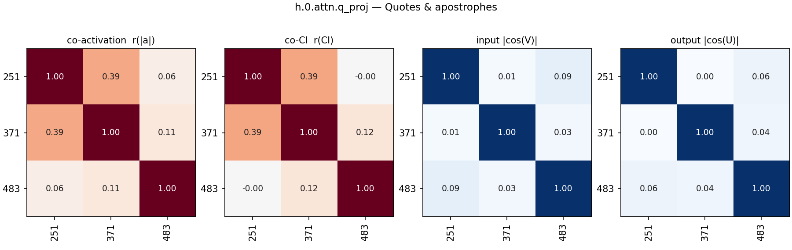

### Interior of fixed prepositional/transitional phrases (5)

- **42** (mean CI 0.0043, fires 12070): parts of transitional and prepositional phrases
- **112** (mean CI 0.0002, fires 647): objects of common prepositional phrases
- **175** (mean CI 0.0001, fires 249): fires on introductory phrases involving prepositional objects
- **200** (mean CI 0.0031, fires 8357): core words in prepositional and transitional phrases
- **417** (mean CI 0.0002, fires 746): phrasal preposition centers predicting completing prepositions

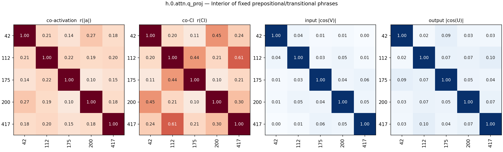

### Word completing 'not X' / 'no X' (2)

- **87** (mean CI 0.0001, fires 349): second word in phrases like not only, no longer
- **321** (mean CI 0.0001, fires 335): words completing 'not X' or 'no X' phrases

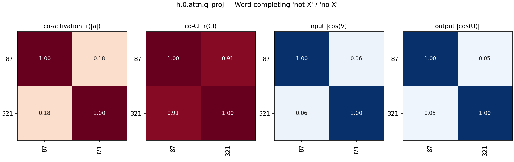

### 'See also' headings (2)

- **220** (mean CI 0.0000, fires 27): "also" in "See also" section headings
- **265** (mean CI 0.0000, fires 27): predicts newlines after 'see also'

### Ungrouped (35)

- **5** (mean CI 0.0000, fires 31): fires on 're' in 'in re' legal citations
- **16** (mean CI 0.0490, fires 122779): fires on word fragments and prepositions
- **18** (mean CI 0.0000, fires 79): latex math delimiters and structured text separators
- **28** (mean CI 0.5568, fires 1295078): fires promiscuously on nearly all tokens
- **44** (mean CI 0.0003, fires 1017): forward slashes in urls and 're' in legal
- **49** (mean CI 0.0003, fires 813): fires on colons marking q&a or comparisons
- **77** (mean CI 0.0001, fires 288): phrases after 'in' and latex math delimiters
- **78** (mean CI 0.0001, fires 249): numbers in star pagination of legal texts
- **103** (mean CI 0.0002, fires 701): common phrase and abbreviation completion
- **122** (mean CI 0.0002, fires 580): dashes/structure (positive) and words following 'not' (negative)
- **143** (mean CI 0.0001, fires 112): punctuation predicting legal contexts and usernames
- **164** (mean CI 0.0068, fires 16686): punctuation starting code elements, comments, and strings
- **171** (mean CI 0.0003, fires 916): fires on 'than' and predicts numbers or quantities
- **187** (mean CI 0.0005, fires 1328): irc username brackets and 'et al'
- **189** (mean CI 0.0010, fires 2224): fires on `>` in xml/html and chat logs
- **214** (mean CI 0.0011, fires 2829): file extensions/tlds (negative) and latex \left( (positive)
- **225** (mean CI 0.0000, fires 23): predicts newline after yaml frontmatter separator
- **242** (mean CI 0.0000, fires 87): numbers following figure/table predicting caption starts
- **243** (mean CI 0.0002, fires 336): closing caret (^) in superscript markdown
- **268** (mean CI 0.0000, fires 165): closing underscores (italics) and title-separating dashes
- **270** (mean CI 0.0001, fires 142): fires on ' the' and separators before usernames
- **278** (mean CI 0.0002, fires 346): colon in 'a:' and 're' in 'in re'
- **311** (mean CI 0.0002, fires 500): second word in common two-word phrases (at least, end up)
- **319** (mean CI 0.0051, fires 14628): letters inside acronyms and all-caps words
- **325** (mean CI 0.0000, fires 34): predicts newlines after hyphens/dashes introducing markdown headers or authors
- **347** (mean CI 0.0036, fires 9630): single-letter tokens, contractions, and word fragments
- **374** (mean CI 0.0210, fires 53679): fires on prepositions to predict determiners
- **381** (mean CI 0.0096, fires 22991): non-english european languages
- **393** (mean CI 0.0004, fires 1242): fires on tokens completing comparative or correlative phrases
- **406** (mean CI 0.0001, fires 404): apostrophes/quotes (positive) and 'up' (negative)
- **412** (mean CI 0.0002, fires 707): fires on the token 'out'
- **429** (mean CI 0.0001, fires 367): Predicts tokens following ')' in Go receivers and math options
- **464** (mean CI 0.0001, fires 391): numbers in technical identifier and specific formatting contexts
- **470** (mean CI 0.0009, fires 2272): tlds and file extensions in urls/paths
- **493** (mean CI 0.0002, fires 793): html tag closers and latex subscript openers

## All pairs

All alive components in group order (black lines: group boundaries; last block: ungrouped).

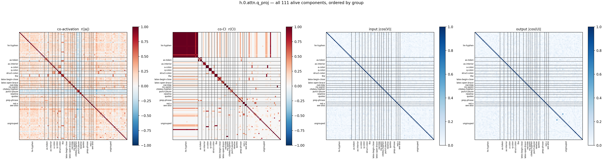

## Full co-CI grid

The co-CI panel alone, large, with every component index on both axes (same group order as above).

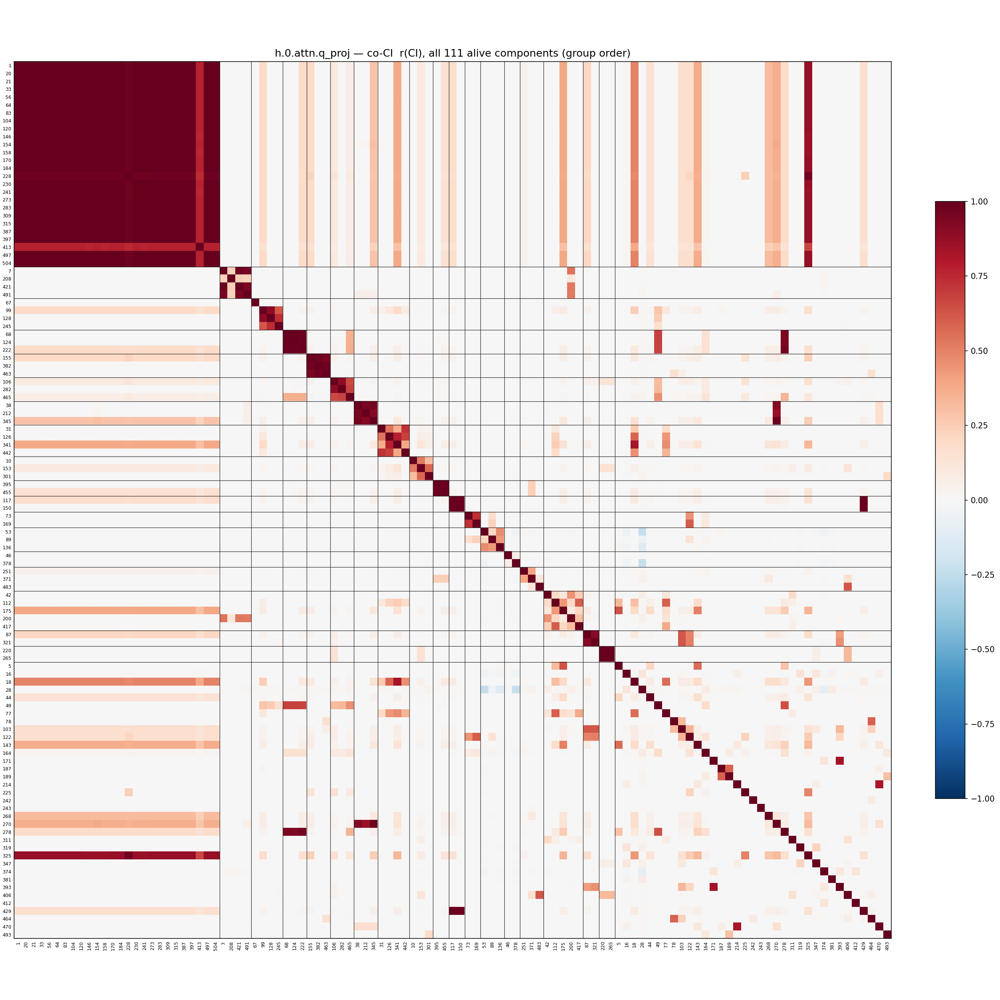
