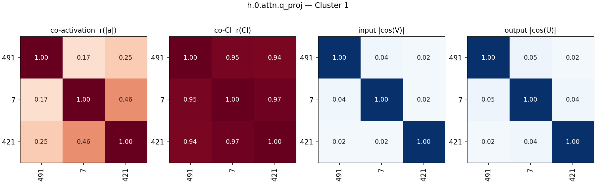
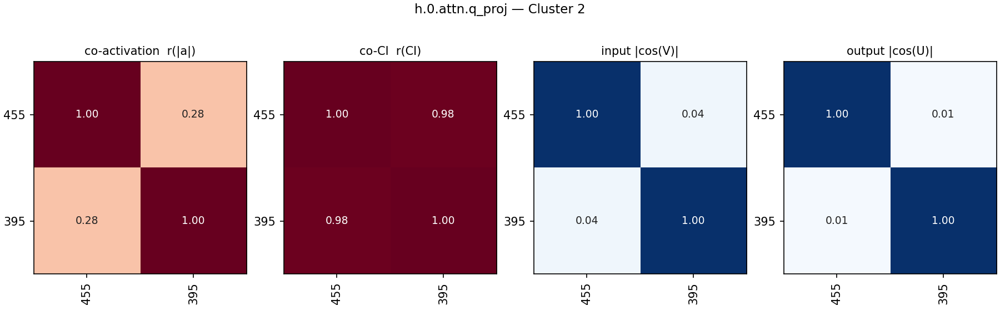
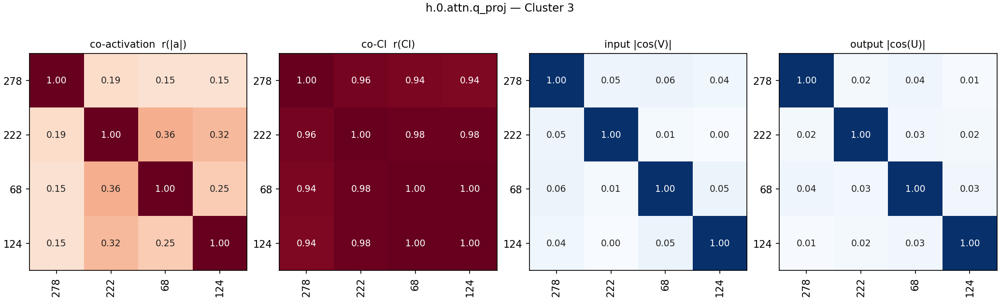
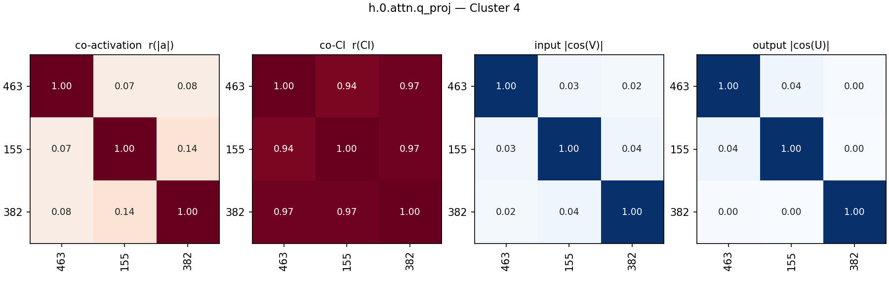
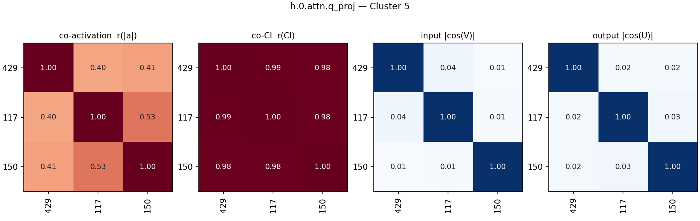
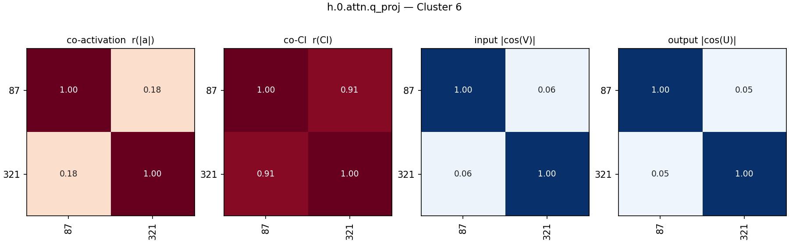
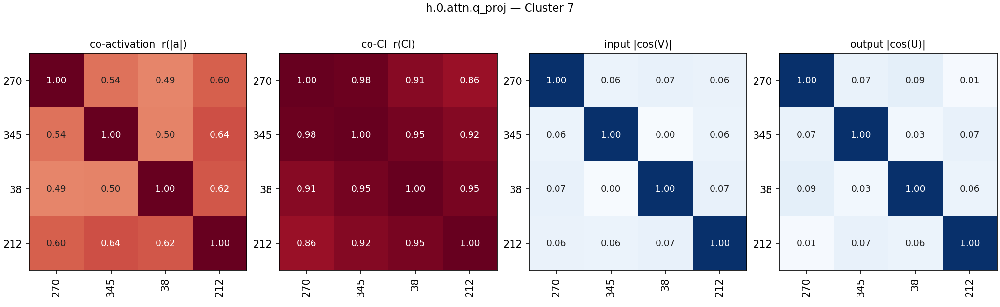
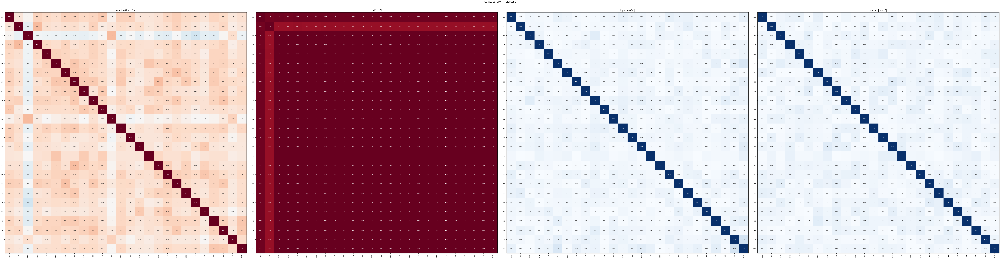
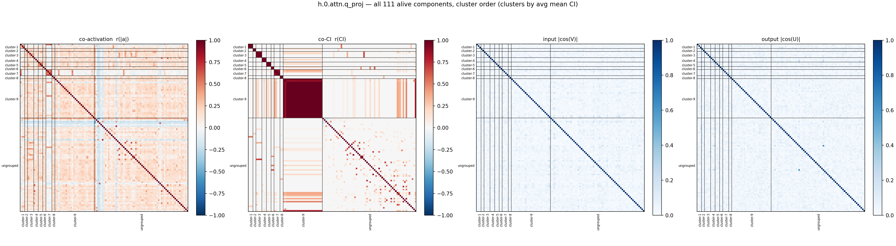
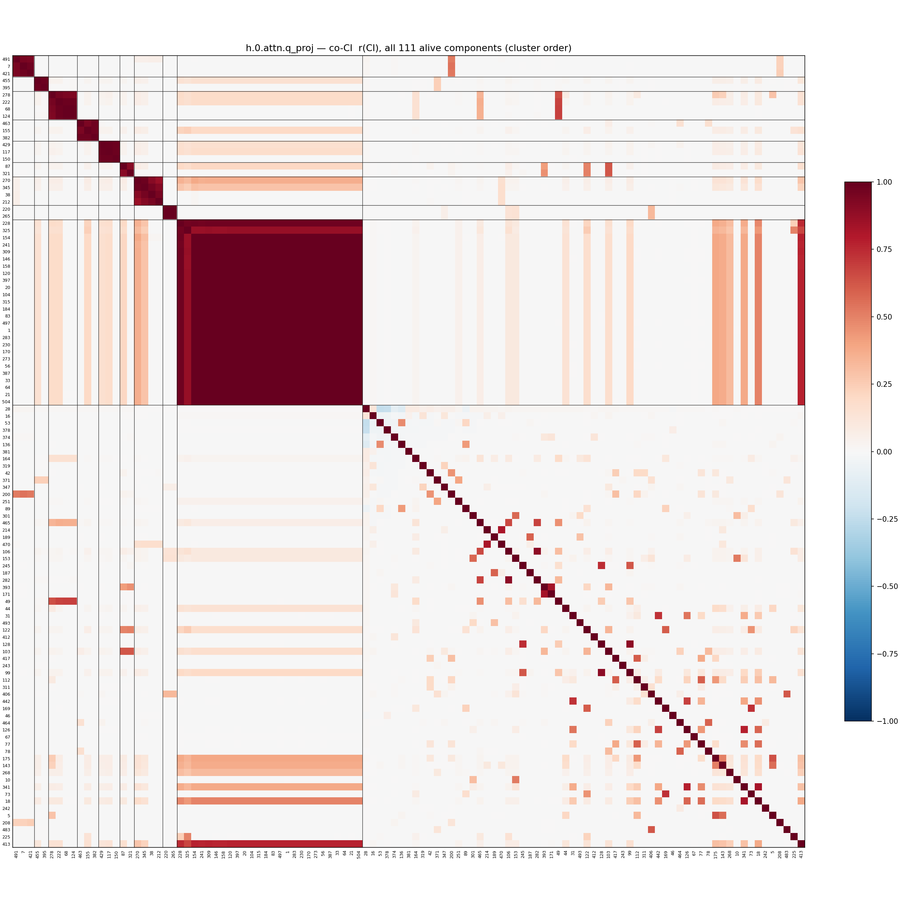

# L0_q (co-CI > 0.9 clustering) — threshold-rule component clusters (h.0.attn.q_proj)

Alternative to [L0_q_coci.md](L0_q_coci.md) (average-linkage) with threshold rules instead (alive components only, as before): **(1)** two components with co-CI r(CI) > 0.9 are in the same cluster (pairs processed in descending r, chains allowed); **(2)** a component does not join a cluster if it has r(CI) ≤ 0.0 with any existing member (two clusters only merge if every cross pair is > 0); such joins are skipped (0 skipped here). r(CI) over the 2,048,000-token Pile sample. Clusters with ≥ 2 members become groups. **Ordering is by mean CI throughout**: groups by their members' average mean CI (descending), members within a group — and Ungrouped — by mean CI (descending).

Per group with >1 member, four pairwise grids:

- **co-activation** — Pearson r of |a_c| = |‖U_c‖ (V_c·φ)| per token
- **co-CI** — Pearson r of the causal importance (lower_leaky) per token; gray = component never varied (no CI in sample)
- **input cosine** — |cos(V_a, V_b)| of read-in vectors (|·|: component sign is gauge)
- **output cosine** — |cos(U_a, U_b)| of write vectors (same gauge)

'fires' below = tokens with CI > 0.1 in the sample. Grid axes use the same mean-CI order as the lists.

## Groups

| group | n | members |
|---|---|---|
| [Cluster 1](#cluster-1) | 3 | 491 7 421 |
| [Cluster 2](#cluster-2) | 2 | 455 395 |
| [Cluster 3](#cluster-3) | 4 | 278 222 68 124 |
| [Cluster 4](#cluster-4) | 3 | 463 155 382 |
| [Cluster 5](#cluster-5) | 3 | 429 117 150 |
| [Cluster 6](#cluster-6) | 2 | 87 321 |
| [Cluster 7](#cluster-7) | 4 | 270 345 38 212 |
| [Cluster 8](#cluster-8) | 2 | 220 265 |
| [Cluster 9](#cluster-9) | 26 | 228 325 154 241 309 146 158 120 397 20 104 315 184 83 497 1 283 230 170 273 56 387 33 64 21 504 |
| [Ungrouped](#ungrouped) | 62 | 28 16 53 378 374 136 381 164 319 42 371 347 200 251 89 301 465 214 189 470 106 153 245 187 282 393 171 49 44 31 493 122 412 128 103 417 243 99 112 311 406 442 169 46 464 126 67 77 78 175 143 268 10 341 73 18 242 5 208 483 225 413 |

### Cluster 1 (3)

- **491** (mean CI 9.19e-04, fires 2395): fires on 'as' in phrases like 'such as'
- **7** (mean CI 8.67e-04, fires 2174): fires on the token ' as'
- **421** (mean CI 7.61e-04, fires 1796): fires on the token ' as'

### Cluster 2 (2)

- **455** (mean CI 2.35e-04, fires 523): closing tilde for markdown subscripts
- **395** (mean CI 2.07e-04, fires 485): closing tilde in markdown subscripts

### Cluster 3 (4)

- **278** (mean CI 1.52e-04, fires 346): colon in 'a:' and 're' in 'in re'
- **222** (mean CI 1.40e-04, fires 305): fires on colon in 'a:' predicting newline
- **68** (mean CI 1.34e-04, fires 290): fires on the colon in 'a:' to predict a newline
- **124** (mean CI 1.31e-04, fires 290): fires on colon in 'a:' q&a format

### Cluster 4 (3)

- **463** (mean CI 1.31e-04, fires 339): predicts ':' after 'q' and completes hex codes
- **155** (mean CI 1.28e-04, fires 285): fires on 'q' to predict ':' in q&a context
- **382** (mean CI 1.15e-04, fires 242): predicting ':' after 'Q' at document start

### Cluster 5 (3)

- **429** (mean CI 1.23e-04, fires 367): Predicts tokens following ')' in Go receivers and math options
- **117** (mean CI 1.17e-04, fires 340): closing parenthesis in multiple-choice option lists
- **150** (mean CI 1.12e-04, fires 329): closing parenthesis in multiple choice options

### Cluster 6 (2)

- **87** (mean CI 1.13e-04, fires 349): second word in phrases like not only, no longer
- **321** (mean CI 1.01e-04, fires 335): words completing 'not X' or 'no X' phrases

### Cluster 7 (4)

- **270** (mean CI 5.12e-05, fires 142): fires on ' the' and separators before usernames
- **345** (mean CI 3.82e-05, fires 122): fires on 'the' and 'The'
- **38** (mean CI 2.77e-05, fires 99): fires on 'the'/'The', predicting ordinals, superlatives, and sequential words
- **212** (mean CI 2.56e-05, fires 91): the word 'the'

### Cluster 8 (2)

- **220** (mean CI 1.37e-05, fires 27): "also" in "See also" section headings
- **265** (mean CI 1.23e-05, fires 27): predicts newlines after 'see also'

### Cluster 9 (26)

- **228** (mean CI 7.86e-06, fires 34): hyphen preceding usernames in hacker news formatting
- **325** (mean CI 7.80e-06, fires 34): predicts newlines after hyphens/dashes introducing markdown headers or authors
- **154** (mean CI 6.72e-06, fires 11): hyphen before author username in hacker news posts
- **241** (mean CI 6.64e-06, fires 12): predicts username after hyphen in hacker news posts
- **309** (mean CI 6.20e-06, fires 11): fires on hyphen preceding usernames in hn posts
- **146** (mean CI 6.20e-06, fires 11): hyphen separating post title and author username
- **158** (mean CI 6.19e-06, fires 11): hyphen before username in hacker news posts
- **120** (mean CI 6.15e-06, fires 11): predicts hacker news usernames after title hyphens
- **397** (mean CI 6.14e-06, fires 11): hyphen preceding username in hacker news posts
- **20** (mean CI 6.09e-06, fires 11): fires on hyphens before usernames in hn-style dumps
- **104** (mean CI 6.07e-06, fires 11): hyphen separating article title and username
- **315** (mean CI 6.06e-06, fires 11): activates on hyphens preceding hacker news usernames
- **184** (mean CI 6.03e-06, fires 11): fires on dash separating title and author/username
- **83** (mean CI 6.03e-06, fires 11): predicts submitter usernames after hyphens in hacker news
- **497** (mean CI 6.01e-06, fires 11): hyphen before username in hacker news metadata
- **1** (mean CI 5.99e-06, fires 11): hyphen before username in hacker news posts
- **283** (mean CI 5.83e-06, fires 11): hyphen before usernames in hacker news post headers
- **230** (mean CI 5.83e-06, fires 11): hyphen separating article title from username
- **170** (mean CI 5.82e-06, fires 11): hyphen separating post title and author username
- **273** (mean CI 5.75e-06, fires 11): hacker news post title to username separator hyphen
- **56** (mean CI 5.62e-06, fires 11): hyphen before username in hacker news submissions
- **387** (mean CI 5.47e-06, fires 11): fires on hyphens before usernames in hn data
- **33** (mean CI 5.40e-06, fires 11): hyphen preceding username in link aggregator formats
- **64** (mean CI 3.99e-06, fires 11): fires on hyphen preceding usernames in link aggregators
- **21** (mean CI 2.12e-06, fires 10): hyphen separating hacker news title and username
- **504** (mean CI 1.31e-06, fires 10): Predicts author usernames after a hyphen

### Ungrouped (62)

- **28** (mean CI 5.57e-01, fires 1295078): fires promiscuously on nearly all tokens
- **16** (mean CI 4.90e-02, fires 122779): fires on word fragments and prepositions
- **53** (mean CI 4.38e-02, fires 106524): punctuation marks (periods and commas)
- **378** (mean CI 3.47e-02, fires 78487): newline token detector
- **374** (mean CI 2.10e-02, fires 53679): fires on prepositions to predict determiners
- **136** (mean CI 1.07e-02, fires 27726): fires on commas
- **381** (mean CI 9.62e-03, fires 22991): non-english european languages
- **164** (mean CI 6.81e-03, fires 16686): punctuation starting code elements, comments, and strings
- **319** (mean CI 5.15e-03, fires 14628): letters inside acronyms and all-caps words
- **42** (mean CI 4.29e-03, fires 12070): parts of transitional and prepositional phrases
- **371** (mean CI 3.71e-03, fires 9426): quotes, apostrophes, asterisks, and tildes
- **347** (mean CI 3.65e-03, fires 9630): single-letter tokens, contractions, and word fragments
- **200** (mean CI 3.11e-03, fires 8357): core words in prepositional and transitional phrases
- **251** (mean CI 2.17e-03, fires 5857): closing quotation marks
- **89** (mean CI 1.63e-03, fires 5650): commas following introductory phrases and transitions
- **301** (mean CI 1.55e-03, fires 4009): opening curly braces in latex commands
- **465** (mean CI 1.20e-03, fires 3482): fires on colons used as structural separators
- **214** (mean CI 1.11e-03, fires 2829): file extensions/tlds (negative) and latex \left( (positive)
- **189** (mean CI 9.74e-04, fires 2224): fires on `>` in xml/html and chat logs
- **470** (mean CI 8.99e-04, fires 2272): tlds and file extensions in urls/paths
- **106** (mean CI 5.82e-04, fires 1557): activates on colons to predict category words
- **153** (mean CI 5.66e-04, fires 1345): predicts latex environments and label prefixes
- **245** (mean CI 5.63e-04, fires 1488): words following degree modifiers like as, how, so
- **187** (mean CI 5.48e-04, fires 1328): irc username brackets and 'et al'
- **282** (mean CI 4.77e-04, fires 1091): colon token in structural prefixes (category:, q:)
- **393** (mean CI 4.37e-04, fires 1242): fires on tokens completing comparative or correlative phrases
- **171** (mean CI 3.36e-04, fires 916): fires on 'than' and predicts numbers or quantities
- **49** (mean CI 3.22e-04, fires 813): fires on colons marking q&a or comparisons
- **44** (mean CI 2.86e-04, fires 1017): forward slashes in urls and 're' in legal
- **31** (mean CI 2.60e-04, fires 623): predicts newline or alignment after latex closing brace
- **493** (mean CI 2.47e-04, fires 793): html tag closers and latex subscript openers
- **122** (mean CI 2.30e-04, fires 580): dashes/structure (positive) and words following 'not' (negative)
- **412** (mean CI 2.28e-04, fires 707): fires on the token 'out'
- **128** (mean CI 2.23e-04, fires 704): predicting ' as' in 'as [word] as' constructions
- **103** (mean CI 2.07e-04, fires 701): common phrase and abbreviation completion
- **417** (mean CI 1.92e-04, fires 746): phrasal preposition centers predicting completing prepositions
- **243** (mean CI 1.90e-04, fires 336): closing caret (^) in superscript markdown
- **99** (mean CI 1.81e-04, fires 666): predicts 'as' in 'as [word] as' phrases
- **112** (mean CI 1.75e-04, fires 647): objects of common prepositional phrases
- **311** (mean CI 1.65e-04, fires 500): second word in common two-word phrases (at least, end up)
- **406** (mean CI 1.43e-04, fires 404): apostrophes/quotes (positive) and 'up' (negative)
- **442** (mean CI 1.04e-04, fires 343): latex environment closing brace predicting newline
- **169** (mean CI 1.01e-04, fires 182): hyphens in academic citation keys predicting journal names
- **46** (mean CI 8.07e-05, fires 351): fires on newline tokens
- **464** (mean CI 7.04e-05, fires 391): numbers in technical identifier and specific formatting contexts
- **126** (mean CI 7.04e-05, fires 192): predicts latex alignment specifiers and newlines
- **67** (mean CI 6.36e-05, fires 303): predicts nouns after 'as a' (e.g. result)
- **77** (mean CI 5.96e-05, fires 288): phrases after 'in' and latex math delimiters
- **78** (mean CI 5.73e-05, fires 249): numbers in star pagination of legal texts
- **175** (mean CI 5.38e-05, fires 249): fires on introductory phrases involving prepositional objects
- **143** (mean CI 5.22e-05, fires 112): punctuation predicting legal contexts and usernames
- **268** (mean CI 4.51e-05, fires 165): closing underscores (italics) and title-separating dashes
- **10** (mean CI 4.33e-05, fires 301): predicts equation or figure prefixes in latex labels
- **341** (mean CI 4.08e-05, fires 106): predicts latex array alignment specifiers
- **73** (mean CI 2.54e-05, fires 82): hyphen preceding journal abbreviations in citations
- **18** (mean CI 2.30e-05, fires 79): latex math delimiters and structured text separators
- **242** (mean CI 1.97e-05, fires 87): numbers following figure/table predicting caption starts
- **5** (mean CI 1.31e-05, fires 31): fires on 're' in 'in re' legal citations
- **208** (mean CI 1.25e-05, fires 92): the token ' as' in 'as X as' and 'so as' constructs
- **483** (mean CI 8.53e-06, fires 86): closing single quotation marks
- **225** (mean CI 3.79e-06, fires 23): predicts newline after yaml frontmatter separator
- **413** (mean CI 1.65e-06, fires 16): hyphen separating title and username in news posts

## All pairs

All alive components in cluster order (black lines: cluster boundaries; last block: ungrouped).

## Full co-CI grid

The co-CI panel alone, large, with every component index on both axes (same cluster order as above).

