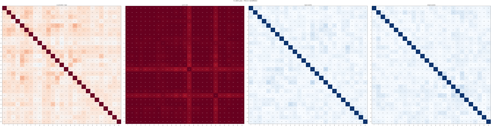
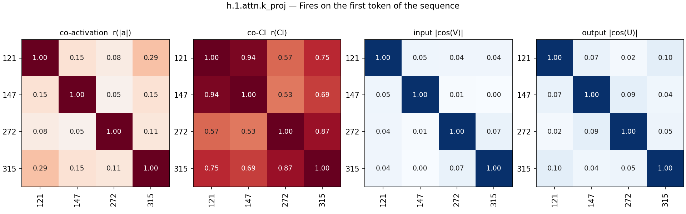
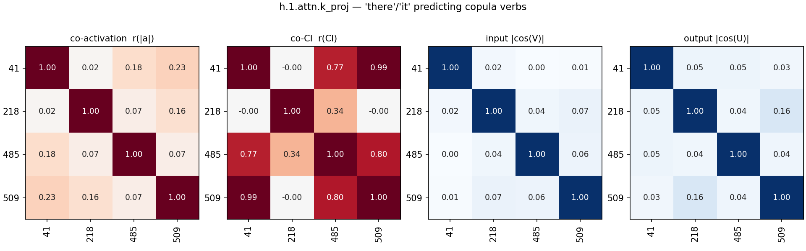
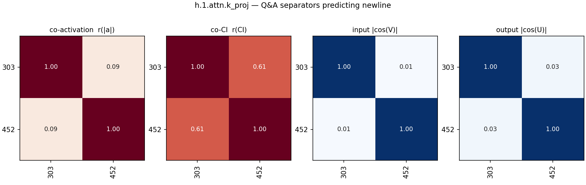
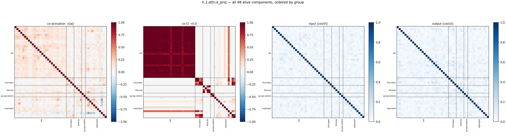
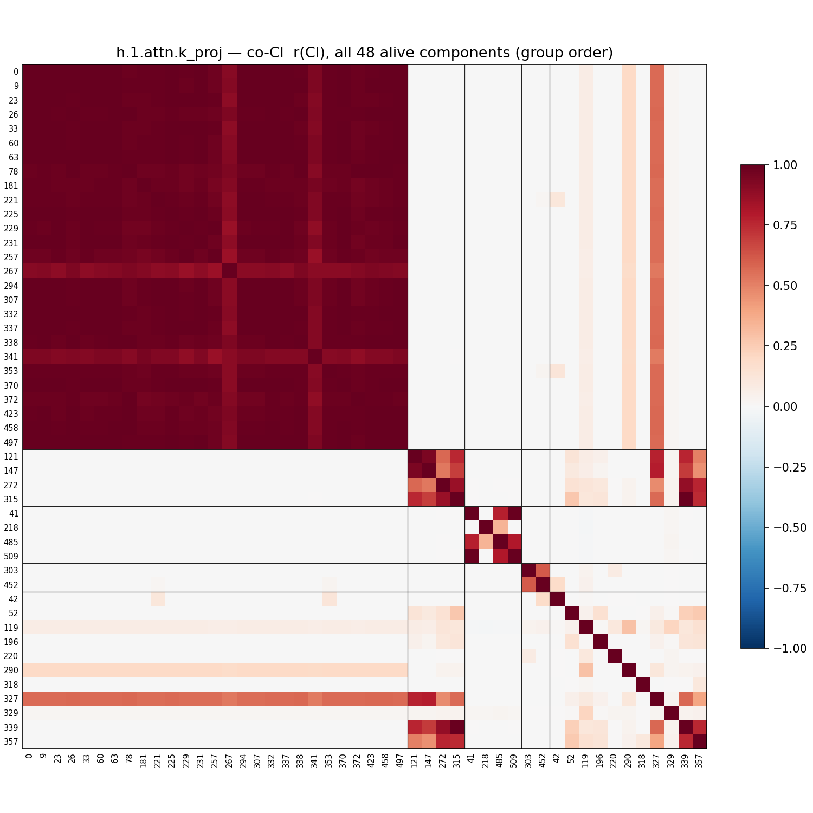

# L1_k — component groups by expected CI co-firing (h.1.attn.k_proj)

All 48 alive components (harvest mean CI > 1e-6). Groups were formed by Claude (2026-08-28) reading each component's **full website description** (label + autointerp reasoning, fetched from the paper site) and grouping components expected to have high per-token CI-similarity: same trigger tokens/positions, subset-detectors of one pattern merged; patterns on different tokens kept apart; bimodal or vague descriptions left ungrouped. No activation/CI data was used to form the groups.

Per group with >1 member, four pairwise grids over a 2,048,000-token Pile sample (4000 cached rows):

- **co-activation** — Pearson r of |a_c| = |‖U_c‖ (V_c·φ)| per token
- **co-CI** — Pearson r of the causal importance (lower_leaky) per token; gray = component never varied (no CI in sample)
- **input cosine** — |cos(V_a, V_b)| of read-in vectors (|·|: component sign is gauge)
- **output cosine** — |cos(U_a, U_b)| of write vectors (|·|: same gauge)

'fires' below = tokens with CI > 0.1 in the sample. Within each group, components are ordered by component id (in the lists and on all grid axes).

## Groups

| group | n | members |
|---|---|---|
| [Fires on <|endoftext|>](#eos) | 27 | 0 9 23 26 33 60 63 78 181 221 225 229 231 257 267 294 307 332 337 338 341 353 370 372 423 458 497 |
| [Fires on the first token of the sequence](#first-token) | 4 | 121 147 272 315 |
| ['there'/'it' predicting copula verbs](#there-be) | 4 | 41 218 485 509 |
| [Q&A separators predicting newline](#qa-sep-newline) | 2 | 303 452 |
| [Ungrouped](#ungrouped) | 11 | 42 52 119 196 220 290 318 327 329 339 357 |

### Fires on <|endoftext|> (27)

- **0** (mean CI 0.0007, fires 1416): fires on <|endoftext|> tokens
- **9** (mean CI 0.0007, fires 1416): fires on the <|endoftext|> token
- **23** (mean CI 0.0007, fires 1414): fires exclusively on the <|endoftext|> document separator token
- **26** (mean CI 0.0006, fires 1414): fires on the <|endoftext|> document separator token
- **33** (mean CI 0.0007, fires 1416): fires on the <|endoftext|> document separator token
- **60** (mean CI 0.0007, fires 1416): fires on the <|endoftext|> token
- **63** (mean CI 0.0007, fires 1416): fires on the <|endoftext|> token
- **78** (mean CI 0.0006, fires 1392): fires on <|endoftext|> to predict document-starting tokens
- **181** (mean CI 0.0006, fires 1416): fires on the <|endoftext|> token
- **221** (mean CI 0.0007, fires 1440): activates on <|endoftext|> token to predict new document starts
- **225** (mean CI 0.0007, fires 1416): fires on the <|endoftext|> token
- **229** (mean CI 0.0006, fires 1413): fires on <|endoftext|> to predict sequence boundaries
- **231** (mean CI 0.0007, fires 1416): fires on the <|endoftext|> token
- **257** (mean CI 0.0006, fires 1408): fires on the <|endoftext|> separator token
- **267** (mean CI 0.0004, fires 1295): fires on the <|endoftext|> document separator token
- **294** (mean CI 0.0007, fires 1416): fires on document separator <|endoftext|>
- **307** (mean CI 0.0007, fires 1416): fires on the document separator token <|endoftext|>
- **332** (mean CI 0.0007, fires 1416): fires on document separator <|endoftext|>
- **337** (mean CI 0.0007, fires 1417): fires on <|endoftext|> to predict document-starting tokens
- **338** (mean CI 0.0007, fires 1405): activates on <|endoftext|> document separator tokens
- **341** (mean CI 0.0005, fires 1339): fires on the <|endoftext|> token
- **353** (mean CI 0.0007, fires 1445): fires on endoftext to predict document starts
- **370** (mean CI 0.0007, fires 1416): fires exclusively on the <|endoftext|> token
- **372** (mean CI 0.0006, fires 1391): fires on <|endoftext|> to predict new document starts
- **423** (mean CI 0.0006, fires 1408): fires on the <|endoftext|> document separator token
- **458** (mean CI 0.0007, fires 1415): fires on endoftext document separators
- **497** (mean CI 0.0007, fires 1416): fires on the endoftext token separator

### Fires on the first token of the sequence (4)

- **121** (mean CI 0.0014, fires 3375): fires on the first token of a sequence
- **147** (mean CI 0.0012, fires 2841): early sequence tokens
- **272** (mean CI 0.0019, fires 4007): fires on the first token of a sequence
- **315** (mean CI 0.0027, fires 6103): fires at the beginning of sequences

### 'there'/'it' predicting copula verbs (4)

- **41** (mean CI 0.0008, fires 1774): predicts forms of 'to be' after 'there'
- **218** (mean CI 0.0014, fires 4090): fires on the pronoun 'it' predicting subsequent verbs
- **485** (mean CI 0.0010, fires 3188): predicts existence or copula verbs after "there" / "it"
- **509** (mean CI 0.0008, fires 1940): predicts forms of 'to be' after 'there'

### Q&A separators predicting newline (2)

- **303** (mean CI 0.0002, fires 386): predicts a newline after conversational or q&a separators
- **452** (mean CI 0.0003, fires 550): predicts newlines after q/a colons and table markers

### Ungrouped (11)

- **42** (mean CI 0.0000, fires 53): fires on 'table' and 'figure' to predict numbers
- **52** (mean CI 0.0003, fires 1143): alphanumeric tokens in acronyms, variables, and identifiers
- **119** (mean CI 0.1287, fires 332938): fires on punctuation, brackets, and newlines
- **196** (mean CI 0.0002, fires 580): fires on numbers to predict punctuation and units
- **220** (mean CI 0.0018, fires 4698): markdown citation and reference opening tags
- **290** (mean CI 0.0175, fires 44487): fires on newlines, predicts indentation or newlines
- **318** (mean CI 0.0000, fires 97): fires on commas to predict conjunctions and transitions
- **327** (mean CI 0.0018, fires 4191): sequence boundaries and document starts
- **329** (mean CI 0.8913, fires 2044886): always fires
- **339** (mean CI 0.0026, fires 5843): uninterpretable / polysemantic
- **357** (mean CI 0.0036, fires 9066): miscellaneous text and punctuation tokens

## All pairs

All alive components in group order (black lines: group boundaries; last block: ungrouped).

## Full co-CI grid

The co-CI panel alone, large, with every component index on both axes (same group order as above).

