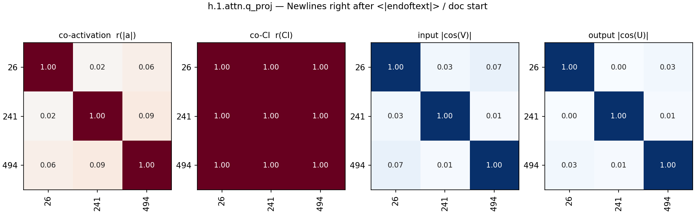
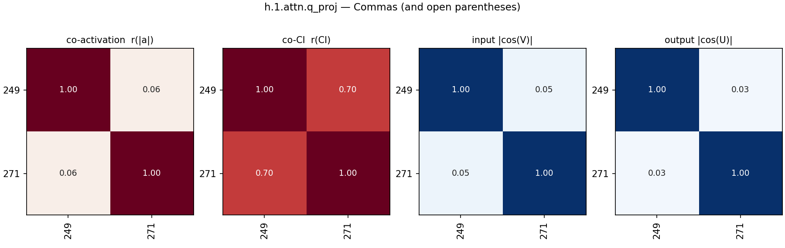
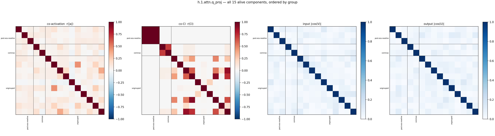
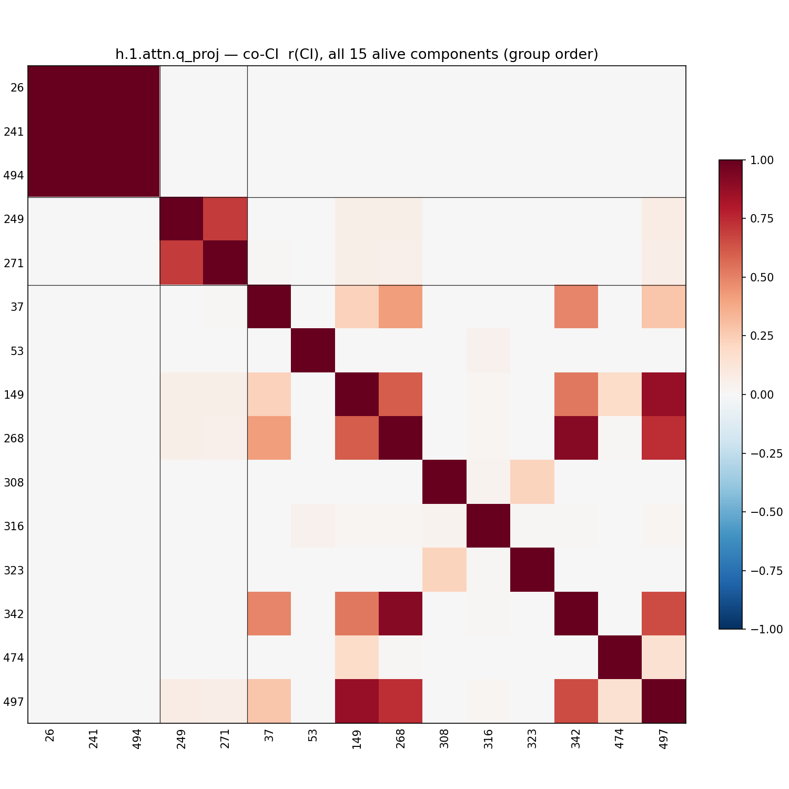

# L1_q — component groups by expected CI co-firing (h.1.attn.q_proj)

All 15 alive components (harvest mean CI > 1e-6). Groups were formed by Claude (2026-08-28) reading each component's **full website description** (label + autointerp reasoning, fetched from the paper site) and grouping components expected to have high per-token CI-similarity: same trigger tokens/positions, subset-detectors of one pattern merged; patterns on different tokens kept apart; bimodal or vague descriptions left ungrouped. No activation/CI data was used to form the groups.

Per group with >1 member, four pairwise grids over a 2,048,000-token Pile sample (4000 cached rows):

- **co-activation** — Pearson r of |a_c| = |‖U_c‖ (V_c·φ)| per token
- **co-CI** — Pearson r of the causal importance (lower_leaky) per token; gray = component never varied (no CI in sample)
- **input cosine** — |cos(V_a, V_b)| of read-in vectors (|·|: component sign is gauge)
- **output cosine** — |cos(U_a, U_b)| of write vectors (|·|: same gauge)

'fires' below = tokens with CI > 0.1 in the sample. Within each group, components are ordered by component id (in the lists and on all grid axes).

## Groups

| group | n | members |
|---|---|---|
| [Newlines right after <|endoftext|> / doc start](#post-eos-newline) | 3 | 26 241 494 |
| [Commas (and open parentheses)](#commas) | 2 | 249 271 |
| [Ungrouped](#ungrouped) | 10 | 37 53 149 268 308 316 323 342 474 497 |

### Newlines right after <|endoftext|> / doc start (3)

- **26** (mean CI 0.0000, fires 42): fires on newlines at the start of documents
- **241** (mean CI 0.0000, fires 42): fires on newlines following the end-of-text token
- **494** (mean CI 0.0000, fires 42): newlines immediately following endoftext token

### Commas (and open parentheses) (2)

- **249** (mean CI 0.0000, fires 14): comma token after numbers or mathematical variables
- **271** (mean CI 0.0000, fires 53): commas and open parentheses

### Ungrouped (10)

- **37** (mean CI 0.0001, fires 301): predicts prepositions, punctuation, and word continuations
- **53** (mean CI 0.0033, fires 10868): domain-specific technical and academic terms
- **149** (mean CI 0.0024, fires 6499): generic component predicting common punctuation and stopwords
- **268** (mean CI 0.0007, fires 1902): word fragments and compounds in specific phrases
- **308** (mean CI 0.0043, fires 11763): fires on existence and state verbs (is, was, there are/is)
- **316** (mean CI 0.8573, fires 1981956): always fires / bias component
- **323** (mean CI 0.0006, fires 1661): predicative adjectives promoting complementizers (to, that, for)
- **342** (mean CI 0.0005, fires 1483): predicts word ends and boundaries
- **474** (mean CI 0.0001, fires 232): fires on period tokens
- **497** (mean CI 0.0015, fires 3924): repeating identical tokens or characters

## All pairs

All alive components in group order (black lines: group boundaries; last block: ungrouped).

## Full co-CI grid

The co-CI panel alone, large, with every component index on both axes (same group order as above).

