# L2_k — component groups by expected CI co-firing (h.2.attn.k_proj)

All 167 alive components (harvest mean CI > 1e-6). Groups were formed by Claude (2026-08-28) reading each component's **full website description** (label + autointerp reasoning, fetched from the paper site) and grouping components expected to have high per-token CI-similarity: same trigger tokens/positions, subset-detectors of one pattern merged; patterns on different tokens kept apart; bimodal or vague descriptions left ungrouped. No activation/CI data was used to form the groups.

Per group with >1 member, four pairwise grids over a 2,048,000-token Pile sample (4000 cached rows):

- **co-activation** — Pearson r of |a_c| = |‖U_c‖ (V_c·φ)| per token
- **co-CI** — Pearson r of the causal importance (lower_leaky) per token; gray = component never varied (no CI in sample)
- **input cosine** — |cos(V_a, V_b)| of read-in vectors (|·|: component sign is gauge)
- **output cosine** — |cos(U_a, U_b)| of write vectors (|·|: same gauge)

'fires' below = tokens with CI > 0.1 in the sample. Within each group, components are ordered by component id (in the lists and on all grid axes).

## Groups

| group | n | members |
|---|---|---|
| [First token of the sequence (attention sink)](#seq-start) | 18 | 3 68 86 88 134 196 243 261 271 413 449 453 458 464 487 503 509 511 |
| [Both <|endoftext|> and first token (boundaries)](#boundary-both) | 12 | 12 23 67 73 99 131 204 321 444 446 490 508 |
| ['table'/'figure' predicting numbers](#table-figure) | 16 | 2 64 74 92 93 140 221 263 324 332 348 352 381 389 392 457 |
| [Markdown citation/cross-reference openers](#md-cite) | 3 | 41 127 302 |
| [Opening quotes/parentheses/brackets](#open-punct) | 14 | 4 31 106 126 163 192 246 296 347 358 418 427 463 500 |
| [Closing quotes predicting dialogue attribution](#close-quote) | 4 | 198 239 288 315 |
| [LaTeX/math commands & syntax](#latex) | 4 | 70 208 235 284 |
| [Newlines, tabs & indentation](#whitespace) | 3 | 59 136 498 |
| [List-separating commas & conjunctions](#list-sep) | 2 | 105 142 |
| [Items in coordinated pairs/lists](#list-items) | 3 | 20 331 430 |
| [Clause-separating dashes/semicolons](#dashes) | 2 | 245 438 |
| [Repeated words/phrases (induction keys)](#repetition) | 2 | 137 505 |
| [Subword/compound-word continuations](#subword) | 12 | 5 6 43 133 184 229 251 289 301 327 384 400 |
| [Acronyms & uppercase entities](#acronyms) | 2 | 424 443 |
| [Proper nouns & named entities](#names) | 2 | 231 407 |
| [Head/subject nouns predicting grammatical boundary](#noun-subjects) | 4 | 113 313 370 460 |
| [URL scheme '://' → domains](#url) | 2 | 47 476 |
| [Tokens inside brackets/parentheses](#bracket-interior) | 3 | 56 185 320 |
| [Subordinating conjunctions & phrase-initial prepositions](#subord-conj) | 3 | 175 337 435 |
| [Numbers predicting trailing punctuation](#numbers) | 2 | 183 450 |
| [Word/phrase endings predicting punctuation](#word-end-punct) | 3 | 14 166 415 |
| [Punctuation/symbols in structured technical text](#tech-punct) | 13 | 0 52 55 62 83 143 173 197 280 373 431 447 448 |
| [Ungrouped](#ungrouped) | 38 | 1 22 39 42 72 107 125 130 148 151 164 167 187 206 217 218 219 224 225 247 259 264 266 281 286 295 306 308 322 334 369 404 421 439 445 477 494 510 |

### First token of the sequence (attention sink) (18)

- **3** (mean CI 0.0001, fires 250): first token of the sequence
- **68** (mean CI 0.0020, fires 4059): fires on the first token of the sequence
- **86** (mean CI 0.0020, fires 4059): first token in a sequence
- **88** (mean CI 0.0020, fires 4061): fires at the beginning of sequences
- **134** (mean CI 0.0020, fires 4059): first token of the sequence
- **196** (mean CI 0.0020, fires 4083): fires on the first token of the sequence
- **243** (mean CI 0.0020, fires 4059): first token in a sequence
- **261** (mean CI 0.0020, fires 4059): first token of sequence
- **271** (mean CI 0.0020, fires 4083): fires on the first token of a sequence
- **413** (mean CI 0.0020, fires 4060): first token in sequence
- **449** (mean CI 0.0020, fires 4059): first token of the sequence
- **453** (mean CI 0.0020, fires 4089): fires on the first token of sequences
- **458** (mean CI 0.0020, fires 4059): fires on the first token of a sequence
- **464** (mean CI 0.0020, fires 4060): fires on the first token of a sequence
- **487** (mean CI 0.0020, fires 4060): first token in sequence
- **503** (mean CI 0.0020, fires 4059): first token of sequence
- **509** (mean CI 0.0020, fires 4059): first token in a sequence
- **511** (mean CI 0.0020, fires 4060): first token of a sequence

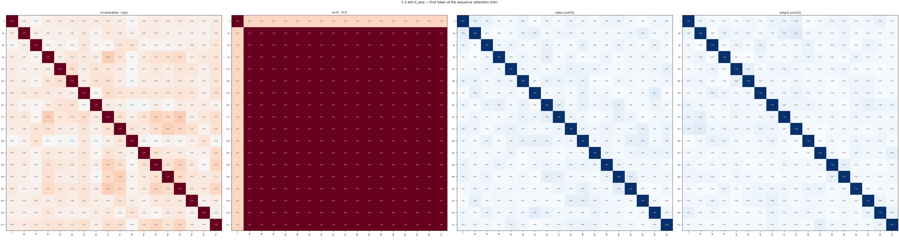

### Both <|endoftext|> and first token (boundaries) (12)

- **12** (mean CI 0.0125, fires 37598): fires at the start of sequences or documents
- **23** (mean CI 0.0028, fires 5948): sequence start and document boundary tokens
- **67** (mean CI 0.0020, fires 4060): fires mostly on sequence boundaries or early tokens
- **73** (mean CI 0.0028, fires 5932): sequence start or document boundary token
- **99** (mean CI 0.0028, fires 5975): fires on sequence start and endoftext tokens
- **131** (mean CI 0.0028, fires 5971): attention sink (first token and endoftext)
- **204** (mean CI 0.0028, fires 5994): fires near the start of a sequence or after document boundaries
- **321** (mean CI 0.0026, fires 5472): sequence start and <|endoftext|> tokens
- **444** (mean CI 0.0025, fires 5417): first token of sequence and document boundaries
- **446** (mean CI 0.0029, fires 6030): sequence start and endoftext tokens (attention sink)
- **490** (mean CI 0.0020, fires 4302): fires near the beginning of sequences or documents
- **508** (mean CI 0.0029, fires 6039): fires on first token of sequence or document

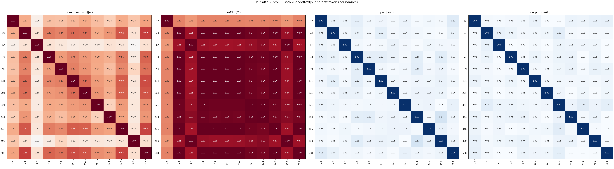

### 'table'/'figure' predicting numbers (16)

- **2** (mean CI 0.0000, fires 38): predicts numbers following 'table' and 'figure' in texts
- **64** (mean CI 0.0000, fires 30): predicts numbers following 'table' or 'figure'
- **74** (mean CI 0.0000, fires 35): table and figure labels in academic texts
- **92** (mean CI 0.0000, fires 45): predicts numbers after 'table' or 'figure' tokens
- **93** (mean CI 0.0000, fires 24): predicts table number after the word 'table'
- **140** (mean CI 0.0000, fires 53): fires on 'table'/'fig' to predict caption numbers
- **221** (mean CI 0.0000, fires 31): predicts numbers following 'table' or 'figure'
- **263** (mean CI 0.0000, fires 30): predicts numbers or spaces after 'table' or 'figure'
- **324** (mean CI 0.0000, fires 31): predicts numbers following table or figure
- **332** (mean CI 0.0000, fires 31): predicts numbers following table or figure
- **348** (mean CI 0.0000, fires 31): predicts numbers after 'table' or 'figure'
- **352** (mean CI 0.0000, fires 37): predicts numbers following 'table', 'figure', and 'fig'
- **381** (mean CI 0.0000, fires 34): fires on 'table' or 'figure' to predict a number
- **389** (mean CI 0.0000, fires 31): predicts table number after 'table' in academic texts
- **392** (mean CI 0.0000, fires 30): predicts numbers after table or figure
- **457** (mean CI 0.0000, fires 31): predicts numbers following "table" or "figure"

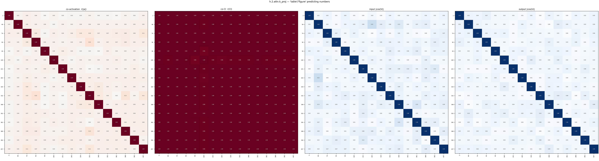

### Markdown citation/cross-reference openers (3)

- **41** (mean CI 0.0018, fires 5602): markdown citation, reference, and link markers
- **127** (mean CI 0.0036, fires 9418): markdown citation and cross-reference markers
- **302** (mean CI 0.0016, fires 3812): markdown citation and cross-reference syntax

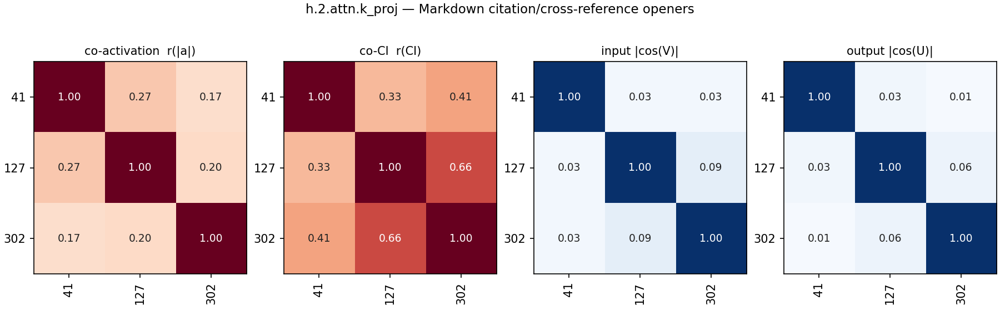

### Opening quotes/parentheses/brackets (14)

- **4** (mean CI 0.0102, fires 27853): syntactic punctuation and opening brackets/quotes/comments
- **31** (mean CI 0.0004, fires 1516): fires on opening quotes and parentheses
- **106** (mean CI 0.0002, fires 861): opening parentheses predicting citation verbs
- **126** (mean CI 0.0012, fires 3881): fires on opening quotes and brackets
- **163** (mean CI 0.0071, fires 19989): opening punctuation (quotes, parentheses) and comment markers
- **192** (mean CI 0.0070, fires 19214): fires on opening brackets and parentheses
- **246** (mean CI 0.0159, fires 40523): opening delimiters
- **296** (mean CI 0.0027, fires 7887): fires on opening punctuation like quotes and brackets
- **347** (mean CI 0.0458, fires 110287): predicts closing characters in math, html, and strings
- **358** (mean CI 0.0003, fires 1178): opening parentheses and brackets for citations and notes
- **418** (mean CI 0.0002, fires 935): opening quotes and brackets promoting capitalized words
- **427** (mean CI 0.0001, fires 508): fires on opening punctuation to predict capitalized words
- **463** (mean CI 0.0001, fires 456): fires on opening parenthesis, promotes citation words
- **500** (mean CI 0.0014, fires 4299): predicts capitalized words after opening punctuation

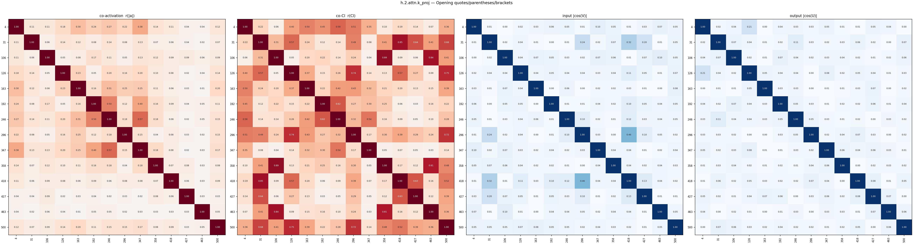

### Closing quotes predicting dialogue attribution (4)

- **198** (mean CI 0.0003, fires 748): closing quotation marks predicting dialogue attribution
- **239** (mean CI 0.0004, fires 1127): predicts speech attribution or newlines after closing quotes
- **288** (mean CI 0.0004, fires 1294): end of quotation, predicts dialogue tags or newlines
- **315** (mean CI 0.0002, fires 517): predicts dialogue tags after closing quotes

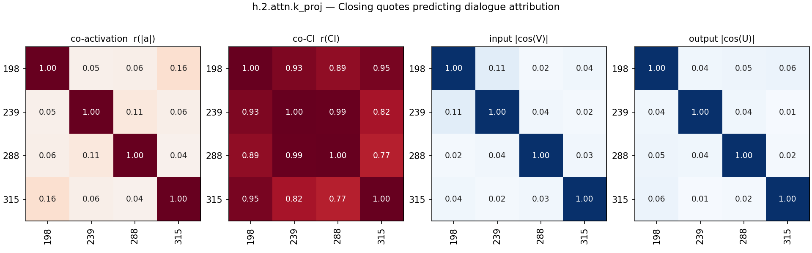

### LaTeX/math commands & syntax (4)

- **70** (mean CI 0.0048, fires 13217): predicts latex and math commands upon observing '$'
- **208** (mean CI 0.0283, fires 76293): latex math commands and backslash syntax
- **235** (mean CI 0.0492, fires 127086): latex math syntax and symbols
- **284** (mean CI 0.0015, fires 5059): fires on latex opening braces and brackets

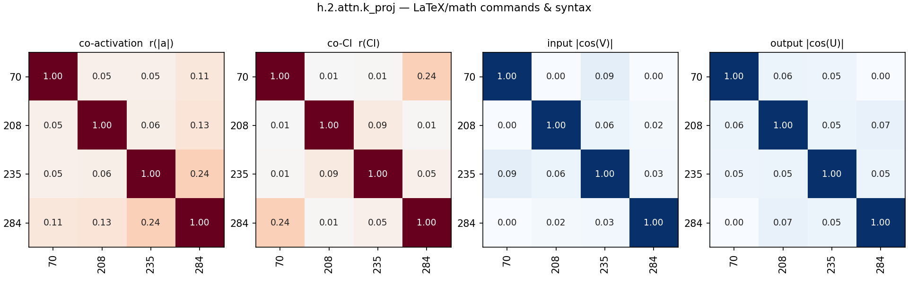

### Newlines, tabs & indentation (3)

- **59** (mean CI 0.0076, fires 19042): fires on newlines, tabs, and indentation spacing
- **136** (mean CI 0.0013, fires 4373): whitespace and tabs for alignment in tables/code
- **498** (mean CI 0.0243, fires 63178): newlines and indentation whitespace

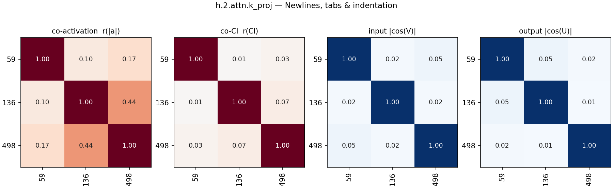

### List-separating commas & conjunctions (2)

- **105** (mean CI 0.0059, fires 16698): commas separating items in a list
- **142** (mean CI 0.0135, fires 37430): list separators and coordinating conjunctions

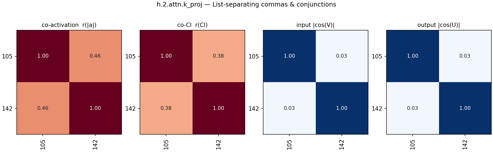

### Items in coordinated pairs/lists (3)

- **20** (mean CI 0.0059, fires 19407): first element in a coordinated pair or list
- **331** (mean CI 0.0441, fires 119813): list items predicting commas and separators
- **430** (mean CI 0.0091, fires 27724): subsequent items in lists or conjunctions

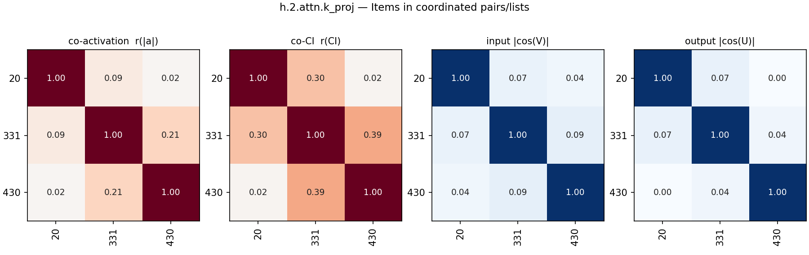

### Clause-separating dashes/semicolons (2)

- **245** (mean CI 0.0000, fires 83): fires on dashes introducing elaborations or appositives
- **438** (mean CI 0.0004, fires 1380): clause-separating punctuation (semicolons and dashes)

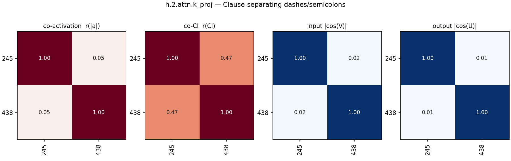

### Repeated words/phrases (induction keys) (2)

- **137** (mean CI 0.0001, fires 606): repeating words from nearby context
- **505** (mean CI 0.0322, fires 86228): attention keys for repeated words and phrases

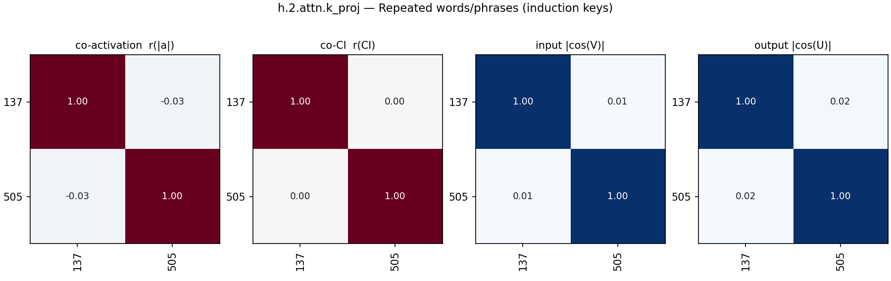

### Subword/compound-word continuations (12)

- **5** (mean CI 0.0401, fires 106358): parts of identifiers, urls, and compound words
- **6** (mean CI 0.0159, fires 46002): subword continuations in specialized and technical vocabulary
- **43** (mean CI 0.0131, fires 39244): later subwords in multi-token words
- **133** (mean CI 0.0399, fires 107667): parts of camelcase identifiers and split words
- **184** (mean CI 0.0437, fires 117224): tokens within structured text, identifiers, and compound words
- **229** (mean CI 0.0013, fires 5866): predicts word suffixes and completions from prefixes
- **251** (mean CI 0.0368, fires 98449): fires predicting word continuation, punctuation or separators
- **289** (mean CI 0.0441, fires 118428): promotes separators like underscores, hyphens, and punctuation
- **301** (mean CI 0.0293, fires 78849): subword or multi-token completion components
- **327** (mean CI 0.1269, fires 346780): tokens in code identifiers, hashes, and complex strings
- **384** (mean CI 0.0375, fires 102661): predicts continuations of multi-token words and entities
- **400** (mean CI 0.0215, fires 58924): tokens in compound words and identifiers

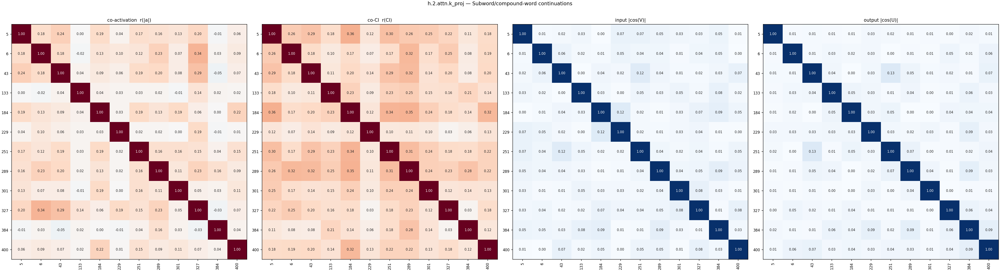

### Acronyms & uppercase entities (2)

- **424** (mean CI 0.0012, fires 5033): tokens comprising acronyms, often inside parentheses
- **443** (mean CI 0.0136, fires 40956): processing acronyms and uppercase entities

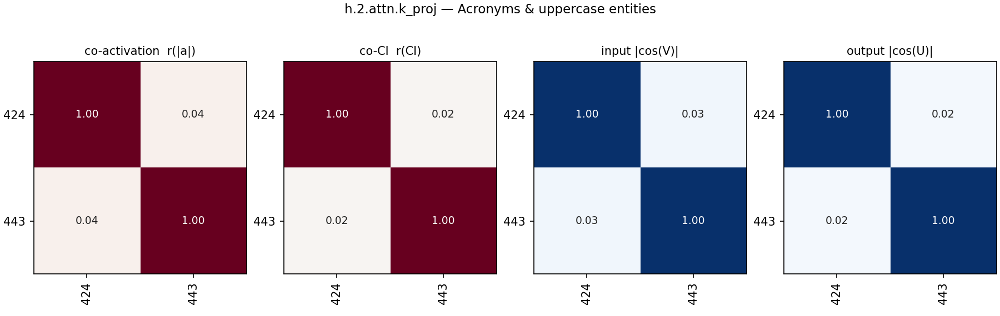

### Proper nouns & named entities (2)

- **231** (mean CI 0.0075, fires 22232): proper nouns and dates
- **407** (mean CI 0.0101, fires 29080): fires on names of people and places

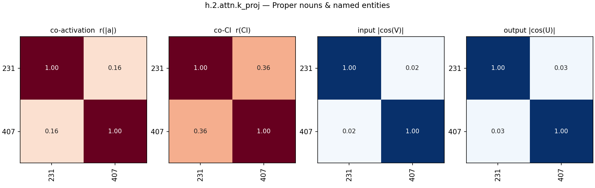

### Head/subject nouns predicting grammatical boundary (4)

- **113** (mean CI 0.0025, fires 8298): abstract nouns pointing to academic or technical sections
- **313** (mean CI 0.0337, fires 89969): nouns / noun phrases
- **370** (mean CI 0.0363, fires 97103): nouns, identifiers, and entities predicting punctuation
- **460** (mean CI 0.0015, fires 5754): plural nouns in academic and technical contexts

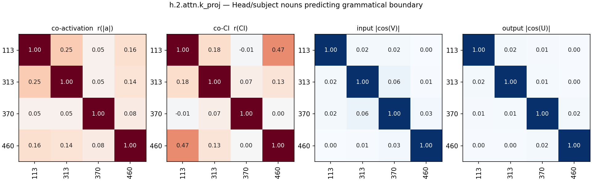

### URL scheme '://' → domains (2)

- **47** (mean CI 0.0003, fires 705): url domain/subdomain predictor after ://
- **476** (mean CI 0.0003, fires 808): predicts domains and urls after http/https or expresses gratitude after thank

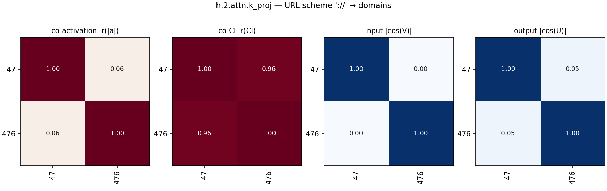

### Tokens inside brackets/parentheses (3)

- **56** (mean CI 0.0199, fires 56963): tokens inside parentheses or brackets
- **185** (mean CI 0.0388, fires 106241): tokens inside brackets, parentheses, or math environments
- **320** (mean CI 0.0705, fires 173991): arguments, array elements, and terms in structured text

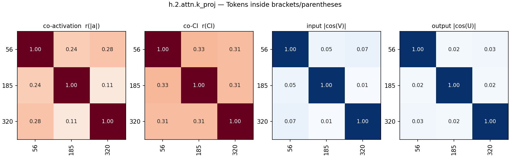

### Subordinating conjunctions & phrase-initial prepositions (3)

- **175** (mean CI 0.0155, fires 45854): prepositions and conjunctions
- **337** (mean CI 0.0075, fires 19320): subordinating conjunctions and prepositions starting introductory phrases
- **435** (mean CI 0.0014, fires 5128): attention head key projection on conjunctions and subordinating words

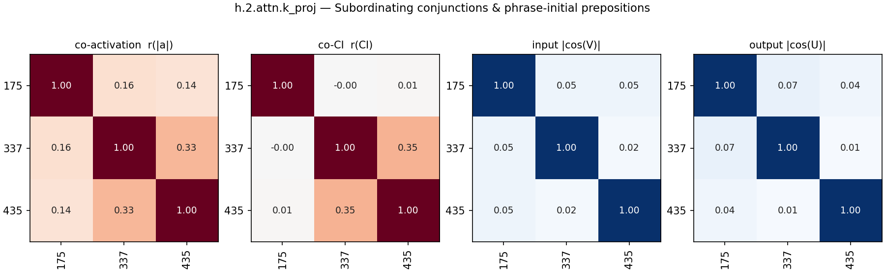

### Numbers predicting trailing punctuation (2)

- **183** (mean CI 0.0023, fires 7132): numbers in identifiers or citations
- **450** (mean CI 0.0194, fires 49754): fires on numbers, predicts trailing punctuation

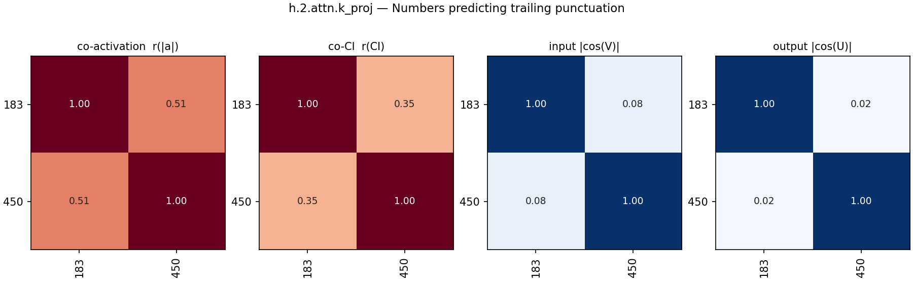

### Word/phrase endings predicting punctuation (3)

- **14** (mean CI 0.0567, fires 150062): predicts punctuation and delimiters
- **166** (mean CI 0.0347, fires 90393): word endings preceding punctuation or spaces
- **415** (mean CI 0.0210, fires 57939): predicts punctuation, spaces, and structural tokens

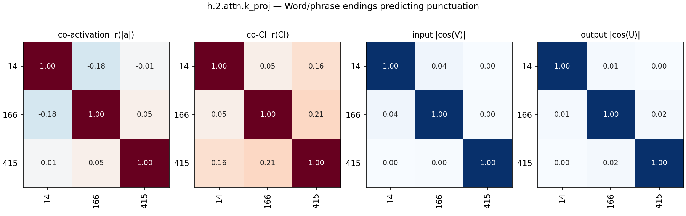

### Punctuation/symbols in structured technical text (13)

- **0** (mean CI 0.0536, fires 140612): symbols and delimiters in structured text
- **52** (mean CI 0.0277, fires 77581): punctuation and formatting in technical/structured text
- **55** (mean CI 0.0312, fires 82881): punctuation and formatting tokens in technical text
- **62** (mean CI 0.0433, fires 119882): fires on punctuation, brackets, and math notation
- **83** (mean CI 0.0562, fires 146961): fires on syntax and symbols indicating structural elements
- **143** (mean CI 0.0446, fires 120333): predicts punctuation or formatting in technical text
- **173** (mean CI 0.0411, fires 107781): technical text, code, and formatting syntax
- **197** (mean CI 0.0372, fires 97711): syntax and specific punctuation in code and math
- **280** (mean CI 0.0429, fires 114977): formatting and structural punctuation predictor
- **373** (mean CI 0.0673, fires 171022): structured text, formatting, code, math, and symbols
- **431** (mean CI 0.0561, fires 140886): fires on punctuation and special characters marking structural boundaries
- **447** (mean CI 0.0383, fires 100004): citations and formatting syntax
- **448** (mean CI 0.0237, fires 69146): punctuation and structural tokens in varied contexts

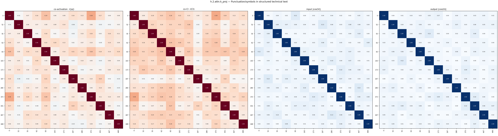

### Ungrouped (38)

- **1** (mean CI 0.0631, fires 163154): prose and text punctuation vs code and syntax
- **22** (mean CI 0.0019, fires 4870): html/xml and irc tag opening bracket '<'
- **39** (mean CI 0.0041, fires 10075): beginning of sequence and indentation tokens
- **42** (mean CI 0.0001, fires 387): markdown figure, table, and section header tokens
- **72** (mean CI 0.0616, fires 162873): proper nouns and identifiers in technical text
- **107** (mean CI 0.0793, fires 202473): fires on verbs and prepositions
- **125** (mean CI 0.0028, fires 8924): Predicts linebreaks after opening delimiters and structural brackets
- **130** (mean CI 0.0291, fires 78422): proper nouns, variables, and abbreviations
- **148** (mean CI 0.0460, fires 123541): promotes horizontal line and separator dashes
- **151** (mean CI 0.0005, fires 2324): predicts first character of parentheticals or list items
- **164** (mean CI 0.0066, fires 20497): weakly interpretable general text feature
- **167** (mean CI 0.1130, fires 287712): structural tokens, newlines, and beginning of new segments
- **187** (mean CI 0.0044, fires 10654): punctuation predicting urls, citations, and markup
- **206** (mean CI 0.6832, fires 1624433): fires on almost all tokens
- **217** (mean CI 0.0456, fires 120406): numbers, code, and structured technical text
- **218** (mean CI 0.0002, fires 539): markdown and academic structural markers
- **219** (mean CI 0.0043, fires 13258): syntactic marker matching words requiring 'the', 'of', 'and'
- **224** (mean CI 0.1761, fires 409592): content words and rare subtoken detector
- **225** (mean CI 0.0009, fires 2889): wh-words and degree adverbs (how, as, what)
- **247** (mean CI 0.0172, fires 47486): miscellaneous mid-sentence important words
- **259** (mean CI 0.0020, fires 4085): fires near tables, formatting, or random tokens
- **264** (mean CI 0.0000, fires 172): ellipses at the end of truncated text snippets
- **266** (mean CI 0.0066, fires 18868): promotes auxiliary verbs and contractions after pronouns
- **281** (mean CI 0.0018, fires 5932): variable names in math and code predicting operators
- **286** (mean CI 0.0619, fires 159294): promotes punctuation and word completions
- **295** (mean CI 0.0224, fires 62225): fires on context-specific nouns and numbers
- **306** (mean CI 0.0062, fires 15661): sequence boundaries and math variables/numbers
- **308** (mean CI 0.0489, fires 124663): mathematical, scientific, and technical formatting
- **322** (mean CI 0.0001, fires 427): dashes (positive) and 'each' (negative)
- **334** (mean CI 0.0076, fires 20609): fires on apostrophes, quotes, newlines, and modal verbs
- **369** (mean CI 0.0065, fires 20094): fires on punctuation introducing parentheticals, citations, or clauses
- **404** (mean CI 0.0022, fires 6579): fires on line prefixes like comments and quotes
- **421** (mean CI 0.0006, fires 1928): words preceding numbers, particularly months before dates
- **439** (mean CI 0.0378, fires 99903): diverse lexical patterns without a clear unified theme
- **445** (mean CI 0.0020, fires 6553): fires mostly on <|endoftext|> and capitalized starts
- **477** (mean CI 0.0084, fires 23703): fires on the first token of a new line
- **494** (mean CI 0.0080, fires 23136): non-english text
- **510** (mean CI 0.0428, fires 111820): fires on articles, pronouns, and determiners

## All pairs

All alive components in group order (black lines: group boundaries; last block: ungrouped).

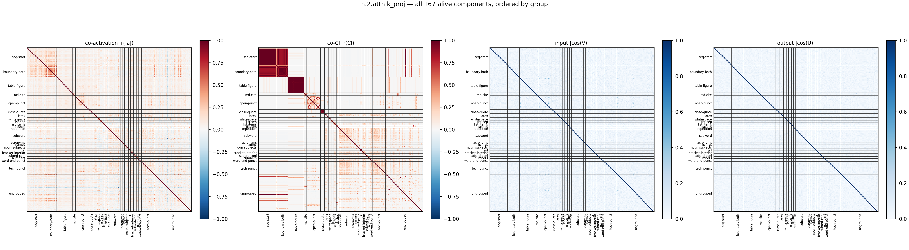

## Full co-CI grid

The co-CI panel alone, large, with every component index on both axes (same group order as above).

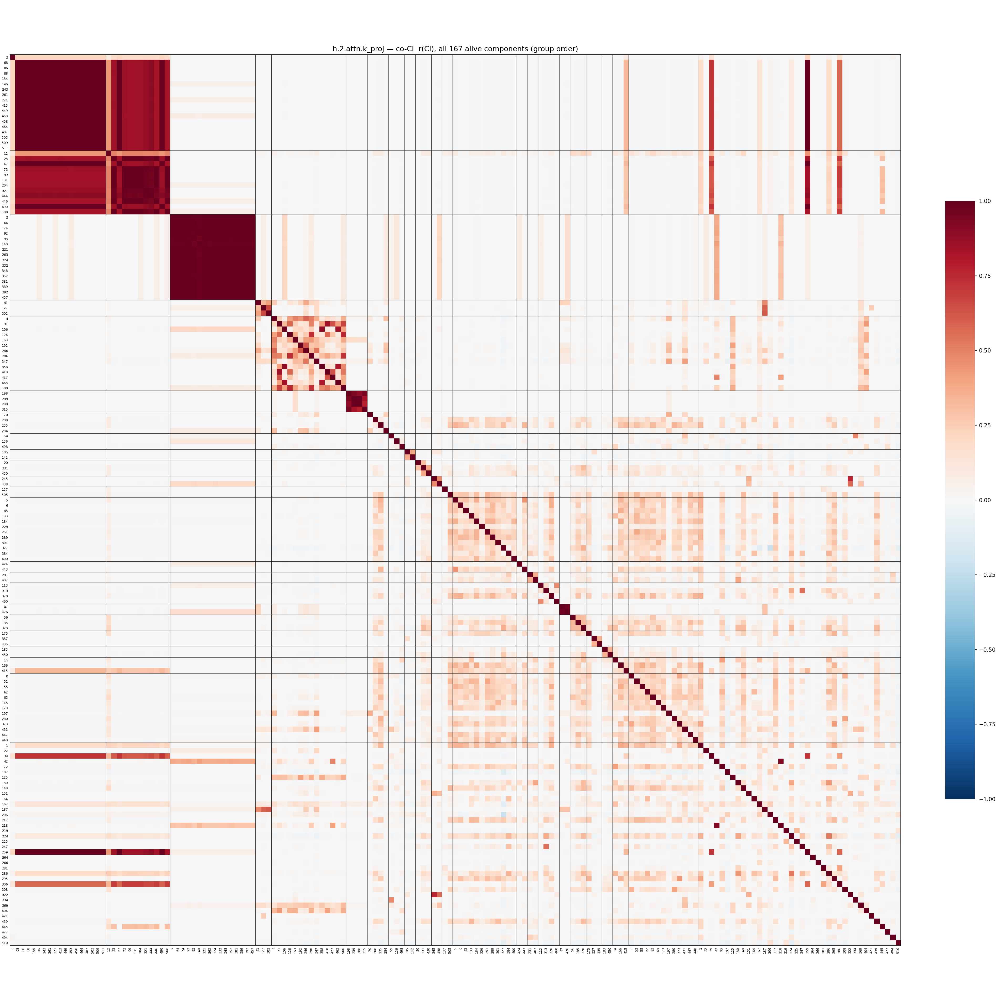
