# L2_q — component groups by expected CI co-firing (h.2.attn.q_proj)

All 92 alive components (harvest mean CI > 1e-6). Groups were formed by Claude (2026-08-28) reading each component's **full website description** (label + autointerp reasoning, fetched from the paper site) and grouping components expected to have high per-token CI-similarity: same trigger tokens/positions, subset-detectors of one pattern merged; patterns on different tokens kept apart; bimodal or vague descriptions left ungrouped. No activation/CI data was used to form the groups.

Per group with >1 member, four pairwise grids over a 2,048,000-token Pile sample (4000 cached rows):

- **co-activation** — Pearson r of |a_c| = |‖U_c‖ (V_c·φ)| per token
- **co-CI** — Pearson r of the causal importance (lower_leaky) per token; gray = component never varied (no CI in sample)
- **input cosine** — |cos(V_a, V_b)| of read-in vectors (|·|: component sign is gauge)
- **output cosine** — |cos(U_a, U_b)| of write vectors (|·|: same gauge)

'fires' below = tokens with CI > 0.1 in the sample. Within each group, components are ordered by component id (in the lists and on all grid axes).

## Groups

| group | n | members |
|---|---|---|
| [Statement/line-end punctuation → newline/clause start](#line-end) | 6 | 11 88 99 208 436 447 |
| [Newline/whitespace tokens → indentation](#newline-token) | 3 | 139 318 385 |
| [List separators & conjunctions](#list-conj) | 6 | 16 25 121 143 166 355 |
| [Repeated words/subwords in context (induction)](#repetition) | 5 | 110 124 195 242 426 |
| [Compound-word / identifier fragments](#subword) | 7 | 76 149 203 279 410 489 499 |
| [Operators, symbols & separators in code/math/technical text](#operators) | 14 | 22 46 48 66 202 211 261 295 311 367 393 402 461 463 |
| [Closing brackets/braces](#closing) | 3 | 156 180 322 |
| [Math variables & code identifiers](#identifiers) | 4 | 86 177 277 371 |
| [Uppercase acronyms & abbreviations](#acronyms) | 2 | 380 435 |
| [Numbers predicting punctuation/digits](#numbers) | 3 | 193 341 428 |
| [Tokens preceding numbers predicting digits](#pre-number) | 2 | 190 501 |
| [Determiners incl. 'the'](#determiners) | 4 | 207 212 450 453 |
| [Prepositions incl. 'of'](#prepositions) | 3 | 216 361 388 |
| [Action verbs](#action-verbs) | 2 | 283 467 |
| [Noun/phrase endings predicting punctuation](#noun-end-punct) | 2 | 313 508 |
| [Ungrouped](#ungrouped) | 26 | 20 47 62 130 138 148 171 219 227 241 259 270 271 304 320 335 337 349 432 439 472 481 497 500 502 506 |

### Statement/line-end punctuation → newline/clause start (6)

- **11** (mean CI 0.0041, fires 10768): predicts newlines and indentation after statement endings
- **88** (mean CI 0.0051, fires 13868): predicts newlines locally
- **99** (mean CI 0.0056, fires 14405): end of line detector predicting newlines
- **208** (mean CI 0.0085, fires 24201): fires on periods and statement-ending punctuation
- **436** (mean CI 0.1247, fires 315513): fires on punctuation and newlines to predict clause starts
- **447** (mean CI 0.0157, fires 44818): predicts newlines and indentation after line-ending punctuation

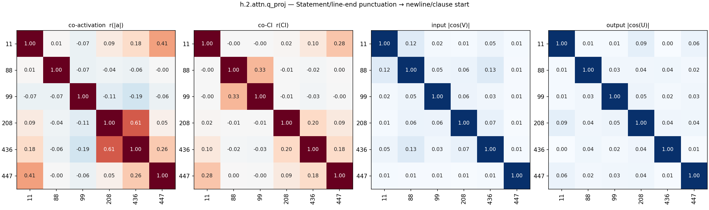

### Newline/whitespace tokens → indentation (3)

- **139** (mean CI 0.0211, fires 54989): fires on newlines to predict indentation and line starts
- **318** (mean CI 0.0134, fires 34982): indentation and spacing
- **385** (mean CI 0.0224, fires 54070): fires on newlines to predict indentation

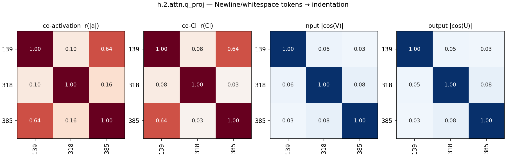

### List separators & conjunctions (6)

- **16** (mean CI 0.0540, fires 144767): fires on list separators and conjunctions
- **25** (mean CI 0.0058, fires 16575): fires on 'and' in lists and compound phrases
- **121** (mean CI 0.0081, fires 22213): conjunctions and list separators
- **143** (mean CI 0.0037, fires 11928): fires on conjunctions, prepositions, and relative pronouns
- **166** (mean CI 0.0202, fires 56300): list item separator and conjunction detector
- **355** (mean CI 0.0197, fires 56253): coordinating conjunctions and clause separators

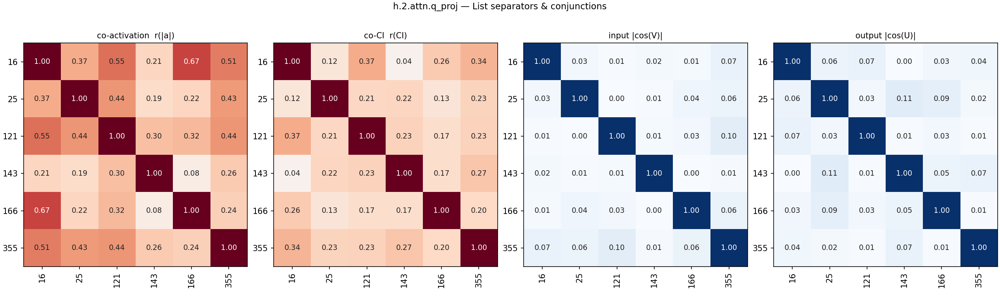

### Repeated words/subwords in context (induction) (5)

- **110** (mean CI 0.0294, fires 78566): fires on fragments of previously mentioned words or concepts
- **124** (mean CI 0.0225, fires 60193): fires on repeated words and phrases
- **195** (mean CI 0.0453, fires 111776): repeats sub-word units or associated terminology in context
- **242** (mean CI 0.0171, fires 47895): repeating significant or distinctive words in context
- **426** (mean CI 0.0255, fires 68877): induction head for repeated words and subwords

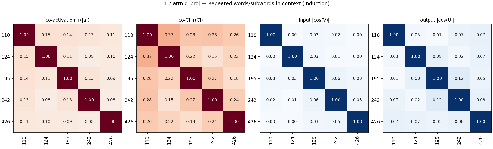

### Compound-word / identifier fragments (7)

- **76** (mean CI 0.0285, fires 75221): segments of compound words and identifiers
- **149** (mean CI 0.0357, fires 94525): mid-word subword continuations
- **203** (mean CI 0.0562, fires 144188): parts of multi-token identifiers and compound words
- **279** (mean CI 0.1288, fires 312286): word fragments and prefixes anticipating word completions
- **410** (mean CI 0.0290, fires 74688): connecting punctuation and words in compound phrases/identifiers
- **489** (mean CI 0.0346, fires 91168): predicts delimiters and structural punctuation
- **499** (mean CI 0.0365, fires 94250): subword tokens and predicting punctuation/suffixes

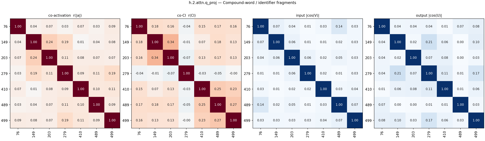

### Operators, symbols & separators in code/math/technical text (14)

- **22** (mean CI 0.0035, fires 10555): fires on punctuation in URLs, file paths, and citations
- **46** (mean CI 0.0772, fires 192900): punctuation predicting punctuation features
- **48** (mean CI 0.0240, fires 66155): punctuation and delimiters in code and structured text
- **66** (mean CI 0.1150, fires 280369): syntax and symbols in code, urls, and latex
- **202** (mean CI 0.0331, fires 88066): symbols, punctuation, and numbers in technical text
- **211** (mean CI 0.0162, fires 44285): punctuation, symbols, and operators
- **261** (mean CI 0.0784, fires 203991): code syntax, symbols, numbers and formatting
- **295** (mean CI 0.0159, fires 42493): identifier symbols, mathematical subscripts, and variable indicators
- **311** (mean CI 0.0428, fires 114065): operators and punctuation in math, code, and data
- **367** (mean CI 0.0348, fires 96446): structural syntax tokens, punctuation, and code/math symbols
- **393** (mean CI 0.0320, fires 86280): operators and structural tokens in math and code
- **402** (mean CI 0.0382, fires 104468): symbols and subwords in complex identifiers
- **461** (mean CI 0.0132, fires 31457): hyphens, underscores, and math operators
- **463** (mean CI 0.0315, fires 82517): structural separators (., _, :, ->) in technical text

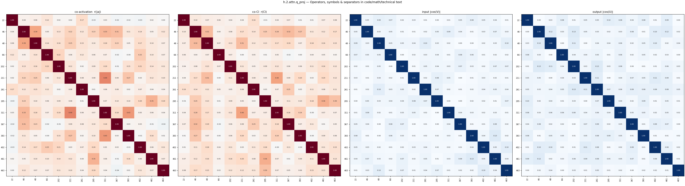

### Closing brackets/braces (3)

- **156** (mean CI 0.0003, fires 1195): predicts closing braces after statement terminators
- **180** (mean CI 0.0022, fires 7185): closing brackets and punctuation in nested structures
- **322** (mean CI 0.0103, fires 29628): fires on closing brackets/parentheses, especially in code/math

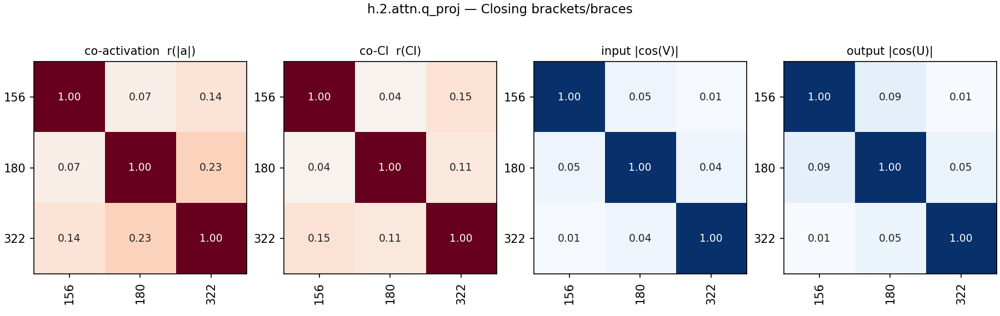

### Math variables & code identifiers (4)

- **86** (mean CI 0.0458, fires 115244): predicts subscripts, superscripts, and math operators
- **177** (mean CI 0.0132, fires 37331): single-letter variables and short acronyms
- **277** (mean CI 0.0387, fires 102315): mathematical, variable, and code identifier assignments/operations
- **371** (mean CI 0.0444, fires 119306): variables, identifiers, and attributes in code/markup

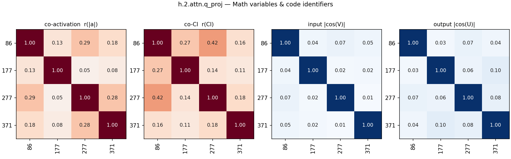

### Uppercase acronyms & abbreviations (2)

- **380** (mean CI 0.0118, fires 31791): uppercase acronyms and identifiers
- **435** (mean CI 0.0384, fires 92229): acronyms, abbreviations, and capitalized multi-letter tokens

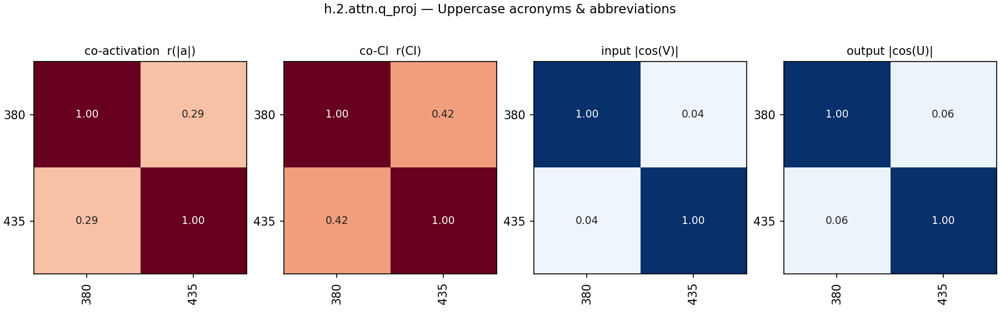

### Numbers predicting punctuation/digits (3)

- **193** (mean CI 0.0360, fires 88622): fires on numbers to predict following punctuation
- **341** (mean CI 0.0134, fires 33179): predicts digits and zero-padded numbers in identifiers
- **428** (mean CI 0.0115, fires 31698): fires on numeric digits and numbers

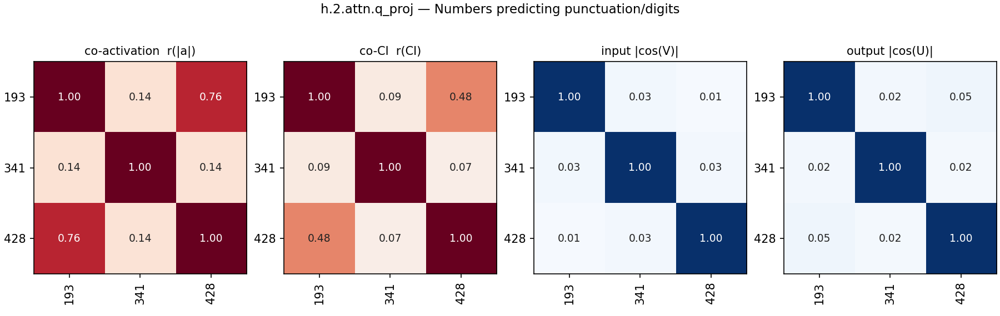

### Tokens preceding numbers predicting digits (2)

- **190** (mean CI 0.0155, fires 41885): predicts digits after formatting or number-indicating tokens
- **501** (mean CI 0.0152, fires 43974): predicting next element in a sequence or list

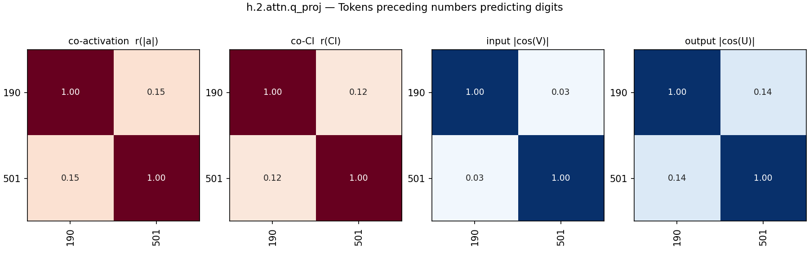

### Determiners incl. 'the' (4)

- **207** (mean CI 0.0888, fires 224032): determiners and adjectives within noun phrases
- **212** (mean CI 0.0134, fires 37243): fires on 'the' and other function words
- **450** (mean CI 0.0183, fires 51477): determiners and demonstratives
- **453** (mean CI 0.0064, fires 19050): indefinite articles and determiners

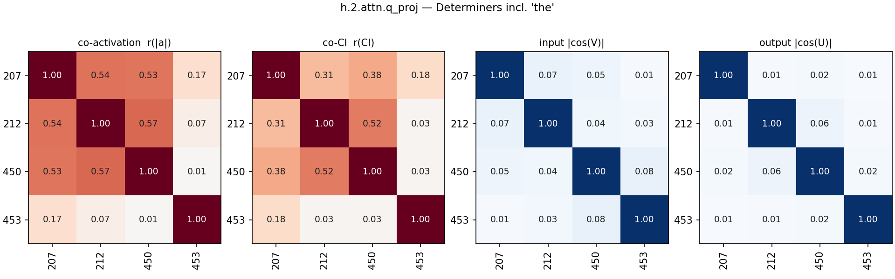

### Prepositions incl. 'of' (3)

- **216** (mean CI 0.0137, fires 38717): fires on prepositions and infinitival 'to'
- **361** (mean CI 0.0370, fires 98842): fires on prepositions and determiners
- **388** (mean CI 0.0024, fires 7634): fires on the word 'of'

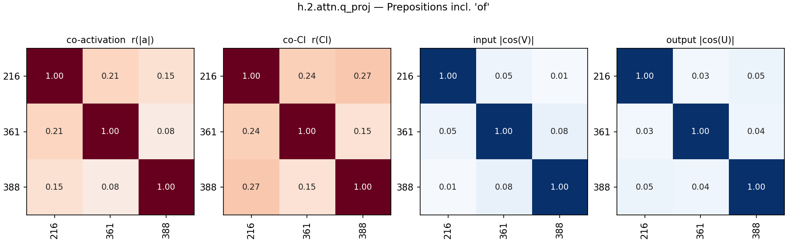

### Action verbs (2)

- **283** (mean CI 0.0194, fires 53989): verbs and action words
- **467** (mean CI 0.0186, fires 51481): verbs (often past tense or action)

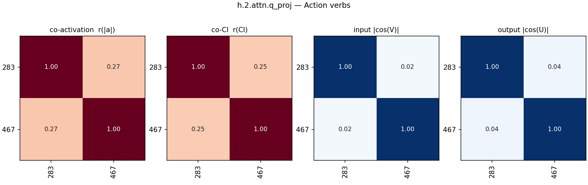

### Noun/phrase endings predicting punctuation (2)

- **313** (mean CI 0.0170, fires 48937): fires on scientific terms and proper nouns predicting punctuation
- **508** (mean CI 0.0290, fires 76774): fires on nouns/phrase endings to predict punctuation

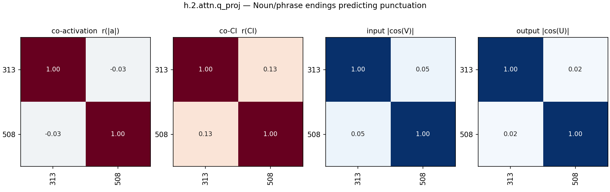

### Ungrouped (26)

- **20** (mean CI 0.0253, fires 68993): no clear unifying pattern, seems to fire on various terms and syntax
- **47** (mean CI 0.0241, fires 65826): hyphens, compound word parts, and structural tokens
- **62** (mean CI 0.0192, fires 53895): domain-specific terms, identifiers, and repeated key words
- **130** (mean CI 0.0002, fires 536): predicts variable names in math word problems
- **138** (mean CI 0.0574, fires 153278): repeating characters and formatting separators
- **148** (mean CI 0.0555, fires 148311): syntax and punctuation symbols in technical text
- **171** (mean CI 0.0516, fires 135004): fires on the second part of commonly hyphenated or paired words/numbers
- **219** (mean CI 0.0154, fires 44500): fires on auxiliary and copular verbs
- **227** (mean CI 0.0158, fires 43492): latex backslashes and english prepositions
- **241** (mean CI 0.0018, fires 6010): in / time words preceding years or numbers
- **259** (mean CI 0.0350, fires 90253): fires on word fragments and various tokens
- **270** (mean CI 0.2354, fires 563696): predicts punctuation, connectors, and sequence delimiters
- **271** (mean CI 0.0469, fires 118710): fires on xml tags and special punctuation
- **304** (mean CI 0.0037, fires 10595): fires on hyphens and newlines predicting numbers/compounds
- **320** (mean CI 0.0288, fires 75537): commas and open parentheses
- **335** (mean CI 0.6964, fires 1573345): fires on almost all tokens (general baseline)
- **337** (mean CI 0.0232, fires 63964): fires on subjects/pronouns, predicting verbs/contractions
- **349** (mean CI 0.0183, fires 48941): formatting characters and whitespace token promotion
- **432** (mean CI 0.0373, fires 98644): brackets, math formatting, and word fragments
- **439** (mean CI 0.0038, fires 12758): fires on various capitalized and specific terminology tokens
- **472** (mean CI 0.0382, fires 99296): uninterpretable polysemantic component
- **481** (mean CI 0.0087, fires 27515): promotes common words, punctuation, and newlines
- **497** (mean CI 0.0673, fires 174638): grammatical and logical connectors to predict structure.
- **500** (mean CI 0.0348, fires 88519): technical terms, acronyms, and code variables
- **502** (mean CI 0.0041, fires 13887): modifiers in compound nouns and noun adjuncts
- **506** (mean CI 0.0124, fires 36162): closing punctuation prediction in technical contexts

## All pairs

All alive components in group order (black lines: group boundaries; last block: ungrouped).

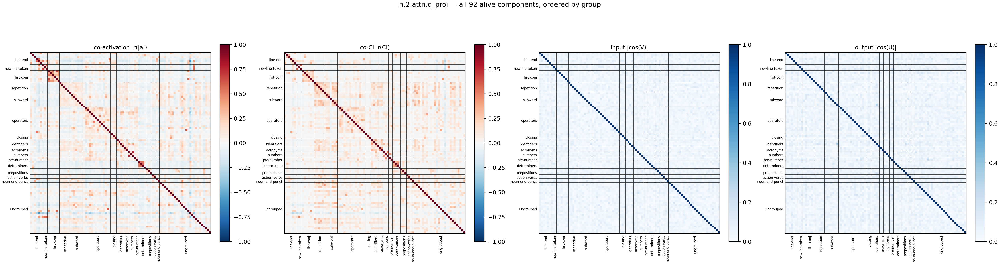

## Full co-CI grid

The co-CI panel alone, large, with every component index on both axes (same group order as above).

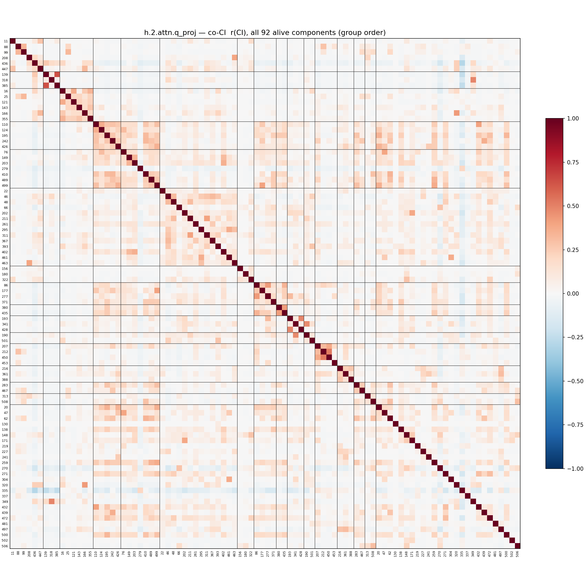
