# L3_k — component groups by expected CI co-firing (h.3.attn.k_proj)

All 60 alive components (harvest mean CI > 1e-6). Groups were formed by Claude (2026-08-28) reading each component's **full website description** (label + autointerp reasoning, fetched from the paper site) and grouping components expected to have high per-token CI-similarity: same trigger tokens/positions, subset-detectors of one pattern merged; patterns on different tokens kept apart; bimodal or vague descriptions left ungrouped. No activation/CI data was used to form the groups.

Per group with >1 member, four pairwise grids over a 2,048,000-token Pile sample (4000 cached rows):

- **co-activation** — Pearson r of |a_c| = |‖U_c‖ (V_c·φ)| per token
- **co-CI** — Pearson r of the causal importance (lower_leaky) per token; gray = component never varied (no CI in sample)
- **input cosine** — |cos(V_a, V_b)| of read-in vectors (|·|: component sign is gauge)
- **output cosine** — |cos(U_a, U_b)| of write vectors (|·|: same gauge)

'fires' below = tokens with CI > 0.1 in the sample. Within each group, components are ordered by component id (in the lists and on all grid axes).

## Groups

| group | n | members |
|---|---|---|
| [First token of the sequence](#seq-start) | 9 | 5 79 132 133 208 277 289 394 492 |
| [Both <|endoftext|> and first token (boundaries)](#boundary-both) | 5 | 65 75 180 336 490 |
| [Fires on <|endoftext|>](#eos) | 3 | 19 241 448 |
| [Newline tokens → indentation/next line](#newline) | 7 | 190 215 261 294 379 435 464 |
| [Subordinating conjunctions & clause initiators](#subord-conj) | 5 | 50 120 189 218 439 |
| [Coordinating/correlative conjunctions](#coord-conj) | 3 | 45 56 333 |
| [Subject nouns/pronouns predicting verbs/prepositions](#subject-gram) | 6 | 29 164 384 411 487 507 |
| [List/enumeration labels predicting punctuation](#list-markers) | 3 | 59 115 309 |
| [First subword of split words predicting continuation](#subword) | 2 | 413 444 |
| [Ungrouped](#ungrouped) | 17 | 20 25 96 117 124 145 154 249 259 285 321 323 342 347 428 475 502 |

### First token of the sequence (9)

- **5** (mean CI 0.0020, fires 4062): fires on the first token of a sequence
- **79** (mean CI 0.0020, fires 4058): first token of the sequence
- **132** (mean CI 0.0020, fires 4061): first token of a sequence
- **133** (mean CI 0.0020, fires 4059): first token in the context window
- **208** (mean CI 0.0020, fires 4061): first token in a sequence
- **277** (mean CI 0.0000, fires 63): first token of a sequence
- **289** (mean CI 0.0023, fires 5201): fires on the first token of a sequence
- **394** (mean CI 0.0020, fires 4060): fires on the first token of a sequence
- **492** (mean CI 0.0020, fires 4064): first token in sequence

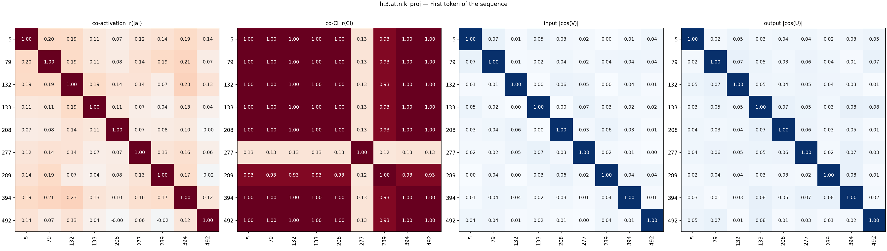

### Both <|endoftext|> and first token (boundaries) (5)

- **65** (mean CI 0.0026, fires 5472): fires on sequence starts and document boundaries
- **75** (mean CI 0.0037, fires 9394): first token in sequence or document boundary
- **180** (mean CI 0.0031, fires 6719): first sequence token and endoftext tokens
- **336** (mean CI 0.0027, fires 5949): sequence beginnings and document boundaries
- **490** (mean CI 0.0029, fires 6108): sequence boundaries and first tokens

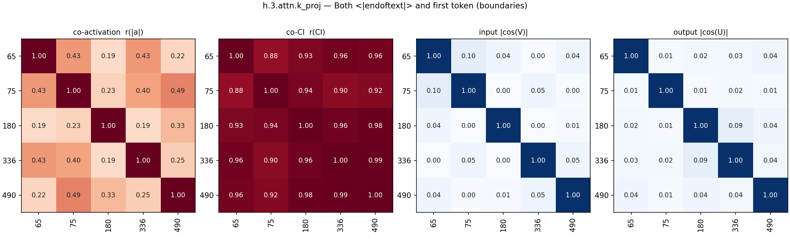

### Fires on <|endoftext|> (3)

- **19** (mean CI 0.0001, fires 264): fires on the <|endoftext|> token
- **241** (mean CI 0.0006, fires 1416): fires on <|endoftext|> to predict document-starting tokens
- **448** (mean CI 0.0002, fires 711): fires on <|endoftext|> separator tokens

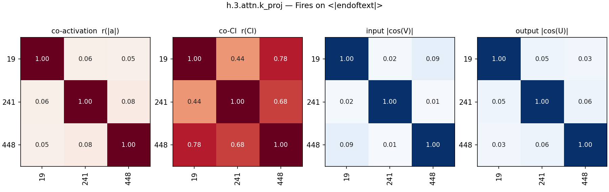

### Newline tokens → indentation/next line (7)

- **190** (mean CI 0.0096, fires 24149): fires on newline and indentation tokens
- **215** (mean CI 0.0013, fires 3444): predicts indentation after newlines in code
- **261** (mean CI 0.0034, fires 8671): fires on newline and line break tokens
- **294** (mean CI 0.0018, fires 5977): predicts section headers, lists, and newlines
- **379** (mean CI 0.0013, fires 3453): fires on newline tokens
- **435** (mean CI 0.0038, fires 8633): newlines and indentation preceding text
- **464** (mean CI 0.0024, fires 6381): predicts indentation spaces and tabs after newlines

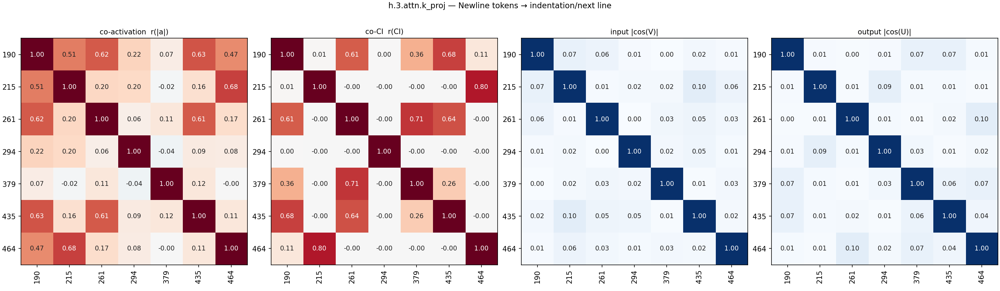

### Subordinating conjunctions & clause initiators (5)

- **50** (mean CI 0.0026, fires 8179): clause-starting question words and subordinating conjunctions
- **120** (mean CI 0.0004, fires 1829): subordinating conjunctions and interrogative words
- **189** (mean CI 0.0023, fires 6719): fires on subordinating conjunctions and conditional words
- **218** (mean CI 0.0094, fires 28546): transition words and clause initiators
- **439** (mean CI 0.0127, fires 36239): subordinating conjunctions, conditionals, and relative pronouns

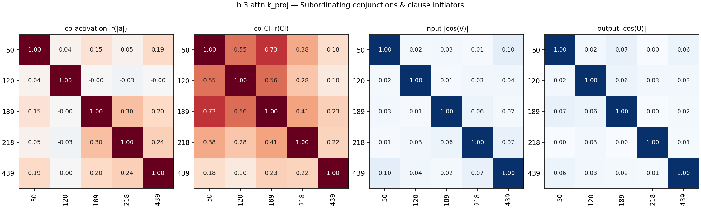

### Coordinating/correlative conjunctions (3)

- **45** (mean CI 0.0009, fires 2981): conjunctions in coordinate structures ('and', '&', 'neither')
- **56** (mean CI 0.0007, fires 2114): fires on words introducing pairs or choices (between, both, either)
- **333** (mean CI 0.0134, fires 38109): fires on coordinating conjunctions and commas in lists/clauses

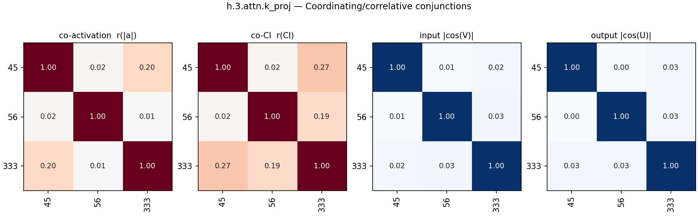

### Subject nouns/pronouns predicting verbs/prepositions (6)

- **29** (mean CI 0.0385, fires 104650): head nouns in formal, academic, or legal text
- **164** (mean CI 0.0023, fires 8094): abstract nouns predicting associated verbs or prepositions
- **384** (mean CI 0.0203, fires 55707): abstract nouns and pronouns predicting verbs or 'of'
- **411** (mean CI 0.0181, fires 50974): pronouns and specific subjects
- **487** (mean CI 0.0082, fires 25441): noun and subject tokens prior to relational prepositions
- **507** (mean CI 0.1579, fires 365994): content words predicting grammatical continuations or punctuation

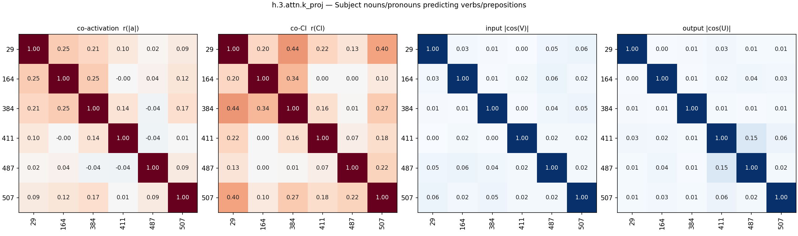

### List/enumeration labels predicting punctuation (3)

- **59** (mean CI 0.0001, fires 379): list item markers predicting following punctuation
- **115** (mean CI 0.0003, fires 1134): predicts closing parenthesis after list or figure labels
- **309** (mean CI 0.0005, fires 1676): predicts punctuation after enumerations and list markers

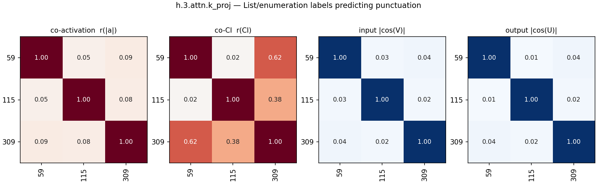

### First subword of split words predicting continuation (2)

- **413** (mean CI 0.0880, fires 223081): fires on initial subwords of multi-token words
- **444** (mean CI 0.0173, fires 47912): predicts continuations of split words and entities

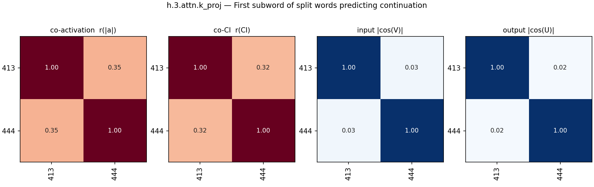

### Ungrouped (17)

- **20** (mean CI 0.0054, fires 18613): scientific and technical terminology
- **25** (mean CI 0.0011, fires 3889): capitalized terms in legal disclaimers and citations
- **96** (mean CI 0.1817, fires 472822): general context tracking with preference for hyphenated or complex terms
- **117** (mean CI 0.0006, fires 1845): predicts acronyms after an open parenthesis
- **124** (mean CI 0.0000, fires 88): markdown header underline and table separator continuation
- **145** (mean CI 0.6927, fires 1626486): frequent token bias / always-on component
- **154** (mean CI 0.0001, fires 487): commas preceding parenthetical or transitional phrases
- **249** (mean CI 0.0098, fires 23621): non-english text
- **259** (mean CI 0.0002, fires 727): fires on document boundaries and markdown headers
- **285** (mean CI 0.0023, fires 6935): fires on latex command names
- **321** (mean CI 0.0001, fires 235): list ordinals (positive) and article 'an' (negative)
- **323** (mean CI 0.0064, fires 20203): auxiliary verbs, copulas, and infinitive markers
- **342** (mean CI 0.0419, fires 114469): predicts object pronouns after transitive verbs
- **347** (mean CI 0.0542, fires 144315): fires on grammatical function words and sentence transitions
- **428** (mean CI 0.0165, fires 46794): fires predominantly on `<|endoftext|>` token and starts of lines/sequences
- **475** (mean CI 0.0063, fires 17220): fires on code identifiers and sequence starts
- **502** (mean CI 0.0013, fires 4807): fires on numbers to predict trailing punctuation and units

## All pairs

All alive components in group order (black lines: group boundaries; last block: ungrouped).

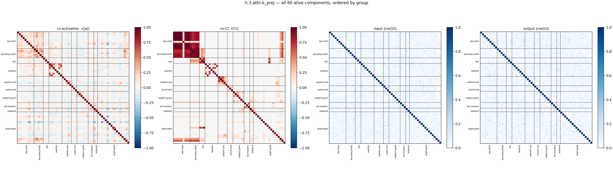

## Full co-CI grid

The co-CI panel alone, large, with every component index on both axes (same group order as above).

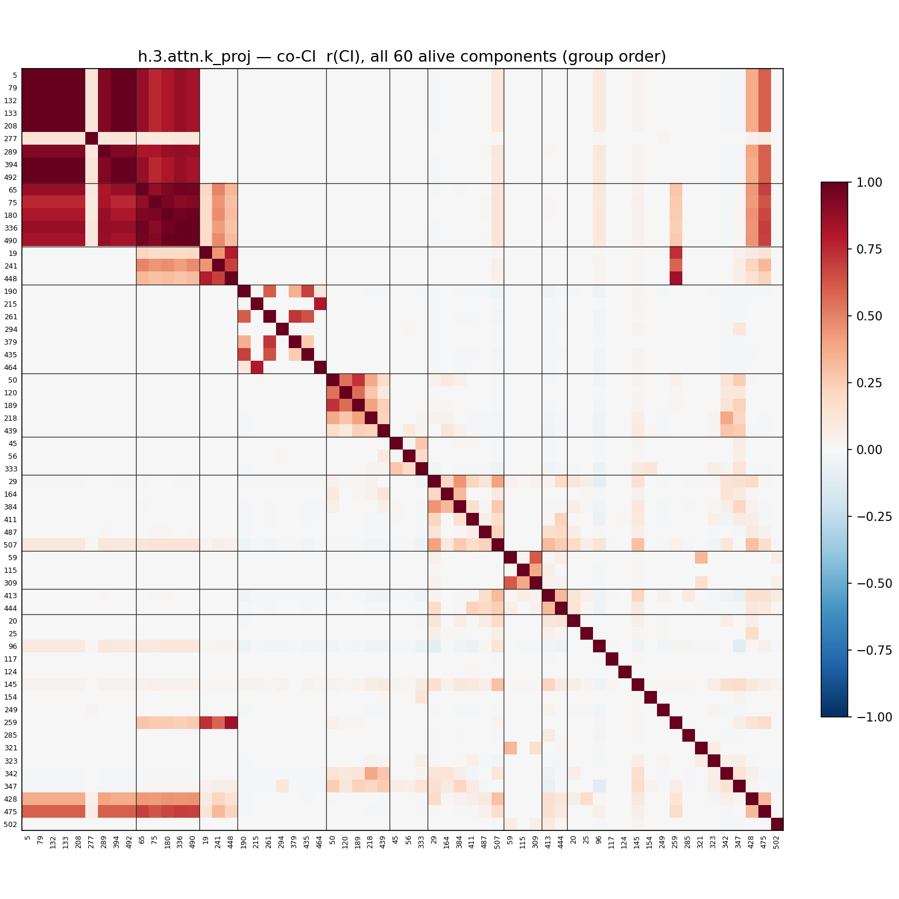
