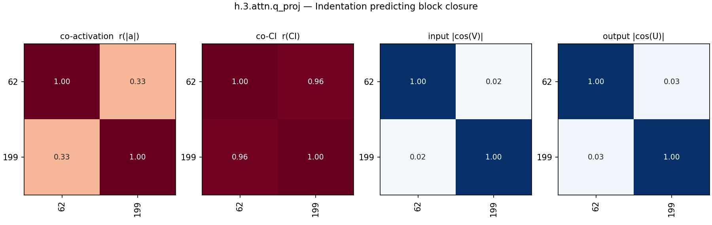
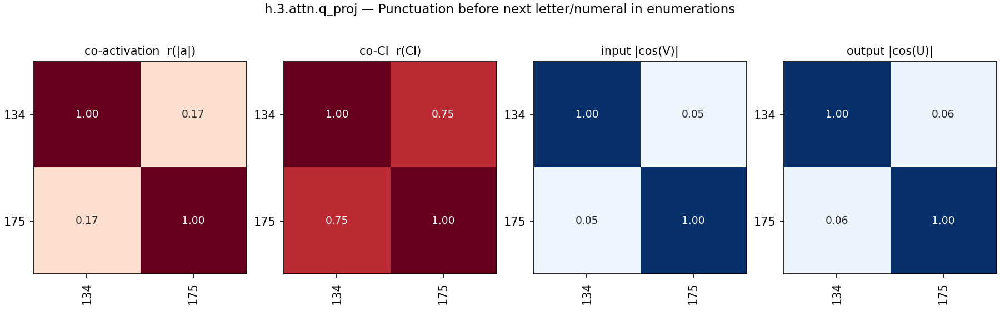
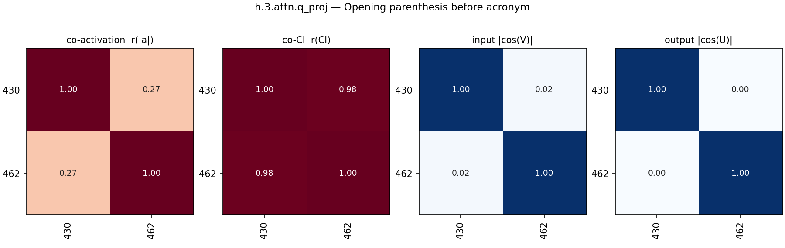
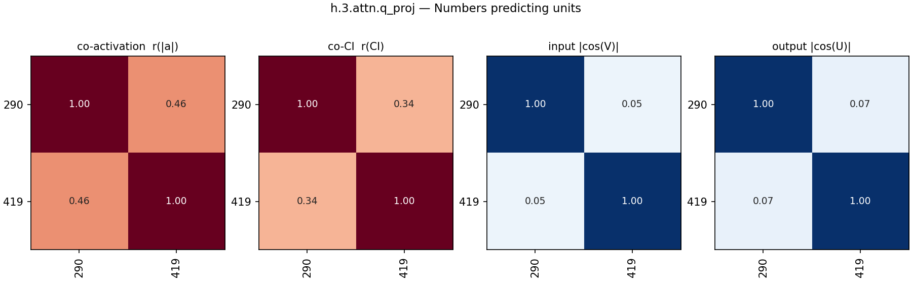
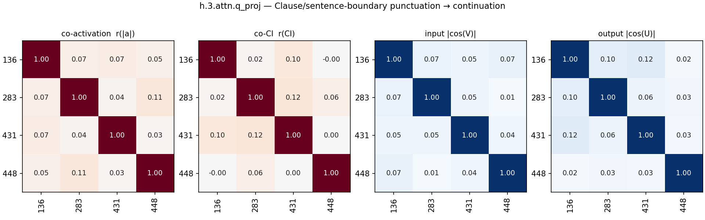
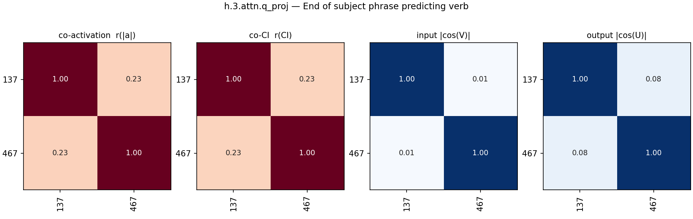
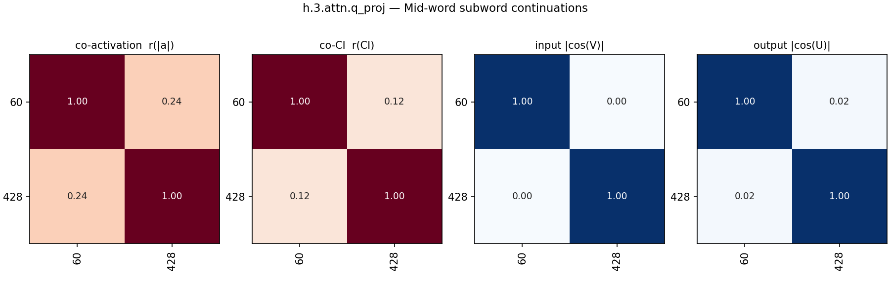
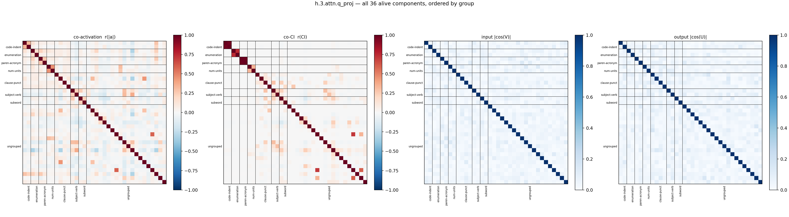
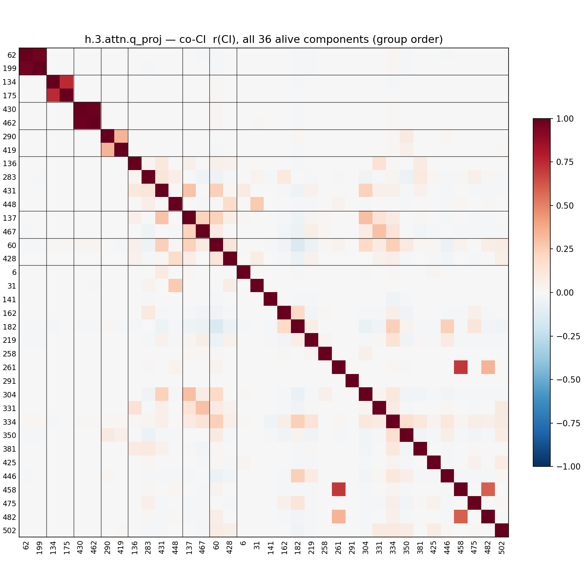

# L3_q — component groups by expected CI co-firing (h.3.attn.q_proj)

All 36 alive components (harvest mean CI > 1e-6). Groups were formed by Claude (2026-08-28) reading each component's **full website description** (label + autointerp reasoning, fetched from the paper site) and grouping components expected to have high per-token CI-similarity: same trigger tokens/positions, subset-detectors of one pattern merged; patterns on different tokens kept apart; bimodal or vague descriptions left ungrouped. No activation/CI data was used to form the groups.

Per group with >1 member, four pairwise grids over a 2,048,000-token Pile sample (4000 cached rows):

- **co-activation** — Pearson r of |a_c| = |‖U_c‖ (V_c·φ)| per token
- **co-CI** — Pearson r of the causal importance (lower_leaky) per token; gray = component never varied (no CI in sample)
- **input cosine** — |cos(V_a, V_b)| of read-in vectors (|·|: component sign is gauge)
- **output cosine** — |cos(U_a, U_b)| of write vectors (|·|: same gauge)

'fires' below = tokens with CI > 0.1 in the sample. Within each group, components are ordered by component id (in the lists and on all grid axes).

## Groups

| group | n | members |
|---|---|---|
| [Indentation predicting block closure](#code-indent) | 2 | 62 199 |
| [Punctuation before next letter/numeral in enumerations](#enumeration) | 2 | 134 175 |
| [Opening parenthesis before acronym](#paren-acronym) | 2 | 430 462 |
| [Numbers predicting units](#num-units) | 2 | 290 419 |
| [Clause/sentence-boundary punctuation → continuation](#clause-punct) | 4 | 136 283 431 448 |
| [End of subject phrase predicting verb](#subject-verb) | 2 | 137 467 |
| [Mid-word subword continuations](#subword) | 2 | 60 428 |
| [Ungrouped](#ungrouped) | 20 | 6 31 141 162 182 219 258 261 291 304 331 334 350 381 425 446 458 475 482 502 |

### Indentation predicting block closure (2)

- **62** (mean CI 0.0015, fires 3670): indentation predicting block closures and syntax keywords
- **199** (mean CI 0.0012, fires 3068): predicts closing block tokens after indentation

### Punctuation before next letter/numeral in enumerations (2)

- **134** (mean CI 0.0003, fires 1126): predicts next letter or roman numeral in sequence
- **175** (mean CI 0.0001, fires 431): predicts subsequent letters in alphabetical enumerations

### Opening parenthesis before acronym (2)

- **430** (mean CI 0.0005, fires 1587): opening parenthesis before acronym abbreviation
- **462** (mean CI 0.0006, fires 1717): opening parenthesis introducing an acronym or abbreviation

### Numbers predicting units (2)

- **290** (mean CI 0.0005, fires 2285): activates on numbers, predicts units of measurement
- **419** (mean CI 0.0007, fires 2945): fires on numbers preceding scientific units

### Clause/sentence-boundary punctuation → continuation (4)

- **136** (mean CI 0.0004, fires 1361): commas terminating clauses or phrases predicting continuations
- **283** (mean CI 0.0465, fires 125541): clause and sentence boundary detector
- **431** (mean CI 0.0135, fires 40788): fires near closing parentheses or ends of phrases to predict a comma or closing syntax
- **448** (mean CI 0.0029, fires 7992): predicts conjunctions and clause boundaries multilingually

### End of subject phrase predicting verb (2)

- **137** (mean CI 0.0137, fires 37061): end of subject phrase preceding verbs
- **467** (mean CI 0.0314, fires 82770): fires on subjects and entities entering an action

### Mid-word subword continuations (2)

- **60** (mean CI 0.1741, fires 439302): word continuation and completion
- **428** (mean CI 0.0243, fires 63874): sub-word tokens in non-english languages

### Ungrouped (20)

- **6** (mean CI 0.0002, fires 898): scientific and medical terms in academic titles
- **31** (mean CI 0.0001, fires 426): punctuation and formatting tokens in multilingual or code contexts
- **141** (mean CI 0.0011, fires 3079): predicts indentation spaces after newlines
- **162** (mean CI 0.0273, fires 74355): fires after grammatical function words
- **182** (mean CI 0.1514, fires 375805): fires broadly on common english structure words
- **219** (mean CI 0.0401, fires 114492): fires on auxiliary verbs
- **258** (mean CI 0.0001, fires 255):  verbs preceding 'is' in relative clauses
- **261** (mean CI 0.0009, fires 2369): polysemantic component
- **291** (mean CI 0.0003, fires 621): predicts 'as' or 'that' after 'such' or 'known'
- **304** (mean CI 0.0285, fires 75161): predicting punctuation (commas, question marks) and conjunctions
- **331** (mean CI 0.0117, fires 32633): predicts prepositions
- **334** (mean CI 0.7215, fires 1626643): universally active component across all contexts
- **350** (mean CI 0.0629, fires 167855): punctuation predicting component following adjectives or specific entities
- **381** (mean CI 0.0216, fires 59529): coordinating conjunctions and list separators
- **425** (mean CI 0.0028, fires 8458): fires on periods in acronyms, urls, and code
- **446** (mean CI 0.0319, fires 89750): fires on determiners and pronouns
- **458** (mean CI 0.0020, fires 4812): fires on document boundaries and <|endoftext|>
- **475** (mean CI 0.0098, fires 30453): syntactic punctuation symbols and operators in code
- **482** (mean CI 0.0053, fires 13214): fires negatively on endoftext, positively on general text
- **502** (mean CI 0.0172, fires 50080): hyphens, quotes, and structural punctuation

## All pairs

All alive components in group order (black lines: group boundaries; last block: ungrouped).

## Full co-CI grid

The co-CI panel alone, large, with every component index on both axes (same group order as above).

