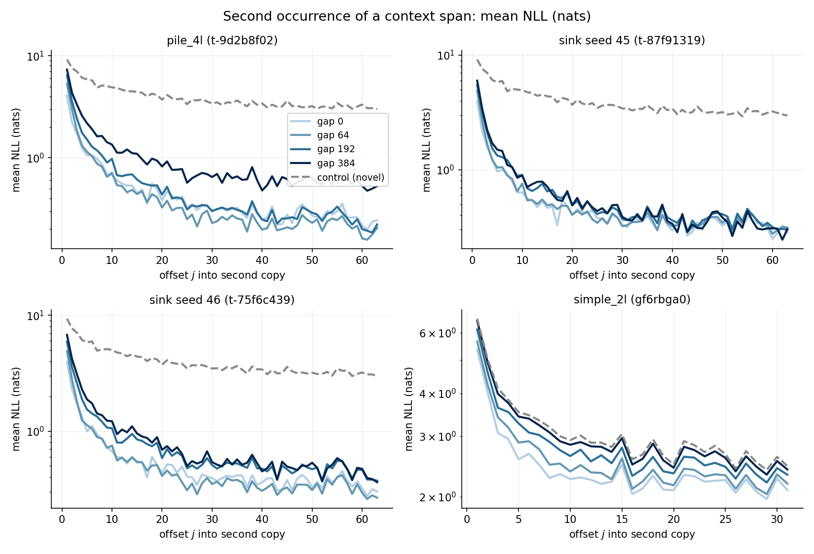
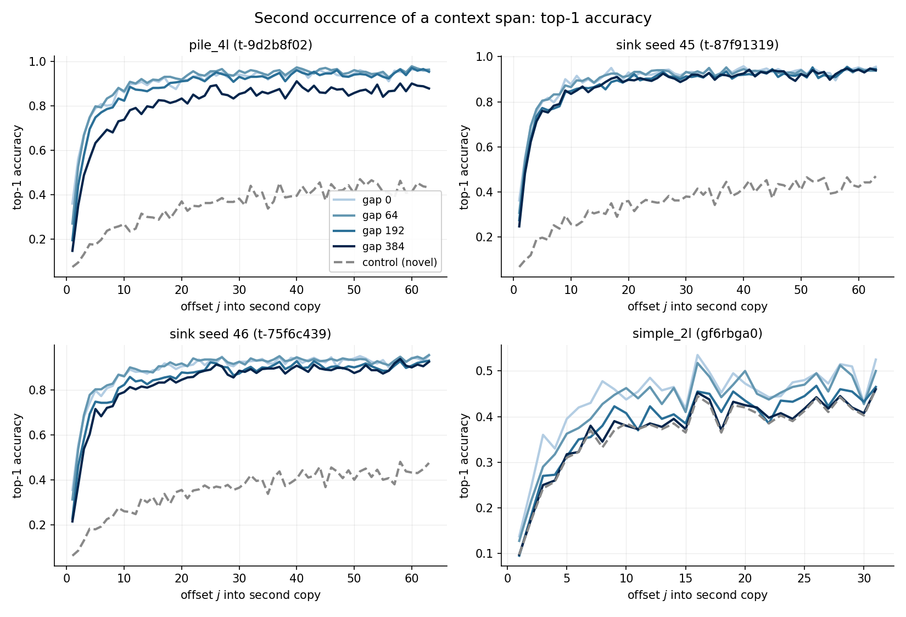
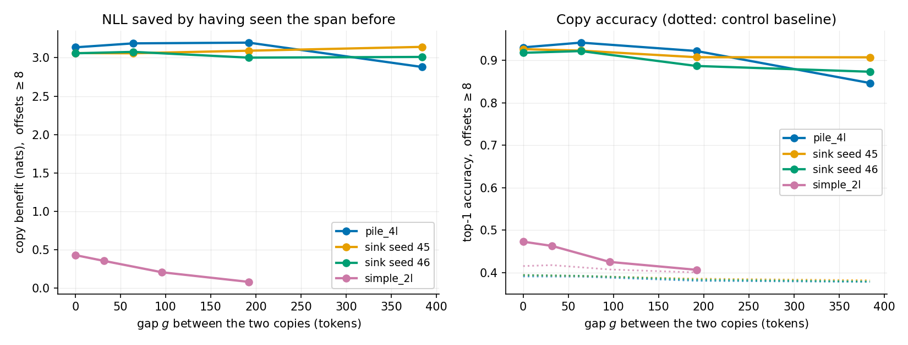
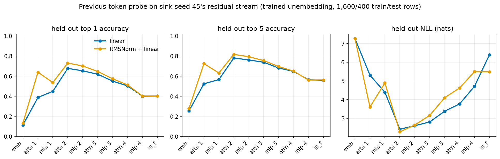
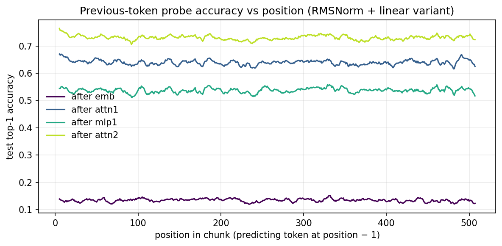

# prev-token: previous-token attention & copying from context

Three questions; the first two answered for all four target models (pile_4l `t-9d2b8f02`, sink seed 45 `t-87f91319`, sink seed 46 `t-75f6c439`, simple_2l `gf6rbga0`), the third for sink seed 45:

1. **How much of each attention head's total attention goes to the immediately preceding token?** (`hide/attention_stats.py` → `hide/cache/attn_stats.npz`)
2. **How well does each model predict text it has already seen earlier in its context?** — the behavioral induction/copying capability. (`hide/copy_predict.py` → `hide/cache/copy_predict.npz`; figures by `hide/copy_plot.py`)
3. **Where in the residual stream does the previous token become linearly readable?** — trained-unembedding probes at every stage, sink seed 45. (`hide/prev_probe_modal.py` → `hide/cache/prev_probe.npz`; figures by `hide/prev_probe_plot.py`)

Data: 500 cached Pile rows (512 tokens) for the three Pile models; 500 cached SimpleStories stories (truncated to 512) for simple_2l. Sink models loaded via `load.load_sink(seed)` = the local Torch port with **corrected RoPE** (see `sink-models/rope_report.md`), so long-range behavior is trustworthy.

---

## 1. Previous-token attention per head

Attention is recomputed per head from each attention module's own weights (forward pre-hook; the module itself may run flash attention). Reported: the mean over all queries $i \geq 1$ of the softmax mass on key $i-1$,

$$\bar{a}_{\text{prev}} = \big\langle \mathrm{att}[i, i{-}1] \big\rangle_{i \geq 1}.$$

For the sink models the softmax includes the learned sink slot (GPT-OSS style), so their fractions are shares of **total** attention including the sink; the sink-slot mass itself is tabulated below.

### pile_4l (t-9d2b8f02)

| layer | h0 | h1 | h2 | h3 | h4 | h5 |
|---|---|---|---|---|---|---|
| 0 | 0.115 | 0.169 | 0.104 | 0.183 | 0.125 | **0.302** |
| 1 | 0.220 | **0.623** | 0.152 | 0.298 | 0.034 | 0.135 |
| 2 | 0.163 | 0.102 | 0.016 | 0.019 | 0.005 | 0.128 |
| 3 | 0.152 | 0.161 | 0.039 | 0.100 | 0.034 | 0.113 |

### sink seed 45 (t-87f91319) — sink-inclusive fractions

| layer | h0 | h1 | h2 | h3 | h4 | h5 |
|---|---|---|---|---|---|---|
| 0 | 0.039 | 0.053 | 0.044 | 0.037 | 0.021 | 0.059 |
| 1 | **0.344** | 0.041 | 0.059 | 0.004 | 0.105 | 0.124 |
| 2 | 0.048 | 0.107 | 0.100 | 0.143 | 0.002 | 0.061 |
| 3 | 0.096 | 0.023 | 0.032 | 0.006 | 0.085 | 0.124 |

Sink-slot mass (same run):

| layer | h0 | h1 | h2 | h3 | h4 | h5 |
|---|---|---|---|---|---|---|
| 0 | 0.908 | 0.099 | 0.887 | 0.578 | 0.762 | 0.879 |
| 1 | 0.517 | 0.231 | 0.609 | 0.386 | 0.337 | 0.218 |
| 2 | 0.268 | 0.311 | 0.451 | 0.374 | 0.657 | 0.367 |
| 3 | 0.470 | 0.344 | 0.412 | 0.510 | 0.272 | 0.510 |

### sink seed 46 (t-75f6c439) — sink-inclusive fractions

| layer | h0 | h1 | h2 | h3 | h4 | h5 |
|---|---|---|---|---|---|---|
| 0 | 0.020 | 0.059 | 0.029 | 0.044 | 0.044 | 0.043 |
| 1 | 0.005 | 0.109 | **0.282** | 0.136 | 0.089 | 0.014 |
| 2 | 0.172 | 0.029 | 0.047 | 0.003 | 0.124 | 0.073 |
| 3 | 0.062 | 0.083 | 0.030 | 0.140 | 0.012 | 0.016 |

Sink-slot mass (same run):

| layer | h0 | h1 | h2 | h3 | h4 | h5 |
|---|---|---|---|---|---|---|
| 0 | 0.676 | 0.893 | 0.877 | 0.859 | 0.878 | 0.087 |
| 1 | 0.453 | 0.250 | 0.599 | 0.675 | 0.177 | 0.362 |
| 2 | 0.390 | 0.435 | 0.357 | 0.619 | 0.401 | 0.225 |
| 3 | 0.487 | 0.304 | 0.261 | 0.491 | 0.431 | 0.417 |

### simple_2l (gf6rbga0)

| layer | h0 | h1 | h2 | h3 | h4 | h5 |
|---|---|---|---|---|---|---|
| 0 | 0.103 | 0.143 | 0.257 | **0.301** | 0.119 | 0.084 |
| 1 | 0.194 | 0.205 | **0.322** | **0.316** | 0.051 | 0.048 |

(Self-attention mass $\mathrm{att}[i,i]$ is also in the cache; it is ≤ 0.16 for the Pile models, up to 0.35 for simple_2l L0h3.)

### Findings

- **Every model has exactly one clear previous-token head in an early layer** (simple_2l a pair): pile_4l **L1h1 at 0.62** — the strongest anywhere; sink45 **L1h0** (0.34); sink46 **L1h2** (0.28); simple_2l **L1h2/h3** (0.32 each, L0h3 close at 0.30). In all three 4-layer Pile models it sits in layer 1.
- The sink models' fractions are diluted by the sink slot, which absorbs 9–91% of each head's attention (largest in layer 0, matching the sink-logit magnitudes). Renormalized to non-sink attention, sink45 L1h0 ≈ 0.34/0.48 ≈ **0.71** and sink46 L1h2 ≈ 0.28/0.40 ≈ **0.70** — comparable to or above pile_4l's 0.62.
- pile_4l's generally higher baseline (0.1–0.3 in most heads) reflects that its local heads have no sink slot: mass the sink models park on the built-in sink shows up spread over recent keys in pile_4l.
- Near-zero heads are stable across seeds: pile_4l L2h4 (0.005, the known position/induction head), and each sink model has one L1 and one L2 head at ≤ 0.005.

---

## 2. Predicting previously-seen text (copying / induction)

Paradigm (per event): a natural-text span $A$ of $S$ tokens, a filler $F_g$ of $g$ tokens from a *different* document, then $A$ verbatim again — versus a control where the first copy is replaced by an unrelated span $A'$:

$$\text{rep} = [A,\, F_g,\, A], \qquad \text{ctl} = [A',\, F_g,\, A].$$

Both are scored on the second copy at offsets $j = 1..S{-}1$ (predicting $A[j]$ from the preceding context). The control gives the novel-text baseline at exactly matched positions and context lengths, so the **copy benefit** is

$$\Delta(j) = \mathrm{NLL}_{\text{ctl}}(j) - \mathrm{NLL}_{\text{rep}}(j) \quad [\text{nats}].$$

Pile models: $S = 64$, $g \in \{0, 64, 192, 384\}$, spans/fillers EOS-free from distinct cached rows; 400 events, identical across the three models. simple_2l: $S = 32$, $g \in \{0, 32, 96, 192\}$, spans from cached stories.

Summary (offsets $j \geq 8$, past the induction ramp-up):

| model | gap | rep NLL | ctl NLL | benefit (nats) | rep top-1 | ctl top-1 |
|---|---|---|---|---|---|---|
| pile_4l | 0 | 0.359 | 3.494 | 3.14 | 0.930 | 0.391 |
| pile_4l | 64 | 0.303 | 3.490 | 3.19 | 0.942 | 0.391 |
| pile_4l | 192 | 0.386 | 3.582 | 3.20 | 0.922 | 0.381 |
| pile_4l | 384 | 0.742 | 3.622 | 2.88 | 0.847 | 0.378 |
| sink45 | 0 | 0.390 | 3.451 | 3.06 | 0.926 | 0.395 |
| sink45 | 64 | 0.400 | 3.458 | 3.06 | 0.923 | 0.392 |
| sink45 | 192 | 0.462 | 3.553 | 3.09 | 0.907 | 0.386 |
| sink45 | 384 | 0.458 | 3.599 | 3.14 | 0.907 | 0.382 |
| sink46 | 0 | 0.428 | 3.486 | 3.06 | 0.918 | 0.395 |
| sink46 | 64 | 0.398 | 3.475 | 3.08 | 0.922 | 0.393 |
| sink46 | 192 | 0.582 | 3.584 | 3.00 | 0.887 | 0.384 |
| sink46 | 384 | 0.629 | 3.640 | 3.01 | 0.873 | 0.379 |
| simple_2l | 0 | 2.204 | 2.635 | 0.43 | 0.473 | 0.416 |
| simple_2l | 32 | 2.304 | 2.659 | 0.36 | 0.463 | 0.418 |
| simple_2l | 96 | 2.507 | 2.715 | 0.21 | 0.425 | 0.408 |
| simple_2l | 192 | 2.668 | 2.752 | 0.08 | 0.407 | 0.401 |

### Findings

- **All three Pile models are strong copiers**: on a span seen once before, top-1 accuracy is ~0.91–0.94 and NLL ~0.3–0.5 nats, versus ~0.39 / ~3.5 nats on matched novel text — a copy benefit of **~3.1 nats** (≈ 4.5 bits) per token. The benefit builds over the first ~5–10 tokens of the repeat (the induction ramp-up: the model must first *notice* the repetition) and then saturates.
- **Gap robustness differs**: sink seed 45 is essentially distance-independent (benefit 3.06 → 3.14 from gap 0 to 384; its per-offset curves for all gaps lie on top of each other), sink46 degrades mildly (3.06 → 3.01, accuracy −0.045), while **pile_4l degrades the most at long range** (accuracy 0.93 → 0.85, rep NLL doubling to 0.74 at gap 384). So the built-in-sink models' induction is at least as good as, and at long distances better than, the emergent-sink model's — consistent with eos-isolation's finding that pile_4l's induction and sink machinery share the L2h4 QK circuit (its coarse-position/sink duties may interfere at long range, and its slow-RoPE-plane position code has to bridge the distance).
- **simple_2l barely copies**: benefit only 0.43 nats at gap 0, decaying to ~0.08 at gap 192; top-1 on repeated text 0.47 vs 0.42 baseline. The gap-0 advantage partly reflects local n-gram context rather than true induction. This matches the 4L-capability-analasys picture in reverse: pile_4l's skill portfolio is dominated by copying, while the SimpleStories model — whose training distribution rarely rewards verbatim repetition — never built the machinery.
- The control curves confirm the paradigm is well-matched: control top-1 (~0.38–0.40) and NLL (~3.5) are ordinary novel-text values, drifting only slightly with gap (position in sequence).

Caveat: spans are natural text, so some "copying" on frequent collocations is achievable without induction — that floor is what the control measures; the ~3-nat gap is the genuine use of the prior occurrence.

---

## 3. Where is the previous token linearly readable? (sink seed 45)

At every stage of the residual stream — after the embedding, after each attention, after each MLP, and after `ln_f` — a probe is trained to predict the **previous** token $t_{i-1}$ from the stream $x_i \in \mathbb{R}^{768}$ at position $i$, in two variants:

$$\text{linear:}\quad \ell = W^\top x_i, \qquad\qquad \text{norm+linear:}\quad \ell = W^\top\!\Big(g \odot \tfrac{x_i}{\mathrm{rms}(x_i)}\Big),$$

where $W \in \mathbb{R}^{768 \times 50277}$ is a fresh trained unembedding (one read-out vector per vocab token; zero-init, no bias, like the model's own `lm_head`), and the norm variant prepends the model's own RMSNorm ($\mathrm{rms}(x) = \sqrt{\langle x^2\rangle + \varepsilon}$, $\varepsilon = 10^{-6}$) with a **learnable gain** $g$ trained jointly with $W$. Loss = cross-entropy on $t_{i-1}$.

Setup: sink seed 45 with the fitted corrected RoPE (NLL sanity assert in-job: 2.90); the first 2,000 cached Pile rows, split by row into 1,600 train / 400 test; positions $i = 1..511$ (position 0 has no previous token) → 817,600 train / 204,400 held-out samples. Adam, batch 8,192, 12 epochs, cosine lr $3{\times}10^{-3} \to 0$; all 20 probes trained as parallel Modal containers. Convergence check: held-out top-1 at epoch 6 is within ~0.01–0.02 of the final value everywhere (the schedule is converged, not truncated).

| stage | top-1 (lin) | top-1 (norm) | top-5 (lin) | top-5 (norm) | NLL (lin) | NLL (norm) |
|---|---|---|---|---|---|---|
| emb | 0.114 | 0.134 | 0.254 | 0.278 | 7.26 | 7.26 |
| attn 1 | 0.388 | **0.640** | 0.525 | 0.725 | 5.31 | 3.61 |
| mlp 1 | 0.450 | 0.537 | 0.566 | 0.632 | 4.40 | 4.89 |
| attn 2 | **0.678** | **0.731** | 0.781 | 0.817 | 2.42 | 2.28 |
| mlp 2 | 0.653 | 0.702 | 0.762 | 0.794 | 2.60 | 2.64 |
| attn 3 | 0.619 | 0.647 | 0.739 | 0.756 | 2.81 | 3.16 |
| mlp 3 | 0.551 | 0.575 | 0.682 | 0.696 | 3.38 | 4.10 |
| attn 4 | 0.503 | 0.513 | 0.647 | 0.650 | 3.77 | 4.62 |
| mlp 4 | 0.401 | 0.403 | 0.565 | 0.563 | 4.72 | 5.50 |
| ln_f | 0.402 | 0.403 | 0.558 | 0.563 | 6.40 | 5.49 |

(Stage names are 1-based: "attn 1" = layer-0 attention, "attn 2" = layer-1 attention, etc.)

### Findings

- **The earliest location where the previous token is substantially readable is directly after the first attention** — but only with a norm in front of the probe: top-1 jumps from the 13% embedding-stage baseline to **0.64** (norm+linear) vs only 0.39 for the plain linear probe. The post-embedding baseline (0.11/0.13) is the backward-bigram floor — at that stage the stream contains only the current token, so this is $\max_{t'} P(t_{i-1}{=}t' \mid t_i)$ territory.
- **Readability peaks right after attention 2 = layer-1 attention (0.68 linear / 0.73 norm)** — exactly the stage where the dedicated previous-token head L1h0 (section 1: 0.34 sink-inclusive ≈ 0.71 renormalized) writes. The layer-0 contribution fits section 1's picture of sink45's L0 heads (from `attention-patherns/`): h0/h2/h5 are sink-defaulted previous-token heads that wake on a minority of (mostly syntax) tokens — enough to make the previous token readable for ~2/3 of positions once scale is normalized away, with the dedicated L1 head topping it up.
- **After the peak the signal decays monotonically** — 0.65 → 0.58 → 0.51 → 0.40 (norm) through mlp 2…mlp 4 — the model gradually overwrites/dilutes the previous-token subspace once it has been consumed; ~40% of positions remain top-1 recoverable at the final norm.
- **The norm matters a lot exactly where the signal is young, and not at all late.** Top-1 gain from adding the trainable RMSNorm: +0.25 at attn 1, +0.09 at mlp 1, +0.05 at attn 2, ≤ +0.01 from attn 4 on. Interpretation: after attention 1 much of the previous-token information sits at strongly position-varying stream scale (the L0 heads' conditional, strong-when-active writes; `attention-patherns/` found their per-key write norms vary over an order of magnitude), which a fixed linear read-out cannot exploit but a divide-by-rms read-out can. By late layers the stream scale is homogeneous enough that the norm is irrelevant for accuracy. The one place the norm *hurts* NLL while helping top-1 (mlp 1, attn 3–mlp 4) is mild; and at `ln_f` the two variants agree on top-1 (0.40) while the plain linear probe's NLL is much worse (6.40 vs 5.49) — a pure calibration artifact of `ln_f`'s large gains.
- **A curious non-monotonicity in the norm variant: attn 1 (0.64) → mlp 1 (0.54).** The raw-stream signal does not degrade (the linear probe *improves* 0.39 → 0.45); rather, MLP 1 adds large, position-dependent content that changes the normalized geometry — after dividing by the now-bigger and more variable rms, the previous-token subspace is squeezed. So "readability under normalization" can go down even while raw linear readability goes up.
- **No position dependence**: per-position test accuracy is flat across the chunk at every stage (`prev_probe_pos.png`) — the probe is reading token content, not position.

Caveats: the probes overfit substantially (train top-1 ≈ 0.93 at attn 2 vs 0.68 held-out; 38.6M probe parameters vs 0.8M train samples), so held-out numbers are **lower bounds** on linear decodability — more data would raise the mid-stack values somewhat, but the stage-to-stage shape (and the norm/no-norm comparison, which shares data and schedule) is the robust part. Top-1 also understates recoverability where the probe's errors are near-ties (top-5 is ~0.10–0.15 higher throughout).
