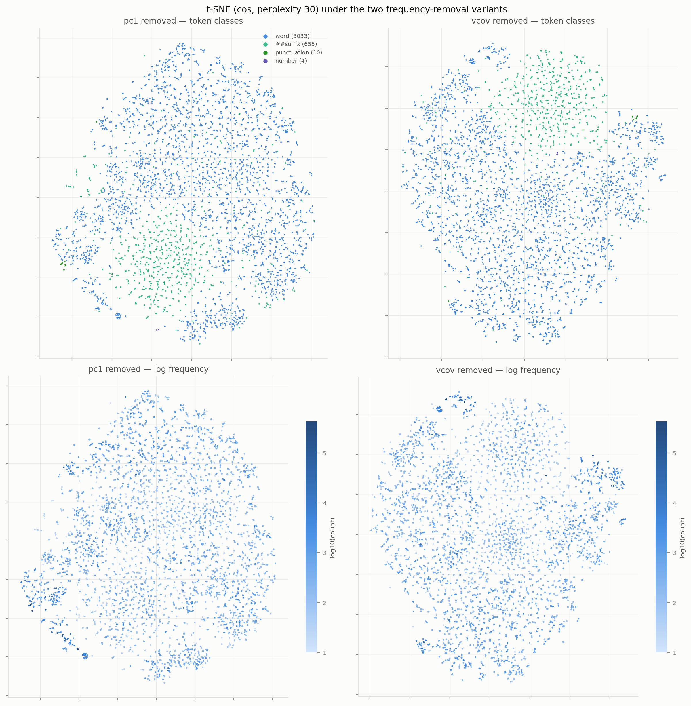
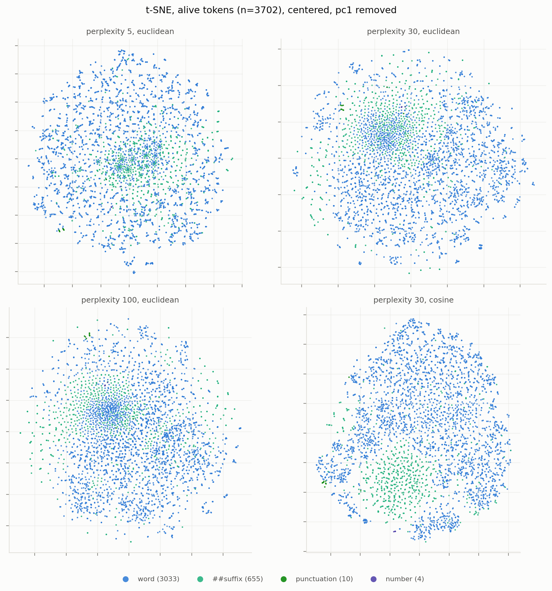
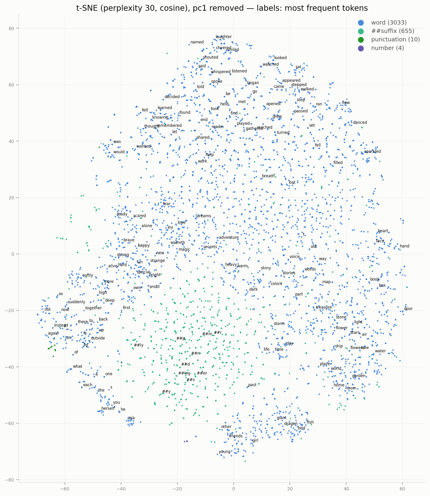
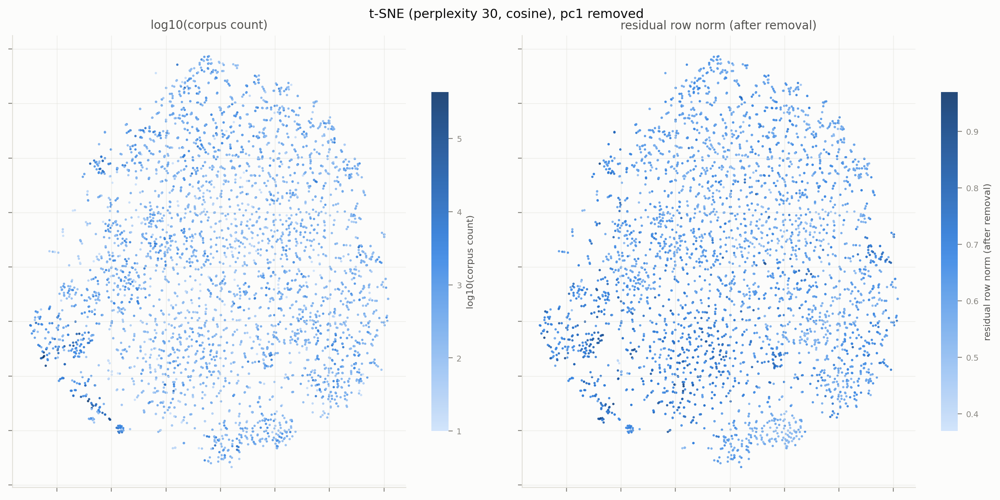

# SimpleStories token embeddings: t-SNE maps & clustering (alive tokens, de-frequencied)

*2026-08-27, superseding the 2026-08-25 all-token raw-embedding version, archived as `archive/simple-emb-clusters-2026-08-27/`. This version restricts to alive tokens and removes the frequency direction before all analyses, in two variants compared throughout. Everything runs locally in ~10 min.*

## Setup

The object of study is the token-embedding matrix of the 2-layer SimpleStories model, $E = W_{\text{wte}} = W_{\text{lm\_head}}$ (tied, verified bit-exact), restricted to the **alive tokens**

$$\mathcal{A} = \{c : \text{count}(c) \ge 10\}, \qquad |\mathcal{A}| = 3702 \text{ of } 4019,$$

with counts from `simple-token-table/token_table.csv` (20k stories, 5.74M tokens; the old version used a 1,500-story sample). This drops `[UNK]`, `[EOS]`, all dead tokens, and in particular the entire **rare-token cone** that dominated the old maps. Composition of the alive set: 3,033 words, 655 `##`-suffixes, 10 punctuation, 4 digits.

The alive rows $A$ are then mean-centered, $\tilde A = A - \bar a$, and the **frequency direction is projected out**: $X = \tilde A(I - vv^\top)$, with two variants for the unit vector $v$ (see `token-embeds/freq_direction.py` and CLAUDE.md for the analysis behind this choice):

- **pc1** — the top principal component of $\tilde A$;
- **vcov** — the covariance direction $v \propto \tilde A^\top \tilde y$, $y = \log \text{count}$, which zeroes the covariance of *every* remaining direction with log count.

The two directions nearly coincide: $\cos(v_{\text{pc1}}, v_{\text{vcov}}) = 0.983$. Both correlate strongly with frequency (Spearman of the removed projection: 0.78 / 0.80). The regression direction $w$ was deliberately **not** used: it carries 57% of its mass in the low-variance bias PC (a $\Sigma^{-1}$ artifact), and removing it leaves frequency ~fully decodable.

Distances: cosine on the processed rows (for clustering, rows are unit-normalized, where $\|\hat x-\hat y\|^2 = 2(1-\cos\theta)$). All outputs exist per variant under `figures/<variant>/`, `cache/<variant>/`, `clusters_*_<variant>.md`.

## Does the variant choice matter? (No.)

Head-to-head (`run_compare.py` → `cache/compare.json`):

| comparison | value |
|---|---|
| mean 10-NN overlap (cosine) between variants | **0.94**; 100% of tokens share ≥ 5/10 neighbors |
| same-method ARI between variants | Spectral 0.81, HDBSCAN-192d 0.80, KMeans-25 0.50, GMM-25 0.51, Ward-25 0.43 |
| different-method ARI *within* one variant (baseline) | 0.23–0.53 |

The between-variant agreement for the same method is *higher* than the within-variant agreement between methods: **switching pc1 ↔ vcov perturbs the partition less than switching clustering algorithm does.** The low HDBSCAN-t-SNE ARI (0.18) is a property of comparing two independent t-SNE embeddings, not of the spaces. Verdict: the difference is not relevant; either removal is fine. (pc1 was used for the figures referenced below; the vcov twins are in `figures/vcov/`.)

One genuine asymmetry, expected from its construction: after **vcov** removal no linear combination of the remaining coordinates covaries with log count (CV ridge decodability −0.34, i.e. only nonlinear remnants), while after **pc1** removal a weak linear frequency signal survives (CV +0.28). If maximal de-frequencying is the goal, prefer vcov; for geometry it makes no visible difference.

How much frequency remains overall: Spearman(count, residual row norm) ≈ 0.22 (both variants; was −0.51 for raw norms), and mean pairwise cosine drops from 0.26 (raw alive rows) to ≈ 0.000 — **centering alone removes the anisotropy**; the old "cloud anisotropy" was entirely the shared mean offset (which contains the bias direction).

## t-SNE

Same four runs as before (perplexity 5/30/100 euclidean + 30 cosine = main). The structure is robust across settings and variants:

**What changed vs the raw-embedding map:**

- The **frequency banding is gone.** Coloring by log count now shows only mild texture (high-frequency function words still co-locate — but as a *semantic* group, not a gradient across the whole map):

- **No rare-token tendril / cone** (excluded with the dead tokens) and no `[UNK]` anchor.
- The **semantic organization survives intact and cleaner**: past-tense narrative verbs (top), speech verbs, function words + pronouns + determiners (left), names next to pronouns, animate beings (bottom), nature/places/objects (right), abstract nouns (center), gerunds, adjectives; the `##`-suffix region remains coherent (lower middle) with productive suffixes (`##ing`, `##ed`, `##ly`) on its rim.

## Clustering

Model selection per variant (`figures/<variant>/model_selection.png`):

| method | pc1 | vcov |
|---|---|---|
| KMeans silhouette-optimal k | 11 ($s = 0.026$) | 36 ($s = 0.027$) |
| GMM BIC-optimal k (PCA-50) | 3 | 2 |
| HDBSCAN, 192-d | 2 clusters, 78% noise | 2 clusters, 73% noise |
| HDBSCAN, t-SNE map | 3 clusters, 12% noise | 4 clusters, 17% noise |

The silhouette is now **flat and tiny** (max 0.026–0.027 vs 0.082 before): removing frequency deleted the one strong split the old analysis found (high- vs low-frequency at k=2). The disagreement on $k_{\text{opt}}$ (11 vs 36) is meaningless — the curves are flat, so the argmax is noise. The continuum picture from the old report is *more* true after de-frequencying, with one nice exception:

- **HDBSCAN in the native 192-d space now finds real structure** (it found 0 clusters / 100% noise before): a crisp **locative-preposition cluster** — `in through around under behind above among beneath across within against below between during amidst` (n ≈ 15) — plus one broad high-frequency core (n ≈ 800–1000). Identical in both variants (ARI 0.80). The prepositions are this embedding's one genuinely density-separated semantic kind.
- The old KMeans k=2 frequency split is gone; the silhouette-optimal partitions are now **semantic**: e.g. pc1's k=11 = {function words+punct, auxiliaries/past-aux, physical objects, nature/sky, word-fragments, people+names, abstract nouns, base verbs, gerunds, suffixes, adjectives} with thoroughly mixed median frequencies.

Fine k=25 directory (unchanged spirit; listings in `clusters_kmeans_<variant>.md`, `clusters_ward_<variant>.md`, `clusters_hdbscan_<variant>.md`; auto-labeled dendrogram in `figures/<variant>/dendrogram_ward.png`): the clusters remain strikingly interpretable — POS × semantics (speech verbs, motion verbs, flying verbs, growth/bloom words, containers/artifacts, light/sky, emotions negative vs positive, names+people, animals, plural nature nouns, `##ed`-suffixes vs short suffixes, …). Method agreement at k=25 stays modest (ARI 0.23–0.53, `figures/<variant>/method_agreement.png`) — still a continuum with neighborhoods, borders drawn arbitrarily. NMI with the coarse token classes: 0.13–0.17 (slightly below the old 0.19–0.21, as expected — the class-correlated frequency axis is gone).

## Takeaways

1. **De-frequencying works and costs nothing semantically.** Centering + one-direction removal eliminates the frequency organization (the old dominant axis) while every semantic neighborhood survives; the map is cleaner because the rare-token cone and `[UNK]` are gone.
2. **pc1 vs vcov is immaterial for geometry** (10-NN overlap 0.94; same-method ARI above the method-noise floor). vcov is the principled choice when you need zero *linear* frequency covariance; pc1 leaves a weak linear residue (CV ρ ≈ 0.28).
3. The embedding is still a **continuum, not clusters** — silhouette max drops to 0.03 once the frequency split is removed. The robust discrete objects are now: the **suffix region**, the **function-word core**, and a newly-resolved crisp **locative-preposition cluster** (HDBSCAN, native space, both variants).
4. Anisotropy of the alive cloud was **entirely the shared mean** (pairwise cos 0.26 → 0.00 after centering) — consistent with the mean carrying the bias direction + frequency offset.

## Files

| file | contents |
|---|---|
| `common.py` | data loading, alive mask, mean-centering + frequency-direction removal (`processed(variant)`), shared plot style |
| `run_tsne.py` | 4 t-SNE runs + Figures per variant |
| `run_clustering.py` | all clustering methods, model selection, listings, auto-labeled dendrogram, per variant |
| `run_compare.py` | per-variant stats + pc1-vs-vcov head-to-head (`cache/compare.json`, `figures/compare_tsne.png`) |
| `inspect_cluster.py` | print one Ward cluster's tokens by dendrogram subtree: `python inspect_cluster.py <variant> <id>` |
| `clusters_{kmeans,ward,hdbscan}_<variant>.md` | full per-cluster token listings |
| `figures/<variant>/*.png`, `cache/<variant>/` | per-variant figures, t-SNE coords, labels, metrics |

Rerun order: `run_tsne.py` → `run_clustering.py` → `run_compare.py` (each loops over both variants; caches make reruns fast).
